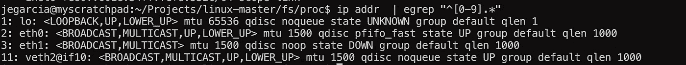
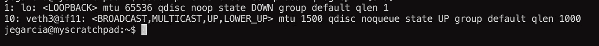
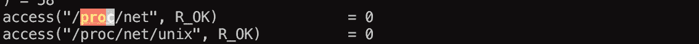
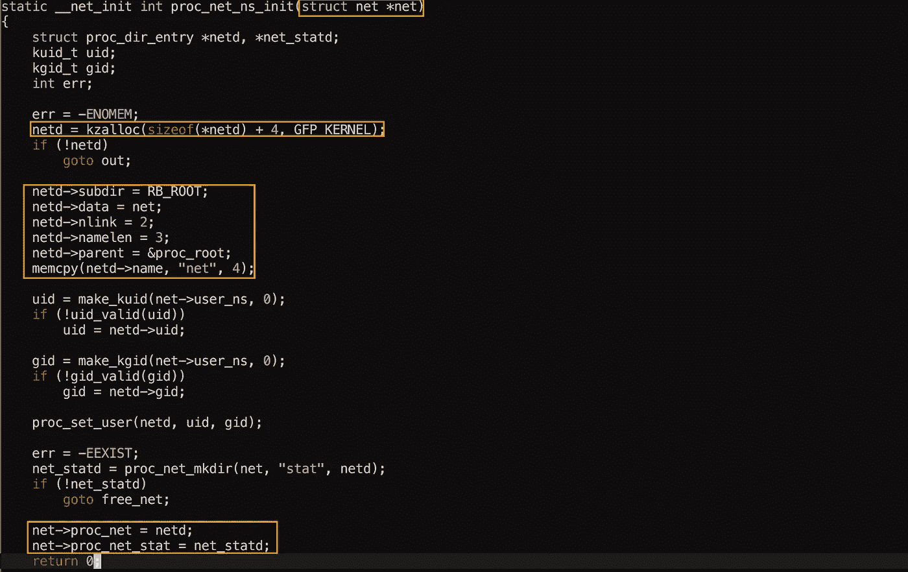
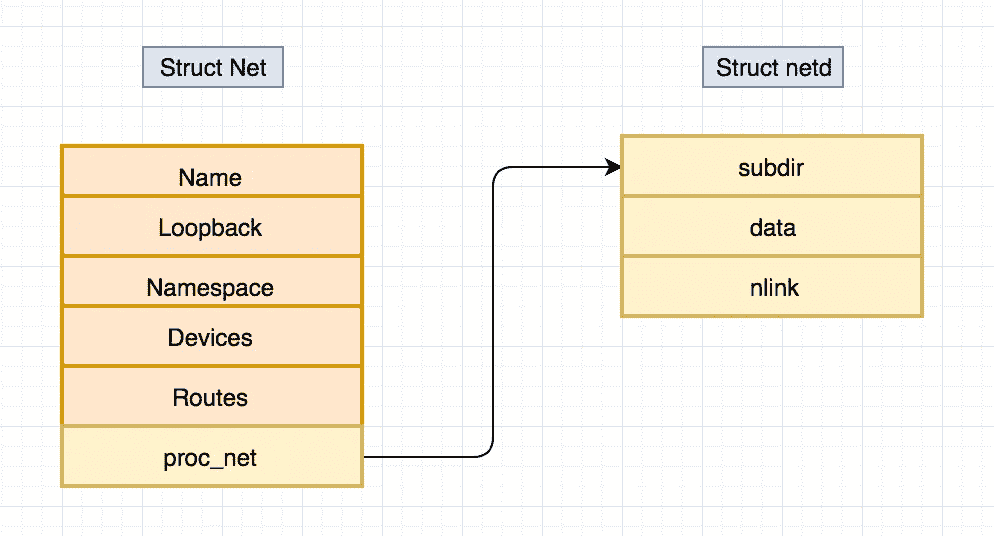
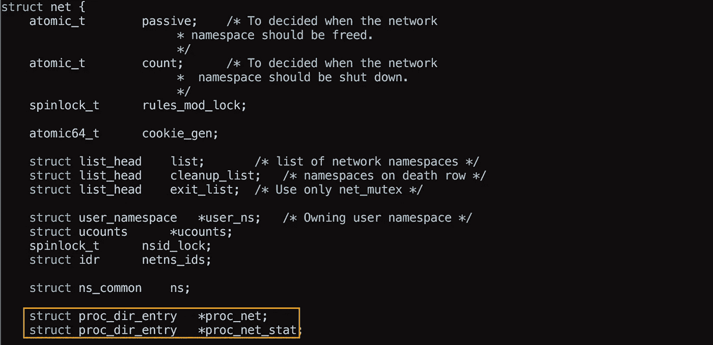

# 从用户层到堆栈

> 原文：<https://medium.com/hackernoon/from-user-land-up-to-the-stack-92e63686ede7>

在前面的故事中，我们看到了网络堆栈真正代表了什么，以及它是如何在内核中构建的，有趣的问题是看看它是如何从用户的角度工作的。

## 真正的问题是:

> 当我在一个名称空间中执行 ifconfig 时，为什么我只能看到名称空间的接口？？？

让我来举例说明

**根命名空间**

(我们得到了到**eth**和 **veth** 对的回送)

**来自“蓝色”命名空间:**

这一切看起来都很好，让我们深入了解一下。

1.  **我们想要拦截实际返回该信息的调用(strace)**

好的，那么 **strace** 告诉你这是从 **/proc** 中读取的信息(我们大概知道，或者假设)

**2。让我们在内核中寻找 proc 实现**

我最终在 **fs/proc/proc_net.c** 中找到了有趣的东西

我用橙色突出了重要的东西，让我们按部分来看:

*   init 函数接受一个**结构网络**，这是一个**命名空间** (devs，routes 等)的整个网络堆栈。
*   netd 已分配
*   netd 似乎是一个结构，所以一些属性被填充(data，namelen(3 ==net)等
*   我们将 **stuct net** 上的属性 **proc_net** 设置为 **netd**

这表明实际的网络栈实现( **struct net** ) 保存着 **proc fs** 条目的信息？

让我们在 struct net 中验证这一点，**include/net/net _ namespace . h**

有了它，所以当一个**网络栈**被分配给一个名称空间时，**进程 fs** 的 **dentry** 位于 struct net 自身内部，因此它只能显示与它自己的 **struct net(名称空间)相关的信息。**

下一次，让我们看看这些结构，以及谁填充了 proc/net 中的“dev”叶。

谢谢！

> [黑客中午](http://bit.ly/Hackernoon)是黑客如何开始他们的下午。我们是 [@AMI](http://bit.ly/atAMIatAMI) 家庭的一员。我们现在[接受投稿](http://bit.ly/hackernoonsubmission)并乐意[讨论广告&赞助](mailto:partners@amipublications.com)机会。
> 
> 如果你喜欢这个故事，我们推荐你阅读我们的[最新科技故事](http://bit.ly/hackernoonlatestt)和[趋势科技故事](https://hackernoon.com/trending)。直到下一次，不要把世界的现实想当然！

