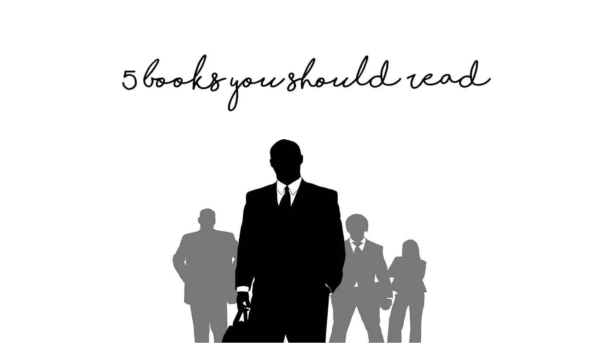

# 从创业者到企业家，这里有 5 本你应该读的书！

> 原文：<https://medium.com/hackernoon/from-wantrepreneur-to-entrepreneur-here-are-5-books-you-should-read-c681bc84c1e2>

如果你的目标是加入成功企业家的行列，阅读是一项工具性技能。书籍引导我们进入新的思维方式，帮助我们度过艰难时期，并教会我们如何成为高效的企业家。

从创业者到企业家，这里有 5 本你应该读的书！

# [1。毅力到伟大:毅力、激情和勇气如何带你从平凡走向非凡](http://amzn.to/1JCLIPH)

在《从勇气到伟大》中，琳达·卡普兰·泰勒和罗宾·科瓦尔探讨了一个贴近他们内心的话题，一个他们认为是他们自己职业生涯成功的真正秘密的话题——以及他们认识和见过的许多人的职业生涯。这就是勇气、毅力、汗水、决心和坚持到底的不可思议的力量。我们都被这样一种观念弄得眼花缭乱:有些人之所以能取得成功，能进入高级职位，是因为他们天赋异禀，或者人脉广泛，或者两者兼而有之。但是研究表明，在我们的文化中，我们高估了天赋和智力。事实是，如此多的人获得成功——即使是那些有天赋的人——因为他们非常努力，投入了数千小时的实践和额外的汗水，创造了自己的运气。琳达和罗宾应该知道——她们是来自布朗克斯区的两个女孩，没有任何特殊的优势或特权，通过自己的努力工作和不懈的努力，在竞争激烈的职业中取得了成功。在这本书里，作者展示了大量关于成功的故事和最新研究，揭示了帮助他们和无数其他人在职业生涯和个人生活中获得最高水平成功的策略。他们谈到了勇气，这是接受艰难挑战和不要一遇到困难就放弃的必要条件。他们讨论了弹性的本质。每个人在事业和生活中都遭受挫折。然而，关键是要振作起来，重新振作起来。根据积极心理学的最新研究，他们讨论了为什么乐观主义者在学校、工作和运动场上表现更好，以及如何重新设定乐观的设定点。他们谈论勤奋，这个概念是马尔科姆·格拉德威尔在他的书[离群者](http://amzn.to/1PlohHt)中通过 10，000 小时法则而普及的。创造力理论家米哈里·契克森米哈认为，一个人真正的创造潜力至少需要 10 年才能实现。作者还探讨了坚韧的概念——这种品质让我们保持专注，避免分心，以完成工作——在当今支离破碎、混乱、高科技、互联的世界中，这是一项越来越困难的任务。
以与《尼斯的力量》相同的短小精悍的格式写成，并加入了琳达和罗宾生活中特有的自然幽默——以及书籍——《勇气至伟大》注定是商界每个人都需要的书。"

# [2。超人的头脑:释放你大脑中的天才](http://amzn.to/1PlnDcX)

你知道你的大脑有超能力吗？Berit Brogaard 博士和 Kristian Marlow，MA 研究了具有惊人才能的人记忆冠军、人类回声定位器、音乐大师、数学天才，以及能品尝颜色和听到面孔的联觉者。尽管这些能力令人惊叹，但它们并不神秘。我们的大脑不断地处理我们意识不到的大量信息，这些有天赋的人的共同点是，通过练习，受伤，先天大脑障碍，甚至更不寻常的情况，他们已经成功地获得了一定程度的有意识地获得这种强大的处理能力。
《超人的头脑》带我们走进天才、学者、艺术大师以及各种各样以某种方式获得了真正非凡才能的普通人的生活和大脑。深入研究这些能力的神经基础，作者甚至揭示了我们如何自己获得其中一些能力，从完美的音高和闪电般的数学技能到超强的创造力。
《超人的头脑》这本书充满了读者从奥利弗·萨克斯等人身上寻找的迷人的科学，结合了与爱因斯坦进行月球漫步的令人振奋的承诺。"

# [3。大颠覆:商业如何应对动荡时期](http://amzn.to/1PlnGFF)

《大颠覆》是从阿德里安·伍尔德里奇在《经济学人》上颇具影响力的熊彼特专栏中摘录的，论述了过去五年前所未有的商业颠覆的原因和深远后果。大分裂有许多原因。互联网的传播速度比以往任何技术都要快。新兴市场正在挑战西方在创新和制造业方面的主导地位。节俭创新等聪明的管理技术正迫使企业重新考虑定价。机器人正从工厂车间进入服务领域。但是这些发展结合在一起动摇了商业生活，甚至是生活的基础。
大颠覆正在产生一个新的赢家阶层，其中许多人仍不为人所知:例如，亚洲的女性亿万富翁和首席执行官比欧洲多。它也产生了越来越多的失败者:想要继续在纸上谈兵的世界里运作的老式大学；拒绝承认竞争正以极快的速度进行的公司；和商人，他们认为我们仍然生活在公司人的世界里。它正迫使每个人要么适应，要么死亡:员工意识到，他们将不得不跳槽，甚至从一个职业跳到另一个职业，而机构意识到，他们需要保持适应性和灵活性。
大扰乱更是一种考验，因为它与大停滞同时发生。金融危机不仅降低了西方大多数人的生活水平。它还揭示了 2000 年至 2007 年的繁荣时期是建立在信贷基础上的:个人和政府借钱来支付不再有任何真正合理性的生活方式。员工们不得不应对前所未有的变化，同时他们也看到自己的收入持平或下降。企业不得不对革命性的创新做出反应，尽管它们正看到自己的整体市场收缩。为了呆在同一个地方，我们都不得不跑得更快。这本书以一个很长的介绍开始，解释了这本书的主题，并将其置于一个广阔的历史背景中。它还将向读者介绍约瑟夫·熊彼特，并解释为什么他关于创造性破坏的观点在今天特别有价值。

# [4。想得更大，做得更大:坚持不懈的回报](http://amzn.to/1PlnHtf)

商业中最危险的举动是没有行动。全球商业名人和黄金时段彭博电视主持人 Jeffrey W. Hayzlett 让商业领袖将他们的愿景与行动联系起来，超越竞争对手，更接近他们的商业梦想。根据他自己的商业背景故事，包括他在柯达担任 CMO 的时间，并与 Jeffrey Hayzlett 分享了许多领导人在 C-Suite 上的例子，Hayzlett 传授了十个核心经验，让读者敢于承认他们是谁作为一个领导人和/或公司，定义他们想要去哪里，并无畏地做需要做的事情，不要在意传统智慧，重新设定限制，并在前进的路上碾压障碍。"

# [5。万物的进化:新思想是如何产生的](http://amzn.to/1PlnLcj)

《纽约时报》畅销书《理性乐观主义者和基因组》的作者带着一个引人入胜的进化论论点回来了，这个论点彻底消除了一个危险的、广为流传的神话:我们可以指挥和控制我们的世界。

人类社会在进化。技术、语言、道德和社会的变化是渐进的、不可阻挡的、渐进的和自发的。它遵循一个叙事，从一个阶段到下一个阶段；它蠕动而不是跳跃；它有自己自发的动力而不是被外界驱使；它心中没有目标或终点；这很大程度上是通过反复试验实现的，类似于自然选择。人类世界的大部分是人类行动的结果，而不是人类设计的结果:它来自数百万人的互动，而不是少数人的计划。

Matt Ridley 从科学、经济、历史、政治和哲学中汲取了引人入胜的证据，推翻了传统的假设，即我们这个时代的重大事件和趋势是由政府、商业、学术界或有组织的宗教中的高层人物决定的。相反，我们最重要的成就是自下而上发展起来的。就像一群大雁在天空中无意中形成了 v 形，蚂蚁在没有建筑师的情况下建造了泥巴教堂，大脑在没有大脑制造者的情况下形成，学习在没有教学的情况下发生，道德的改变除了流行的时尚之外没有任何理由。尽管我们忽视、蔑视和无视它们，但自下而上的趋势塑造了世界。工业革命、手机、亚洲崛起、互联网从来都不是计划中的；它们发生了。语言是通过一种自然选择的形式出现和进化的，普通法也是如此。酷刑、种族主义、奴隶制和恋童癖都曾被广泛认为是可以接受的，现在被认为是不道德的，尽管近几十年来宗教已经衰落。在这本涉猎广泛、学识渊博的书中，里德利出色地论证了进化，而不是设计，是塑造了我们文化、技术和思想的力量，甚至现在还在塑造我们的未来。

雷德利这本发人深省的书既引人注目又充满争议，既权威又雄心勃勃，它将改变我们对世界及其运作方式的看法。"

_________________

一如既往，让我知道你对这个话题的想法。我很想在下面的评论中听到你的想法和观点。

此外，如果你想通过我的定期帖子阅读更多关于创业、[营销、](https://hackernoon.com/tagged/marketing)、社交媒体、领导力、[技术、](https://hackernoon.com/tagged/technology)、创新和风险投资等话题的精彩内容，请点击“关注”，并随时通过 [SlideShare](http://www.slideshare.net/abhishekshah) 、 [Twitter](https://twitter.com/abhishekshah) 、[脸书](https://www.facebook.com/Maillands)和 [LinkedIn](https://www.linkedin.com/in/findingnewlands) 联系。

附:以下是我在 Linkedin 上的[其他文章](https://www.linkedin.com/today/author/35708898) & [在 Medium 上的文章](/@abhishekshah)。

> [黑客中午](http://bit.ly/Hackernoon)是黑客如何开始他们的下午。我们是 AMI 家庭的一员。我们现在[接受投稿](http://bit.ly/hackernoonsubmission)并乐意[讨论广告&赞助](mailto:partners@amipublications.com)机会。
> 
> 如果你喜欢这个故事，我们推荐你阅读我们的[最新科技故事](http://bit.ly/hackernoonlatestt)和[趋势科技故事](https://hackernoon.com/trending)。直到下一次，不要把世界的现实想当然！

