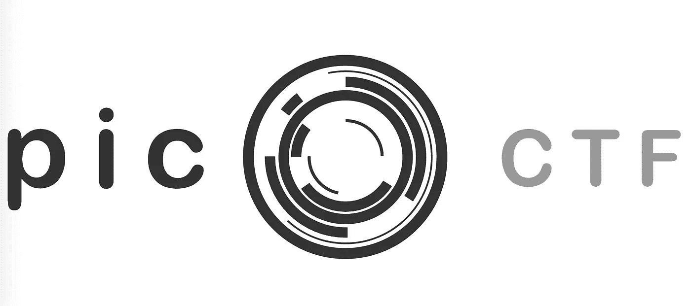
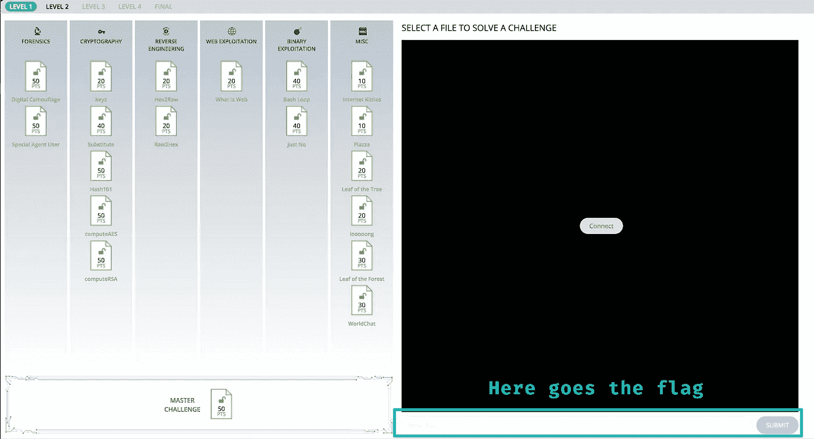

# 从网络开发者到高中黑客

> 原文：<https://medium.com/hackernoon/from-web-developer-to-highscool-hacker-f2e0dd270d9c>

我们最近都在看机器人先生，梦想成为某个 b4da55 133t 黑客，只需要终端和几行代码就能征服世界。但是…很快你意识到你是一个前端开发人员…你花了大部分时间在大量的 HTML，CSS 和最时髦的新框架上。这对你实现梦想没有多大帮助😢。还是会？

一段时间以来(大约一年)，我一直致力于网络开发。作为一名设计出身的人，我发现自己在视觉方面最得心应手，虽然我偶尔会深入到后端，但大部分时间我都花在项目的前端。

我一直都非常好奇，因为 little 总是被安全领域所吸引。试图闯入或进入我不应该进入的东西，对我来说总是听起来很有趣😁。

所以最近，(并且适当地配合新的机器人先生季节的释放🙄)我开始了自学网络安全的旅程。

在阅读了大量关于这个主题的文章后，我得出了一个结论…要在计算机安全方面有所能力，你必须精通许多领域:网络、取证、逆向工程…更不用说计算机科学本身的基础了。如果你想利用一个系统，你必须首先知道它是如何工作的，而…我没有。直到几周前。

Meet Pico CTF!

在寻找实践我所学的方法时，我遇到了 PICO，这里的事情变得非常令人兴奋…

# 🚩什么是 CTF？

正如一些我已经知道 CTF 的主张:夺取国旗。这是一种建立测试环境的竞赛，这样黑客们就可以到处玩了。通常它是一组挑战，以任何形式具体化:一个易受攻击的网站、一台易受攻击的机器、一组网络挑战等，黑客必须解决这些挑战才能获得标记。

你可能会问，国旗是什么样子的？像这样:

> 标志(this_is_a_flag_so_1337)

它可以是任何形式，但是在 PICO 的例子中，它只是一个文本字符串，您必须发现它，然后在站点上输入它进行验证

Pico CTF dashboard.

如果你发现的(或者你认为你发现的)旗帜是正确的，狂喜侵入你的身体。如果没有，回到挫折之地。

# 🤔为什么是 PICO？

外面有一大堆 CTF:

 [## apsdehal/awesome-ctf

### awesome-CTF——CTF 框架、库、资源和软件的精选列表

github.com](https://github.com/apsdehal/awesome-ctf#solve) 

所以作为一个完全的新手，不知道从哪里开始，我开始阅读。每个人似乎都推荐 PICO，但我一开始并没有被说服，这或多或少是我的想法:

> 它是针对高中生的，而我是一名 pro 1337 网站开发人员，它肯定不会那么有挑战性…

我…它..加拿大..不会吧？😬

# 💥现实

因此，在相对轻松地解决了最初的几个挑战之后，事情开始变得复杂起来。我很快陷入了一些挑战中，试图进入一个不同的挑战，同样的结果，然后现实开始了。这些挑战是在难度指数递增的基础上完美设计的。很快就变得困难了。

到目前为止，我已经在业余时间工作了好几个星期，达到了中级水平 2。看起来这将是一个漫长的旅程。

酷的是我学到了很多东西。从使用二进制或十六进制，到通过加密算法进行网络协议分析等等。

PICO 迎接挑战的方式遵循以下方法:

1.  嘿！我们在怀疑旗子的地方发现了这个东西。
2.  找到它。祝您好运😉🖕
3.  *Pssht:你可能会发现这很有用
4.  **Pssht:可能跟？

仅此而已。它真的把你扔进了蓝色。我发现，这样你真的花时间建立一个心理过程，并开始一点一点地建立你的研究。而不是像我习惯的那样直接一头扎进我的 web 开发材料中。一旦你确定了你在做什么，就到了解决问题的部分，这通常需要你实现一些定制的软件。

# 📡挑战

我计划完成 PICO CTF，我意识到我的经验可能对像我一样的其他人有用，那些对安全感兴趣但不知道从哪里开始的人。

Its pretty common to feel like this these days.

我已经很久没有被一个问题挑战了，或者我不得不放弃一些东西，在另一个时间去追求它，因为我遇到了一个完全的障碍。

一旦你解决了一个问题，就会有**极度满足**的副作用。当你看到那个绿色的小信息时，它是如此的有价值，以至于你开始上瘾了。

That feel when you convert binary to decimal using an online converter.

我给自己施加了以下约束:

## 1.我将用 Python 构建所有定制的东西

我的主要语言是 Javascript ❤️，这是我过去一年一直在使用的语言。我总是被 Python 吸引，所以我决定用它来解决 PICO 中的任何问题，并在学习的过程中不断学习。

做出这一决定的主要原因是:

*   我对机器学习和数据方面的东西非常感兴趣，希望将来能做一些项目。有很多指导材料都提到了 Python 的使用，显然它是 ML 中使用最广泛的语言之一，所以作为一个新手，我想学习一些被广泛支持的东西。
*   ☝Same 的事情发生在黑客方面。很多黑客工具都是用 Python 制作的。所以能够扩展/修改它是一个优势。
*   完全个人喜好，想学一些不同于我在日常工作中 8 个多小时所用的东西，只是为了改变和交叉知识。

## 2.我会阅读新命令的每个“手册页”

PICO 挑战倾向于让您使用大量新的 UNIX 终端命令。所以为了更好地理解它们，我会通读我必须使用的任何新命令的手册页。

## 3.使用 VIM

这完全是个人喜好。我在日常工作中使用 Atom，但一直想学习 VIM。当您必须使用 SSH 登录到一台机器时，它特别有用。你会在皮科做很多。

如果你也想这样做，我建议你从这里开始:

## 4.我将记录我的进步

所以为了记录我的心理过程，为了帮助别人，也为了自己学习。我决定记录任何我认为值得分析的挑战。使用的工具、花费的时间、流程等…

我将使用这个模板，所以如果你想，叉它，并开始使用它:

 [## 阿尔韦托阿尔瓦/CTF/挑战模板. md

### 记录 CTF 挑战赛的模板

github.com](https://github.com/albertovilva/coolstuff/blob/master/CTF/challengeTemplate.md) 

# 📝结论

因此，如果你对这次旅行感兴趣，请继续收听。我会定期发布评论(每个挑战一篇),不是所有的，而是所有我感兴趣的。

希望有一天我能完成 PICO，实现我成为一名高中黑客的梦想…

# 👨我！

 [## 阿尔贝托·维尔瓦。(@vilvadot) |推特

### 阿尔贝托·维尔瓦的最新推文。(@vilvadot)。开发者。复制人。目前与…有着深厚的感情

twitter.com](https://twitter.com/vilvadot)