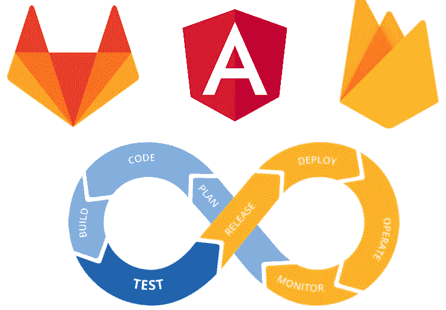
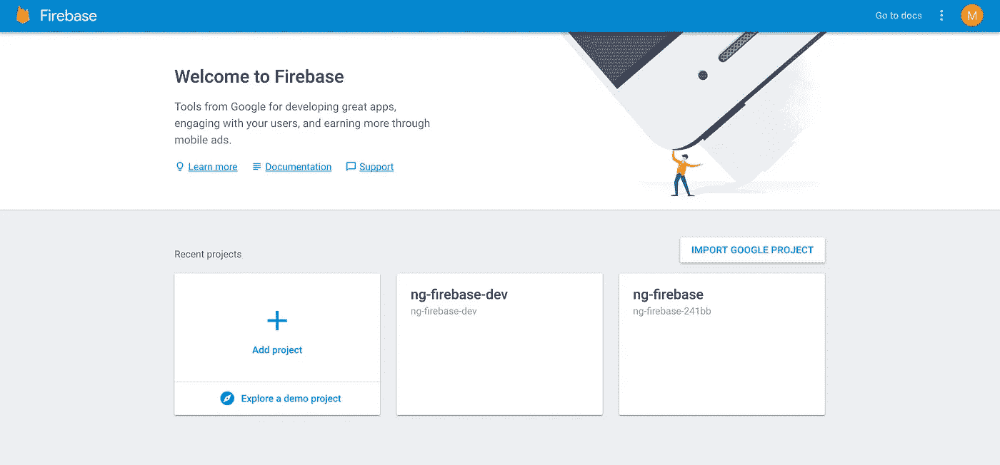
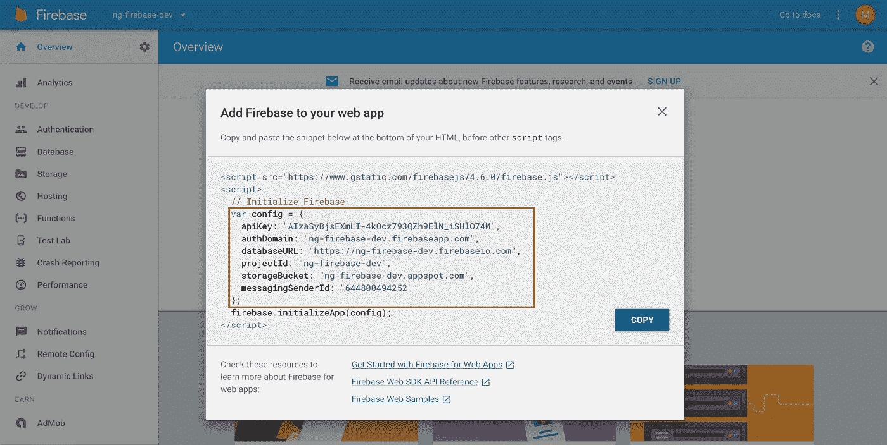
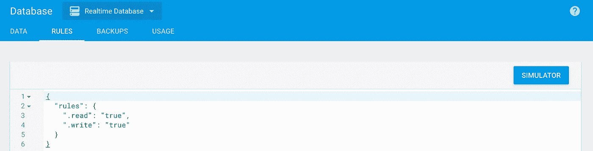
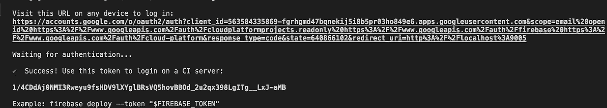
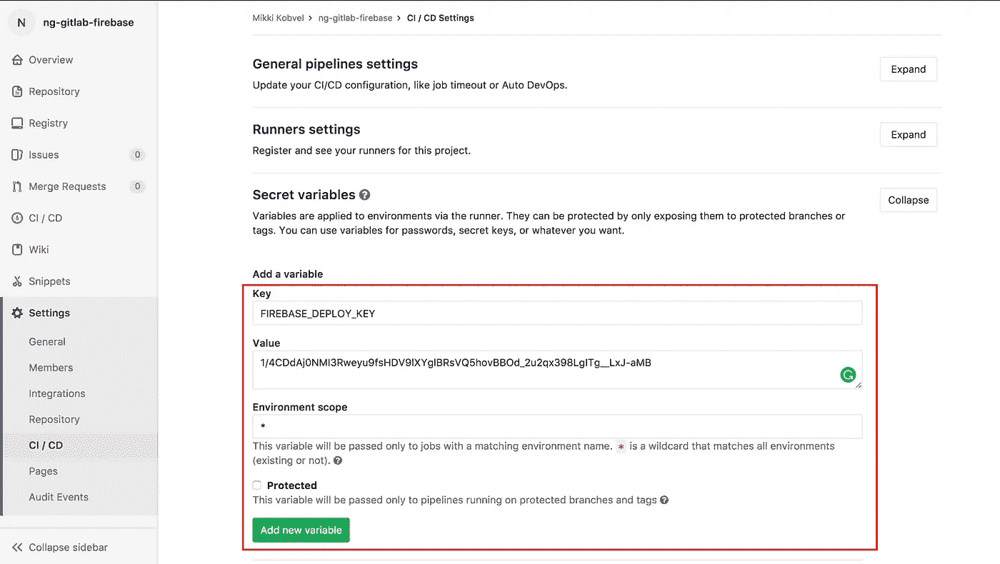

# 利用 Angular、Firebase 和 GitLab CI 从零到生产

> 原文：<https://medium.com/hackernoon/from-zero-to-production-with-angular-firebase-and-gitlab-ci-598181cfc6e5>



# 短篇小说

我将介绍从头构建应用程序的所有步骤:

1.  我们将使用 [angular-cli](https://github.com/angular/angular-cli) 生成一个新的应用程序。*(是流行的 CLI 工具，用于构建*[](https://angular.io/)**应用)**
2.  *接下来，我们将为我们的新项目设置 [**Firebase**](https://firebase.google.com/) 以进行可能的 API 调用。( *Firebase 是非常受欢迎的后端替代品，它有助于轻松构建应用程序，而无需在基础架构上花费精力*)*
3.  *此外，我们将使用 Firebase 托管来使我们的应用程序在开发和生产环境中运行。*
4.  *毕竟，我们将使用 GitLab CI 将所有部分整合在一起，并自动化**构建**、**测试**和**部署**阶段！*

*您可以在这里查看[**最终回购**](https://gitlab.com/kobvel/ng-gitlab-firebase) 。但是请记住，该教程包括一些关于 GitLab repo 本身配置的信息。*

# *#1 生成应用程序*

*首先，我们需要[在](https://docs.gitlab.com/ee/gitlab-basics/create-project.html) [**GitLab**](https://gitlab.com/) 中创建一个空项目。*

*确保您已经在计算机上安装了 angular-cli。你可以在这里找到说明。*

*现在，我们能够生成新项目:*

```
*$ ng new ng-gitlab-firebase$ cd ng-gitlab-firebase*
```

*接下来，我们将把一个新创建的本地项目与远程 GitLab 项目链接起来。*

```
*$ git init$ git remote add origin [https://gitlab.com/kobvel/ng-gitlab-firebase.git](https://gitlab.com/kobvel/ng-gitlab-firebase.git)*
```

# *#2 消防基地设置*

*让我们在 [**Firebase 控制台**](https://console.firebase.google.com/u/0/) 中创建两个项目。第一个将对应于我们的默认生产环境( **ng-firebase)。**其次是开发环境，负责开发周期需求( **ng-firebase-dev** )。*

**

***ng-firebase-dev** and **ng-firebase** new created projects in the Firebase console*

*向我们的本地项目添加与 Firebase 相关的 npm 模块。*

```
*$ npm install angularfire2 firebase --save*
```

*下一步是初始化配置 **Angular** 应用程序，以便与 Firebase 一起工作。打开`src/app/app.module.ts` …*

*src/app/app.module.ts*

*LOC 4–6:Angular-Firebase 对应库的导入。*

*LOC 17:用未知的配置初始化 Firebase 模块，我们将把它添加到我们的`src/environments/environment.ts`文件中。*

*让我们从我们的**开发**项目( **ng-firebase-dev** )中获取 firebase config，这是我们之前在 firebase 控制台中创建的。你可以从 Firebase 控制台的主页*概览*屏幕中点击“**将 Firebase 添加到你的 web 应用**”来获得它。*

**

*Getting config from **Firebase console** by clicking on the *“****Add Firebase to your web app****”**

*基本上，从这个代码片段中，我们只需要获取`config`对象。让我们将它复制并粘贴到环境对象中，这样我们就可以将它用于 Angular-Firebase 配置。*

*现在`firebaseConfig`属性匹配我们开发项目的配置对象。*

*对于[未来的](https://hackernoon.com/tagged/future)配置，我们需要几个[环境](https://hackernoon.com/tagged/enviroment)文件，它们将对应于不同的环境(开发/生产)。复制原始`environment.ts`文件，创建`environment.develop.ts`和`environment.production.ts`。*

*点睛之笔是将`environment.production.ts`的`firebaseConfig`对象更改为我们之前创建的 **Firebase** 的生产项目中的相应配置。查例题 [**此处**](https://gitlab.com/kobvel/ng-gitlab-firebase/tree/master/src/environments) 。*

## **在第 2 步之后，我们已经做好了使用 Firebase 的准备**

*让我们设置一些基本的 API 调用来在屏幕上显示一些东西*

*src/app/app.component.ts*

*src/app/app.component.html*

> *只有当您将**关闭您实时数据库的安全规则**时，上面的例子才有效。我们将在后面介绍如何从本地文件部署规则。但是为了确保您与 **Firebase** 的交互工作正常，只需在 Firebase 设置中将**写/读**规则设置为真。*

*您可以在 Firebase 控制台的 **Database = > Rules** 选项卡中找到提到的配置。*

**

*Database/rules*

# *#3 Firebase 托管*

*让我们的应用在现实世界中可见！*

*正在安装`firebase-tools`，因此我们的 CI 将能够使用 firebase 相关命令。*

*`$ npm install firebase-tools --save-dev`*

*`$ touch .firebaserc firebase.json`*

*上面的命令将创建两个文件，我们将在稍后讨论，每个文件负责 Firebase 主机配置的一部分。*

## *firebase.json*

*firebase.json*

***数据库** : `rules`属性相当于 Firebase 控制台中的数据库/规则配置。基本上，保存数据库设置比在 Firebase 控制台中更改它们更方便。它们将在部署后**更新**。*

*通常情况下，你的项目不应该有`.write: true`！这不安全！我已经将它们设置为 true，只是为了演示的目的，因为认证不会在本文中讨论。*

***托管:** `public`属性是说我们要托管什么文件夹。只要我们在开发单页面应用程序，我们就希望我们的前端决定向每条路线显示什么，所以我们将`rewrites`设置为将任何 URL 重定向到`index.html`。*

## *。firebaserc*

*`.firebaserc`简单地说就是在哪里部署代码。`develop`是默认的。*

*确保值等于 firebase 项目实例的键名。而不是项目的名称。在我的例子中，生产实例等于`ng-firebase-241bb`，而不仅仅是`ng-firebase`*

# *#4 GitLab Ci 配置*

*为了能够从 GitLab CI 部署任何东西，我们需要允许它使用我们的主机。为此，我们只需生成`$FIREBASE_DEPLOY_KEY`。*

*`$ firebase login:ci`*

*执行此命令后，您将被重定向到浏览器。选择您的 Firebase 帐户并返回控制台。您应该会发现类似这样的内容:*

**

*Firebase generating of the deploy token*

*这一长串“成功！”信息是我们的新令牌。点击**设置/CI CD/Secret 变量打开 GitLab 项目配置。***

**

*Adding FIREBASE_DEPLOY_KEY*

*如上所示填写键/值输入，然后单击—添加新变量。*

## *package.json*

*现在，我们准备设置部署流程。我们需要在`package.json`中描述 npm 脚本，gitlab 配置将使用这些脚本。*

*scripts object in the **package.json** file*

1.  *`predeploy` —告知 firebase 要在当前部署中使用预定义的别名。我们已经在 **#3 Firebase Hosting** 一节中定义了它们。可用的有— `default`、`develop`、`production`。通过`$CI_ENVIRONMENT_SLUG`，我们将获得别名(生产或开发)的相应值，稍后我们将在。`gitlab-ci.yml`文件。*
2.  *`deploy` —使用我们之前定义为可变环境的 deploy 键简单地部署我们的应用程序。*

## *。gitlab-ci.yml*

*Yaml 文件是非常自描述的，但是让我们注意一些时刻。*

*   ***部署**由于每个阶段底部的参数`only`，开发/生产只发生在相应的分支。*
*   ***LOC 16，27** :对于**开发/生产**部署，我们正在定义将由`npm run build`使用的环境变量。引擎盖下会发生类似`npm run build -e develop`的事情。*
*   *同样在 **package.json** 文件中我们使用了`firebase use $CI_ENVIRONMENT_SLUG`，所以它将变成`firebase use develop`。Firebase 将从`.firebaserc`中知道当前部署使用哪个别名。*

# *结论*

*GitLab 具有强大的内置 CI/CD，使您的代码的整个交付周期易于设置。将它与 **Firebase** 和 **Angular** 框架相结合，将我们带到了快速 web 应用开发的新高度。*

*作为本教程的结果，一旦有一个提交被推送到**主**或**开发**分支，您将拥有应用程序的自动部署。这将链接到不同的数据库实例和主机。主分支对应于**生产**环境，**开发**分支对应于**开发**环境。*

# *家庭任务*

*在`.gitlab-ci.yml`文件中只描述了一个阶段——**部署**。尝试添加名为— **test** 的新阶段，以便在开始部署阶段之前运行测试。*