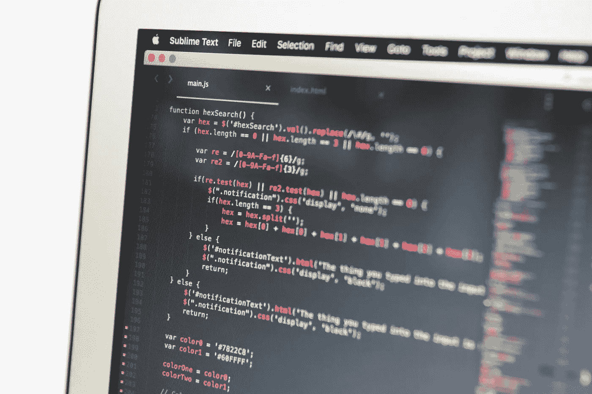

# 从零到软件工程实习生，以及中间的所有步骤

> 原文：<https://medium.com/hackernoon/from-zero-to-software-engineering-intern-and-all-the-steps-in-between-725f1f925510>

## 采访玛吉·娄

想要得到生活中想要的东西，一半的战斗是相信你能做到。作为人类，我们倾向于高估/低估自己的价值和能力。对于一些事情，我们志存高远。其他的，尤其是与职业相关的事情，我们倾向于把目标定得低一些。

正如 Maggie 在这个非常有趣的采访中所展示的那样，乐观的心态和对自己的信念真的可以一直走下去。不仅如此，投资于“软技能”，即使你在数据科学或软件工程等非常技术性的领域工作，也比你想象的要重要得多。

归根结底，我们都是人。与你最亲近的人建立牢固的关系可以大大加快你的职业生涯，因为你不仅会学到如何与他人互动和工作，还会学到如何了解自己——因为理解和自我意识非常有价值。

这个采访会让你思考！一定要评论、分享和订阅——对 Maggie 大声喊出来。

## 想学习如何冷邮件？阅读我们的[实习指南](http://studenthustle.co/internshipguide/)

# 嘿玛姬！感谢您花时间分享关于[学生热](http://studenthustle.co/)的内容。

# 介绍一下自己！告诉我们你在哪里上学，在过去的几个夏天里你做了什么，现在你在做什么。

我的名字叫 [**Maggie Lou**](https://www.linkedin.com/in/maggie-lou-4a3bb110a/) ，我即将成为西北大学**的大三学生，在工程学院学习计算机科学。今年夏天，我在[**brain tree Payments**](https://www.braintreepayments.com/)担任云基础设施团队的软件工程/devops 实习生。**

# **你在学校学什么？有没有在现实世界中有帮助的课？如果不是，你从哪里学到了在工作中最有帮助的东西？**

**我不会说我的任何课程在专业环境中有直接的帮助(例如，帮助我获得实习机会或实习期间的工作)，但我仍然真的喜欢学校和学习。**

**尤其是在像高科技这样的快节奏环境中，最重要的是你对学习新事物充满激情和渴望。我认为“学习的兴奋感”是一种习得的技能。如果你在学校总是抱怨，只是因为你觉得你应该做的事情，这种态度将不可避免地影响到你的个人和职业生活。另一方面，如果你有足够的热情去关注细节，长时间集中注意力，在学校问好问题，这些也会延续下去。所以我试着去上我感兴趣的课。我最喜欢的课是佛教心理学。这甚至有助于面试！一个 30 分钟的面试提示是“教我点东西”。我花了全部时间向我的两位面试官传授佛教知识。**

# **去西北最大的优势是什么？**

**声望。例如，我参加了一次招聘活动，我是我们桌边唯一一个招聘人员会关注的学生，因为他在我的简历上看到了这所学校。低劣但真实。**

****

# **是什么让你决定申请并继续经历[I experience](http://ixperience.co.za/)的，申请过程是怎样的？**

**我最好的朋友要去，我想如果我想按时毕业，我就不能在学年中出国学习，所以我报名了。我没有其他的暑假计划，我很幸运我的家人能负担得起。**

**申请过程是在线提问和视频面试。这不是非常费力的，我不建议在这上面花太多时间。**

# **可以分享一下经验吗？那段时间做了什么，在哪里工作，学到了什么？**

**我参加了数据科学课程，学到了很多东西，但我意识到我讨厌数据科学和机器学习。我在 [**实习过**](https://madewithover.com/) ，一个图片编辑的 iOS 应用。它可以让你把文字“覆盖”在图像上。想想手机友好的 Photoshop——这是一个非常酷的产品！我做了一个自动化的指标仪表板，在他们每周的市政厅展示，显示每周更新的数字，如收入、付费客户数量、保留率等。我还和其他实习生一起开发了一个 iOS 功能。根据你想要使用的照片，它会使用图像识别和自然语言处理来建议要覆盖的标题。**

> **我学到的最重要的经验是重视耐心、积极和善良**

**这些品质在我们的社会中不受重视，尤其是在科技领域。幽默、自信、智慧等。看起来性感多了，但这些都不是以做一个好人为代价的。大多数人都认为团队合作和沟通对成功至关重要，但是不要太看重耐心的力量。即使从纯粹的道德角度来看，忍耐也不是真正的务实。它有助于设定明确的期望，并保持高昂的士气，以应对单调乏味的艰苦工作。就我个人而言，我发现真正关注我周围发生的事情很有帮助。我觉得我已经建立了更牢固的关系，这帮助我学得更快，因为我更少分心，可以更容易地吸收复杂的概念。**

**这种善良和耐心哲学的书籍版本是戴尔·卡耐基的 [**如何赢得朋友和影响人**](https://www.amazon.com/How-Win-Friends-Influence-People/dp/0671027034) 。强烈推荐一读。**

# **你是如何得到布伦特里的暑期工作的，你为面试做了哪些准备？**

**我在招聘会上丢了我的简历。我接受了一次编码挑战，两次电话采访，还有 4 次现场采访。**

**我的技术准备时间表:**

**开始:熟悉你选择的语言(我选择了 Java)**

**–我从零开始，在 hackerrank.com 的**上学习这个“30 天代码”模块。30 天里每天都有一个挑战。每个问题都有教程视频，开始的很简单。他们从完整的基础开始，比如如何打印变量****

****解决问题:解决问题，你会开始看到模式****

****–我做了 [**破解编码面试**](http://www.crackingthecodinginterview.com/) 的题(可以在线免费下载 pdf)。人们总是喜欢‘把整本书从头到尾做一遍’。这可能有点过了。我大概喜欢 10%的问题，只关注字符串、二叉树、堆栈、队列和链表****

****–对于更难的问题，请前往[**leetcode.com**](http://leetcode.com/)****

****熟悉面试:进行模拟面试，这样你就不会感到尴尬****

****–我让随机的朋友打电话给我，问我一个他们从破解编码面试中随机选择的问题，甚至是那些不是技术人员的朋友。在你编程的时候大声说话很奇怪，所以这是很好的练习****

****开始是最难的，因为这就像是‘我他妈的从哪里开始，我做不到这一点。’你能做到的！****

****人们似乎相信我是作为一名科技奇才出生的。号码****

****我高中上过一门计算机科学课，差点没上，因为我想上年鉴。老实说，我总共上了 5 堂计算机科学课。****

****你不必生来就是某一类型的人才能擅长编程。你甚至不必学习计算机科学。这都是关于实践和谷歌你不知道的东西(我已经谷歌了‘浏览器’和‘服务器’大概 30 次，因为我总是忘记它们是做什么的，它们是如何工作的)。****

> *******我开始每天 7 分钟用 30 天的代码*******

****去年十月，我不知所措，不知道自己在做什么。我从每天 7 分钟开始，用了 30 天的代码。就像我真的设置了一个 7 分钟的计时器，并且只工作到计时器停止才不会让自己不知所措，并且让自己面对这样一个事实:我总是有至少 7 分钟的空闲时间。****

# ****在布伦特里的经历与你对今年夏天的期望有什么相似和不同之处？****

****Braintree pair program 的所有工程师，这意味着总是有两个人同时在不同的计算机上处理相同的代码(想想 Google doc)。这是一次非常有趣的学习经历。****

****这对提高工作效率真的很有好处，因为你不能在一天中开小差或拖延发邮件或偷懒，否则你的搭档会对你评头论足。它可以很好地平衡工作与生活，因为我们每天花 8 小时高效地工作。这非常累人，尤其是因为我不习惯这种高度集中、长时间的工作。我希望我能把这种生产力延续到我的余生。****

# ****作为队里最年轻的人之一感觉如何？人们对你有不同的看法吗？****

****布伦特里的实习项目非常好，因为我们没有特别的实习项目。我们只是和其他全职工程师进行常规的结对轮换。我显然比其他开发人员知道得少，但是他们听取我的建议，鼓励我为代码和团队会议做出贡献，我并不觉得我受到了与全职工程师不同的待遇。****

********

# ****在布伦特里实习的前半段时间和在旧金山的第一个夏天，你最大的收获是什么？****

> *******我‘活该’也没关系。担心那个*** 已经来不及了****

****我正在努力克服“应得”东西的概念。我仍然感到不知所措，对自己的技术能力和 Braintree 在我身上的投资没有安全感。我的工作导师给了我非常好的建议，那就是我是否“值得”并不重要。担心那个已经太晚了。我唯一能做的就是尽我所能努力学习并利用这个机会。****

# ****别人给过你最差的建议是什么？****

****这不是建议，但这是一件人们应该警惕的可怕事情。当人们告诉我男人比女人更容易被雇佣是因为他们是更好的工程师时，我非常生气。当然，在绩效评估中，有时男性比女性更有技术资格。这个论点忽略了很多使其无效的结构性问题。我们甚至可以忽略那些同样合格的女性因为她们是女性而受到明显歧视的公然案例****

****男人是更好的工程师的原因是因为他们花更多的时间做工程师。不是因为他们更在乎，而是因为他们有这样做的奢侈。****

****从小学开始，在机器人俱乐部和 STEM 课程中，鼓励男孩追求 STEM。女孩们被教导这是非常书呆子气和社会自杀的行为(比如:在计算机科学高年级的时候，我差点拿了年鉴，尽管科技现在是我生命中的激情)****

****然后，在招聘过程中，女性传统上被低估了，因为她们的简历上没有这么多年的工作经验。他们被错误地安置在较低的角色。在与工作中的女性开发人员的一次不相关的谈话中，随机得出 50%的人在招聘时被放错了位置。他们在几个月内就被提升到了适当的职位，但是当他们在协商加薪时，他们的男性同事有机会专注于开发并成为更好的程序员。****

****此外，妇女传统上更多地参与参与和规划多样性和包容性倡议。这不是一个选择。男人声称女人这样做是因为他们感兴趣，这是不公平的。作为一个女人，我觉得我有各种需要关心的事情，否则我将永远无法得到晋升。这也占用了我们可以在技术上做得更好的时间。****

****男人不是比女人更好的开发者，因为他们是男人。她们之所以更优秀，是因为她们在编程上花费了更多的时间，因为女性不得不花时间解决结构性问题。****

****我在学校已经为此纠结了很久。我花了很多时间研究西北大学计算机专业的女性。我放弃了几乎所有的课外活动，包括我的姐妹会，主要是为了专注于技术。但是大部分时间甚至不会成为一个更好的开发人员。它将走向多元化和包容性。但我觉得我别无选择。****

# ****你正在西北大学做一个自行车共享平台，你能分享一下你做这个平台的动机和进展吗？****

****自行车花了很多时间被锁在自行车架上或者闲置在车库里。经常旅行的热情的自行车爱好者(像我一样，因为我住在科罗拉多州，在芝加哥上学，在旧金山工作)，在每个地方花费大量的时间和金钱购买自行车。****

****我正在创建一个名为 Cyclical 的自行车共享市场来连接这两方。想想 [**Airbnb**](http://airbnb.com/) 或者 [**Getaround**](http://getaround.com/) ，但是用自行车。今年秋天我将在西北大学启动。许多学生在国外学习，他们的自行车闲置了整整一个季度。我希望将这些自行车与那些不想花 350 美元买一辆新自行车的学生联系起来，他们将使用 4 年，然后在 Craigslist 上卖 30 美元。****

******——******

# ****人们在哪里可以找到你，你在寻找什么机会？(Twitter、linkedin、个人网站、媒体等)。****

****领英:[https://www.linkedin.com/in/maggie-lou-4a3bb110a/](https://www.linkedin.com/in/maggie-lou-4a3bb110a/)****

****github:[https://Maggie-Lou . github . io](https://maggie-lou.github.io/)****

******—******

## ****想学习如何冷邮件？阅读我们的[实习指南](http://studenthustle.co/internshipguide/)****

*****原载于*[*studenthustle.co*](http://studenthustle.co/from-zero-to-software-engineering-intern-and-all-the-steps-in-between/)****