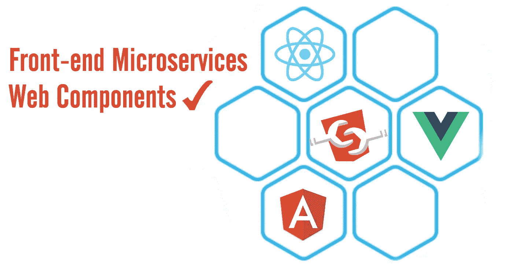
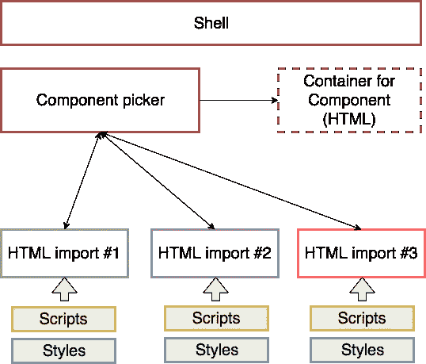

# 带有网络组件的前端微服务

> 原文：<https://medium.com/hackernoon/front-end-microservices-with-web-components-597759313393>

# 为什么是微服务？

这可能对你来说是个信号，当你有一个大的企业应用程序时，你可以很容易地用域附件来划分逻辑。如今[谷歌](https://hackernoon.com/tagged/google)有很多应用，比如*谷歌驱动* e、*谷歌文档*、 *Gmail* 等，很明显*谷歌驱动*和*谷歌文档*不应该仅仅是一个应用，因为它们都使用**认证**和相同的框架。

您的案例可能没有谷歌的那么明显，但让我来描述一下前端微服务架构的一些**优势**:

*   **维修性**。您可以很容易地将您的资源划分到不同的团队中，这些团队将增加他们在与应用程序某个部分相关的特定领域中的知识。
*   **技术自由**。如果您想尝试 [**VueJS**](https://vuejs.org/) 或另一种新的[技术](https://hackernoon.com/tagged/technology)，请便！风险不大，您只需要启动一个微服务，而不是重写所有内容。
*   **独立部署**。当你可以发布应用程序的小部分时，它给了你很多自由。修复和发布会更顺利。

当然，这也伴随着一些**成本**:

*   **保持一致性。**您需要投入时间让您的应用程序协同工作。*一旦我将应用程序重写为微服务模型，我就会发现* ***更多的错误*** *，这些错误在应用程序是一个整体时是不可见的。*
*   **运营复杂性。**所有常规布阵的魔法都必须像咒语一样生效，否则你会得不偿失。

# 方法

我做了一项研究。甚至要求社区提供任何现有的例子:

*   [如何将 AngularJS 应用嵌入到另一个单独部署的应用中](https://stackoverflow.com/questions/39205899/how-to-embed-whole-angularjs-app-into-existing-app-which-is-separately-deployed)？
*   [有没有办法将 angularJS 应用程序作为聚合物组件运行？](https://stackoverflow.com/questions/39227614/is-there-a-way-to-run-angularjs-app-as-polymer-component)

*P.S .我在寻找 iFrame 以外的解决方案。*

我已经用 **AngularJS** 作为嵌套组件成功构建了 [**聚合物**](https://www.polymer-project.org/) 。**但是，**在论坛的某个地方，这样做是有限制的。所以我决定去更低的层次，在 **Web 组件的层次上构建同样的方法。**

# [Web 组件](https://github.com/webcomponents/webcomponentsjs/)解决方案

解决方案非常依赖于 Web 组件标准的单一特性。 **HTML 导入**:一种通过其他 HTML 文档包含和重用 HTML 文档的方式([规范](https://w3c.github.io/webcomponents/spec/imports/)、[教程](https://www.html5rocks.com/en/tutorials/webcomponents/imports/))。

> 想法是将组件预定义为 HTML 导入，而每个组件都可以包含自己的脚本和样式。因此，我们可以在顶层**决定当前哪个 HTML 导入应该在 DOM 中呈现，其余的事情应该由导入的文档本身来处理。**

HTML imports driven microservices

**Shell —** 是一个顶层包装器，由组件选择器和组件容器组成。还应该包括允许用户操作组件的视图或控制器。

**容器** —嵌套应用程序的 HTML 应该注入的实际根位置。(对于所有嵌套的应用程序，它应该有一个**单一的**入口点)。

**组件选择器**—允许管理当前活动的嵌套应用程序的服务。

**HTML 导入** —我们的抽象微服务。可能是用不同框架编写的整个应用程序。

# 实施的基本示例

这里是一个[**Web 组件驱动的微服务**](https://github.com/andrewdacenko/web-components-angular-react) 的完整报告，带有嵌套的 AngularJS 和 React 应用。**非常感谢**安德鲁·达琴科在早期的支持！

index.html

16 LOC: **容器**用于嵌套应用程序。

两个嵌套的应用程序— `angular-app.html`和`react-app.html`。通过点击两个按钮中的一个，我们在`loader.js`的帮助下加载相应的应用程序。

loader.js

`loader.js`是一种**组件拾取器**，我在上一段已经描述过了。

# **结论**

这种方法是为生产应用程序实现的。成千上万的用户证明了这一点。

我建议在开始将应用划分为前端微服务之前，先回答自己几个问题:

*   就**团队**和代码而言，你的应用有多大？
*   可以用**域附件**把你的 app 分成小块吗？
*   你能多容易地为你的应用程序发布小特性？

> 如果你想直接从马嘴那里得到信息，请关注我的 [**Twitter**](https://twitter.com/Kobvel) 和 [**Medium**](/@kobvel) 账号。