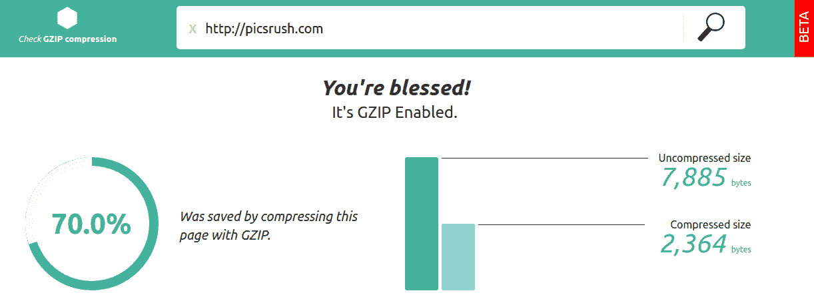

# 生产前端性能检查表

> 原文：<https://medium.com/hackernoon/front-end-performance-check-list-for-production-4e930cb63e8a>


front End Performance Check-list For Production

在 web 开发中，确切地说是前端 web，我们花费更多的时间来搜索我们页面的最佳设计和内容，这很好，但我们错过了优化我们的网页。

在这篇文章中，我将与你分享我的小鸡名单，我用它来优化我的网页开发后。所以，如果你认为我错过了什么，请随意发表评论。

这个清单包含了搜索引擎优化的优化，以及页面加载时间和一些最佳实践。

> 开始吧！！！！

*   **不要错过网站图标**:网站图标就像你网站的小 ID。无论你的网站的根文件夹中是否有 favicon.ico 文件，浏览器都会要求它。如果您没有该文件，响应将是 404 Not Found。所以要小心，不要在第一次与浏览器互动时给人负面印象。为了解决所有问题，你可以用[这个在线工具](http://realfavicongenerator.net/)为你的网站生成图标和清单文件。
*   使用社交媒体元标签:元标签对于社交媒体和谷歌排名非常重要。你可以用这个[在线元标签生成器](https://megatags.co/)生成你所有的社交元标签(脸书、推特、谷歌……)。
*   **压缩你的图片**:加载图片会让你的页面加载时间增加 70%。所以尽可能使用 SVG 图像。并在生产后对其进行优化。可以试试这个[在线图像压缩器](http://compresspng.com/)。
*   **CSS 优化**:

***用于跨平台 CSS 的 autoprefixer***:我们都为自己喜欢的浏览器编写 CSS 规则，对于我来说，我在开发中使用 Chrome。但是你需要给所有这些规则加上前缀来支持所有类型的浏览器。Autoprefixer 将使用基于当前浏览器流行程度和属性支持的数据来为您应用前缀。您可以在命令行中使用它。

```
npm install -g postcss-cli autoprefixer
postcss *.css use autoprefixer -d build
```

或者用 webpack 配置或者用这个[在线工具](https://autoprefixer.github.io/)。

***Purifycss*** :一个神奇的工具，可以帮你删除项目中所有不用的 css 代码。purifycss 接受内容(HTML/JS/PHP/etc)和 css，只返回使用过的 CSS，如果你的应用使用的是 Bootstrap 之类的 CSS 框架，这非常有用。

要安装 purify-css:

```
npm install -g purify-css
```

如何使用它:

```
purifycss src/css/main.css src/css/bootstrap.css src/js/main.js — min — info — out src/dist/index.css
```

从 [purify-css github 页面](https://github.com/purifycss/purifycss)获取更多信息。

***缩小 CSS*** :缩小你的 CSS 文件你可以用 purifycss 缩小或者缩小所有资产[在线](http://csscompressor.com/) [。](http://csscompressor.com/.)

*   **使用 PageSpeed Insights 检查性能** : PageSpeed Insights 为移动和桌面设备测量页面性能。它提取 url 两次，一次用移动用户代理，一次用桌面用户代理。PageSpeed Insights 检查页面是否应用了常见的性能最佳实践，并提供一个分数，范围从 0 到 100 分。给你一些提高分数的建议。
*   **GZIP 压缩**:启用压缩是提高网站性能的最快方法之一。往前走，在你的服务器上设置 GZIP，让你的用户享受好处。这是我在自己的网站上节省了多少带宽。



checkgzipcompression.com

你也可以查看你的 Gzip 压缩，[这里](https://checkgzipcompression.com) [。](https://checkgzipcompression.com.)

*   **使用 CDN** :来自 webopaedia，“内容交付网络(CDN)是一个分布式服务器(网络)系统，根据用户的地理位置、网页的来源和内容交付服务器，向用户交付网页和其他 Web 内容。”简单来说，这是一种在世界各地服务器上的缓存系统，你可以在这里为你的网站尝试免费的 [CloudFlare](https://www.cloudflare.com) 计划。
*   用哨兵追踪前端错误:[哨兵](https://sentry.io/)对前端开发者来说是一个很棒的工具。它自动报告从浏览器环境中触发的未捕获的 JavaScript 异常，并提供丰富的 API 来报告您自己的错误。您可以实时看到所有的错误堆栈。通过电子邮件、短信或 Slack 获得通知。Sentry 可以在前端错误发生时提示用户反馈。
*   **使用谷歌标签管理器**:简而言之，[谷歌标签管理器](https://www.google.com/analytics/tag-manager/)是新版本谷歌通用分析的一个完整的分析解决方案，另一方面，谷歌标签管理器可以管理你所有的 javascript 片段，这些片段在你的网页中向第三方发送信息，比如 facebook 和 twitter widgets。它可以帮助你节省加载时间，并在一个地方管理所有的 javascript 代码片段。

感谢阅读！如果你认为我错过了什么，请随意发表评论。

如果你认为其他人应该阅读这篇文章，请按💚按钮，发推特，分享帖子。记得在 Medium 上关注我，这样你就可以得到关于我未来帖子的通知。

> ***阅读更多故事***[](https://elazizi.com/)

**

*Press the 💚 button*

*[](http://bit.ly/HackernoonFB)**[](https://goo.gl/k7XYbx)**[](https://goo.gl/4ofytp)*

> *[黑客中午](http://bit.ly/Hackernoon)是黑客如何开始他们的下午。我们是阿妹家庭的一员。我们现在[接受投稿](http://bit.ly/hackernoonsubmission)并乐意[讨论广告&赞助](mailto:partners@amipublications.com)机会。*
> 
> *如果你喜欢这个故事，我们推荐你阅读我们的[最新科技故事](http://bit.ly/hackernoonlatestt)和[趋势科技故事](https://hackernoon.com/trending)。直到下一次，不要把世界的现实想当然！*

**