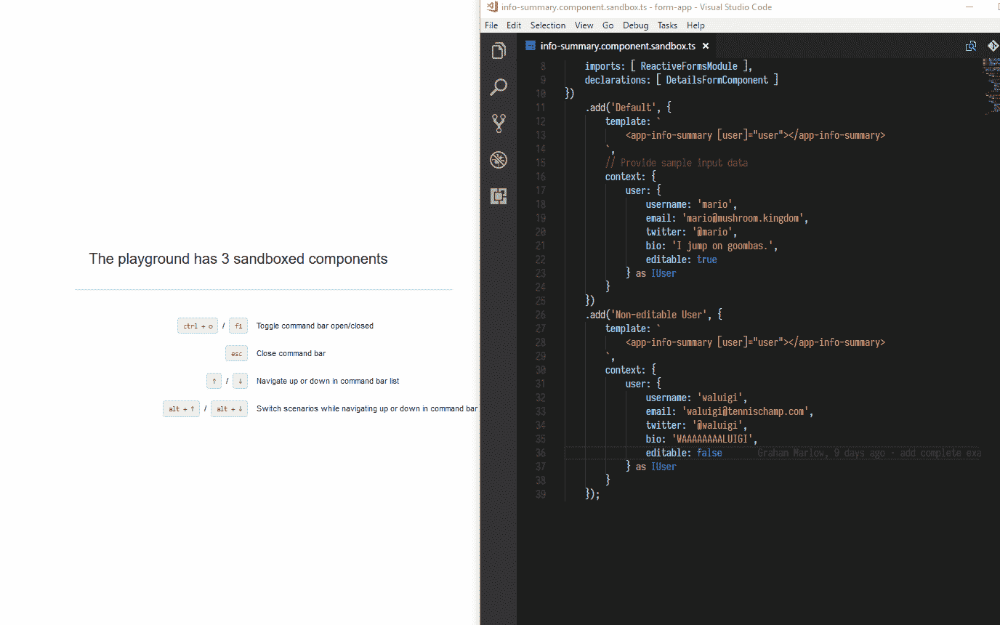
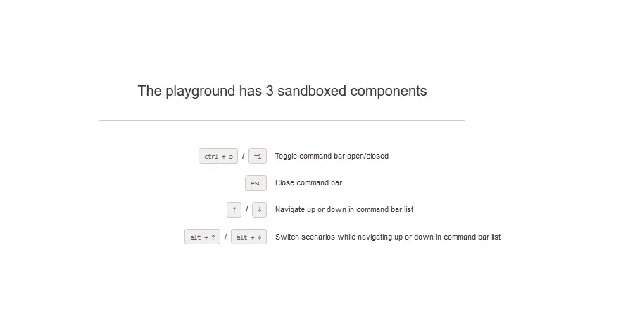
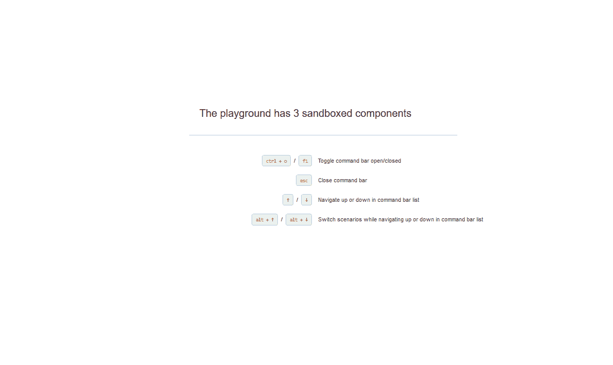

# 前端工作流程:重新设想

> 原文：<https://medium.com/hackernoon/front-end-workflow-re-envisioned-43f800bb01bd>

> 由于前端开发包含了以组件为中心的设计，因此构建用户界面的方法也应该如此。



Developing with Angular Playground

两年前,[思考改变了我设计用户界面的方式。说得难听点，它使得 UI 设计对程序员更友好:将 UI 分成几个部分，将每个部分作为无状态标记单独处理，只有在整个结构完成后才添加逻辑。基于组件的设计的工作流程是如此的直观，以至于我经常忘记我正在使用它。](https://reactjs.org/docs/thinking-in-react.html)

不幸的是，在现实世界中规划应用程序并不像文章中描述的那么简单。项目经理的需求、愿望和目标永远在变化。设计用户界面结构(首先是逻辑，然后是逻辑)有一个主要的痛点:直到开发结束，代码都没有最低限度的可行产品来演示。这意味着范围或项目方向的变化会极大地影响开发工作。如果应用程序的功能由于不同的方向而发生巨大的变化，那么花时间构建应用程序是没有意义的。

开发团队如何在保持基于组件的设计优势的同时，提供快速、有意义的产品迭代？解决方案是以与《反应中的思考》中描述的相反的方向进行开发:

1.  从绘制相同的用户界面地图开始，将每个部分划分为各自的组件。
2.  与其定义整体结构和开发无状态的重现，不如从最小的部分开始向上移动。选择应用程序中最不复杂的组件，用模拟数据完成它，从而完成结构的一部分。
3.  继续在整个用户界面中向上移动，逐渐实现更复杂的组件。这些复杂的组件将使用先前创建的较小组件。

这个工作流程解决了可演示产品的问题。每个组件完成后，开发团队就可以展示一个全功能的应用程序，即使它是用假数据连接起来的。这种方法的问题在于开发过程:如果不定义应用程序结构的其余部分，孤立地开发一个单独的组件通常是不容易的。然而，有一些很棒的工具可以帮助我们解决这个问题，并允许轻松有效地独立开发组件。

# 沙盒组件

当开发一个完整的应用程序时，组件应该被单独地分阶段和迭代。这种技术被称为沙箱，或者为一段数据提供一个完整且隔离的环境。对于现代前端框架，两个开源的沙盒工具是[故事书](https://storybook.js.org/)和[角游乐场](http://www.angularplayground.it/)。

**免责声明:**我是角操场的投稿人。因此，我将把重点放在 Playground 上，因为它是我最熟悉的工具。

Playground 获取已经写在应用程序代码中的组件，并将它们安装在“场景”中。每个场景都是围绕您的组件构建的轻量级包装，仅包含您在该场景中定义的标记。应用程序的所有其他依赖项都被忽略了。这意味着您可以在没有整个应用程序的情况下迭代和测试组件。这也意味着您可以用您选择的任何数据和依赖项来存放组件，并完全控制它们提供的数据。

因为组件是与应用程序本身的场景分开创建的，所以 Playground 只需获取现有的组件，并将其引导到自己的环境中。这意味着你需要在一个组件上工作的唯一代码是它的依赖列表和它的选择器，例如`<my-component>`。代码库中的更改会立即反映在使用该组件的所有场景中。

这些特性在构造组件时为开发人员提供了很大的力量。

# 搭建操场

Angular Playground 在应用程序现有的 Angular 环境下工作，所以没有太多样板文件需要设置。由于大多数 Angular 开发使用 [Angular CLI](https://cli.angular.io/) ，我将在假设您的 Angular 应用程序(CLI `1.2.0+`)已经搭建好的情况下开始。为了让 Playground 与您的应用程序挂钩，只需要添加一些额外的元数据文件。

如果您想跳过配置，直接进入我的示例项目，[这里是代码](https://github.com/mgmarlow/playground-demo)。

由于 Playground 使用[动态导入表达式](https://blogs.msdn.microsoft.com/typescript/2017/06/27/announcing-typescript-2-4/)来确保沙盒组件真正以独立的块加载，所以要确保项目中的 TypeScript 版本是`2.4.0+`。我们还需要更改一个`tsconfig.app.json`设置，将模块输出设置为`esnext`。

```
npm install --save-dev angular-playground typescript@2.4.2
```

下一步是添加 Playground 用来引导应用程序组件的代码。在`src/`目录下，添加以下文件:`main.playground.ts`

注意，我的 Angular apps 在这里的名字是`ng-app`。

接下来是 Angular CLI 将用来编译 Playground 项目的元数据文件。向`angular-cli.json`添加一个额外的`app`条目:

现在，对于您的项目根中的特定于操场的配置，`my-app-dir/angular-playground.json`。Playground CLI 工具将在构建沙箱时使用该文件。

最后，向项目的`package.json`添加一个 npm 脚本，以使用 Playground CLI。

```
"scripts": {
  "playground": "angular-playground"
}
```

用`npm run playground`运行 Angular Playground，导航到 localhost:4201。



Playground running in localhost:4201/

# 创建沙箱

随着操场的建立和运行，我们准备为我们的组件创建沙箱。下面是一个简单的组件，我们将为其构建场景:

如果用户是可编辑的，该组件允许用户编辑与简档相关联的特定字段。注意，这个组件接受一个输入(`@Input() user`)并在其模板中包含一个单独的组件，`<app-details-form>` ( [源](https://github.com/mgmarlow/playground-demo/blob/master/src/app/user-profile/details-form/details-form.component.ts))。

我们用操场 API 函数`sandboxOf()`创建沙箱。这个函数的工作方式很像 Angular 的`NgModule`装饰器，因为我们用它来描述特定组件所需的依赖关系。由于`InfoSummaryComponent`包含了来自`ReactiveFormsModule`的控件，我们需要将该模块作为导入引入。此外，由于`DetailsFormComponent`是在`InfoSummaryComponent`的模板中使用的，Playground 需要知道它，这样它才能正确地呈现整个组件。

假设我们想要设置这个组件的两种不同状态:一种是默认的可编辑用户，另一种是不可编辑用户。我们可以通过为组件设置两个不同的“场景”来做到这一点，每个场景为`@Input() user`变量提供一个不同的用户。



Sandboxing the info-summary component

下面是各自的沙箱文件(`info-summary.component.sandbox.ts`)，它将组件分为两种场景，“默认”和“不可编辑用户”。

首先，我们用`sandboxOf(InfoSummaryComponent, { /** … **/})`实例化组件及其依赖项。然后，我们使用`.add()`方法向沙箱中添加不同的场景，设置我们的环境。每个场景都有一个名称和一组选项。

options 对象唯一需要的属性是`template`，它接收将在页面上呈现的模板。在这个简单的例子中，我们只是用不同类型的用户数据来存放我们关心的组件。最后，`context` 是一个可选属性，它向组件的上下文提供数据。这里我们用它来提供两个不同的用户，一个可编辑，一个不可编辑。

有了这个沙盒结构，我们可以为我们开发的组件准备许多不同的场景，对它们的所有数据需求和使用进行建模。随着组件复杂性的增加，沙箱提供了一个很好的环境来帮助关注重要的细节。

# 包扎

虽然这是一个简单的例子，但我希望它展示了沙箱组件的强大。Angular Playground 支持所有不同类型的组件设置，允许您提供注入的服务，设置场景特定的样式，并轻松地对`@Input()`和`@Output()`进行建模。还有很多好处可以帮助您的开发团队，这些好处不在本文的讨论范围之内。以下是几个例子:

*   **测试变化和边缘案例**:通过为一个组件创建许多场景，每个变化都很容易测试和设计。最糟糕的 bug 是那些很难重现的 bug，因为它需要大量的数据和交互来结束损坏的组件状态。沙盒允许开发人员模拟出破坏组件的数据，并立即开始迭代解决方案，从而缓解了这个问题。
*   **单一用途的组件**:通过沙盒工作流的进展鼓励开发人员构建可以在场景中轻松建模的组件。这意味着当组件启动时，它通常会被分解成更小的部分，每一部分都更加独特。当组件完成时，只要遵循预期的工作流，结果通常是简单的、可重用的代码块。
*   **更简单的单元测试**:沙箱被设计成类似于单元测试文件，使得在组件开发之后(或期间)立即过渡到测试变得容易。
*   **交互式文档**:游乐场场景可以嵌入到文档页面中，允许它们利用交互式组件。因为这些场景是从源代码中提取的，所以当组件发生变化时，它们会立即更新。

# 资源

*   [思考中做出反应](https://reactjs.org/docs/thinking-in-react.html)
*   [故事书](https://storybook.js.org/) ( [来源](https://github.com/storybooks/storybook))
*   [角游乐场](http://www.angularplayground.it/) ( [来源](https://github.com/SoCreate/angular-playground))
*   [文章源代码](https://github.com/mgmarlow/playground-demo)