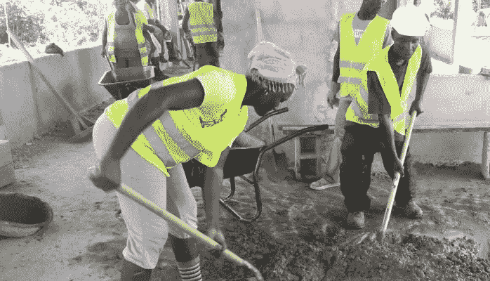

# 前沿女性 STEM:离网绿色能源项目的性别整合

> 原文：<https://medium.com/hackernoon/frontier-female-stem-gender-integration-of-an-off-the-grid-green-energy-project-b486cf8557da>

2015, Kwendin, Liberia — Mixed gender crew builds next generation power infrastructure

我和我的团队被要求记录我们如何能够有效地将[妇女](https://hackernoon.com/tagged/women)纳入利比里亚农村的项目——在那里，我们的女性员工与男性同事一起无缝地以非传统的角色工作。我们希望与世界各地的同事分享这些信息，以便在他们的工作中使用。

在世界上的许多地区，女性的劳动没有得到充分的价值认可，没有被视为“真正的工作”，只是被视为理所当然。对于一家在利比里亚经营的外国公司来说，有意将女性劳动力纳入经营活动，并明确承认其在推进使命中的关键作用，既是道德要求，也是现实需要。在我们的运营中，我们努力通过我们的核心原则来塑造性别环境，其中的关键是纳入熟练的女性劳动力，明确认可女性的贡献，并营造一种尊重所有员工(无论性别)的环境。

在我们最近的[项目](https://hackernoon.com/tagged/project)中，我们在 Kwendin 村建设了一个由美国国际开发署(USAID)资助的生物能源工厂，我们的女首席执行官向所有员工做出了明确的指示，即只要可行，就雇佣女性担任熟练工职位，这导致了最初的建筑团队，在 15 名工人中，我们雇佣了两名女泥瓦匠和一名女木匠，此外还有三名女性担任更传统的厨师职位。我们的外籍管理团队由一名拥有 MBA 和建筑经验的女性政党领袖、一名前军方男性副手和一名前和平队女性合同经理(CM)组成，这让我们的员工看到了一名男性外籍经理和一名男性利比里亚首席工程师接受女性领导的指导。

我们的负责人积极努力表明女工是工作中的平等伙伴。他们的意见在上午和下午的会议上被积极征求，我们的泥瓦匠和木匠抓住机会在现场陈述他们的意见、担忧和想法。一个关键的教学时刻是在一个下午，女泥瓦匠领导比阿特丽斯对我们如何用碎石回填一个基坑提出了异议，认为它不会妥善解决。我们的负责人听出了她的担心，并礼貌地反驳了他们，但大约三个小时后，很明显，回填确实没有稳定好，必须用砾石底座来代替地基。我们的首领召集了所有的船员，说:“Beatriz，你是对的，我错了，压碎的砖石不能用，我们需要像你建议的那样使用砾石。谢谢你给我指明了正确的道路。”那一刻给我们的工作人员留下了深刻的印象，Beatriz 对她的工作信心大增。

有时，我们的工作需要明确纠正不良的性别价值观，每次出现这种情况，我们的主管和合同经理(CM)都会欣然接受。有一次，一名男性水泥技术员来到午餐圈吃饭，脱下沾满泥巴的靴子，扔给我们的女木匠，说:*“去把这些清理干净。”*我们 CM 当着剧组的面坚定的把他叫了出来，告诉他木匠不是他妈要收拾的烂摊子，而是一个技术工人，他的责任就是给施工架木头。她解释说，仅仅因为女性的性别而期望她做额外的工作是对她的专业技能的不尊重，年轻男子必须要么自己洗靴子，要么礼貌地付给村民清洁靴子的费用，这样每个人的劳动都得到了适当的重视。同样，在看到首席工程师只要求女员工捡起垃圾并清扫工地后，内阁宣布清洁任务必须在全体员工之间平均分配，不分性别。对于我们的厨师来说，在“传统的女性工作”中，工作人员很容易认为他们是理所当然的，我们确保每次为他们服务时，工作人员都要感谢他们，并且厨师长将公开与 CM 举行会议，以便工作人员可以看到厨师团队领导必须向 CM 报告以接收她的供应资金，并以与砖石和木工团队报告相同的方式提交收据。

性别规范的改变需要几代人的努力，而不仅仅是一个项目，因此，当我们在 Kwendin 努力一点一点地改变态度时，我们敏锐地意识到配偶和儿童虐待、危险的家庭工作条件(特别是由于在冒烟的明火上烹饪)、缺乏以女性为重点的医疗支持以及缺乏性别间的同情和尊重等普遍问题。尽管我们知道我们的努力只能触及性别问题的表面，即使只是在一个村庄，但向前迈出的每一步都是一项成就，我们希望在我们离开 Kwendin 时，我们教授的小课程以及我们的女性经理和劳动者树立的榜样将会产生共鸣，加强社区对妇女更道德、公正甚至有效的工作环境的持续压力。

作为我们组织的领导者，我们必须积极寻求平衡我们的劳动力，为男女共享的技能提供同等报酬；对工作场所内外的性别欺凌坚持不容忍政策；教育我们的员工和社区男女同志情谊的好处。

2015, Kwendin, Liberia — Mixed gender crew builds next generation power infrastructure