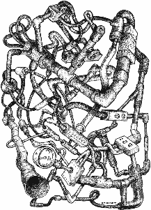

# 去他妈的，运吧。

> 原文：<https://medium.com/hackernoon/fuck-it-ship-it-905afd092547>

在[工程](https://hackernoon.com/tagged/engineering)、**我们靠船运**生死。如果我们不发布代码，我们要么在做别人的工作(营销、产品、客户服务等)，要么我们什么也不做。如果我们在做别人的工作，从定义上来说，我们没有做好自己的工作。

我们的工作是推出新产品，发布新功能，并以某种方式阻止错误和生产中断。在小公司里，一个人就可以承担所有这些职能。在更大的范围内，这是跨个人或团队分布的。

# 为什么速度很重要

> 如果你对你产品的第一个版本不感到尴尬，那么你已经推出太晚了。 *—雷德·霍夫曼*

如果你的[初创公司](https://hackernoon.com/tagged/startup)还没有发布代码，那么你只是一个科学展览项目。你的产品必须公开，这样你才能从用户那里得到反馈。很烂吗？他们喜欢吗？是什么阻碍了他们支付费用呢？是什么让他们说“闭嘴，拿走我的钱！”？如果你不知道这一点，那么你将会漫无目的地走下去，可能会浪费你的时间去建造一些没人关心的东西。

你的领导团队没有所有的答案。他们可能擅长直觉，但归根结底，他们只是直觉，必须得到现实世界的验证。

# 技术债务重要吗？

如果你是一家大公司，而且你即将为数百万用户上线，这就很重要了。话说回来，你应该更好地了解你的新活动会接触到多少人，并相应地做好计划。但如果你是一家初创公司…

Y.A.G.N.I.

从来没有创业公司死于技术债务。在#failwhale 年代，甚至 Twitter 也没有消亡。重要的是往墙上扔东西直到它粘住。当你开始往墙上扔东西时，很有可能你不再需要它了。

注意，技术债不代表“狗屎代码”。这意味着你有意识地延迟你的系统工程，以适应更大的用例。如果你的报告足够快，不要建造 OLAP。如果你只在美国推出，你不需要国际化。如果你每天只有 1000 个用户，那么你不需要在 Go 中重写你的 Rails 应用。事实上，[从来不做重写](https://www.joelonsoftware.com/2000/04/06/things-you-should-never-do-part-i/)。

如果你真的遇到了“扩展问题”，那是因为你采用了它。你的产品是成功的。如果你有一个好的商业模式，那么这意味着你正在赚钱，并且可以用这些钱雇佣工程师来解决你的扩展问题。如果你没有赚钱，那么你需要让富人相信，彩虹的尽头有一个罐子，前提是他们给你钱让你到达那里(并雇佣那些关键的工程师来解决你的扩展问题)。

# 如何判断自己是否足够快？

> 如果一切似乎都在控制之中，说明你走得不够快。—马里奥·安德烈蒂

当你全速前进时，有趣的事情发生了。当你有能力完成事情时，人们会被你吸引。你会被要求做更多的工作。

WHOA!

这里的解决方案不是一周工作 80 小时。你的工作就是去上班，并在上班的时候保持精力充沛。你完成的数量会给你多巴胺，应该会让你保持动力。你设定了雄心勃勃的目标，并且达到了目标。但是不要过度。你会精疲力尽，研究表明，一周工作超过 40-50 小时产出很少。回家放松一下(或者一头扎进个人项目)。

# 发货后

具有讽刺意味的是，我正在完成这篇关于快速运送物品的文章，它花了我整整一周的时间来写。我 2017 年的新年决心是加倍努力，把事情做完，即使这意味着它并不完美。如果工作有趣且有价值，你会得到反馈，并且有时间去做得更好。如果不是，那你就没有浪费时间去擦一坨屎。

出货后，庆祝你的胜利。确保让你的团队、合作伙伴或客户知道你的成就。寻求反馈。期待反馈。希望你能得到反馈。利用您所学到的知识，现在是时候重构您的代码，清理接口，并修复您没有考虑到的边缘情况错误。

> [黑客中午](http://bit.ly/Hackernoon)是黑客如何开始他们的下午。我们是 [@AMI](http://bit.ly/atAMIatAMI) 家庭的一员。我们现在[接受投稿](http://bit.ly/hackernoonsubmission)，并乐意[讨论广告&赞助](mailto:partners@amipublications.com)机会。
> 
> 如果你喜欢这个故事，我们推荐你阅读我们的[最新科技故事](http://bit.ly/hackernoonlatestt)和[趋势科技故事](https://hackernoon.com/trending)。直到下一次，不要把世界的现实想当然！

