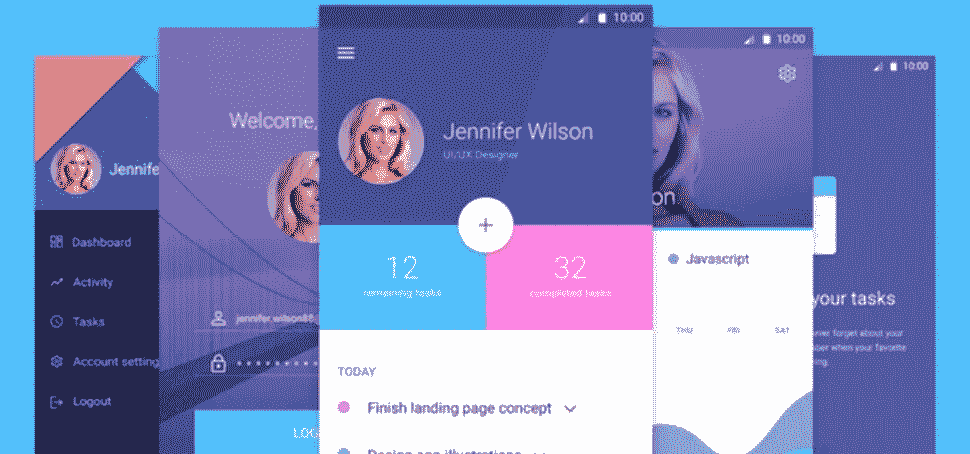

# 全栈 Java

> 原文：<https://medium.com/hackernoon/full-stack-java-c00623fed87d>

在过去的几年里，我在许多会议上发表过演讲。10 年前，当我去参加一个 Java 会议时，我会说 Java 开发人员社区的划分是 40%服务器，15%移动，其余是桌面(完全是根据会议上的传闻编造的数字)。今天，当我参加会议时，几乎所有的开发人员都在构建服务器代码，只有少数人在做 Android 工作…

似乎 JavaScript 已经从 Java 手中接过了全栈的衣钵(我用 Java 作为 JVM 的同义词，所以 Kotlin、Scala 等人都和我们在一条船上)。

尽管过去一年在企业开发者社区中出现了一些冲突，但 Java 在服务器端仍然有着良好的记录，我们试图在客户端填补这一空白，特别是针对[移动应用](https://www.codenameone.com/)。

虽然 Android 实际上是 Java，但它大量基于 XML，需要做大量的工作来“做对”,这使得很少有时间在应用程序的各个层之间跳舞。另一个痛点是设计，在手机上这绝对至关重要！

我投入了大量的工作来使用 Java 创建华丽的应用程序查看这些应用程序的现场演示和完整源代码:

*   [材料屏幕](https://www.codenameone.com/blog/template-mobile-material-screens-ui-kit.html)
*   [凤凰](https://www.codenameone.com/blog/template-phoenix-ui.html)
*   [PSD 至 App](https://www.codenameone.com/blog/psd-to-app-revisited.html)
*   [清洁现代](http://www.codenameone.com/blog/template-clean-modern-ui-kit.html)

这(材料屏幕)花了我 1-2 天的时间来制作:

This demo took me 1–2 days to build in Java… Imagine what we can do in 2 weeks!

然而，仅仅制作一个好看的演示是不够的。我们需要建立基于 Java 的完整的创业公司。Java 开发人员需要有能力在几周内而不是几个月内，在生产级的完整服务器端构建这样的应用程序，以便在当今精益创业和敏捷企业的市场中具有竞争力。

# 接受挑战

我可以用 Java 构建一个 kickass 原生移动应用程序，它将包括服务器端，外观良好，并在 2-4 周内在商店中达到生产级别。虽然这不是火箭科学，但构建一个合适的生产应用程序仍然需要大量的工作。请注意，我不是在谈论某个特定用例的 90%已经实现的模板…

事实上，我能相对容易地做到这一点与我在 Java 和编程方面的经验有关，所以这可能不会以书的形式或甚至在课程/视频中有效地扩展。我想做所有这些，但在这个时候，我不认为他们会有效。

当我 20 多年前开始进入专业编程世界时，我已经知道如何合理地编程。然而，让事情发生巨大变化的是我一路走来遇到的了不起的导师，他们教会了我了不起的东西。导师是双向的，今天当我指导程序员时，我对材料和学生问题都有了更好的理解。

所以我 90%的时间都在做支持。这不是最有趣的工作，但它帮助我掌握了社区的脉搏。

# 前进和问题

我一直在为开发人员开展一个训练营项目，在那里我可以密切指导一小组程序员，这样他们就可以轻松地构建非常棒的应用程序并部署整个项目。有很多挑战，例如，你如何平衡好的/坚固的架构和以周为单位的时间限制？

通常，几周只是我们在 Java 世界中花费在白板上的时间…

还有移动应用程序开发的黑暗世界，其中包括本机层、签名/供应等许多陷阱。一直到商店…

这些都很“简单”,但是当我们坐在象牙塔里时，一切看起来都很容易和完美，这就是为什么这个训练营是我个人非常期待的。

所以我想从你们这里知道:

*   你认为全栈 Java 是一个有价值/重要的目标吗？
*   当你看到这样的东西时，你最关心的问题是什么？

> [黑客中午](http://bit.ly/Hackernoon)是黑客如何开始他们的下午。我们是 [@AMI](http://bit.ly/atAMIatAMI) 家庭的一员。我们现在[接受投稿](http://bit.ly/hackernoonsubmission)，并乐意[讨论广告&赞助](mailto:partners@amipublications.com)机会。
> 
> 如果你喜欢这个故事，我们推荐你阅读我们的[最新科技故事](http://bit.ly/hackernoonlatestt)和[趋势科技故事](https://hackernoon.com/trending)。直到下一次，不要把世界的现实想当然！

