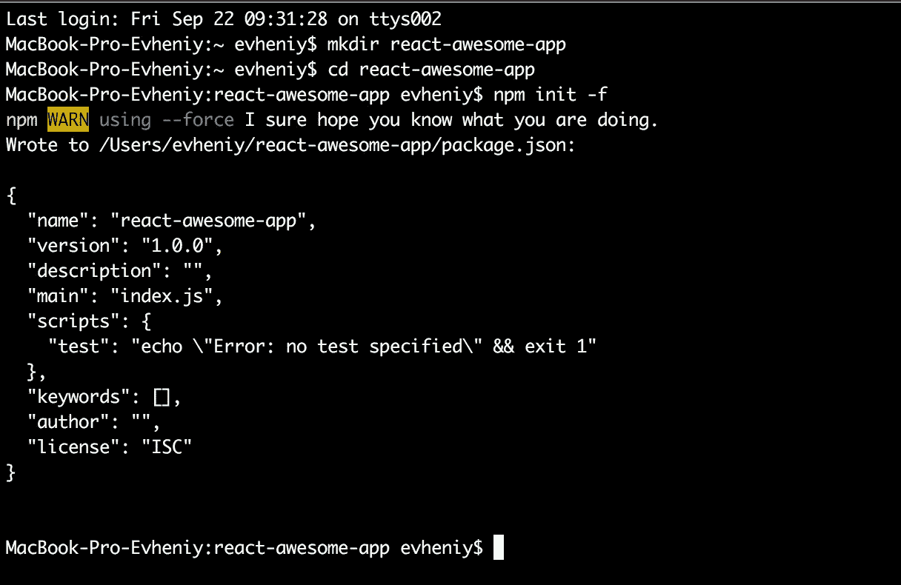
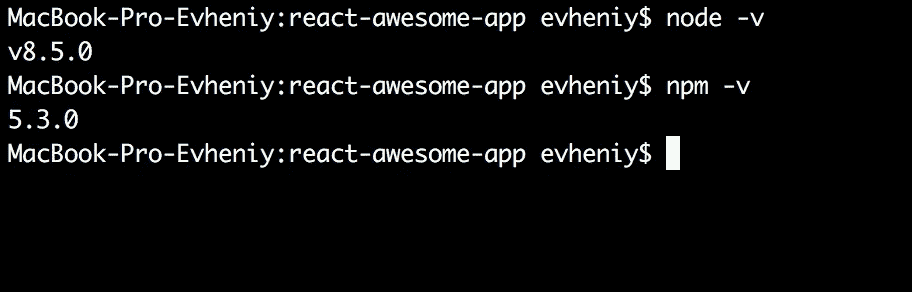
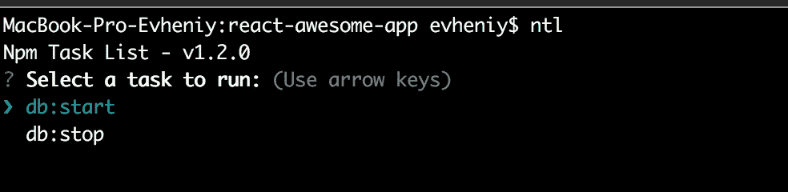
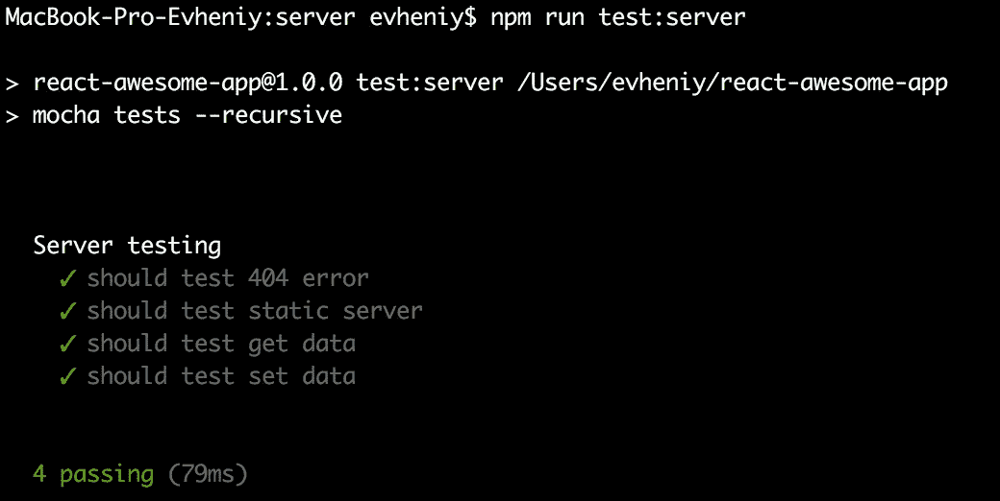
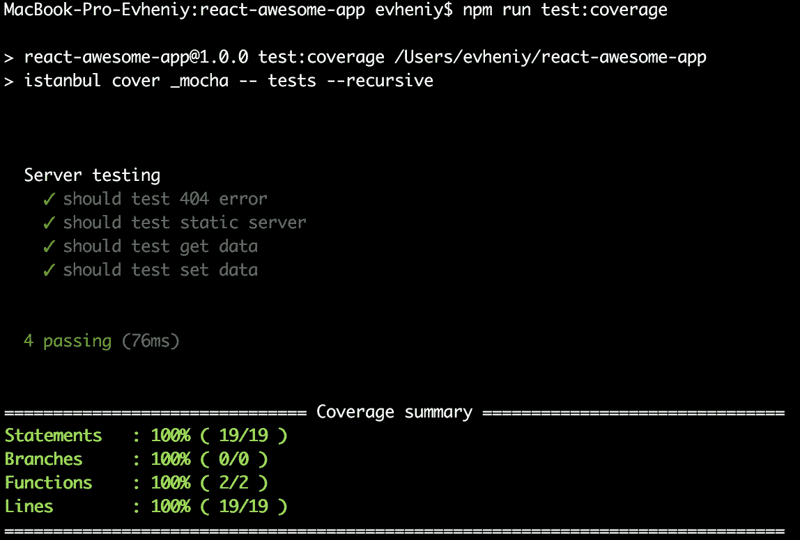

# 从头开始的全栈 react 应用程序—第 1 部分

> 原文：<https://medium.com/hackernoon/full-stack-react-app-from-scratch-part-1-9086cacc59ac>


一些开发人员不喜欢 [react](https://facebook.github.io/react/) ，因为它太难了，功能性的，新思想。在本教程中，我将向您展示如何简单快速地使用 [node.js](https://nodejs.org/en/) 、react、 [redux](http://redux.js.org/docs/introduction/) with [rxjs](http://reactivex.io/rxjs/) 和 [docker](https://www.docker.com/) 从零开始创建生产就绪全栈应用程序，并覆盖全部代码。

我们将在后端使用 node.js 创建全栈应用程序，并在前端使用 redux 和 rxjs。而 [redis](https://redis.io/) 将是我们的数据存储。要在 dev PC 上运行 redis，我将展示使用 docker 是多么容易。

让我们从 [docker 安装](https://docs.docker.com/engine/installation/)开始创建我们的应用程序。之后，我们应该创建目录并启动节点项目。现在谁想看我创建的代码 [github 库](https://github.com/evheniy/react-awesome-app)。

每个新的 JavaScript 项目都应该从使用 **npm init** 命令创建的 **package.json** 开始。

```
mkdir react-awesome-app
cd react-awesome-app
npm init -f
```



Node.js 现在是[最受欢迎的平台](https://medium.freecodecamp.org/trending-developer-skills-based-on-my-analysis-of-ask-hn-whos-hiring-26c02a3ca1fd)，不仅仅是作为后端或前端捆绑的工具。正如[我在](/@evheniybystrov/backend-development-what-next-f9a5f9b386d2)之前写的，许多大公司支持它用于自己的服务(谷歌、AWS)或者[把它作为系统的一部分](https://nodesource.com/blog/how-massive-companies-use-node-js-at-scale)(优步贝宝)。对于真正的生产项目，最好使用云服务，如 [Google function](https://cloud.google.com/functions/docs/) 或 [AWS lambda](http://docs.aws.amazon.com/lambda/latest/dg/nodejs-prog-model-handler.html) 。但是对于开发或小型项目，我们可以使用 node 作为 http/https 服务器，使用类似于 [express](http://expressjs.com/ru/) 或 [koa](http://koajs.com/) 的框架。在教程中，我将向您展示其他框架— [YEPS](https://yeps.info/) ，[我创建了它](/@evheniybystrov/yet-another-event-promised-server-ee1b06506add)用于处理承诺、异步/等待、并行执行…

正如我之前所说，要存储我们的应用程序数据，我们可以使用 redis。感谢 docker，我们可以在本地运行它，没有依赖性和内存问题。要在 docker 中运行它，我们需要执行命令

```
docker run -d --name redis -p 6379:6379 redis:alpine
```

这里我们使用小的 **alpine** 镜像作为守护进程( **-d** )，打开默认端口 **6379** 。要停止它，我们需要运行:

```
docker rm -f redis
```

当我们使用 **package.json** 时，我们可以将这些命令添加到**脚本**部分:

```
"scripts": {
  "db:start": "docker run -d --name redis -p 6379:6379 redis:alpine",
  "db:stop": "docker rm -f redis"
},
```

不要忘记 **package.json** 是 json 文件，所以不要破坏它。现在我们只需要运行 **npm run db:start** 来启动 redis 服务，运行 **npm run db:stop** 来停止它。

不要忘记安装 node.js 版本 7.6.0 和更高版本，因为我们将本机使用 **async / await** 。要检查当前版本，只需运行 **node -v** (由于 [nvm](https://github.com/creationix/nvm) ，我使用了最新版本):



现在我将只安装一个全局依赖项— [**ntl**](https://www.npmjs.com/package/ntl) ，它有助于查看我们所有的命令:

```
npm i -g ntl
```

在目录中运行 **ntl** 命令并选择脚本后:



# 下一步是我们的后端。

了解**[**node . js http/https server**](https://nodejs.org/en/docs/guides/anatomy-of-an-http-transaction/)**如何工作非常重要。它是单个进程，实际上它是带有**请求**事件的 EventEmitter。每个用户的请求运行事件处理程序，而每个 node.js 框架(如 express.js 或 koa.js)只是处理用户请求的处理程序。因此，这个过程中的任何副作用(如变量)都可能导致内存泄漏。小心点。****

****对于我们的项目，我们将使用 [YEPS 框架](/@evheniybystrov/yet-another-event-promised-server-ee1b06506add)。我使用 Promise.all 为一个具有异步/等待和并行作业的高负载项目创建了它。多亏了 promise 模型和并行执行，而不是一个接一个循环运行模块的中间件模型，我的速度提高了 10 倍。****

****要使用 YEPS，我们需要安装所有依赖项(运行带有 **-S** 标志的命令，将依赖项存储在 **package.json** 和 **-D** 中，将其存储为 **devDependencies** ):****

```
**npm i -S yeps yeps-bodyparser yeps-cors yeps-error yeps-helmet yeps-logger yeps-redis yeps-router yeps-server yeps-static**
```

****并且我们可以看到 **package.json** 的变化:****

```
**"dependencies": {
  "yeps": "^1.0.0",
  "yeps-bodyparser": "^1.1.0",
  "yeps-cors": "^1.0.0",
  "yeps-error": "^1.2.0",
  "yeps-helmet": "^1.0.0",
  "yeps-logger": "^1.0.0",
  "yeps-redis": "^1.0.0",
  "yeps-router": "^1.0.0",
  "yeps-server": "^1.0.0",
  "yeps-static": "^1.2.0"
}**
```

****为了组装我们的服务器部分，我将创建新的目录 **server** 和 **index.js** 作为入口点。****

```
**mkdir server
cd server
touch index.js**
```

****并把这段代码:****

```
****const** App = require('yeps');
**const** Router = require('yeps-router');
**const** error = require('yeps-error');
**const** logger = require('yeps-logger');
**const** redis = require('yeps-redis');
**const** bodyParser = require('yeps-bodyparser');
**const** helmet = require('yeps-helmet');
**const** cors = require('yeps-cors');
**const** serve = require('yeps-static');

**const** app = module.exports = **new** App();
**const** router = **new** Router();

router.get('/data').then(**async** (ctx) => {
  **const** rows = **await** ctx.redis.get('data');
  ctx.res.end(JSON.stringify(rows));
}).post('/data').then(**async** (ctx) => {
  **await** ctx.redis.set('data', JSON.stringify(ctx.request.body));
  ctx.res.end(JSON.stringify({
    message: 'ok',
  }));
});

app.all([
  error({ isJSON: **true** }),
  logger(),
]).then(
  serve(),
).all([
  redis(),
  bodyParser(),
  helmet(),
  cors(),
]).then(
  router.resolve(),
);**
```

****在这里，在需要所有依赖项之后，我创建了**应用程序**和**路由器**。在路由器中，我创建了两个入口点**获取**和**设置数据**。不是 restfull app。****

****之后我们能看到的最有趣的东西。使用 YEPS，我们可以并行运行所有作业，但是使用 promise 接口(在 YEPS 接口后面，我们使用 promise)我们可以使用优先级。首先我们应该设置我们的**记录器**和**错误处理器**(带有 json 响应头)。在检查请求并理解它不是获取静态文件如 JavaScript 文件或 index.html 的请求后(没有参数该模块查看**公共**目录),我们可以启用所有其他模块并且**并行运行它**。连接到 redis 后，设置所有安全头，我们可以开始解析请求并运行路由器处理程序。****

****我在 [YEPS 路由器](https://github.com/evheniy/yeps-router)中使用了相同的并行作业思想。例如，在 express.js 中，我们需要考虑哪些路线是最重要、最受欢迎的，并将其放在第一位。在 YEPS 路由器中，所有检查都是并行进行的。第一个匹配路由器将停止此过程。如果您需要设置优先级，您可以创建多个路由器:****

```
****const** routerFirst = **new** Router();
**const** routerSecond = **new** Router();app
.then(routerFirst.resolve())
.then(routerSecond.resolve());**
```

****不要忘记为我们的 redis 创建**配置**。你可以在 [yeps-redis](https://github.com/evheniy/yeps-redis) 文档中找到例子。为此，我们需要创建 **config** 目录，并放入 **default.json** 文件:****

```
**{
  "redis": {
    "host": "127.0.0.1",
    "port": 6379
  }
}**
```

****要运行我们的服务器，我们需要在 **package.json** 中创建**入口点**和**脚本**，就像我们为 docker 创建的一样:****

```
**"start: server": "node ./bin/www",**
```

****和 **bin/www** :****

```
**#!/usr/bin/env node

const app = require('../server');
const server = require('yeps-server');

server.createHttpServer(app);**
```

****以及运行的命令: **npm run start:server** (或者使用 **ntl** )。****

****打开浏览器[http://localhost:3000/data](http://localhost:3000/data)后检查响应。****

# ****为了做好生产准备，我们需要创建我们的第一个测试。****

****现在我们需要安装我们的第一个开发依赖项。为了进行测试，我们将使用[摩卡](https://www.npmjs.com/package/mocha)、[柴期望](http://chaijs.com/api/bdd/)、[西农](http://sinonjs.org/)和[柴-http](https://github.com/chaijs/chai-http) :****

```
**npm i -D mocha chai chai-http sinon**
```

****而我们的 **package.json** 之后有 **devDependencies** :****

```
**"devDependencies": {
  "chai": "^4.1.2",
  "chai-http": "^3.0.0",
  "mocha": "^3.5.3",
  "sinon": "^3.3.0"
}**
```

****为了运行测试，我们需要将**脚本**添加到 **package.json** 中:****

```
**"test:server": "mocha tests --recursive"**
```

****之后，创建测试目录，其中包含**服务器**目录和 **index.js** 文件:****

```
**mkdir tests
cd tests
mkdir server
cd server
touch index.js**
```

****和我们后端测试的代码:****

```
****const** chai = require('chai');
**const** chaiHttp = require('chai-http');
**const** sinon = require('sinon');
**const** yeps = require('yeps-server');
**const** redis = require('yeps-redis/redis');
**const** logger = require('yeps-logger/logger');

**const** app = require('../../server');

**const** expect = chai.expect;
chai.use(chaiHttp);
**let** server;

describe('Server testing', () => {
    logger.info = text => text;
    logger.error = text => text;

    beforeEach(() => {
        server = yeps.createHttpServer(app);
    });

    afterEach(() => {
        server.close();
    });

    it('should test 404 error', **async** () => {
        **const** spy = sinon.spy();
        **await** chai.request(server)
            .get('/404')
            .send()
            .catch((error) => {
                expect(error).to.have.status(404);
                spy();
            });
        expect(spy.calledOnce).to.be.true;
    });

    it('should test static server', **async** () => {
        **const** spy = sinon.spy();
        **await** chai.request(server)
            .get('/index.html')
            .send()
            .then((res) => {
                expect(res).to.have.status(200);
                spy();
            });
        expect(spy.calledOnce).to.be.true;
    });

    it('should test get data', **async** () => {
        **const** spy = sinon.spy();
        **await** redis.set('data', 'test');
        **await** chai.request(server)
            .get('/data')
            .send()
            .then((res) => {
                expect(res).to.have.status(200);
                expect(res.body).to.be.equal('test');
                spy();
            });
        expect(spy.calledOnce).to.be.true;
    });

    it('should test set data', **async** () => {
        **const** spy = sinon.spy();
        **const** data = 'test';
        **await** chai.request(server)
            .post('/data')
            .send({ data })
            .then((res) => {
                expect(res).to.have.status(200);
                spy();
            });
        **const** storedData = JSON.parse(**await** redis.get('data'));
        expect(storedData.data).to.be.equal(data);
        expect(spy.calledOnce).to.be.true;
    });
});**
```

****在运行 **npm run test:server** 之后，我们看到:****

********

****我禁用了记录器以查看清晰的结果(我们可以看到关于 404 错误测试的信息—未找到页面):****

```
**logger.info = text => text;
logger.error = text => text;**
```

****这就是我们的后端。我们创建了两个端点来获取和设置我们的数据，我们的服务器可以是一个静态服务器。现在我们准备在下一章开始我们的前端部分**。******

****和一些小的更新，如果你在团队工作。首先是 [editorconfig](http://editorconfig.org/) 。对所有团队成员使用相同的代码标准很有帮助。我们需要创造**。编辑器配置**:****

```
**root = true

[*]
end_of_line = lf
insert_final_newline = true

charset = utf-8

indent_style = space
indent_size = 2**
```

****下一步是安装 [nsp](https://www.npmjs.com/package/nsp) —节点安全平台。它帮助您保持节点应用程序的安全。我们只在开发时需要它，所以用 **-D** 标志安装它:****

```
**npm i -D nsp**
```

****并将脚本添加到 **package.json** 来运行它:****

```
**"test:security": "nsp check"**
```

****下一步是安装 [eslint](https://www.npmjs.com/package/eslint) 和[伊斯坦布尔](https://www.npmjs.com/package/istanbul)。Eslint helsp 配合 ES6 代码标准，我们会配合 [airbnb react 插件](https://www.npmjs.com/package/eslint-config-airbnb)使用。由于我们将使用 ES6 和更高版本，我们需要安装新版本的伊斯坦布尔-伊斯坦布尔@next。****

```
**npm i -D eslint eslint-config-airbnb eslint-plugin-jsx-a11y eslint-plugin-react eslint-plugin-import istanbul@next**
```

****要使用 eslint，我们需要创建配置文件— **。eslintrc** :****

```
**{
  "extends": "airbnb",
  "env": {
    "node": **true**,
    "mocha": **true** },
  "rules": {
    "jsx-a11y/href-no-hash": 0,
    "no-unused-expressions": 0,
    "no-multi-assign": 0
  }
}**
```

****和脚本:****

```
**"lint:js": "eslint server tests",**
```

****要运行: **npm 运行 lint:js******

****伊斯坦布尔也一样— **.伊斯坦布尔. yml** :****

```
****instrumentation:
  default-excludes:** true
  **excludes:** []
  **include-all-sources:** true**
```

****和脚本:****

```
**"test:coverage": "istanbul cover _mocha -- tests --recursive"**
```

****在运行 **npm 运行测试之后:覆盖率**我们看到****

********

****要在一次点击中运行我们所有命令，我们需要 [npm-run-all](https://www.npmjs.com/package/npm-run-all) 包:****

```
**npm i -S npm-run-all**
```

****并且命令 **npm run test** (简而言之就是 **npm test** 甚至 **npm t** )会运行我们所有的测试:****

```
**"test": "npm-run-all test:**",**
```

****最后一点——每个 github 库都应该有一个 Readme.md 文件，里面有如何安装和使用你的项目的说明。让我们检查一下 [github 库](https://github.com/evheniy/react-awesome-app)。在下一章，我将向你展示如何轻松地创建真正的反应式应用程序。****