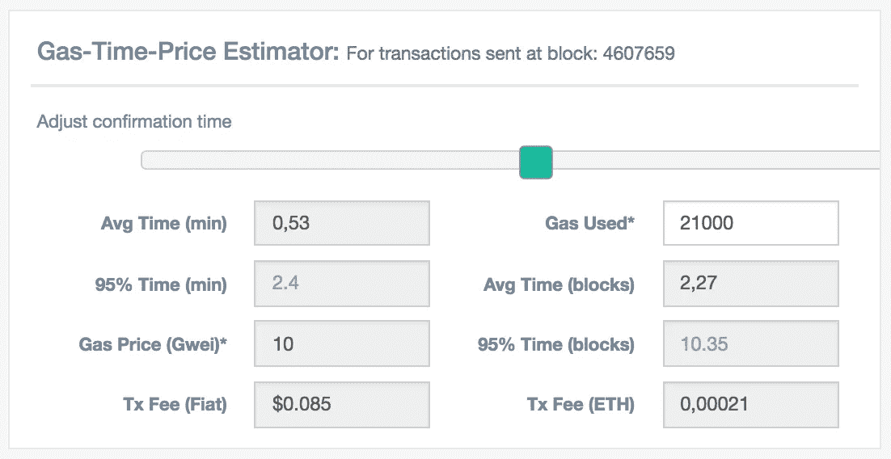
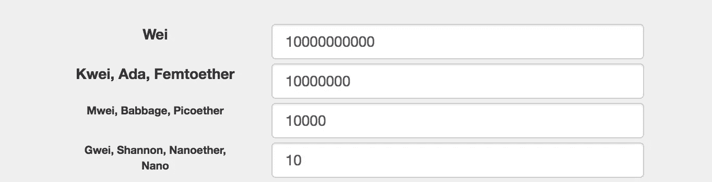
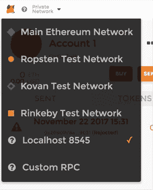
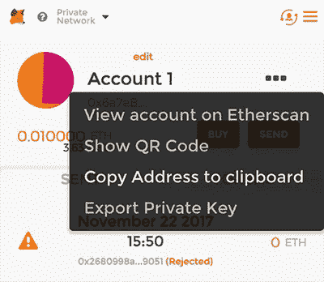

# 全栈智能合约开发

> 原文：<https://medium.com/hackernoon/full-stack-smart-contract-development-fccdfe5176ce>

## 编写、测试和部署以太坊智能合约及其 web 界面


这个周末，我和我的团队花了一些时间研究以太坊区块链特有的工具和部署，并做了一个小实验:[永远在链条上](https://forever.lifeonmars.pt/)。

这相当于一个数字纹身:一个智能合同，任何人都可以免费使用(减去交易成本)，在以太坊区块链上留下永久的信息。这条信息被永远保存在区块链，铭刻在成千上万的电脑里，不可更改，不朽。

尽管持久性是区块链的核心概念之一，但这仍然让一些人担心，所以我也写了一篇关于该工具和区块链技术的一些含义的[非技术性文章。](https://hackernoon.com/forever-on-the-chain-c755838dfc79)

接下来是智能合约教程。我将带您浏览这个工具的关键路径的创建和测试。

这里假设你已经理解了一些以太坊的核心概念，比如智能合约、交易和 gas。如果你不知道，这里有一个解释，让你开始。

[](/@preethikasireddy/how-does-ethereum-work-anyway-22d1df506369) [## 以太坊到底是怎么运作的？

### 介绍

medium.com](/@preethikasireddy/how-does-ethereum-work-anyway-22d1df506369) 

# 智能合同

这份智能合同非常简单。它唯一的功能是将消息记录到区块链中。这是通过使用事件来实现的，如下所述。

## 代码走查

聪明的契约是写在实处的。这是一个静态类型语言，用来写以太坊智能合约。来自[的文档](http://solidity.readthedocs.io/en/develop/index.html):

> Solidity 是一种面向契约的高级语言，其语法类似于 JavaScript，旨在针对以太坊虚拟机(EVM)。

下面是我们的契约的实现情况。

```
pragma solidity 0.4.24;/**
 * [@title](http://twitter.com/title) Recorder — record a message into the blockchain
 * [@a](http://twitter.com/dev)uthor Life on Mars — https://lifeonmars.pt
 */
contract Recorder{
  event Record(
    address _from,
    string _message
  ); /**
   * [@n](http://twitter.com/dev)otice Sends the contract a message
   * to record into the blockchain
   * [@param](http://twitter.com/param) message  message to record
   */
  function record(string message) public {
    emit Record(msg.sender, message);
  }
}
```

让我们从慢慢浏览这段代码开始。

```
pragma solidity 0.4.24;
```

根据[文件](http://solidity.readthedocs.io/en/develop/layout-of-source-files.html#version-pragma):

> 源文件可以(也应该)用所谓的版本杂注进行注释，以拒绝用未来的编译器版本进行编译，这可能会引入不兼容的更改。

这一行确保您的源文件不会被版本不是 0.4.24 的编译器编译。

也可以使用限制较少的 pragmas，例如通过插入符号范围。取`^0.4.24`。在这种情况下，你的源代码将被任何晚于`0.4.24`早于`0.5.0.`的编译器编译。更多信息参见 npm 的 [semver 文档。](https://docs.npmjs.com/misc/semver)

```
contract Recorder {}
```

`contract`顾名思义，是用来定义合同的关键词。合同用写在 [PascalCase](https://en.wikipedia.org/wiki/PascalCase) 中的名称来定义。

```
event Record(
  address _from,
  string _message
);
```

在这里，我们定义一个事件。事件允许您对以太坊日志记录工具进行写访问。当被调用时，调用它们的参数存储在事务的日志中，这是区块链[ [docs](http://solidity.readthedocs.io/en/develop/contracts.html#events) ]中的一种特殊数据结构。这些事务日志可用于存储信息。

与使用合同存储(写入合同中的变量)相比，使用日志在天然气成本方面要便宜得多。然而，这也带来了一个代价:契约不能从日志数据中读取数据(更多细节参见 Consensys 的这篇好文章[】)。](https://media.consensys.net/technical-introduction-to-events-and-logs-in-ethereum-a074d65dd61e)

因为，对于我们的用例，我们不需要契约来读取这些日志，我们使用事件而不是存储字符串数组。

```
function record(string message) public {
  Record(msg.sender, message);
}
```

`record`的方法非常简单。这是一种`public`方法，[的意思是可以对外调用](https://solidity.readthedocs.io/en/v0.4.24/contracts.html#visibility-and-getters)。它接受一个名为`message`的`string`参数，它所做的就是用两个参数调用`Record`事件:

*   `msg.sender`保存调用`record`函数[ [docs](http://solidity.readthedocs.io/en/develop/units-and-global-variables.html#block-and-transaction-properties) ]的账户地址；
*   `message`只是调用`record`的参数。

只有一种方式可以与这个特定的智能契约进行交互:向它发送一个事务，以及一个调用`record`方法的`message`参数。当一个账户`A`调用`record`方法时，就会调用`Record`事件，这导致元组`{A's address, message}`被存储在相应的事务日志中。

## 汇编

Solidity 代码可以使用 solidity 命令行编译器`solc`进行编译。稍后我们将看到如何使用 [Truffle](http://truffleframework.com/) 进行编译和部署，但是现在请耐心等待。 [**如果你想跟着做，安装 solc**](http://solidity.readthedocs.io/en/develop/installing-solidity.html) **。**

运行`solc`允许我们输出契约的二进制表示。这用于部署合同(同样，Truffle 稍后会为我们处理这个问题)。下面是这个契约的二进制输出的样子(你可以用`solc --bin Recorder.sol`自己看看)

```
6060604052341561000f57600080fd5b6101a28061001e6000396000f300606060405260043610610041576000357c0100000000000000000000000000000000000000000000000000000000900463ffffffff168063e51ace1614610046575b600080fd5b341561005157600080fd5b6100a1600480803590602001908201803590602001908080601f016020809104026020016040519081016040528093929190818152602001838380828437820191505050505050919050506100a3565b005b7fac0fdae5d3299ac82cf049834f149484c5cafb1584ffd1e2432597e4581b16a73382604051808373ffffffffffffffffffffffffffffffffffffffff1673ffffffffffffffffffffffffffffffffffffffff16815260200180602001828103825283818151815260200191508051906020019080838360005b8381101561013857808201518184015260208101905061011d565b50505050905090810190601f1680156101655780820380516001836020036101000a031916815260200191505b50935050505060405180910390a1505600a165627a7a723058201b9ef174b2b5557ad31400e4eb1cd02dd02b8244eefbc97e9b75b01072cc706e0029
```

相当令人兴奋的东西。

根据[官方文件](http://solidity.readthedocs.io/en/develop/abi-spec.html):

> 编码不是自描述的，因此需要一个模式来解码。

这意味着，如果我们能够理解一个契约并与之交互，我们需要知道它的 [ABI 规范](https://en.wikipedia.org/wiki/Application_binary_interface)。ABI(应用程序二进制接口)是程序的接口规范。

这是这个合同的规格说明(你可以通过`solc --abi Recorder.sol`亲自查看)。

```
[
  {
    "constant": false,
    "inputs": [
      {
        "name": "message",
        "type": "string"
      }
    ],
    "name": "record",
    "outputs": [],
    "payable": false,
    "stateMutability": "nonpayable",
    "type": "function"
  },
  {
    "anonymous": false,
    "inputs": [
      {
        "indexed": false,
        "name": "_from",
        "type": "address"
      },
      {
        "indexed": false,
        "name": "_message",
        "type": "string"
      }
    ],
    "name": "Record",
    "type": "event"
  }
]
```

这个 ABI 规范将在以后变得相关。

## Natspec

编译器也可以根据你对以太坊自然规范格式的使用，或者 Natspec ，生成文档。这可以被用户界面用来向用户和/或开发者显示附加信息。这个契约对它自己和它的`record`方法都有这样的注释。

这是编译输出。

```
“devdoc”: {
  “author”: “Life on Mars — [https://lifeonmars.pt](https://lifeonmars.pt)",
  “methods”: {
    “record(string)”: {
      “params”: {
        “message”: “ — message to record”
      }
    }
  },
  “title”: “Recorder — record a message into the blockchain”
},
“userdoc”: {
  “methods”: {
    “record(string)”: {
      “notice”: “Sends the contract a message to record into the blockchain”
    }
  }
}
```

我想给你看这些内部结构，但是从现在开始我们要用松露了。Truffle 是以太坊的一个框架，它的一些细微之处会让我们的生活变得更简单。在我们的例子中，它将有助于编译和测试。

**你需要块菌来跟随接下来的部分，所以请** [**按照说明安装它**](http://truffleframework.com/docs/getting_started/installation) **。**

# 在本地网络上部署和测试合同

为了测试和部署合同，我们需要运行一个以太坊客户端。我们将从 [Ganache CLI](https://github.com/trufflesuite/ganache-cli) 开始，它模拟了一个真实客户端的行为(比如 [geth](https://github.com/ethereum/go-ethereum/) ，我们将在后面研究它)，但是它要快得多。这个速度有助于加快开发和测试周期。

**按照说明，用** `**npm install -g ganache-cli**` **安装，用** `**ganache-cli**` **运行。**

现在，创建一个新的`recorder`目录，将`cd`放入其中，并运行`truffle init`。我们需要配置 Truffle 来连接到`ganache-cli`。如下编辑`truffle.js`文件:

```
ℹ️ truffle.js
-------------module.exports = {
  networks: {
    development: {
      host: "localhost",
      port: 8545,
      network_id: "*",
      gas: 4712387,
    }
  }
};
```

接下来，创建一个`contracts/Recorder.sol`文件，用于存储合同的源代码，如上所示。

然后像这样创建`migrations/2_deploy_contracts.js`:

```
ℹ️ migrations/2_deploy_contracts.js
-----------------------------------var Recorder = artifacts.require("./Recorder.sol");module.exports = function(deployer) {
  deployer.deploy(Recorder);
};
```

现在我们准备打开`truffle console`，在这里我们将让 Truffle 通过`migrate --reset`将记录器合同部署到网络中。Truffle 将确保为您自动编译您的合同。

(顺便说一下，`--reset`告诉松露[从头开始运行所有的迁移](http://truffleframework.com/docs/getting_started/migrations)。出于本文的目的，我们对使用迁移进行契约版本控制不感兴趣，所以我们总是使用它来重新开始这个过程。)

一旦部署了合同，我们就可以使用它了！我们将存储几条记录，然后继续查询它们。

我们可以通过获取一个契约引用并直接在其上调用方法来调用契约上的方法:

```
ℹ️ truffle console
-----------------truffle(development)> recorder = Recorder.at(Recorder.address)
truffle(development)> recorder.record("first message");
truffle(development)> recorder.record("second message");
```

注意`ganache-cli`输出。在其他事情中，它会告诉你运行这个交易用了多少汽油。

```
ℹ️ ganache-cli output
-----------------eth_sendTransactionTransaction: 0x118de578d3bcbd9474099e5385b0a883ad18eaa99319f710f641db1cc6b2e8fe
  Gas usage: 24577
  Block Number: 14
  Block Time: Fri Nov 10 2017 20:06:42 GMT+0000 (WET)eth_getTransactionReceipt
```

为了阅读前面写的内容，我们需要运行下面的代码。

```
ℹ️ truffle console
------------------truffle(development)> recorder
  .Record({}, {fromBlock: 0, toBlock: "latest"})
  .get((error,result) => (
    console.log(result.map(
      (result) => (result.args._message)
    )
  )))
```

注意我们是如何调用`Record({}, {fromBlock: 0, toBlock: "latest"})`的。第一个参数用于过滤结果，这超出了本文的范围。第二个是我们如何指定我们将在哪个块跨度中寻找`Record`的事务日志。

`get`方法接受回调，我们只是`map` ping 返回的结果，以获得每个结果的`args._message`值。

如果这一切都解决了，您应该看到您的控制台输出如下。

```
ℹ️ truffle console
------------------truffle(development)> [ 'first message', 'second message']
```

就是这样！您的契约已经部署，您已经使用它将消息写入链中，然后您查询它以获取这些消息。

## 测试

在我们在真实网络上尝试之前，让我们先来看看测试合同。Truffle 使用 [Mocha](https://mochajs.org/) 测试框架，使用 [Chai](http://chaijs.com/) 进行断言。我们将使用下面的测试。

```
ℹ️ test/recorder.js
-------------------var Recorder = artifacts.require("Recorder");contract('Recorder', function(accounts) {
  it("records event", function(done) {
    Recorder.deployed().then(function (instance) {
      instance
        .Record({}, {fromBlock: 0, toBlock: "latest"})
        .get(function (error, events) {
          assert.equal(
            0,
            events.length,
            "There should be no events at start."
          );
          instance.record("pokemon").then(function () {
            instance
              .Record({}, {fromBlock: 0, toBlock: "latest"})
              .get(function (error, events) {
                assert.equal(
                  1,
                  events.length,
                  "There should be one event after recording."
                );
                done();
              });
          });
        });
    });
  });
});
```

它看起来很丑，但就测试而言，它非常简单:

*   `Recorder.deployed()`在获得已部署的记录器实例时解析
*   我们首先使用`instance.Record(...).get()`,获取写入其中的消息列表
*   我们用`assert.equal(0, events.length)`检查它没有消息
*   然后我们用`instance.record("pokemon")`写一条消息
*   最后，我们确保消息是用`assert.equal(1, events.length)`写的

在`tests`目录中创建一个名为`recorder.js`的文件，并将测试粘贴到其中。您可以通过退出控制台并简单地在您的 shell 中键入`truffle test`来运行这个测试。注意，每次运行测试文件时，truffle 都会重新部署契约。更多详情参见[文档](http://truffleframework.com/docs/getting_started/javascript-tests)。

```
ℹ️ truffle test output
----------------------Using network 'development'.Contract: Recorder
    ✓ records event (101ms)1 passing (115ms)
```

成功！

# 连接到真实的网络

你现在可以合理地说*它在我的机器*上工作。不够好？让我们试着让它在真实的以太网上工作。

在我们部署到实际的 *mainnet* 之前，让我们先使用一个 *testnet* 。testnet 是以太网的模拟，由真实节点支持，但主要用于测试。因此，测试网不用于任何严肃的事情，其中的以太不应该包含任何值。我们将使用 [Ropsten testnet](https://github.com/ethereum/ropsten) 。这将允许我们使用一个[块浏览器](https://ropsten.etherscan.io/)来挖掘我们在网络上的合同和交易。

**根据** [**说明书**](https://github.com/ethereum/go-ethereum/wiki/Building-Ethereum) **安装 geth。**然后我们用 Ropsten 同步([更多指令](https://github.com/ethereum/ropsten))。

```
ℹ️ shell
--------$ geth --testnet --fast --bootnodes "enode://20c9ad97c081d63397d7b685a412227a40e23c8bdc6688c6f37e97cfbc22d2b4d1db1510d8f61e6a8866ad7f0e17c02b14182d37ea7c3c8b9c2683aeb6b733a1@52.169.14.227:30303,enode://6ce05930c72abc632c58e2e4324f7c7ea478cec0ed4fa2528982cf34483094e9cbc9216e7aa349691242576d552a2a56aaeae426c5303ded677ce455ba1acd9d@13.84.180.240:30303" --rpc
```

*   告诉 geth 连接到 Ropsten 测试网
*   `--fast`或`--syncmode="fast"`使区块链同步更快(详见[本 PR](https://github.com/ethereum/go-ethereum/pull/1889))；
*   `--bootnodes=...`告诉 geth 要连接到哪些节点，以便发现网络的其余部分
*   `--rpc`告诉 geth 启用 HTTP-RPC 服务器，允许 trufle 和其他 RPC 客户端连接到它

我们可以使用 geth 提供的控制台与网络进行交互。`geth attach`应该可以了，但是如果不行，就在 geth 输出中查找下面一行。

```
ℹ️ geth output
--------------INFO [11-13|14:45:16] IPC endpoint opened: /Users/pokemon/.rinkeby/geth.ipc
```

并相应运行`geth attach /Users/pokemon/.rinkeby/geth.ipc`。这会让你直接进入控制台。Geth 应该很难与 Ropsten 链同步，这可能需要几分钟到几个小时，具体取决于您的硬件和网络。下面是我们检查进度的方法。

```
ℹ️ geth console
---------------> eth.blockNumber
0
```

`eth.blockNumber`返回最近块的编号[文档](https://github.com/ethereum/wiki/wiki/JavaScript-API#web3ethblocknumber)。它将显示`0`，直到您与网络同步，我们可以通过`eth.syncing`检查:

```
ℹ️ geth console
---------------> eth.syncing
false
```

真扫兴。似乎我们还没有连接到任何节点。在我们继续之前，我们必须在 geth 的输出中看到这一点。

```
ℹ️ geth output
--------------INFO [11-13|15:26:26] Block synchronisation started
INFO [11-13|15:26:28] Imported new block headers               count=384 elapsed=951.820ms number=384 hash=d3d5d5…c79cf3 ignored=0
```

太好了！让我们再试试控制台:

```
ℹ️ geth console
---------------> eth.blockNumber
0
> eth.syncing
{
  currentBlock: 775342,
  highestBlock: 2356143,
  knownStates: 167957,
  pulledStates: 162021,
  startingBlock: 0
}
```

好多了。我们将等到`eth.syncing`再次返回`false`后再与区块链交互。上面那个 0[没事，不用担心。](https://github.com/ethereum/go-ethereum/issues/14338)

这里有几个让您忙碌的其他命令:

*   `net.listening`告诉我们节点是否在主动监听网络连接[ [文档](https://github.com/ethereum/wiki/wiki/JavaScript-API#web3netlistening)
*   `net.peerCount`返回连接的对等体数量[ [文档](https://github.com/ethereum/wiki/wiki/JavaScript-API#web3netpeercount)
*   `admin.peers`让我们深入了解我们联系的同行

让我们尝试将我们的合同部署到 Ropsten 网络。我们会让松露再一次为我们做艰苦的工作。然而，Ropsten 是一个真正的人造网络，我们需要为我们的一个帐户得到一些真正的人造乙醚。

我们先去 geth 确认一下有没有乙醚:

```
ℹ️ geth console
---------------> eth.getBalance(eth.accounts[0])
0
```

没错。我试着用了一个水龙头，但是当我试的时候，它就坏了。 [Ropsten Gitter](https://gitter.im/ethereum/ropsten) 推荐我使用 [MetaMask 的乙醚龙头](https://faucet.metamask.io/)，你需要 [MetaMask](https://metamask.io/) 使用它，它对我很有效。

然后，我使用 MetaMask 将 Ether 发送到我在 geth 的帐户。首先我必须找到它的地址。

```
ℹ️ geth console
---------------> eth.accounts[0]
"0xff7771583ee3944a9ef32cfcb54c0b0d688fa70a"
```

然后我使用 MetaMask 中的“Send”将资金发送到这个地址。传输时间不会超过几分钟(您可以点击 MetaMask 中的传输，在 Etherscan 上查看)。一旦确认，您应该能够在 geth:

```
ℹ️ geth console
---------------> eth.getBalance(eth.accounts[0])
1836311700000000000
```

让我们也使用这个帐户地址来告诉 Truffle 使用哪个帐户与区块链进行交互。更新您的`truffle.js`文件，如下所示:

```
ℹ️ truffle.js
-------------module.exports = {
  networks: {
    development: {
      host: "localhost",
      port: 8545,
      network_id: "*",
      from: /* YOUR ADDRESS HERE */,
      gas: 4000000,
    }
  }
};
```

因为我们是坚持者，我们再次运行测试，现在在 Ropsten 上。

```
ℹ️ shell
--------$ truffle testUsing network 'development'.Error encountered, bailing. Network state unknown. Review successful transactions manually.
Error: authentication needed: password or unlock
```

哦，对了。所以，为了保护你，geth 一直锁定这个帐户。为了使用它，你需要解锁它。回到 geth:只要 geth 保持开放，就让我们保持帐户解锁。

```
ℹ️ geth console
---------------> personal.unlockAccount(eth.accounts[0], "password", 0)
```

太好了。现在让我们再试一次。

```
ℹ️ shell
--------$ truffle testUsing network 'development'.Contract: Recorder
    ✓ records event (54382ms)1 passing (54s)
```

这比使用 Ganache CLI 花费的时间长得多，但是测试通过了。现在让我们引导`truffle console`并尝试部署契约。这一次，Ganache CLI 不是目标。罗普斯滕群岛。

```
ℹ️ truffle console
------------------truffle(development)> migrate --reset
Using network 'development'.Running migration: 1_initial_migration.js
  Replacing Migrations...
  ... 0x2b330d5a4bac42ac3aea135c0f7090502f05e5349a6684c869db9a9591d02bd3
```

好多了，但这需要一段时间才能完成。花点时间在 geth 的输出中注意类似这样的内容。

```
ℹ️ geth output
--------------INFO [11-22|11:05:50] Submitted contract creation              fullhash=0xfb92a0da5e5b7d13a155b1c57bb46ffeb672502842ffe744de30be068a4d5b4f contract=0xf7Ec3C971DFA6549e2c0aC4437068e86dC39b25F
```

整洁，对不对？顺便说一下，你可以复制那个交易散列和合同地址，然后去 [Ropsten Etherscan](https://ropsten.etherscan.io) 中寻找它们。它可能需要一分钟才能显现出来，但它会的。我们现在正在将合同部署到一个真正的网络上。记住，你没有服务器。这简直太棒了。

与此同时，松露继续进行。

```
ℹ️ truffle console
------------------Running migration: 1_initial_migration.js
  Replacing Migrations...
  ... 0x2b330d5a4bac42ac3aea135c0f7090502f05e5349a6684c869db9a9591d02bd3
  Migrations: 0xf1867e8ac0fe8c4dd26157c2e5123b9f5d63e0e0
Saving successful migration to network...
  ... 0x3c0364b133a07bed6f34c1e2b733f57cfee65ded088bdd452547bfba5eb3c18c
Saving artifacts...
Running migration: 2_deploy_contracts.js
  Deploying Recorder...
  ... 0x4c86ec2e5da57f734706257a86e7fff929538a68ed7a5265cc628b984613d822
  Recorder: 0x949d9ac08845f74ec7cd96337920b672fb31c017
Saving successful migration to network...
  ... 0x02c04fc250d3077c12eef7e3c580564f03791ee53de2a1dfcc82eb37deba3911
Saving artifacts...
```

太好了。我们完了。看到这条线了吗？

```
ℹ️ truffle console
------------------Recorder: 0x949d9ac08845f74ec7cd96337920b672fb31c017
```

是的，[就是我们](https://ropsten.etherscan.io/address/0x949d9ac08845f74ec7cd96337920b672fb31c017)。我们在 Ropsten 测试网上直播。

让我们玩我们的合同。我们知道它能工作是因为它通过了测试，但是。回到松露，所以我们可以记录一个信息，并确保它留在那里。

```
ℹ️ truffle console
------------------truffle(development)> recorder = Recorder.at(Recorder.address)
truffle(development)> recorder.record("i dont even")
```

这将需要几分钟，因为我们现在在 Ropsten 上。但是后来:

```
ℹ️ truffle console
------------------truffle(development)> recorder.Record(
  {},
  {fromBlock: 0, toBlock: "latest"}
).get(function (error,result) {
  console.log(result.map((x)=>(x.args._message)))
})
truffle(development)> ['i dont even']
```

完美！

# 使用以太坊主网

有了这些知识，我们现在可以轻松地将相同的契约部署到 mainnet 中。为了简洁起见，我们将跳过测试等几个步骤，直接进入正题。

让我们重新启动 geth 并让它连接到 mainnet。

```
ℹ️ shell
--------$ geth --fast --cache=512
```

我们需要等待 geth 同步。去别处忙吧，这会花些时间。

一旦`eth.syncing`再次返回 false，让我们使用 truffle 来部署它。确保你使用的账户里有资金。真正的以太。

```
ℹ️ shell
--------$ truffle migrate --reset
```

一开始可能会不太顺利。你可能会遇到两种故障模式。有这样一种美:

```
ℹ️ truffle migrate output
-------------------------Running migration: 1_initial_migration.js
  Deploying Migrations...
  ... undefined
Error encountered, bailing. Network state unknown. Review successful transactions manually.
Error: insufficient funds for gas * price + value
```

这个也是:

```
ℹ️ truffle migrate output
-------------------------Running migration: 1_initial_migration.js
  Deploying Migrations...
  ... undefined
Error encountered, bailing. Network state unknown. Review successful transactions manually.
Error: exceeds block gas limit
```

所以，这是 geth 告诉松露你的[气体设置](http://truffleframework.com/docs/advanced/configuration)不理想。我建议将`gas`设置为一个合理的高值，比如 1000000(注意上面合同部署是如何消耗大约 20K 汽油的)，并检查 [ETH 加油站](https://ethgasstation.info/)以计算出`gasPrice`的值应该是多少。这是我现在看到的:



所以，10 Gwei 在 0.53 分钟内给我们一个确认。那很好。以太坊转换器可以帮我们把那个变成卫。



所以现在 truffle.config 应该是这样的。

```
ℹ️ truffle.js
-------------module.exports = {
  networks: {
    development: {
      host: "localhost",
      port: 8545,
      network_id: "*",
      from: "0x13f53d42fc7cf4f1cf4ca8031a526f6a8528cdfa",
      gas: 1000000,
      gasPrice: 10000000000,
    }
  }
};
```

这应该能让你顺利上路！

# 构建 web 前端

让我们继续为这个合同实现一个 web 前端。当然——它已经是公开的，任何人都可以使用……算是吧。使用`geth`并不是最用户友好的工具，而且你也不能轻易地与一个没有 ABI 的合同进行交互。所以，我们需要再接再厉，让普通大众也能使用它。

我们将从使用 [web3.js](https://github.com/ethereum/web3.js/) 并将其连接到我们的本地节点开始。web3.js 是什么？来自[的自述](https://github.com/ethereum/web3.js/):

> 这是以太坊兼容的 [JavaScript API](https://github.com/ethereum/wiki/wiki/JavaScript-API) ，它实现了[通用 JSON RPC](https://github.com/ethereum/wiki/wiki/JSON-RPC) 规范。

让我们回到 Ganache CLI，因为它比使用真实网络更快。从`ganache-cli`开始。重新调整你的`truffle.js`，重新部署你的合同。找到它的地址。

然后从`ganache-cli`输出中获取第一个账户地址。

```
ℹ️ ganache-cli output
-----------------Available Accounts
==================
(0) 0xa2dee6cd83d3d9cb6fb2d42899abcbdf04bf344f
```

我们可以用松露来查询这个账户的余额。为此，我们还将使用 web3 库，它很方便地包含在 truffle 中。它告诉我们这个帐户是加载的。

```
ℹ️ truffle console
------------------truffle(development)> account = "0xa2dee6cd83d3d9cb6fb2d42899abcbdf04bf344f"
truffle(development)> parseInt(web3.eth.getBalance(account))
'99944815499999920000'
```

太好了！让我们在浏览器中仔细检查一下。[下载 web3.js](https://github.com/ethereum/web3.js/blob/develop/dist/web3.js) 并将其包含在一个带有`<script>`标签的 HTML 文件中。在您的浏览器中打开该文件，并将其放入控制台。

```
ℹ️ browser javascript console
-----------------------------> var host = "[http://localhost:8545](http://localhost:8545)"
> var web3 = new Web3(new Web3.providers.HttpProvider(host))
> var account = "0xa2dee6cd83d3d9cb6fb2d42899abcbdf04bf344f"
> parseInt(web3.eth.getBalance(account))
< 99944815499999920000
```

太好了。现在我们知道可以将浏览器连接到 Ganache CLI，让我们继续做更好的事情。我们想做的是测试合同的书写和阅读。这是一个开始。

```
ℹ️ browser javascript console
-----------------------------> var contractABI = JSON.parse('[{"constant":false,"inputs":[{"name":"message","type":"string"}],"name":"record","outputs":[],"payable":false,"stateMutability":"nonpayable","type":"function"},{"anonymous":false,"inputs":[{"indexed":false,"name":"_from","type":"address"},{"indexed":false,"name":"_message","type":"string"}],"name":"Record","type":"event"}]');
> var contractAddress = "0x2680998ab6aa13fd092636ec974f5e305a8d9051";
> var web3 = new Web3(new Web3.providers.HttpProvider("[http://localhost:8545](http://localhost:8545)"));
> web3.eth.defaultAccount = "0xa2dee6cd83d3d9cb6fb2d42899abcbdf04bf344f";
> var contract = web3.eth.contract(contractABI).at(contractAddress);
```

好的，我们现在有一个`contract`实例。让我们试着在上面记录一些东西。

```
ℹ️ browser javascript console
-----------------------------> contract.record("hello from console");
< "0x09506da426e48b5b9a36cda4dd176767a1a3a1392c80299a4b3a16281f10ece3"
```

哦，看，这是一个交易 ID。这一定很棒。让我们检查它的工作情况，好吗？

```
ℹ️ browser javascript console
-----------------------------> contract.Record({}, {fromBlock: 0, toBlock: "latest"}).get(function (error, results) {
  console.log(results.map((result) => (result.args._message)));
});
["hello from console"]
```

好像管用！我们现在准备继续前进。

## 使用元掩码

请注意，我们在上面设置了`web3.eth.defaultAccount`，并使用了 Ganache CLI 为我们创建的一个帐户。现在，这对于开发来说是好的，但是当你把它放到网上时，你最好让用户为交易付费。

输入元掩码。MetaMask 是一个 Chrome 扩展，用作浏览器内以太坊钱包。**你会需要它继续，所以** [**去安装它**](https://metamask.io) **。**

此外，要使用 MetaMask 进行开发，您需要运行一个本地服务器，因为仅仅打开 HTML 文件是不够的。你喜欢怎么做就怎么做。我喜欢用 python。

```
ℹ️ shell
--------$ python -m SimpleHTTPServer
Serving HTTP on 0.0.0.0 port 8000 ...
```

去掉`<script>`标签，在浏览器上打开 localhost:8000。如果你在控制台中输入`web3`，你应该看不到`undefined`。如果是这样，请确保 MetaMask 正在运行。

最后，确保元掩码连接到您的本地节点。



让我们再试一次，现在不设置`web3.eth.defaultAccount`。把这个扔进控制台。

```
ℹ️ browser javascript console
-----------------------------> var contractABI = JSON.parse('[{"constant":false,"inputs":[{"name":"message","type":"string"}],"name":"record","outputs":[],"payable":false,"stateMutability":"nonpayable","type":"function"},{"anonymous":false,"inputs":[{"indexed":false,"name":"_from","type":"address"},{"indexed":false,"name":"_message","type":"string"}],"name":"Record","type":"event"}]');
> var contractAddress = "0x2680998ab6aa13fd092636ec974f5e305a8d9051";
var web3 = new Web3(web3.currentProvider);
var contract = web3.eth.contract(contractABI).at(contractAddress);contract.Record({}, {fromBlock: 0, toBlock: "latest"}).get(function (error, results) {
  console.log(results.map((result) => (result.args._message)));
});
["hello from console"]
```

它像预期的那样工作。让我们试着录制另一条消息，并确保我们也能阅读这条消息。

```
ℹ️ browser javascript console
-----------------------------> contract.record("hello again")
Uncaught Error: The MetaMask Web3 object does not support synchronous methods like eth_sendTransaction without a callback parameter
```

啊哦。这是因为 MetaMask 是一个[光以太坊客户端](https://github.com/ethereum/wiki/wiki/Light-client-protocol)。这意味着它不会存储所有的区块链数据，而是每次都向网络请求所需的数据。

因此，我们需要使用异步方法来做我们以前做过的事情。提醒你一下，不太复杂。

```
ℹ️ browser javascript console
-----------------------------> contract.record("hello again", (error, result) => (console.log(result)))
```

一旦你这样做了，MetaMask 应该弹出这个。


注意，它说你的余额不足。有道理。让我们向 MetaMask 为我们创建的这个帐户发送一些资金。首先，找到账户地址。



现在，回到松露。

```
ℹ️ truffle console
------------------truffle(development)> web3.eth.sendTransaction({
  from: web3.eth.accounts[0],
  to: "0x6a7eB27407a50a4eb9d015EA2B0F2e1BcC724461",
  value: 5000000000000000}
)
```

现在让我们再次尝试相同的命令。

```
ℹ️ browser javascript console
-----------------------------> contract.record("hello again", (error, result) => (console.log(result)))
```

这一次，弹出窗口应该没有错误消息。单击发送。您应该能够在 Ganache CLI 上看到类似这样的内容。

```
ℹ️ ganache-cli output
-----------------eth_sendRawTransactionTransaction: 0xfd78adcb6bd3aa86d6e67e5edc946ca3b53235553d4cc5a409c3566bdafb13f6
  Gas usage: 25025
  Block Number: 24
  Block Time: Wed Nov 22 2017 15:58:27 GMT+0100 (CET)
```

成功了吗？好吧，让我们来看看！

```
ℹ️ browser javascript console
-----------------------------> contract.Record({}, {fromBlock: 0, toBlock: "latest"}).get(function (error, results) {
  console.log(results.map((result) => (result.args._message)));
});
["hello from console", "hello again"]
```

这是两条信息。成功！

从这里开始，您将从 Ganache CLI 切换到 Ropsten，然后是以太坊 mainnet。在这篇文章中，我就不重复了。

# 最终注释

为了让[永远在链](https://forever.lifeonmars.pt/)上按预期工作，我们必须做几件额外的事情(除了建立网站之外)。

为了让“保存的消息”列表用新条目更新自己，我们决定使用[事件观察方法](https://github.com/ethereum/wiki/wiki/JavaScript-API#contract-events)。这就建立了一个监听器，每当一个符合您喜欢的任何标准的事件出现在链上时，这个监听器就调用您的回调。我们是这样做的。

```
contract.Record(
  {},
  {fromBlock: 4491369, toBlock: "latest"}
).watch(function (error, result) {
  // DO THINGS
});
```

注意那上面的`4491369`。由于我们连接到 mainnet，从 block 0 清除所有事务会非常慢。因此，我们将我们的搜索限制在从契约部署到的块的块号开始的事件。你可以通过使用以太扫描找到那个号码，但是如果你知道合同是在什么交易中产生的，那么 [web3 也可以帮助你](https://github.com/ethereum/wiki/wiki/JavaScript-API#web3ethgettransaction)。

尽管这非常简单， [MetaMask 对这个](https://github.com/MetaMask/metamask-extension/issues/2114)并不满意，所以我们最终在 EC2 实例上部署了一个 light 节点。

这个项目的代码是[，可以在 GitHub](https://github.com/lifeonmarspt/ethereum-eventer) 上找到。