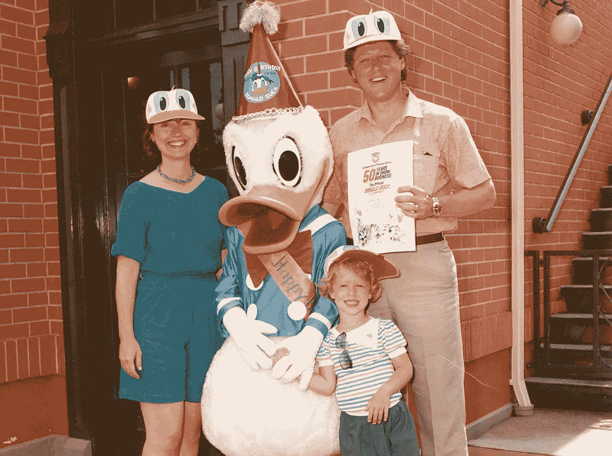
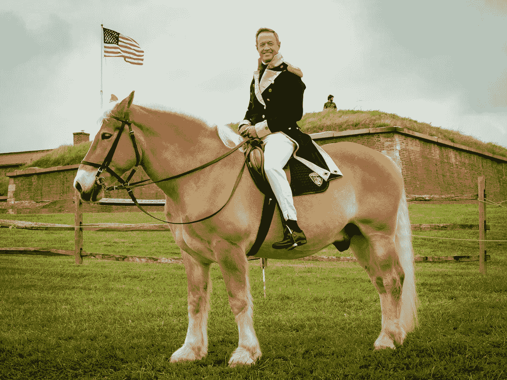

# 2016 年总统候选人趣事 404 页

> 原文：<https://medium.com/hackernoon/fun-404-pages-from-2016-presidential-candidates-d5d76a903080>

通过查看本赛季各种活动的 404“[未找到](https://hackernoon.com/tagged/not-found)”页面，您可以看到哪些 web [开发](https://hackernoon.com/tagged/development)团队正在享受乐趣。

1.伯尼·桑德斯有一段伯尼·桑德斯的视频告诉你[**你输了**。](https://berniesanders.com/404)

Bernie Sanders giving you some bad news

2.特德·克鲁兹有一段特德·克鲁兹拍摄 [**用培根包裹的机枪的视频。**](https://www.tedcruz.org/404)

Ted Cruz making machine gun bacon

3.希拉里·克林顿有一张 [**过去的照片**](https://www.hillaryclinton.com/404) 克林顿一家和……等等……唐老鸭。

The Clinton family with Donald Duck

4.马丁·欧玛利有一张他穿着似乎是 [**的革命装备，骑着一匹**](https://martinomalley.com/404) **的照片。**

O’Malley the revolutionary

和你的朋友——下面的❤一起分享吧

> [黑客中午](http://bit.ly/Hackernoon)是黑客如何开始他们的下午。我们是阿美族家庭的一员。我们现在[接受投稿](http://bit.ly/hackernoonsubmission)并乐意[讨论广告&赞助](mailto:partners@amipublications.com)机会。
> 
> 如果你喜欢这个故事，我们推荐你阅读我们的[最新科技故事](http://bit.ly/hackernoonlatestt)和[趋势科技故事](https://hackernoon.com/trending)。直到下一次，不要把世界的现实想当然！

