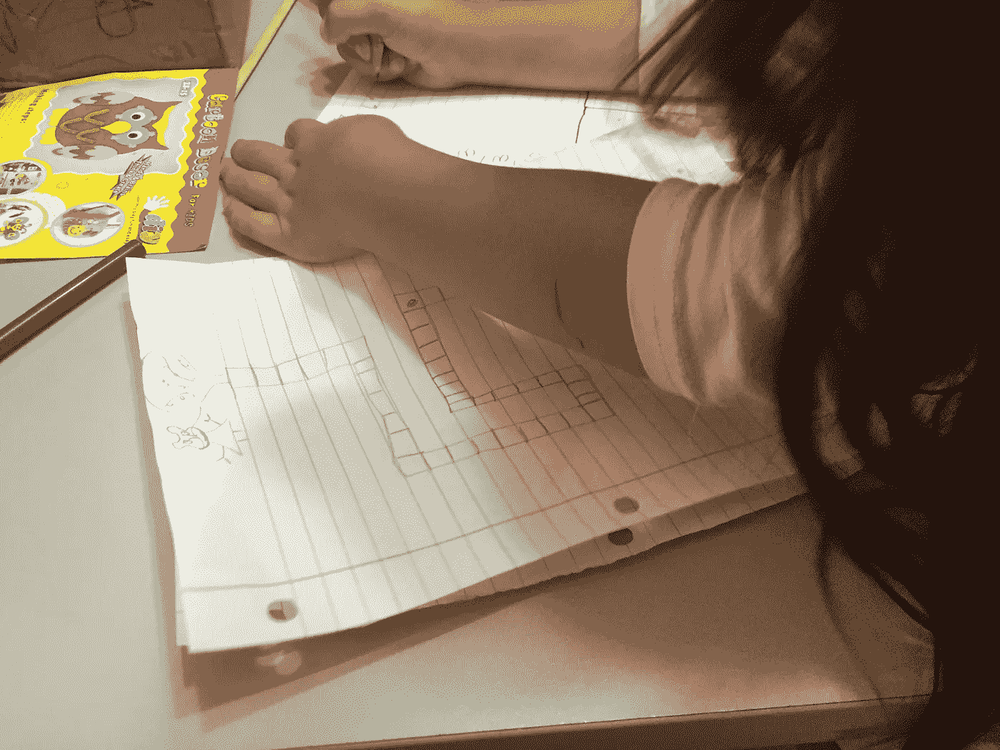
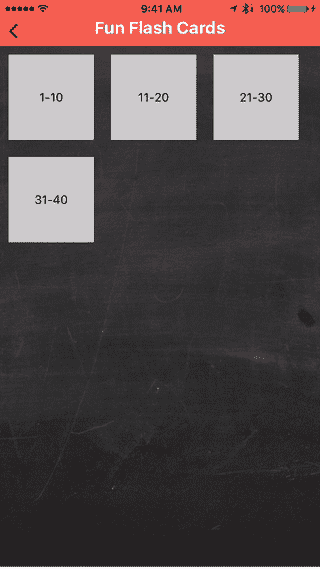

# 有趣的闪存卡——我和女儿一起开发的 React 原生应用程序

> 原文：<https://medium.com/hackernoon/fun-flash-cards-react-native-app-i-built-with-my-daughter-eb813340179e>

这一切真正开始于几年前，当时我在 KickStarter 上支持了 [Hello Ruby](https://www.kickstarter.com/projects/lindaliukas/hello-ruby) 。我有这样的愿景(或梦想),教我的女儿编码，和她一起创作。

我几次试图激起她的兴趣，但她还没有出现，直到大约 2-3 个月前，我们真正开始一起工作，我开始教她编码。

这种经历太棒了，我们一起度过了宝贵的时光，一起解决问题，寻找解决方案。

我给她做的第一个练习是想象她白天做的简单的事情，然后一个接一个地写下各个阶段，这样你就可以读给别人听，让他们 100%地重复。像刷牙、做煎饼和其他类似有趣的事情。

在完成这项工作后，我们开始研究迷宫，并“告诉”计算机如何在迷宫中工作而不被卡住。

很有趣，真的。

# 有趣的卡片

Nesli 现在上一年级，她在学校接受的任务之一是学习立即识别单词。

像“of”、“it”、“them”、“the”这样的简单词汇应该在大脑中自动产生。我之前也没怎么想过，直到和她老师聊过。

它的工作方式是你每周制作一张抽认卡，一次写 10 个单词。你给孩子看一张[卡片](https://hackernoon.com/tagged/card)，让他们告诉你单词。

当我们一起看它时，我们说这将是一个为我的手机(不像爸爸的孩子的手机)应用程序的可怕想法。

在开始编码之前，我们坐下来设计了[应用](https://hackernoon.com/tagged/app)。我真的希望这个过程是我们之间的合作，而不是我告诉她你如何设计一个应用程序。我问了一些引导性的问题，她真的很喜欢这个过程。

# 最终产品

# 哇！

作为一名父亲和工程师，有趣的卡片是我最自豪的时刻之一。我每天在手机上打开这个应用程序 3-4 次，只是微笑。

我们作为一个团队一起创造了这个。我们思考这个问题，用铅笔画草图，然后编码。我对它欣喜若狂，真的。

就代码复杂性而言，这可能是我 14 岁开始学习编码以来最简单的任务。但是，我一个人学会了编码，我女儿正在和她爸爸一起学习编码。这对我意味着整个世界(甚至更多)。

 [## KensoDev/趣味闪卡

### 在 GitHub 上创建一个帐户，为趣味闪存卡的开发做出贡献。

github.com](https://github.com/kensodev/fun-flash-cards) 

# 它成功的原因

我们的孩子经常玩我们的手机，当然还有 iPad，我认为让她为她每天使用的设备创造一个产品是激发创造力的原因。

她知道如何使用应用程序，她知道如何立即创建她的应用程序，像“点击”和“滑动”是自然的定义。

她自己选择颜色，让它看起来像粉笔板，这也有助于真正与这个想法联系起来。

> [黑客中午](http://bit.ly/Hackernoon)是黑客如何开始他们的下午。我们是 [@AMI](http://bit.ly/atAMIatAMI) 家庭的一员。我们现在[接受投稿](http://bit.ly/hackernoonsubmission)，并乐意[讨论广告&赞助](mailto:partners@amipublications.com)机会。
> 
> 如果你喜欢这个故事，我们推荐你阅读我们的[最新科技故事](http://bit.ly/hackernoonlatestt)和[趋势科技故事](https://hackernoon.com/trending)。直到下一次，不要把世界的现实想当然！

