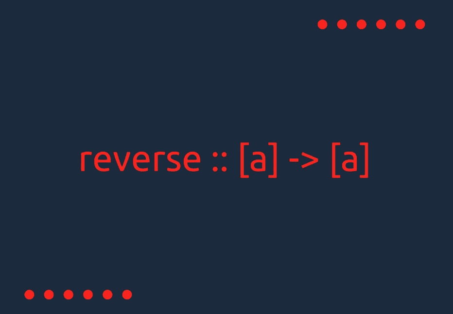
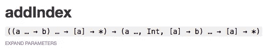

# Javascript 中的函数类型签名

> 原文：<https://medium.com/hackernoon/function-type-signatures-in-javascript-5c698c1e9801>



当一个 Javascript 开发人员开始探索函数式编程的最深层秘密时，他经常会发现这些奇怪的*箭头符号，上面写着类型*，然后感觉*‘这到底是什么？’*。毕竟，他是动态类型化 Javascript 的大师，摆脱了类型的界限。

这些类型符号是一种叫做**类型签名**的元语言，它讲述了很多关于纯函数的事情，并且在函数式编程中的重要性*远远超出了我们最初的预期*。



Screenshot from [http://ramdajs.com/docs/](http://ramdajs.com/docs/)

*让我们看看这些类型签名是什么，以及为什么我们应该在代码中使用它们。*

> 类型签名定义函数的输入和输出，有时包括参数的数量、参数的类型以及函数包含的参数的顺序。

这些类型签名是写在纯函数之上的高度表达的语句，用于推断它的工作。

类型签名基于作为标准类型系统的 [Hindley-Milner](https://en.wikipedia.org/wiki/Hindley%E2%80%93Milner_type_system) 类型系统，这也是受 [ML](https://en.wikipedia.org/wiki/ML_(programming_language)) 影响的语言所遵循的，包括 Haskell。

这些语句通过**形式化**类型推断算法*(Haskell 通常使用)*中的函数表达式达到了更大的目的，但是现在我们将使用它们来更好地记录我们的 Javascript 代码，并从中推导出**自由定理**。

如果您发现任何用这些类型签名记录的纯函数，解码它们的能力将让您提前了解该函数的工作方式。


Just like He-man

我们将把类型签名定义为函数上方的注释。使用函数时还可以使用 [*流*](https://flow.org/) 来推断类型。要开始心流，你可以跟随这个，

[](/@lunasunkaiser/type-checking-with-flow-4db5ef9b3095) [## 使用流程进行类型检查

### JavaScript 可能是快速的、富于表现力的、轻量级的、功能性的、令人敬畏的编程语言，有一个巨大的社区…

medium.com](/@lunasunkaiser/type-checking-with-flow-4db5ef9b3095) 

# 简单功能

```
// length :: String → Number
const length = s => s.length;
```

所以上面的函数接受一个字符串并返回一个数字。如果我们仔细观察，我们可以看到

```
1\. The function name is written first followed by `::`.2\. The input type of the function is written before the arrow.3\. The return type of the function is written after the arrow or at last.
```

记住，只写输入和输出的类型，这样就可以读成 ***“一个从字符串到数字的函数长度”。***

上述长度函数也可以写成

```
// length :: [Number] → Number
const length = arr => arr.length
```

只要实用，函数有多种类型签名是正常的，如果函数的参数类型过于灵活，那么我们应该使用***HM-任意变量*** ，我们稍后将讨论它们。

## 多参数

在 Javascript 中，我们可以有带许多参数的函数，不像其他 FP 语言，让这些函数一次只带一个参数是一个好习惯。但是，如果我们仍然想在函数中使用多个参数，我们可以这样做。

```
// join :: (String, [String]) → String
const join = (separator, arr) => arr.join(separator)
```

# 高阶函数

如果我们没有函数来处理函数，那就不是函数式编程。

```
// addOneToAll :: ((Number → Number),[Number]) → [Number]const addOneToAll = (addOne = x=>x+1 , arr) => arr.map(addOne)
```

当一个函数作为参数传递时，我们把它的签名放在一个括号中，以表示一个更有意义的整体类型签名。

上面的函数是一个' *map* 函数，不是每次这个函数都作用于定义的数据类型，基本上可以作用于任何类型的数组。所以为了描述这种函数，我们需要一些别的东西。

# 辛德雷-米尔纳任意变量

*像 identity、map、filter 和 reduce 这样的函数接受的参数过于灵活，无法由特定类型定义，因此我们使用经典的 Hindley-Milner 变量* `*a*` *和* `*b*` *。*

```
// identity :: a → a
const identity = a => a
```

因为对于相同的输入类型，identity 总是给我们相同的输出类型。因此，我们用`a → a`来代表它的签名。


I know!

我们的长度函数也可以写成

```
// length :: [a] → Number
const length = arr => arr.length
```

同样的，

```
// head :: [a] → a
const head = arr => arr[0]
```

# Thunks 或 Curried 函数

*最纯粹的纯函数的类型签名* ✨

对于一个接受多个参数的函数来说，处理它们总是一个好的选择，这样它们就可以在我们代码的后面被组合。此外，在带有多个参数的函数中使用任意的 HM 变量也不是一个好的做法。

如果你对 [***我们为什么要 curry 我们的函数***](https://hackernoon.com/partial-application-of-functions-dbe7d9b80760) 感到好奇，请通过这个，

[](https://hackernoon.com/partial-application-of-functions-dbe7d9b80760) [## 函数的部分应用

### 为函数提供比预期更少的参数称为函数的部分应用。

hackernoon.com](https://hackernoon.com/partial-application-of-functions-dbe7d9b80760) 

```
// map :: (a → b) → [a] → [b]
const map = fn => arr => arr.map(fn)
```

一个标准的映射函数将具有上述类型的签名。但是，很多时候，映射也可以由这种类型的签名来定义

```
map :: [a] → [b]
```

有时我们知道 map 返回的数组的类型，就像这样。

```
// allToString :: [a] → [String]
const allToString = arr => arr.map(toString)
```

让我们看看标准滤波器和 reduce

```
// filter :: (a → bool) → [a] → [a]
const filter = fn => arr => arr.filter(fn)// reduce :: (b → a → b) → b → [a] → b
const reduce = fn => init => arr => arr.reduce(fn, init)
```

显然，reduce 函数的类型签名有点复杂，如果我们能理解如何编写 reduce 函数的类型签名，我们就能为几乎任何函数编写类型签名。

好的，所以 reduce 的第一个参数是一个 ***reducing 函数*** ，它使用`b`和`a`给出`b`，这意味着这个函数将把所有东西都归约为类型`b`，所以从 *reduce()* 获得的最终值和提供的初始值将是`b`类型。并且由于类型`a`列表中的每个单个值都将被馈送到这个*归约函数，所以 ***归约函数*** 的第二个参数必须是`a`类型，它就是这样。因此， *reduce()* 的类型签名是正当的。*

**

# *自由定理*

*这些签名的另一个用途是产生*自由定理。当我们处理纯函数的**组合时，这些定理非常有用，因为它们帮助我们优化和重构代码。****

```
*// Type signature of head says
// head :: [a] → acompose(map(fn), head) == compose(head, fn)*
```

*这是我们的第一个自由定理，仅来源于 head 和 map 函数的类型签名，其陈述*

*如果我们对每个元素使用函数`map`，然后对结果数组使用函数`head`，那么这就相当于对数组的`head`使用函数`fn`。*

*让我们证明这个定理*

```
*compose(map(fn), head) == compose(head, fn)*--Converting to Type Signatures--*[a] → [b] → b == [a] → a → b*-- Removing Intermediates --*[a] → b == [a] → b*
```

*由于两个函数的总体类型签名是相同的，我们可以得出结论，对于相同的输入，两个组合将返回相同的结果。*

**

*上面的推导被简化了，因为它需要 Lambda Calculas 来进行自由定理的实际推导，这不在本文的范围之内。*

*如果你想更深入地研究，你可以一直浏览瓦德勒关于自由定理的论文。*

*请注意，这里使用的 Compose 函数实际上与惯用的 Compose 相反。更多信息[点击这里](https://github.com/rajatsharma305/compose-r#compose-r)。*

*解密和使用类型签名的能力不仅在 Javascript 中有用，在其他 FP 语言中也很有用，所以如果我们需要借用 Javascript 的任何纯函数，我们只需引用它的类型签名，我们就知道在代码中的什么地方放置该函数。*

*感谢阅读*

*用...书写💖*

*[](http://bit.ly/HackernoonFB)**[](https://goo.gl/k7XYbx)**[](https://goo.gl/4ofytp)*

> *[黑客中午](http://bit.ly/Hackernoon)是黑客如何开始他们的下午。我们是 [@AMI](http://bit.ly/atAMIatAMI) 家庭的一员。我们现在[接受投稿](http://bit.ly/hackernoonsubmission)，并乐意[讨论广告&赞助](mailto:partners@amipublications.com)机会。*
> 
> *如果你喜欢这个故事，我们推荐你阅读我们的[最新科技故事](http://bit.ly/hackernoonlatestt)和[趋势科技故事](https://hackernoon.com/trending)。直到下一次，不要把世界的现实想当然！*

**