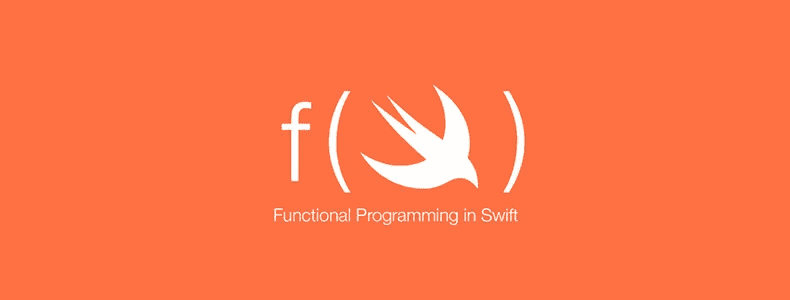

# Swift 中的功能数据验证

> 原文：<https://medium.com/hackernoon/functional-data-validation-in-swift-2cf2c28d55cd>

我将谈谈我在 Swift 中创建的一个小库，它既可以独立使用，也可以与 [Swiftz](https://github.com/typelift/Swiftz) lib 一起使用。它叫做 [**Swiftz-Validation。**](https://github.com/RPallas92/Swiftz-Validation)

## 什么是 Swiftz-验证？

这是一种典型的表单验证模型的数据结构，在其他场景中，您希望聚合所有失败，而不是在发生错误时短路(Swiftx 更适合这种情况)。验证可能是成功的(值)，包含成功的值，也可能是失败的(值)，包含错误。

验证是实现应用接口(`.ap`)的数据结构，并且以这样的方式实现:如果一个失败被应用到另一个失败，则它导致包含两个验证的失败的新验证。换句话说，验证是一种为可以聚集的错误而创建的数据结构，它在表单验证这样的上下文中是有意义的，在表单验证中，您希望向用户显示所有未通过验证的字段，而不仅仅是在第一次失败时就停止。

验证不能很容易地用于排序操作，因为`.ap`方法需要两个验证，所以创建它们的操作必须已经执行了。虽然有可能以连续的方式使用验证，但是最好将这项工作留给[或者](https://github.com/typelift/Swiftx/blob/master/Sources/Either.swift)，一个为此而设计的数据结构。

## 验证数据示例

在下面的例子中，我们将验证一个密码:它应该包含 8 个以上的字符，它应该包含一个特殊字符，它必须不同于用户名。

# 使用 Swiftz-Validation 的优势

像表单和模式验证这样的事情在[编程](https://hackernoon.com/tagged/programming)中很常见，但是我们最终要么使用分支，要么为每种情况设计非常具体的解决方案。

对于分支，我的意思是使用 if-else 条件，事情会很快失控，它无法扩展，因为很难抽象它，也很难推理每个规则。让我们看一个使用分支的相同验证的例子:

因为这个函数使用了`if`条件并修改了一个局部变量，所以它不是很模块化。这意味着不可能将这些检查分割成更小的部分，让它们自己完全理解——它们修改了某些东西，所以你必须理解它们是如何修改那个东西的，在什么环境下，等等。对于非常简单的事情来说，这还不算太糟糕，但是随着复杂性的增长，它变得难以管理。

## 优势

Swiftz-Validation 的主要优势在于:

*   每个验证都易于理解和推理
*   易于构建验证规则
*   易于重用验证规则和组成更复杂的验证[(干原理)](https://en.wikipedia.org/wiki/Don%27t_repeat_yourself)
*   它有一个众所周知的接口或抽象来工作(它是一个函子，指出，应用和半群)。因此，您可以用 **sconcat(半群)**组合验证，用 **ap(适用的)**应用函数，用 **fmap(仿函数)**转换结果，用 **switch** 语句对某种模式匹配的结果做出反应。

在下面的例子中，您可以看到验证结构如何为您提供一个[工具](https://hackernoon.com/tagged/tool),用于以可重用(DRY)和可组合的方式建立验证库和函数:

# 如何使用图书馆

验证库作为一个**枚举**实现，有两种情况:

*   **成功**(成功值)—代表一个成功值。
*   **失败**(Failure value)——代表一个不成功的值。

验证函数只是返回这两种情况中的一种，而不是抛出错误或改变其他变量。使用验证的关键是:

*   **组合验证:**有时候我们想要创建非常复杂的验证规则。关键是创建简单的可重用和可组合的验证，并将它们组合成一个复杂的验证结构。
*   **转换验证值:**有时我们得到的验证值并不是我们想要的。我们真的不想改变任何关于验证状态的东西(不管是通过还是失败)，但是我们想稍微调整一下*值*。这相当于在表达式中应用函数。
*   **对验证结果做出反应:**一旦我们有了验证结果，我们需要一种方法来相应地对值是成功还是失败做出反应。

现在，我们将看到一些例子:

**组合验证**

**转换验证值**

**对验证结果做出反应**

# 结论

我写这个库是作为一个个人实验，因为核心 SwiftZ 库不包括类似的数据结构，我认为这是一个非常重要的数据结构，因为验证在每个 sowftware 程序中都很常见。该库仍在开发中，但它可以与 SwiftZ 一起使用，也可以独立使用。我会添加更多像 liftA3 和类似的操作。

随时拉要求回购和改善它，谢谢！。

这个库的灵感来自 Haskell 的验证包:[https://hackage.haskell.org/package/Validation](https://hackage.haskell.org/package/Validation)

**鸣谢**

*   感谢[何塞·路易斯·阿尔卡拉](https://medium.com/u/d278e9977263?source=post_page-----2cf2c28d55cd--------------------------------)在 Swift 和 SwiftZ 上对我的帮助。
*   感谢@jlopez_rz 帮我做测试用例。
*   感谢 Jorge Aznar 帮我写这篇文章。