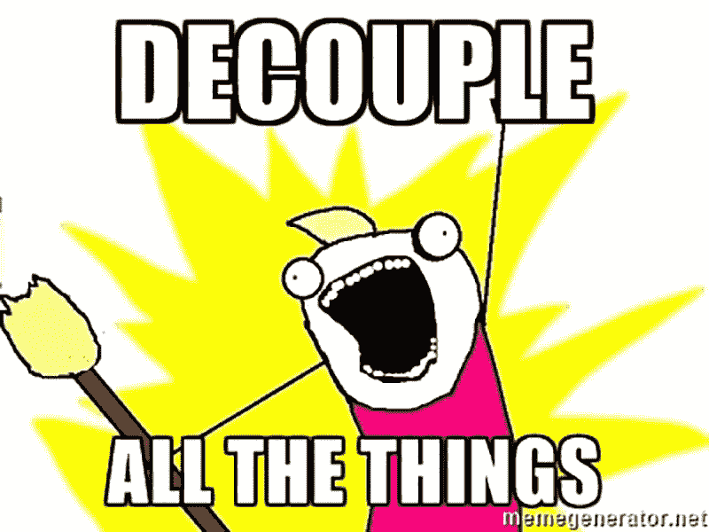
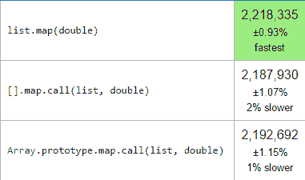

# 函数式 JavaScript:从对象中分离方法

> 原文：<https://medium.com/hackernoon/functional-javascript-decoupling-methods-from-their-objects-aa3ca13d7ae8>



在我的项目中，我最后总是做的一件事是将方法从它们的对象中分离出来。`map`、`filter`和`reduce`不是唯一的，但他们肯定是第一批被赋予自由的。

> 解耦一个方法可以让它摆脱父对象的限制，并且在表达代码的方式上给我们更多的自由。

# 那看起来像什么？

为了简单起见，我们仅限于从数组中提取`map`。幸运的是，JavaScript 的原型继承使我们很容易做到这一点，因为我们想要的函数就在`Array.prototype.map`中。JavaScript 很酷的一点是我们可以直接调用这个方法。我们只需使用`.call`，因为`map`需要一个`this`参数。

撒上一点咖喱(未来的文章),我们就完成了这个整洁的小衬垫…

```
const map = f => x => Array.prototype.map.call(x, f)
```

我们现在可以调用我们的`map`函数无数组！

# 映射的替代方法

调用`map`有许多不同的方式，由于 V8 引擎的优化，在性能上真的没有区别。



任何性能差异都不显著，这些数字每次都会发生变化。结论应该是这些方法是平等的。

# 脱钩如何让我的生活更美好？

这是一个很好的问题！可以说是最好的问题。我认为最好用代码而不是文字来解释，所以让我们直接进入主题。

`document.querySelectorAll`(以及类似的方法)不返回数组，它们返回一个 NodeList，NodeList 不包含`map`方法。有一些魔术可以把一个节点列表转换成一个数组，但是转换不是必须的，因为我们的`map`可以枚举一个节点列表，就像它是一个数组一样。

我们甚至可以`map`覆盖一个字符串，而不需要首先将它转换成一个字符数组。

解耦允许我们轻松地将对象映射转换为列表映射:

我们甚至可以`map`越过物体。

解耦允许我们组合函数:

解耦(使用 curry)允许我们部分应用函数参数并创建新函数。

告别`this`！！！

在这个例子中，`cat.speak`起作用，但是`catSpeak`不起作用，因为`this`上下文改变了。多痛苦啊！相反我们可以将`speak`方法和**方法脱钩，再也不用担心** `**this**` **了！**

然后，我们可以创建使用解耦函数的新函数。

# 摘要

今天，我们已经了解了解耦方法和从对象中提取它们的许多好处。解耦允许一个函数在更多的地方和不同类型的对象中使用，也允许它与其他函数组合使用。我们还删除了所有对`this`上下文的引用，这对我来说就足够了！

我知道这是一件小事，但当我在媒体和 Twitter 上收到这些后续通知时，我感到非常高兴。或者你觉得我满嘴屁话，在下面的评论里告诉我。

干杯！

# 相关文章

[](https://hackernoon.com/javascript-functional-composition-for-every-day-use-22421ef65a10) [## 函数 JavaScript:日常使用的函数组合。

### 函数组合是函数式编程中我最喜欢的部分。我希望给你提供一个好的真实的…

hackernoon.com](https://hackernoon.com/javascript-functional-composition-for-every-day-use-22421ef65a10) [](https://hackernoon.com/rethinking-javascript-death-of-the-for-loop-c431564c84a8) [## 重新思考 JavaScript:For 循环的死亡

### JavaScript 的 for 循环为我们提供了很好的服务，但是它现在已经过时了，应该被更新的函数所取代…

hackernoon.com](https://hackernoon.com/rethinking-javascript-death-of-the-for-loop-c431564c84a8) [](https://hackernoon.com/rethinking-javascript-the-if-statement-b158a61cd6cb) [## 重新思考 JavaScript:if 语句

### 功能性思维打开了我对编程的思维。它让我对代码有了更深的理解…

hackernoon.com](https://hackernoon.com/rethinking-javascript-the-if-statement-b158a61cd6cb) [](http://bit.ly/HackernoonFB)[](https://goo.gl/k7XYbx)[](https://goo.gl/4ofytp)

> [黑客中午](http://bit.ly/Hackernoon)是黑客如何开始他们的下午。我们是 AMI 家庭的一员。我们现在[接受投稿](http://bit.ly/hackernoonsubmission)并乐意[讨论广告&赞助](mailto:partners@amipublications.com)机会。
> 
> 如果你喜欢这个故事，我们推荐你阅读我们的[最新科技故事](http://bit.ly/hackernoonlatestt)和[趋势科技故事](https://hackernoon.com/trending)。直到下一次，不要把世界的现实想当然！

