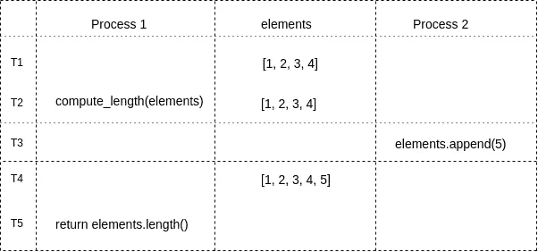

# 函数式编程概念:纯函数

> 原文：<https://medium.com/hackernoon/functional-programming-concepts-pure-functions-cafa2983f757>


由于函数式编程提供的优势，例如****更容易测试******可预测性*** 以及许多其他优势，函数式编程近来受到了很多关注。*

*纯函数是一个主要在函数式编程语言中使用的概念，但是它可以应用在任何编程范例中。*

****什么是纯函数？****

*一个函数要被称为*纯函数必须满足两个条件。* 我们来逐一了解这两个条件。*

# *给函数相同的参数，它应该总是返回相同的输出。*

*在编写纯函数时，我们如何确定上述观点成立？*

*跟着我来获取答案！*

> *函数不能使用程序的状态来计算它的输出。*

```
*x = 5        # x is a global variablemultiply(y):
    return y*x*
```

*`multiply`不是一个纯函数，因为它的输出是使用全局变量 x 计算的。如果 x 的值改变，对于相同的输入,`multiply`函数的输出也会改变。*

```
*x = 5
multiply(2)    # returns 10x = 10         # value of global variable x changed from 5 to 10
multiply(2): 20*
```

*在上面的例子中，`multiply`函数的输入是相同的，但是输出根据程序的状态发生了变化。*

**全局变量 x 也称为程序的状态，因为它可以在程序的任何部分被访问，并在程序执行期间定义与程序相关的数据。**

***由于** `**multiply**` **功能不是对相同的输入给出相同的输出，所以不是纯粹的。***

*为了使`multiply`纯净，我们可以将全局变量 x 作为参数传递给它。*

```
*def multiply_pure(y, x):
    return y*xmultiply_pure(2, 3)    # returns 6
multiply_pure(2, 3)    # returns 6*
```

*无论我们用相同的输入调用`multiply_pure`多少次，它总是返回相同的输出。*

> *其次，当在并发编程环境中工作时，函数不能将可变对象作为参数，也不能用它来计算函数的输出。*

*这是因为并发进程可以修改可变对象，并最终修改函数的输出。
下面的例子说明了上述观点:*

```
*# returns length of the list passed as argument
def compute_length(elements):
    return elements.length()*
```

**

*Mutable **elements** list being modified by multiple processes*

*在参数`elements`被传递给`compute_length`和`elements`的长度被`compute_length`函数返回的时间之间，可能会发生`elements`列表的长度被另一个进程修改的情况。这是因为`elements`是一个共享的可变列表，可以被多个进程访问。*

*因此`compute_length`在并发编程环境中是不纯的。*

> *第三，一个函数不能从 I/O 接受任何输入，这样才是纯粹的。*

```
*# takes input from the user and turns it into a greeting
def greet():
    str = raw_input()        # take input from user
    str = "Hello " + str
    return str*
```

*在上面写的例子中，函数的输出可能会根据 I/O 的输入而改变。*

# *对结果的评估不应该导致任何副作用，例如可变对象的突变或对 I/O 设备的输出*

> *纯函数不应该改变任何可变对象。*

*让我们遵循下面的书面示例来验证上面写的陈述:*

```
*class Box:
    def __init__(self, length):
        self.length = length # doubles length of Box object
# Assumption: Only box objects are passed 
def double_length(box):
    box.length = box.length * 2 
    return carton = Box(5)          # a Box object is created
double_length(carton)    # length of carton is doubled
print carton.length      # prints 10*
```

*这里的`double_length`函数是不纯的，因为它修改了可变的`Box`对象。*

**疑惑？？**

*让我们一步步了解它*

*   *`carton(Box object)`通过引用上例中的`double_length`函数来传递。*
*   *函数内对`Box`对象的任何更改在函数外都是可见的。所以我们可以说`Box`对象对整个程序都是可访问的，这意味着`Box`对象只不过是程序的状态。*
*   *并且函数不能修改状态以被称为纯函数。*

> *纯函数不应输出到 I/O。*

```
*# prints text
def printer(text):
    print “printing…. ” + text* 
```

*I/O 可以在控制台上打印，写入数据库等。*

# *结论*

*任何与程序状态交互的函数都有可能导致副作用。程序的状态可以是全局变量、可变对象、I/O 操作等。*

> *而且任何引起副作用的功能都是不纯的！！*

*如果你喜欢这篇文章，请点击♥按钮，这样其他媒体用户可能会发现它，也会喜欢它。*