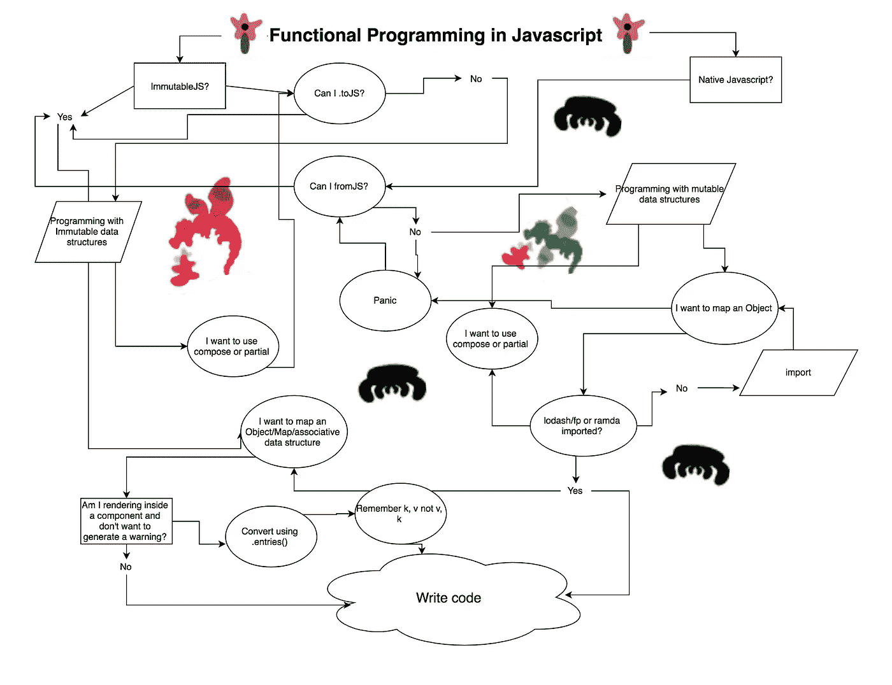
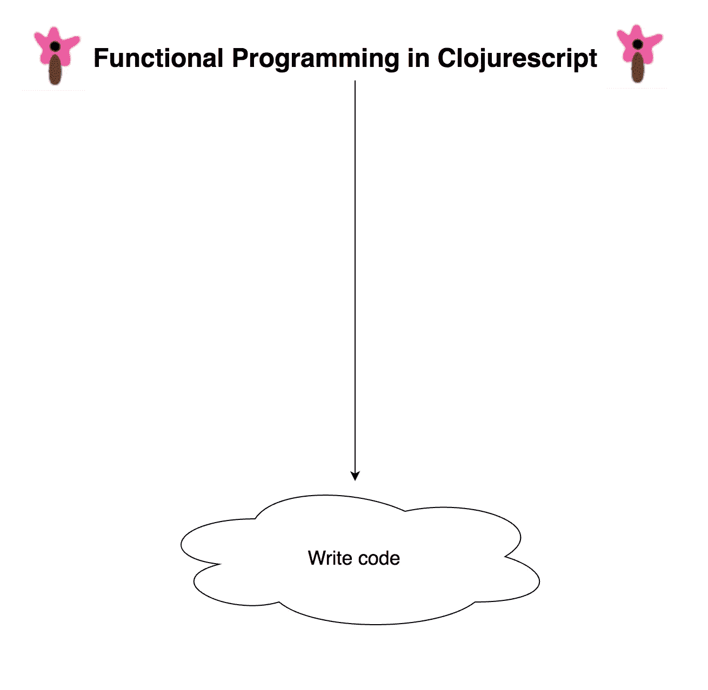
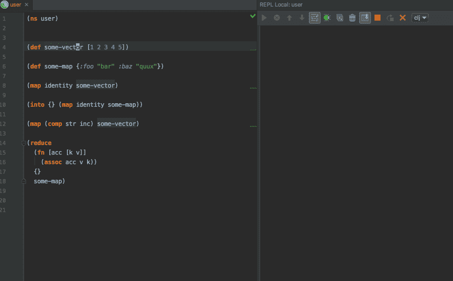

# Javascript 中的函数式编程是一种反模式

> 原文：<https://medium.com/hackernoon/functional-programming-in-javascript-is-an-antipattern-58526819f21e>


## 而 Clojure 实际上更容易

在编写了 [Clojure](https://hackernoon.com/tagged/clojure) 几个月后，我又开始编写 [Javascript](https://hackernoon.com/tagged/javascript) 。当我试图写一些普通的东西时，我有以下想法:

> "这个变量是 ImmutableJS 还是 Javascript？"
> 
> "我如何映射一个对象并取回一个？"
> 
> "如果是不可变的，就把<this function="">和<this syntax="">一起用，否则就把和<different syntax="" and="" totally="" different="" behavior="">一起用。"</different></this></this>
> 
> "一个 React 组件的状态可以是一个不可变的映射吗？"
> 
> “lodash 是进口的吗？”
> 
> "`fromJS`然后<写代码>然后`.toJS()`？"

他们似乎没有必要。但是我想我以前已经想过一百万次了，没有注意到，因为我只知道这些。

我不认为在使用 React、Redux、ImmutableJS、lodash 以及 lodash/fp 和 ramda 等函数式编程库的任意组合编写 Javascript 时，有办法避免这种想法。

我需要脑子里一直有以下内容:

*   用于 lodash、不可变、lodash/fp、ramda 和原生 JS 或某种组合的 API
*   使用 Javascript 数据结构时的可变编程技术
*   不可变数据结构的不可变编程技术
*   使用 Redux 或 React 时，使用可变 Javascript 数据结构的不可变编程

如果我设法把它记在脑子里，我仍然会碰到一堆类似上面的问题。不可变数据、可变数据和不应该变化的可变数据是视情况而定的。常用函数的函数签名和返回值也是如此。几乎每一行代码都有不同的情况。我相信在 Javascript 中使用函数式编程技术时，这是很难处理的。

像 Redux 和 React 这样的库按照惯例需要不变性。所以即使我没有使用 ImmutableJS，我也必须记住“不要在这里变异”。Javascript 中的不可变转换比它们需要的更困难。我觉得这种语言每一步都在和我抗争。更糟糕的是，Javascript 没有 Object.map 这样的基本功能。所以就像上个月超过 4300 万的 T2 人一样，我使用 lodash，它提供了很多 Javascript 没有的功能。尽管如此，这个 API 并不是不可变的友好的。一些函数返回新值，而另一些函数改变现有值。同样，保持这样的直线是不必要的开销。事实上，在 Javascript 之上，我需要知道 lodash、它的函数名、它的签名、它的返回值。最重要的是，它的[“集合优先，参数最后”的方法对于函数式编程来说不是理想的](https://www.youtube.com/watch?v=m3svKOdZijA)。

如果我使用 ramda 或 lodash/fp，那会有帮助。编写函数和清晰简洁的代码很容易。但是我不能用它来处理不可变的数据结构。我也可能会有一些代码，其中集合参数是最后一个，而其他时候则相反。我要知道更多的函数名，签名，返回值，导入更多的基本函数。

当我单独使用 ImmutableJS 时，有些事情变得简单了。Map.set 返回一个全新的值。一切都回归一个全新的价值！这就是我想要的。不幸的是，不变的也是复杂的。我不可避免地要处理两套不同的数据结构。所以我得知道`x`是不可变的还是 Javascript。由于学习了它的 API 和它的整体思维方式，我可以知道如何使用 Immutable 在 2 秒内解决一个问题。当我使用原生 JS 时，我必须跳过那个解决方案，用另一种方式解决问题。像 ramda 和 lodash 一样，我需要知道更多的函数——它们返回什么，它们的签名，它们的名字。我还需要将我所知道的所有函数分成两类:一类可以处理不可变的，一类不能。这也会影响我解决问题的方式。我有时会自动使用 curry 和 compose 来解决问题。但是这两种方法都不适用于不变量。所以我跳过这个解决方案，想另一个。

在我弄清楚这一切之后，我可以试着写一些代码。然后我移动到另一个文件，做同样的事情。



Functional programming in Javascript.


`Visualization of an antipattern.

我大胆地将 Javascript 中的函数式编程称为反模式。这是一条通向迷宫的迷人小路。它似乎解决了一些问题，但最终却制造了更多问题。更重要的是，这些问题似乎没有更高层次的解决方案可以阻止我一遍又一遍地处理它们。

# 这样做的长期成本是什么？

我没有确切的数字，但我认为可以肯定地说，如果我不必去想诸如“我在这里可以使用什么函数？”之类的问题，我会更有效率。以及“我应该改变这个变量吗？”它们与我试图解决的问题或我试图实现的功能没有任何关系。它们是由语言本身造成的。我能找到的避免这种情况的唯一方法是首先不要走上这条路——不要在 Redux/React、ramda 或 lodash 中使用 ImmutableJS、不可变数据结构、不可变数据作为一个概念。基本上不用函数式编程技术写 Javascript。那似乎不是一个好的解决办法。

如果你认同或完全同意我所说的(如果你不认同，那也没关系)，那么我认为值得花 5 分钟、一天甚至一周的时间来考虑:与选择不同的道路相比，坚持 Javascript 道路的长期成本可能是什么？

另一个，对我来说，叫做 Clojurescript。它是一种类似 ES6 的“编译成 JS”语言。总的来说，它是不同语法的 Javascript。它是作为一种在不可变数据结构上操作的函数式编程语言而被从头设计的。对我来说，这比 Javascript 简单多了，也更有前途。



# 什么是 Clojure/Clojurescript？

Clojurescript 类似于 Clojure，只是它的宿主语言是 Javascript 而不是 Java。它们的语法是相同的:如果你学习 Clojurescript，你学习 Clojure，反之亦然。这意味着如果你知道 Clojurescript，你就可以编写 Javascript 和 Java。“30 亿台设备运行 Java”；我很确定其余的运行 Javascript。

与 Javascript 一样，Clojure 和 Clojurescript 是动态类型的。您可以使用 Node 为您的服务器编写 Clojurescript 的全栈应用程序。与只编译成 Javascript 的语言不同，您可以选择编写支持多线程的基于 Java 的服务器。

作为一名普通的 Javascript/节点开发人员，学习这种语言或生态系统对我来说并不困难。

# 是什么让 Clojurescript 变得更简单？



Run whatever code you want inside your editor.

1.  你可以通过按键在编辑器中运行任何代码。这正是它听起来的样子。您可以在编辑器中键入您想要编写的任何代码，突出显示它(或将光标放在它上面)并运行它来查看结果。你可以定义函数并用你想要的任何参数调用它们。您可以在应用运行时完成所有这些工作。因此，如果您不知道某些东西是如何工作的，您可以在 REPL 中从您的编辑器中对其进行评估，并了解发生了什么。
2.  函数作用于数组和对象。贴图、缩小、过滤等。所有这些都以相同的方式处理数组和对象。这是故意的。我们不应该考虑数组和对象的不同`map`函数。
3.  **不可变的数据结构。每个 Clojurescript 数据结构都是不可变的。因此，你永远不会怀疑某样东西是不是永恒不变的。您也永远不会将编程范式从可变转换为不可变。你完全在永恒的土地上。**
4.  **基本功能是语言本身的一部分。**像 map、filter、reduce、compose 和[许多其他功能](https://clojure.github.io/clojure/)是核心语言的一部分，不需要导入。所以你不会在你的头脑中有 4 个不同的版本，例如“map”(array . map，lodash.map，ramda.map，Immutable.map)。你只需要知道一个。
5.  **很简洁。与大多数其他编程语言相比，它可以用更少的代码行来表达思想(通常要少得多)。**
6.  **功能编程。** Clojurescript 是一种从头开始的函数式编程语言——隐式返回语句、函数是第一类、lambda 表达式等。
7.  **使用 Javascript 中任何你想要的东西。从 Javascript 及其生态系统到 npm 库，你可以使用任何东西。**
8.  **性能。** Clojurescript 使用 Google Closure 编译器来优化它输出的 Javascript。包的尺寸小得可笑。在捆绑生产时，除了将优化设置为`:advanced`之外，不需要任何配置。
9.  **可读的库代码。知道“这个库函数是做什么的”有时很有用当我在 Javascript 中使用“goto definition”时，我通常会看到缩小或损坏的源代码。Clojure 和 Clojurescript 库显示了它们的编写方式，所以不用离开编辑器就可以很容易地看到一些东西是如何工作的，因为您可以直接阅读代码。**
10.  这是口齿不清。很难列举这样做的好处，因为好处很多。我喜欢的一点是它是公式化的(它有一个我可以依赖的模式)，并且代码是按照语言的数据结构来表达的(这使得元编程很容易)。Clojure 不同于 LISP，因为它不是 100% `()`。它使用`[]`和`{}`作为代码和数据结构，就像大多数编程语言一样。
11.  元编程。 Clojurescript 允许你写写代码的代码。这有着巨大的影响，我也不会试图去涵盖。一个是你可以有效地扩展语言本身。这里有一个来自 [Clojure 的勇敢和真实](http://www.braveclojure.com/writing-macros/)的例子:

```
(defmacro infix
  [infixed]
  (list (second infixed) (first infixed) (last infixed)))(infix (1 + 1))
=> 2(macroexpand '(infix (1 + 1)))
=> (+ 1 1) 
; The macro passes this to Clojure. Clojure evaluates it no problem because it's native Clojure syntax
```

# 为什么不流行？

如果它这么棒，为什么还没有起飞？有些人会指出，它有，只是没有 lodash，React，Redux 和其他人那么多。但如果更好，Clojurescript 不应该和那些一样受欢迎吗？为什么偏爱函数式编程、不变性和 React 的 JS devs 没有迁移到 Clojurescript？

**缺少工作机会？** Clojure 编译成 Javascript 和 Java。它实际上也可以编译成 C#。所以任何 Javascript 作业都可能是 Clojurescript 作业。或者 Java 或 C#作业。它是一种函数式语言，用于完成任何或所有编译目标。不管怎样，2017 年 StackOverflow 调查发现 [Clojure 开发人员是全球平均工资最高的语言](http://www.techrepublic.com/article/what-are-the-highest-paid-jobs-in-programming-the-top-earning-languages-in-2017/)。

**JS dev 懒？没有。正如我在上面试图展示的那样，我们做了大量的工作。有一种东西叫做 [Javascript 疲劳](/@ericclemmons/javascript-fatigue-48d4011b6fc4)你可能听说过。**

**我们抵触不想学习新东西？我们因采用新技术而臭名昭著。**

**缺乏熟悉的框架和工具？**这种感觉可能存在，但是在 Javascript 中有 Clojurescript 等价物: [re-frame](https://github.com/Day8/re-frame) 是 Redux， [reagent](https://github.com/reagent-project/reagent) 是 React， [figwheel](https://github.com/bhauman/lein-figwheel) 是 Webpack/hot reloading， [leiningen](https://github.com/technomancy/leiningen) 是 yarn/npm，Clojurescript 是下划线/Lodash。

**因为括号太难写？这可能也谈得不够多，但是我们不需要自己去匹配括号和方括号。基本上，Parinfer 使 Clojure 成为一种空白语言。**

**太难在工作中使用？**有可能。这是新技术，就像 React 和 Redux 曾经是，这些可能在某些时候也很难销售。但是没有技术限制——Clojurescript 以与 React 相同的方式集成到现有的代码库中。您可以将 Clojurescript 添加到现有的代码库中，一次重写一个文件的旧代码，并继续从新代码中与旧代码进行交互。

**不够受欢迎？**不幸的是，我认为这就是原因。我迷上了 Javascript，部分是因为它有一个庞大的社区。Clojurescript 比较小。我开始使用 React 的部分原因是它得到了脸书的支持。Clojure 得到了[的支持，他有一头浓密的头发，花了很多时间思考](https://avatars2.githubusercontent.com/u/34045?v=3&s=400)。

人多力量大。我相信。但是“作为否决权的受欢迎程度”抛弃了所有其他可能的因素。

假设一条路径通向 100 美元。不流行。另一条通往 10 美元的道路非常受欢迎。我会选择受欢迎的吗？

嗯，可能是吧！有成功的记录。肯定比另一种方式更安全，因为更多的人选择了它。他们一定没有发生什么可怕的事情。另一种方法听起来确实更好，但我肯定这只是一个陷阱。如果真像看上去的那样，它将是最受欢迎的。

[](http://bit.ly/HackernoonFB)[](https://goo.gl/k7XYbx)[](https://goo.gl/4ofytp)

> [黑客中午](http://bit.ly/Hackernoon)是黑客如何开始他们的下午。我们是 [@AMI](http://bit.ly/atAMIatAMI) 家庭的一员。我们现在[接受投稿](http://bit.ly/hackernoonsubmission)并乐意[讨论广告&赞助](mailto:partners@amipublications.com)机会。
> 
> 如果你喜欢这个故事，我们推荐你阅读我们的[最新科技故事](http://bit.ly/hackernoonlatestt)和[趋势科技故事](https://hackernoon.com/trending)。直到下一次，不要把世界的现实想当然！

