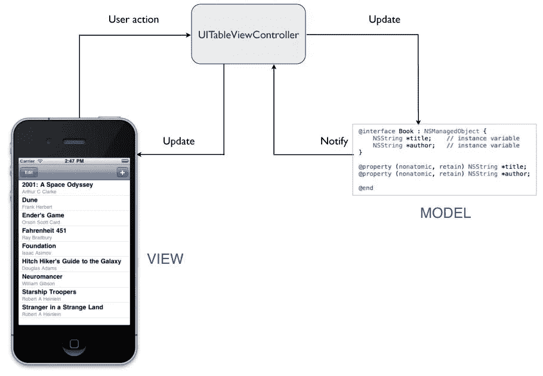

# Swift 3 中的函数式反应式编程

> 原文：<https://medium.com/hackernoon/functional-reactive-programming-in-swift-f67a0939266b>

## 使用 RxSwift 进行数据绑定

这篇文章是一个教程，将教你如何使用 RxSwift 将数据绑定到视图，rx swift 是函数反应式[编程](https://hackernoon.com/tagged/programming) (FRP) [设计](https://hackernoon.com/tagged/design)模式的一部分——视图对数据的变化做出反应。 **FRP 是*不是* MVC。**这些设计模式各不相同。除非你有充分的理由在一个项目中同时使用这两种模式，否则我建议你在架构模式上保持一致——只坚持一种！

提醒一下，模型视图控制器(MVC)包括让一个**视图控制器**成为一个**数据模型**和屏幕上的**视图**之间的“中间人”。



The Model and View never directly communicate, but use the Controller to pass information.

注意，当使用 MVC 设计模式时，模型和视图*从不*直接通信。

MVC 的一个*替代方案*是一种被称为功能反应式编程(FRP)的设计模式。FRP 与 MVC 完全相反——考虑到模型和视图有一个**直接连接的事实。**

在本教程中，我们将只关注使用 RxSwift 将数据绑定到视图—每当数据更新时，您的视图将自动更新。

本教程要求您使用一个名为 [RxSwift](https://github.com/ReactiveX/RxSwift) 的 Cocoapod。**我提供的链接是 Swift 3 的。**如果您使用的是 Swift 2.3，请使用 RxSwift 的这个分支[。](https://github.com/ReactiveX/RxSwift/tree/rxswift-2.0)

我们要做的是在数据和视图之间建立一个直接的连接。你可以在这里分叉克隆我的首发回购[。](https://github.com/juliascript/FRPTutorial/tree/b97fe32f05a4f97a95478c99a62502ed7261a0fe)

让我们以一个`UILabel`为例，它根据来自`UIAlertController`的文本输入进行更新。

通常，您可能有一个如下所示的变量来表示名称值:

```
let name: String = "Julia"
```

要将这个变量转换成与 RxSwift 兼容的变量，我们必须改变变量的类型。

```
let name: Variable<String> = Variable("Julia")
```

注意，我们的变量现在属于`Variable`类，它是 RxSwift 库的一部分。

您可能已经注意到，`Variable`类充当存储在变量中的数据的*包装器*。所以，你仍然可以通过调用`name.value`来访问字符串“Julia”。

接下来，我们对变量`name`调用`asObservable`函数。然后我们对结果调用`bindTo`函数，传入我们绑定到的视图元素。

```
name.asObservable()
    .bindTo(nameLabel.rx.text)
```

在这个特例中，我们绑定到名为`nameLabel`的`UILabel` 的`text`属性。然而，`bindTo`函数也允许我们绑定到视图的其他属性，比如`backgroundColor`。

最后，我们必须初始化并使用一个处置包。**我们在数据和视图之间创建的绑定即使在视图控制器被释放后也将持续。**当视图控制器被释放时，dispose 包将确保绑定也被释放。

```
let disposeBag = DisposeBag()
```

为了将绑定添加到 dispose 包中，我们必须调用绑定的最后一个函数。最终的绑定应该是这样的:

```
name.asObservable()
    .bindTo(nameLabel.rx.text)
    .addDisposableTo(disposeBag)
```

最后，为了改变你的观点，你需要改变数据！本教程中的变量基于来自`UIAlertController`的文本输入而改变，我们将实现改变视图的代码。

通常，您的操作结束可能如下所示:

```
let okAction = UIAlertAction(title: "OK", style: .default) { action in
            if let textInput = alert.textFields?.first?.text {
                self.name = textInput
                self.nameLabel.text = self.name
           }
}
```

请注意，您必须更新视图和数据。当我们将视图绑定到数据时，我们不需要更新视图。绑定意味着它会自动更新！我们要做的就是改变数据本身。

```
let okAction = UIAlertAction(title: "OK", style: .default) { action in
            if let textInput = alert.textFields?.first?.text {
                self.name.value = textInput
            }
}
```

记住`name`的类型是`Variable`——这意味着数据被封装在一个包装器中。我们不得不更新数据，而不是更新名称变量本身，数据恰好在它的`value`属性中。

这里有一个 [Github repo](https://github.com/juliascript/FRPTutorial) 的链接，里面有本教程的工作代码。如果您有任何问题，请随时联系我们！

你通过阅读这篇文章获得了价值吗？[点击这里](http://ctt.ec/l1ica)在 Twitter 上分享！如果你想更经常地看到这样的内容，请在 Medium 上关注我，并订阅我每月一次的简讯。你也可以请我喝杯咖啡。

[](http://bit.ly/HackernoonFB)[](https://goo.gl/k7XYbx)[](https://goo.gl/4ofytp)

> [黑客中午](http://bit.ly/Hackernoon)是黑客如何开始他们的下午。我们是 [@AMI](http://bit.ly/atAMIatAMI) 家庭的一员。我们现在[接受投稿](http://bit.ly/hackernoonsubmission)，并乐意[讨论广告&赞助](mailto:partners@amipublications.com)机会。
> 
> 如果你喜欢这个故事，我们推荐你阅读我们的[最新科技故事](http://bit.ly/hackernoonlatestt)和[趋势科技故事](https://hackernoon.com/trending)。直到下一次，不要把世界的现实想当然！

[](https://goo.gl/Ahtev1)