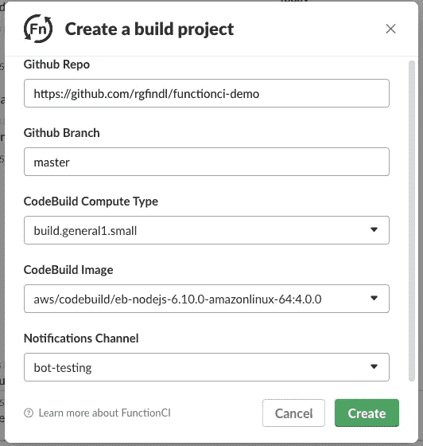
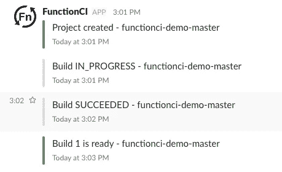
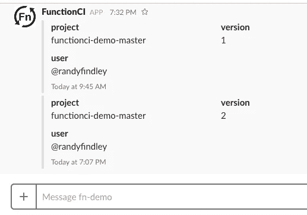
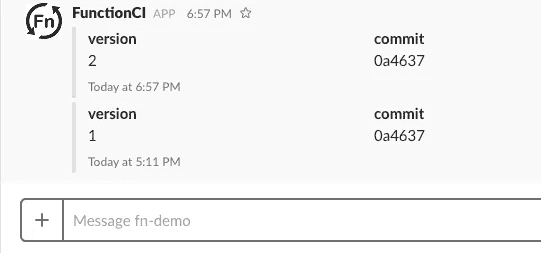
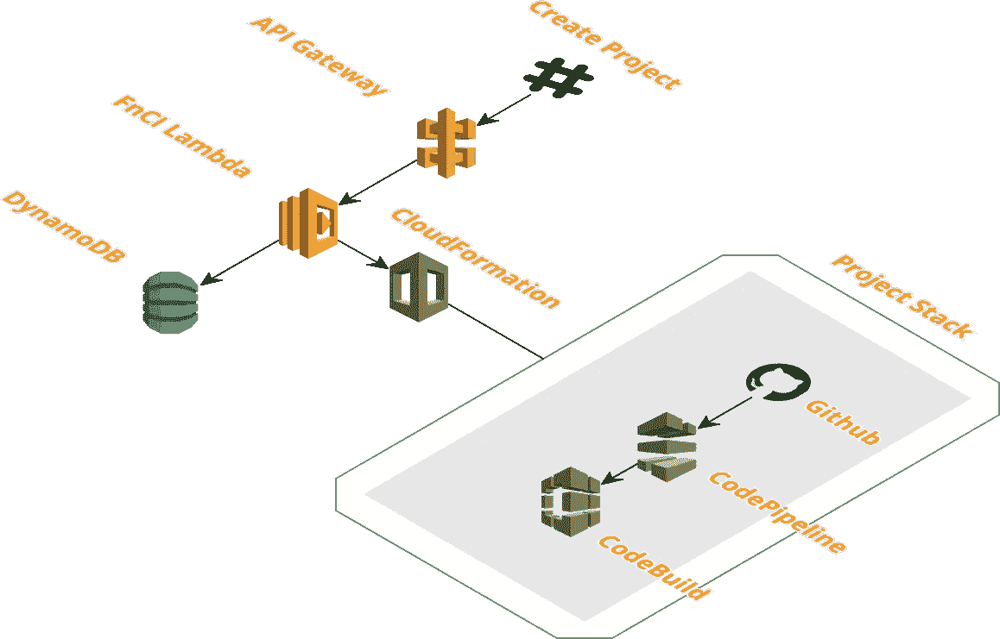
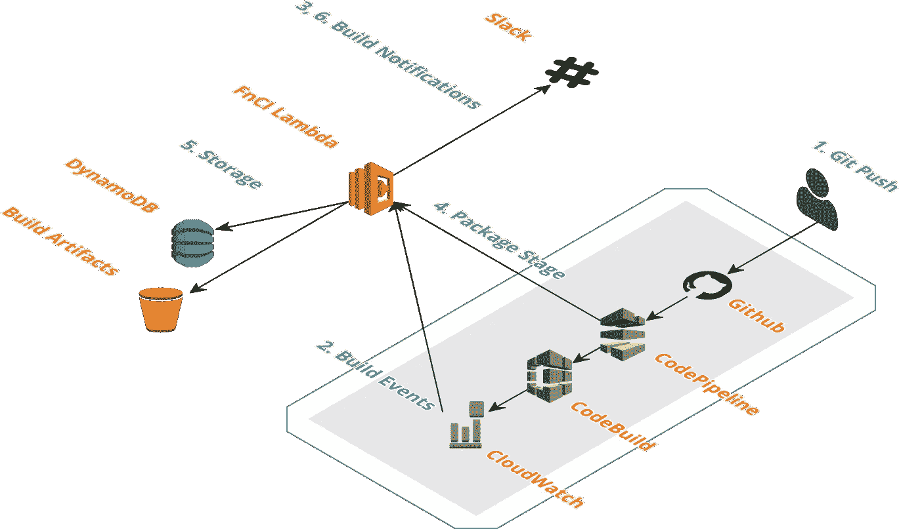
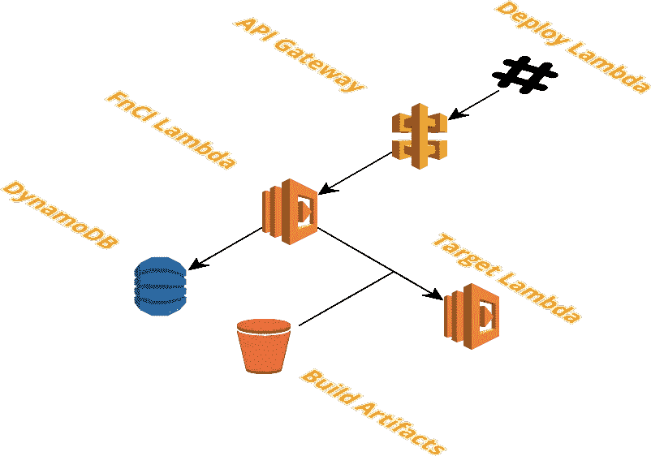

# FunctionCI —无服务器功能的持续集成

> 原文：<https://medium.com/hackernoon/functionci-continuous-integration-for-serverless-functions-c20b8a29b49a>

## 产品搜索黑客马拉松构建

Continuous Integration for Serverless Functions

我最近构建了[函数 CI](https://github.com/rgfindl/functionci) 作为[产品搜索全球黑客马拉松](https://www.producthunt.com/hackathon)的一部分，以解决我在 AWS Lambdas 上遇到的一个痛点。特别是持续集成、部署和审计跟踪。在我深入函数之前，让我解释一下什么是持续集成和无服务器 Lambda 函数。

## 连续累计

持续集成是在每次源代码管理提交时合并、构建、测试和打包代码的过程。

这很重要，因为它有助于快速捕捉合并错误。

它也有助于审计。如果您的 CI 工具将源代码控制提交 ID 与构建工件相关联，您就可以知道在任何时间点运行的代码版本。

## 无服务器 Lambda 函数

AWS Lambda 允许您在不提供或管理服务器的情况下运行代码。您只需为您消耗的计算时间付费，当您的代码不运行时，则不收费。有了 Lambda，你可以为几乎任何类型的应用程序或后端服务运行代码——所有这些都无需管理。只需上传你的代码，Lambda 就会为你的代码提供高可用性的运行和扩展。您可以将代码设置为从其他 AWS 服务自动触发，或者直接从任何 web 或移动应用程序调用它。

# 函数 CI

FunctionCI 是一个开源应用程序，您可以在 AWS 帐户中运行它来管理您的 Lambda 函数。

*   FunctionCI 构建、测试、打包和发布您的 Lambda 函数
*   构建由 AWS CodeBuild 和 AWS CodePipeline 完成
*   通过 Slack 接收构建通知
*   通过 Slack 将构建工件部署到 Lambda 函数中
*   通过 Slack 查看构建历史和部署审计跟踪

FunctionCI 是一个 Slack bot。与 FunctionCI 的所有消息和交互都通过您的 Slack 团队进行。

## 使用

一旦 FunctionCI 启动并运行，您就可以使用`/fn create project` Slack 命令来创建一个新的构建项目。

FunctionCI — Create project

一旦您的构建版本准备就绪，您将收到以下构建通知。

FunctionCI — Build notifications

然后，您可以使用`/fn deploy fn <fn-name> <project-name> <version>` Slack 命令将构建工件部署到 Lambda 函数中。

如果您希望查看最新部署的审计跟踪，您可以使用`/fn show fn <fn-name>` Slack 命令。最棒的是，它还向您显示了谁**做了部署，以及**何时**。**

FunctionCI — Show function

您还可以通过`/fn show project <project>` Slack 命令查看最新构建的列表。

FunctionCI — Show project

这是 FunctionCI 的基本用法。

这是一个示例项目:[https://github.com/rgfindl/functionci-demo](https://github.com/rgfindl/functionci-demo)

## 体系结构

FunctionCI 也是一款无服务器的 Lambda app。它包括以下 AWS 资源:

*   API 网关(为我们的 Slack bot 公开一个 API)
*   Lambda (Slack bot API、SNS 事件、CloudWatch 事件、代码管道事件)
*   文件存储
*   S3(构建工件)
*   CloudFormation(为每个项目构建一个管道)
*   代码管道和代码构建(执行构建)

对于每个添加到 FunctionCI 的项目，FunctionCI 都会通过 CloudFormation 创建一个 CodePipeline/CodeBuild 堆栈。

CodePipeline 通过 Github 触发。第一个代码管道阶段是代码构建。CodeBuild 构建、测试并打包您的应用程序。最后阶段对构建工件进行版本化和归档。

既然您所有的提交都被版本化为构建工件，那么您就准备好部署到您的 Lambda 了。

## 设置

如果您希望运行函数 CI，设置非常简单。只需遵循以下步骤:

1.  派生和克隆[功能 CI](https://github.com/rgfindl/functionci)
2.  安装 [CIM](https://github.com/thestackshack/cim) (云形成实用程序)
3.  安装 [kms](https://github.com/rgfindl/functionci/blob/master/kms/README.md) 堆栈
4.  安装[应用程序](https://github.com/rgfindl/functionci/blob/master/app/README.md)堆栈

希望 FunctionCI 能帮你管理好自己的 Lambda 函数。请告诉我你的想法以及 FunctionCI 是否对你有帮助。