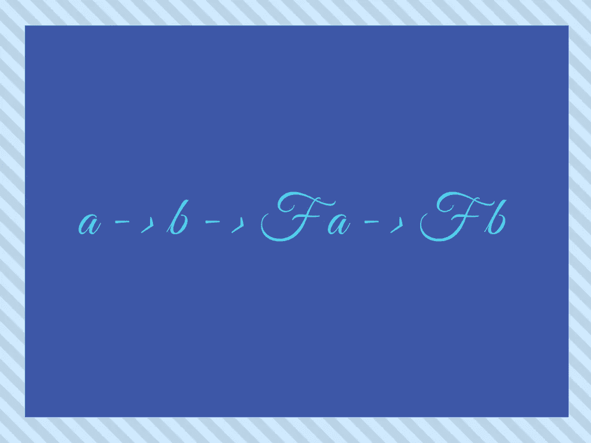
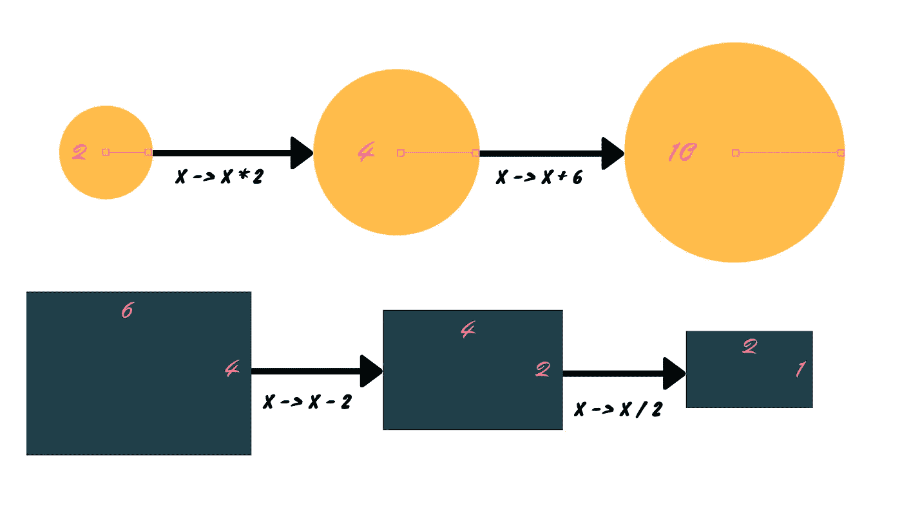
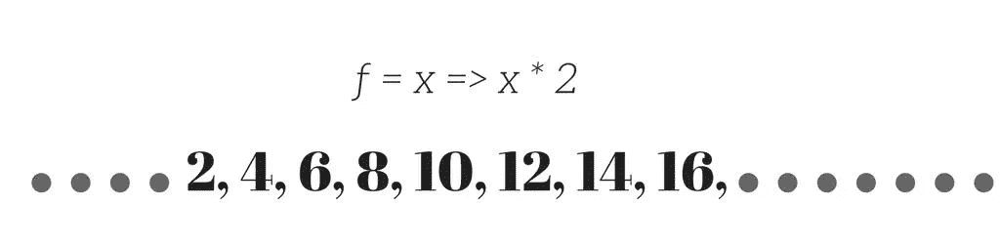

# JavaScript 中的函子

> 原文：<https://medium.com/hackernoon/functors-in-javascript-20a647b8f39f>



where F is a Functor

> “数学家就像画家或诗人一样，是图案的制造者。如果他的模式比他们的更持久，那是因为他们是用思想创造的。”
> 
> ——g·h·哈代，**一位数学家的道歉**

有时，在实际编程中，由于数据固有的复杂性，逻辑准确性是不可能的。数据抽象是一个非常有用的工具，它帮助我们创建数据的简化表示。

为了实现这一点，我们创建了“**容器**，这些容器只包含我们的数据，不做任何其他事情，我们不像在 OOP 中那样为它们提供属性或方法。

我们取一个值，并把它放在我们的容器中，容器将保护我们的值的安全，同时我们通过我们漂亮的函数逻辑传递它。只有当我们迫切需要时，我们才会取出那个值。这样，我们的容器将只有两个任务:

*   *保持自身内部的价值。*
*   *只有在我们需要的时候才把价值还给我们*。

*此外，永远不要改变其中的值。*

这些容器并不是什么新东西，自从我们开始使用 Java 脚本以来，我们就一直在使用它们，只有现在了解它们才能让我们成为更强大的程序员。

当我们进行函数式编程时，这些容器非常强大，因为它们有助于我们函数构造的基础，并帮助我们使用常见的技术，如纯函数式错误处理和异步操作*(以及许多其他东西)*。


在我们深入讨论这些容器之前，我们将讨论一种特殊类型的容器，称为 ***函子。***

***那么，什么是函子呢？*** ***函子是可以与‘映射’函数一起使用的容器。***

在我们创建自己的容器之前，让我们先来看看一些从小到大一直在使用的常见容器。

# 数组


数组是我们在日常编程中最常用的容器，它们不仅包含一个值，还包含多个值。它们是所有数据抽象中最简单的，但却如此强大。让我们和他们一起工作，

```
const arr = [ 8, 10, 23, 35, 54 ];
```

我们可以从这些数据中得到数值，比如

```
const b = a[1];
```

现在，如果你保证只在数组上使用这些操作，我保证这些数组将永远是你的朋友。

永远不要修改原始数组，

```
arr.push(45) ❌orarr[1] = 45 ❌
```

但是你可以用它们来创造新的，

```
const arr2 = [ ...arr, 38, 52 ]orconst even = filter(x => x%2 === 0, arr)
```

我们从来没有在数组上应用任何可能改变数组中值的方法，我们只是创建数组或者取出值，仅此而已。

虽然 Java 的人会说这样做使我的数组变得毫无用处，但我会说，“不，我刚刚创建了一个强大得超乎你想象的数组”。

是的，数组是一个函子。

**函子是一个容器，它可以被一元函数*映射*。**

当我说 mapped upon 时，我的意思是这个容器可以用一个特殊的函数(比如说 *fmap 或 map* )来处理，这个函数将任何一元函数应用于这个容器的每个内容，并返回一个包含结果值的容器作为它的内容。


This truck is a functor

在数组的情况下，这个特殊函数被简单地称为*映射*函数。

# 地图功能


Not this Map

Map function in arrays 接受一个数组，并对其所有元素逐一应用特定的函数，然后返回另一个数组。

```
[1,2,3,4].map(multiplyBy2) 
*//=> [2,4,6,8]*or**map(multiplyBy2, [1,2,3,4]) 
*//=> [2,4,6,8]****where multiplyBy2 = x => x * 2 and map = (fn, arr) => arr.map(fn)*
```

因为，我们总是从映射中得到另一个数组，我们总是可以再次映射它来创建一个数组转换链。

```
[1,2,3].**map**(x => x * 3).**map**(x => x * 2).**map**(x => x / 6)
```

Map 函数不仅仅是一个迭代器函数，*记住*，当我们的值在一个容器中时，我们不能直接对它应用一个函数，然后期望值被改变。举个例子，

```
const a = [1, 2, 3]String(a) = ‘[1 ,2, 3]’ and not [‘1’, ‘2’, ‘3’]
```

***一个 map 函数给一个函数访问容器的内容。***

```
map(String, [1, 2, 3]) = [‘1’, ‘2’, ‘3’]
```

此外，映射函数从不改变容器，相反，它只是对其内容进行操作。保持容器不动。



地图不会改变容器的类型，但是它可以改变里面的东西的类型。

内容的类型可能会改变，我们可以从 map 函数的类型定义中看出这一点。

```
map :: (a -> b) -> [a] -> [b]orfmap :: (a -> b) -> F a -> F b 
```

这里，`a`和`b`可以是相同的类型，也可以是不同的类型。

现在，如果你仔细看，你会看到地图函数从`a -> b`获取一个函数，并从`Fa -> Fb`返回一个函数

这里，`a -> b`指的是任何一个接受`a`并返回`b`的一元函数，比如

```
multiplyBy2(3) = 6 // is a -> b as 3 -> 6
```

而`Fa -> Fb`表示任何一元函数，它接受一个内部带有`a`的容器，并返回一个内部带有`b`的容器。

```
multiplyArrBy2([1]) = [2] // is Fa -> Fb as [1] -> [2], F is []
```

要了解我们如何使用这些类型，请阅读此处，

[](https://hackernoon.com/function-type-signatures-in-javascript-5c698c1e9801) [## Javascript 中的函数类型签名

### 当一个 Javascript 开发人员开始探索函数式编程的深层秘密时，他经常会发现这些…

hackernoon.com](https://hackernoon.com/function-type-signatures-in-javascript-5c698c1e9801) 

现在我们的地图功能将从`multiplyBy2`变为`multiplyArrBy2`让我们看看这个，

现在我们的函数`multiplyBy2`过去作用于整数，现在因为`map`将作用于整数数组。在某种程度上，我们的 map 函数提升了或者说 ***提升了*** 我们的函数，这样它就可以在这种情况下作用于我们的容器或数组。

我们偶尔会提升我们的函数，这样它们就可以作用于我们容器中的数据。*(因为正常功能不能)*

我们尽可能使用部分应用的地图功能，因为这样我们就可以用它来创建另一个功能，或者我们可以将它与*合成*功能一起使用，当数据非常紧急时，我们将使用我们正常的地图功能。

为什么要使用部分应用的函数？

[](https://hackernoon.com/partial-application-of-functions-dbe7d9b80760) [## 函数的部分应用

### 为函数提供比预期更少的参数称为函数的部分应用。

hackernoon.com](https://hackernoon.com/partial-application-of-functions-dbe7d9b80760) 

***在更进一步之前，*** 我们知道，我们用容器来保存我们的价值观，它们唯一的目的就是保存它们。我们还知道 ***函子*** 是特殊的容器，我们可以在上面进行 ***映射*** 操作。我们知道如何在数组上使用映射函数，我们也见过我们的第一个容器和一个函子，数组，我们在日常编程中经常使用。

现在，让我们来看看第二个容器，它也是一个函子。这个容器从我们的功能冒险开始就一直伴随着我们。

# 功能

> 所有的函数也是函子，因此也是容器。

**容器的功能是什么？**

好吧，容器包含数据，但是我们的函数明明包含逻辑，函数怎么可能是容器。

如果你仔细想想:一个函数在被调用时，会返回一个值。所以在某种程度上，它包含了我们的值，唯一的区别是这个值是动态计算的。

```
aFunction(45) // => 90So aFunction gives the value 90, when it is passed 45
```

把它们想象成无限数量的值的数组，如果你想从这些数组中得到一个特定的值，你需要用一个或多个特定的参数来调用函数。



Functions are arrays with Infinite Values

**那么，函数是像数组一样的容器？**

是的，就像数组在传递索引时给出值一样，函数在传递参数时给出结果。

```
const a = [ 8, 10, 23, 35, 54 ]const f = z => z * 2 a[1] = 10
f(2) = 4
```

只有我们的数组比较弱，因为它们只给出范围整数的结果作为索引，但是我们的函数可以接受任何类型的参数，因为对它们没有限制，它们也可以接受其他函数作为参数。

*函数是有无限个值的容器。*

因为它们是函子，所以它们也有一个映射？

是的，它是这样定义的

```
const fnMap = (f, mappingFn) => (x => f(mappingFn(x)))
```

就像 *map* 函数获取数组，将函数应用于内容并返回数组。类似地， *fnMap* 接受一个函数，将另一个函数应用于它的结果并返回该函数，在某种程度上它组合了两个函数 **s *uch，一个函数的结果是第二个函数的参数。***

嗯，好吧，让我们用这个

```
const multiplyBy6 = fnMap(multiplyBy2, multiplyBy3)
```

这看起来很熟悉，我们以前见过。

> **是我们的*作曲*功能。**


因此，我们的函数也有一个*映射*函数，如果我们将一个函数映射到另一个函数，我们就在某种程度上融合了这两个函数。映射函数称为*合成*函数。

## **TL；博士**

*   假设我们有一个函数`multiplyBy2`。
*   在从中取出值或者调用它之前，我们用`multiplyBy3`映射它。
*   所以`multiplyBy2`里面的所有值都乘以 3。
*   现在，每当我们调用`multiplyBy2`比如说`x`，我们得到的值将是`x * 3 * 2`。

也许，现在这一点会更清楚，

```
const fnMap = (f, mappingFn) => (x => f(mappingFn(x)))
```

函数就像数组，是一种数据抽象。只有函数根据我们的要求计算数据。

或者我们可以说数组就像函数，当我们对它们使用'[]'时，它们会立即给出结果。

我们可以用任何方式弯曲我们的思想来理解这一点，这都是真的。

我们只需要记住一件事，我们的值只有在容器中才有价值，无论是函数，数组还是我们创建的容器，只有这样，我们才能将代码中复杂的结构，可能是由于数据的复杂性而产生的，分解成简单的结构。

从现在开始，我需要你记住这个东西，在函数式编程 ***中永远不要赤裸裸地使用你的数据*** 。总是把它包在容器里。

现在，这篇文章太长了，无法讨论更多关于函子的内容。但我保证，我们会在另一部里继续。


用...书写💖。