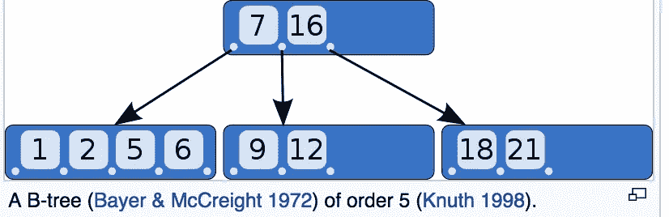

# 系统设计基础——第三部分

> 原文：<https://medium.com/hackernoon/fundamentals-of-system-design-part-3-8da61773a631>

你可以在这里阅读本系列[的上一篇帖子。在这篇文章中，我将介绍数据库索引。](https://hackernoon.com/fundamentals-of-system-design-part-2-abbe437ce2dd)

所有数据库都实现索引。索引是在数据库中实现的附加抽象，用于支持高读取吞吐量。那么为什么不索引数据库中的所有内容呢？因为索引是额外的抽象，会降低写入速度。因此，应用程序[开发人员](https://hackernoon.com/tagged/developer)的任务是根据应用程序的读/写工作负载定义哪些列/键需要索引。

最流行的索引方式是使用 [B 树](https://hackernoon.com/tagged/b-trees)。b 树将数据库分成几千字节的页面或块。每个页面都可以通过其在磁盘上的唯一地址来定位。这样页面就可以相互引用。

Source: Wikipedia, [B-tree](https://en.wikipedia.org/wiki/B-tree)

例如，在上图中，如果您正在寻找例如键 10，从查看根节点开始。10 位于 7 和 16 之间，因此跟随 7 和 16 之间的指针，您将到达第二行的中间节点。10 位于 9 和 12 之间，因此跟随指针到 9 和 12 之间的磁盘指针所引用的下一页。继续搜索，直到到达包含键及其相应值的叶节点。该值通常是记录实际存储位置的字节偏移量。

另一种索引技术被用于较新的数据库，如 Elastic Search、Hbase、Cassandra、Riak，它基于 Google 的 BigTable 论文。下面是它如何在引擎盖下工作的简短总结:

1.  新写入被添加到内存中排序的平衡树(如红黑树或 AVL 树)。这种内存树被称为 memtable。
2.  当 memtable 变大时，它会作为一个 SSTable 文件刷新到磁盘。可以把 SSTable 看作内存树的磁盘上的一个排序的键值存储，即已经排序的 memtable。当 STable 被写入磁盘时，新的写操作可以在 memtable 中继续。
3.  读取首先指向 memtable。如果在 memtable 中没有找到这些键，就在最近的 STable 中搜索，然后是下一个最近的 STable，依此类推。表是经过排序的，所以很容易对它们进行范围查询。
4.  在后台，从 SSTable 中删除重复的键，并保留最新的键值。这一过程被称为压实。
5.  压缩的表被合并到新的表中。因为表是排序的，所以使用类似合并排序的算法来合并它们非常快。

这种索引方案被称为 LSM 树或日志结构合并树。

根据经验，LSM 树可以处理更高的写工作负载，B 树适合高读工作负载。这是因为 SSTables 中的写入始终是顺序的，不像 B 树那样是随机写入(B 树页面不需要在磁盘上按顺序排列)

为了提高耐用性，在 B 树中写入之前还会写入一个称为预写日志(WAL)的附加文件。wal 只是附加文件，在崩溃时帮助 B 树恢复到一致状态。这意味着写入 B 树意味着首先写入 WAL，这又意味着额外的工作和更慢的写入。

通常，LSM 树中的合并和压缩过程非常快，但有时会落后于写入。当数据库遇到非常高的写入工作负载时，可能会发生这种情况。缓慢的压缩和合并会对读取产生负面影响，因为现在需要读取更多的表。这是 LSM 树的一个很大的缺点，在非常高的写吞吐量的情况下，它的性能会变得不稳定，不像 B 树那样表现出稳定的性能。

最后，如果事务语义是最重要的，那么 B 树是更可取的。在 LSM 树中，同一个键可以出现在多个表中。在 B 树中，一个键只出现在一个地方，它的值就地更新。因此，事务隔离很容易在 Btrees 中实现(我打算在以后的文章中讨论事务隔离)。

点击此处链接阅读[系统设计基础——第 4 部分](/@v_aparimit/fundamentals-of-system-design-part-4-d6a62f3fa779)。