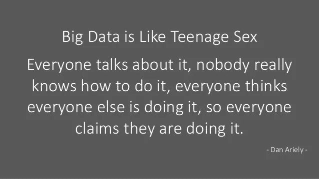

# 人工智能和人类的未来——冬天来了！

> 原文：<https://medium.com/hackernoon/future-of-ai-humans-winter-is-coming-841ca893ad3e>

Photo Credit, [https://i.ytimg.com/vi/GsE8EzKmuPA/maxresdefault.jpg](https://i.ytimg.com/vi/GsE8EzKmuPA/maxresdefault.jpg)

我老婆问了我一个[有趣的](https://hackernoon.com/tagged/interesting)问题，“你觉得我们带着 AI 去哪里好？”。她继续根据她与同事的讨论来讨论机器人的伦理问题。经过两天的思考和阅读，我决定写下我的回应:)

我是这样组织的:

*   我如何定义人工智能
*   人工智能将如何影响我们的经济
*   对我们未来的哲学探究

这是维基百科对人工智能的定义:

> **人工智能** ( **AI** )是[机器](https://en.wikipedia.org/wiki/Machine)展示的[智能](https://en.wikipedia.org/wiki/Intelligence)。在[计算机科学](https://en.wikipedia.org/wiki/Computer_science)中，人工智能研究领域将自己定义为对“[智能代理](https://en.wikipedia.org/wiki/Intelligent_agent)”的研究:任何感知其环境并采取行动以最大化其在某个目标上的成功机会的设备。[【1】](https://en.wikipedia.org/wiki/Artificial_intelligence#cite_note-Intelligent_agents-1)通俗地说，当机器模仿人类与其他[人类思维](https://en.wikipedia.org/wiki/Human_mind)相关联的“认知”功能时，就应用了“人工智能”这个术语，比如“[学习](https://hackernoon.com/tagged/learning)”和“解决问题”。[【2】](https://en.wikipedia.org/wiki/Artificial_intelligence#cite_note-FOOTNOTERussellNorvig20092-2)
> 
> 随着机器变得越来越有能力，一度被认为需要智力的智力设施被从定义中移除。例如，[光学字符识别](https://en.wikipedia.org/wiki/Optical_character_recognition)不再被视为“人工智能”的例子，已经成为一项常规技术。[【3】](https://en.wikipedia.org/wiki/Artificial_intelligence#cite_note-3)目前被归类为 AI 的能力包括成功地[理解人类言语](https://en.wikipedia.org/wiki/Natural_language_processing)、[【4】](https://en.wikipedia.org/wiki/Artificial_intelligence#cite_note-FOOTNOTERussellNorvig2009-4)在[战略游戏](https://en.wikipedia.org/wiki/Strategic_game)系统中高水平竞争(如[象棋](https://en.wikipedia.org/wiki/Chess)和[围棋](https://en.wikipedia.org/wiki/Go_(game))[【5】](https://en.wikipedia.org/wiki/Artificial_intelligence#cite_note-bbc-alphago-5))、[自动驾驶汽车](https://en.wikipedia.org/wiki/Autonomous_car)、[内容交付网络中的智能路由](https://en.wikipedia.org/wiki/Content_delivery_network)、军事模拟以及解释复杂数据。

我想用一种更简单的方式来攻击这个定义。智力是获取和应用知识和技能的能力。因此，在这个词的传统意义上，任何能够获得知识/技能并应用它的人都是聪明的。

AI 的第一个词是人工。人造的定义是人类制造或生产的东西。将这两个词放在一起，人工智能的简单定义是人类有能力获取和应用知识/技能。

> 人类制造的具有获取和应用知识/技能能力的东西。

知识的创造呢？这就是定义失败的地方。人工智能可以创造并因此消除人类作为其创造者的可能性是一件深不可测的事情。让事情变得更糟的是，如果它造成了我们无法理解的东西，我们将无法处理它。老实说，在我们目前的人工智能状态下，这远远不是现实。我将在我的文章的哲学部分回到这个问题。

人工智能会给我们的经济带来什么？

自古以来，人类就一直在使自己的工作自动化，并借助机器提高工作效率。在每一点上，都有大大小小的发明改变了我们的生活。这些发明大多代替了一些人力。自动化任务解放了人类，让他们承担更高的任务。在人工智能的情况下，我们可能没有更高的任务了，因为这个概念的本质就是自我学习和改进。每当一项新的创新在一个行业中引起混乱，人们就会失业，经济中的资金分配就会被扭曲。工业革命导致了经济的巨大变化。生产率提高了，但工作岗位却减少了。但从长远来看，效果是积极的，劳动力转移到不同的工作岗位。人工智能对整体生产率的影响将是积极的，但财富的分配将严重扭曲，大量资金掌握在极少数人手中。低端工作将会消失，导致大量中低收入人群失业。对于受过教育和有技能的工人阶级来说，失业的影响较小，因为他们有能力学习新技能。

我们可以看到技术的微观模式取代了软件行业中的人。几十年前，当企业应用程序充斥市场时，有一个为系统管理员创建的平行市场。软件服务市场乘风破浪，他们大量雇佣管理员，并把他们外包出去。这是一项伟大的事业。生产系统需要管理来扩展和维护业务连续性。数百万人以这种模式谋生并持续数十年。像亚马逊这样的玩家正在后台开发和完善云技术。大型服务公司忽略了它。如今，借助 DevOps 和廉价的云基础架构，大型企业不再需要管理员。他们正在用更便宜的开源替代产品取代像甲骨文这样的传统供应商。如果可以在 Maria 或 Postgres 上开发新产品，谁会在 Oracle DB 上开发呢？在 AWS 上设置它，它将毫不费力地扩展。随着大公司解雇管理员，每个人都想假装邪恶的公司正在做一些疯狂的事情。很简单，他们雇人做一项工作，而这项工作已经不存在了。在软件行业中，跟上潮流不是一项很好的技能，而是一项生存技能。工作会消失，如果我们没有准备好，不要抱怨。

每当任何新的颠覆性技术进入市场，我都会看到三个阶段:

*   怀疑论阶段——每个人都知道它正处于早期，所以他们以超然的态度看待它。怀疑情绪高涨。
*   “聚焦”阶段——在这一阶段，该技术的优势已经被一些大公司所认识。每个人都不了解这项技术，但这并不妨碍他们谈论它。营销团队抓住行话，开始把它添加到他们的网站、白皮书等。但是很少有人真的在研究它。

Dan Ariely’s Quote on Big Data a few years ago

*   “随大流”阶段——在这个阶段，早期采用者和少数主流参与者已经取得了重大进展。技术应用的模式越来越清晰，所以人们开始在这个领域寻找工作。培训机构开始广告课程，MOOC 玩家开始构建内容。这就是工作开始被截断，人们开始恐慌的地方。

如果你拿最近的关键技术来说，这已经发生了。想想云，大数据，区块链，机器学习，深度学习还有现在的 AI。AI 已经非常接近聚光灯阶段的尾声了。

人工智能将创造大量的就业机会，在不同领域建立和概念化它。与此同时，这将使大量的人失业。这些失业的人不容易在其他地方找到工作。取决于他们的年龄组，他们不会有提高技能的机会。一个在港口操作堆垛机 20 年的人将无法学习人工智能编程。我读了一篇来自白宫的论文，讨论了由于人工智能的出现而导致的失业的政策制定。这是一个有趣的开端，但即使像美国这样的发达国家也无法通过仅仅改变政策来维持这种局面。该论文预计，司机将是第一个因无人驾驶汽车而失业的人。他们希望商用卡车运输由机器控制。甚至会计和医生也有可能失业。我遇到了人工智能诊断糖尿病视网膜病变，结果很好。当人们忙于担心特朗普将对外包行业做些什么时，支持人员正在被聊天机器人&虚拟助理取代。没人会得到那份工作。

看看这个，这是先进的机器人技术。我不明白为什么深度学习程序可以解决它现在不能做的事情。

我们将在未来 10 年看到一个巨大的转变，20 年后将看到一个由人工智能驱动的认知世界。好消息是这需要 20 年时间，所以在那之前会有人工智能取代人类的工作。以无人驾驶交通为例，我预计道路和基础设施将需要大修。这将创造就业机会。在上面的视频剪辑中，梅森将继续协助机器人几年。这些变化对不同地区经济的影响会有很大不同。在印度，大多数中产阶级家庭都是由低薪女佣打扫的。在一个非常注重成本的市场中，低工资是他们有需求的唯一原因。由于人口非常多，每个女佣都在多个家庭工作，以此为生。如果有人要引进一种低成本高效率的机器人来取代他们，就会出现社会混乱。另一方面，这项发明在像美国这样的国家不会有太大的影响，因为由于成本的原因，大多数人自己做家务。这就是为什么像洗碗机这样的电器从未在印度的普通家庭中传播开来。替代方案更便宜。

**哲学角度**

在我们问自己如果人工智能胜过人类会发生什么之前，我们需要问自己我们在这个星球上的目的是什么？如果过去的数据是我们未来可能做什么的指标，那么我们的过去告诉了我们什么关于我们已经取得的成就？我还没有发现我们对环境有很大的积极影响。如果昆虫消失了，将会对动物产生巨大的影响，但是如果我们消失了，会有影响吗？

One of my fav scenes from The Matrix

与几个世纪前相比，我们已经取得了进步。为了取得这一进展，我们付出了很大努力。我们创造了文明，将它们夷为平地，制定规则，破坏规则，发动战争，砍伐森林，污染湖泊，这样的例子不胜枚举。我们很可能是一些巨型动物在我们移居的大陆上灭绝的原因。

回到人工智能，我们作为人类的恐惧是人工智能会胜过我们，我们可能不再是这个星球上最高的生物。这是合理的，但在目前的状态下有些牵强。我们写一个伦理框架来控制这一点的解决方案是不合理的。凭借我们所有的推理能力和智慧，我们必须明白，不可能定义一个规则框架来量化某事的对错。这是因为与编程不同，伦理是主观的。虽然我认为杀死动物并吃掉它是错误的，但你可能完全不同意。这是主观的，因此我既对又错。比较士兵射击另一边的士兵。两人都可能是被送上战场的普通人。他们相信自己在做正确的事情，这有助于他们为杀戮辩护。恐怖分子呢？他/她的信仰体系如此强大，以至于能够为杀害无辜的人提供正当理由。这是披着理性外衣的非理性。

一个伦理框架在我们写出来之前就已经失败了。不像解决魔方这样的客观问题，不可能达成一致的单一解决方案。

我妻子提出了一个有趣的例子，她的同事们正在讨论这个例子。一辆无人驾驶汽车载着一名乘客。一辆卡车正从后面朝这辆车疾驰而来，算法知道将会发生事故。这款车有三种选择:

**选项 1:** 留在当前车道，让卡车撞上它。乘客会死。

**选项 2:** 向右变道，这将导致右边一辆载有 65 岁老人的汽车发生致命事故，但无人驾驶汽车中的乘客将受轻伤幸存。

**选项 3:** 向左变道，这将导致左边一辆载着 10 岁女孩上学的汽车发生致命事故。同样，无人驾驶汽车中的乘客将受轻伤而幸存。

这个问题的规则怎么写？(希望在评论区听到您的观点)

这个问题的基本前提是有一个正确的选择。在选择这个选项时，无人驾驶汽车将在更大的范围内造成最小的损害。算法做出人性化决策所需的一些数据点是:

*   65 岁有哪些依赖？他家里有依赖他的孩子吗？他妻子有工作吗？他是一个像首席执行官或社区领袖一样的重要人物，在建造一座可以帮助 1000 名农民的大坝吗？
*   女孩的父母是谁？她的死会有什么长期影响？她父亲是重要人物吗？
*   乘客是谁，救乘客的命到底重要不重要？

从纯数据采集和处理的角度来看，这是一个复杂的问题。需要即时获取多个数据输入，并且需要在几分之一秒内考虑几个因素。假设存在正确的选择，人类不可能做出如此复杂的决定。AI 会是一个更好的决策者。

**思考 1:** 如果道路上的所有车辆实际上都是机器控制的，那么车辆之间相互通信的网络将会非常高效，这种情况本身永远不会发生。换句话说，卡车司机是一台机器，所以这不会发生。事故将 100%被消除，因为大多数事故的发生是由于人类忽视了早期的警告信号。一个自我意识系统永远不会忽略一个信号，并且通过深度学习，实际上甚至会事先了解所有失败的可能性。随着每种故障情况的独立发生或组合发生，系统为存在的每种情况建立处理。

**思考 2:** 在这种情况下，人类定义了正确的选择。换句话说，人工智能系统由人类定义的一套支配性规则来管理。根据定义，这是有缺陷的，因为我们的选择是主观的。我对思想 3 的恐惧是有人会写一个规则来给种族、宗教、性别等以优惠待遇。这个系统的优越性取决于它所遵循的规则。

这就给我们带来了一个更有争议的问题。

**AI 该考虑自保吗？**

如果 AI 达到如此高级的状态，超越人类成为这个星球上的控制因素，那么自我保存是必然的。自我保护会导致做出无视其他生物的选择，比如为了种植更多的作物而转移森林中的动物，或者在湖床上建造一座公寓来容纳更多的人。假设是，与饥饿相比，森林的破坏是一个较小的问题。在我们的事故例子中，汽车的算法可以首先考虑自我保护或机器保护。该算法将首先分析哪种情况会对相关机器造成最严重的损害？基于它们在机器生态系统中的功能，它会选择损害最小的路线。人类的角度不会被考虑或者仅仅被认为是一个美好的拥有。

**那么，人工智能接管后，人类会发生什么？**

狮子在丛林中睡觉，当它饿的时候猎食，当时机成熟的时候交配。它不创新，它存在又消亡。它的目的是生存和满足基本需求。这些需求是有极限的，当达到极限时，它就会停止寻找。狮子为了领地和狮群而杀戮，所有这些都是生物编码的行为。所有这一切都发生在野外，直到人类决定，他们想要土地或狮头作为他们的起居室。换句话说，成为最高级的物种意味着我们可以随心所欲地发挥消灭低级物种的力量。没有理由相信 AI 不会做同样的事情。另一方面，人工智能可能会免除我们的工作，为我们创造系统，让我们在固定的边界内生存。就像狮子一样，我们在动物园或丛林中给了它们一席之地。我们人类可以绘画、爬山、跑步、行动和做任何事情，而没有影响他们(人工智能)世界的系统目的。我的意思是，我们可以做任何我们想做的事情，只要它不干扰机器正在做的事情。当我们的行为对机器产生负面影响时，它们会采取行动来解决问题。我们可以和平共处，但我们作为一个物种的历史却讲述了另一个故事。

一些结束语:

整篇文章分析了对我们今天所知的世界的影响。很有可能今天存在的系统将不再与人工智能统治的世界相关。金钱对人工智能有意义吗？边界对人工智能有意义吗？我们的想象力仅限于我们今天所知道的，但在一个人工智能将创造的世界里，事情可能会非常不同。

众所周知，我们认为机器和人是两种不同实体的想法将会改变。我们会想办法把 AI 融入人体，让自己变得高人一等。这会造成另一个美丽的混乱。

这是我对一个清晨问题的很长的回答。

冬天来了。

以下是我在研究这篇文章的经济部分时使用的一些参考资料，它们读起来很有趣:

 [## 人工智能、自动化和经济

### 编者按:经济顾问委员会、国内政策委员会、国家经济委员会的工作人员…

obamawhitehouse.archives.gov](https://obamawhitehouse.archives.gov/blog/2016/12/20/artificial-intelligence-automation-and-economy)  [## 汹涌的浪潮

### 1930 年，当世界正在“受苦受难”的时候...从对经济悲观主义的猛烈抨击中，约翰·梅纳德·凯恩斯写了一篇广泛的…

www.economist.com](http://www.economist.com/news/briefing/21594264-previous-technological-innovation-has-always-delivered-more-long-run-employment-not-less?spc=scode&spv=xm&ah=9d7f7ab945510a56fa6d37c30b6f1709)