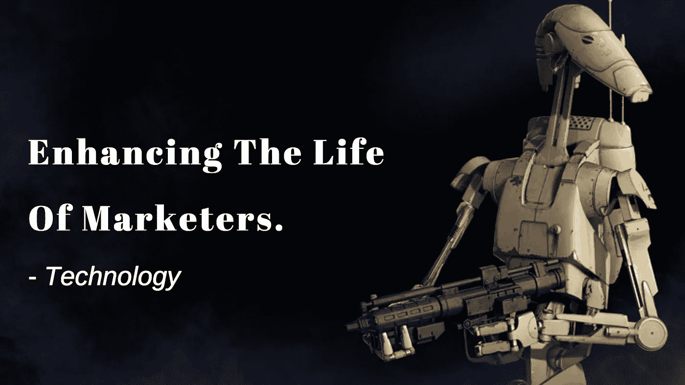
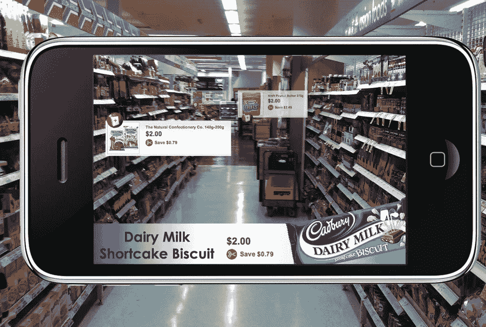
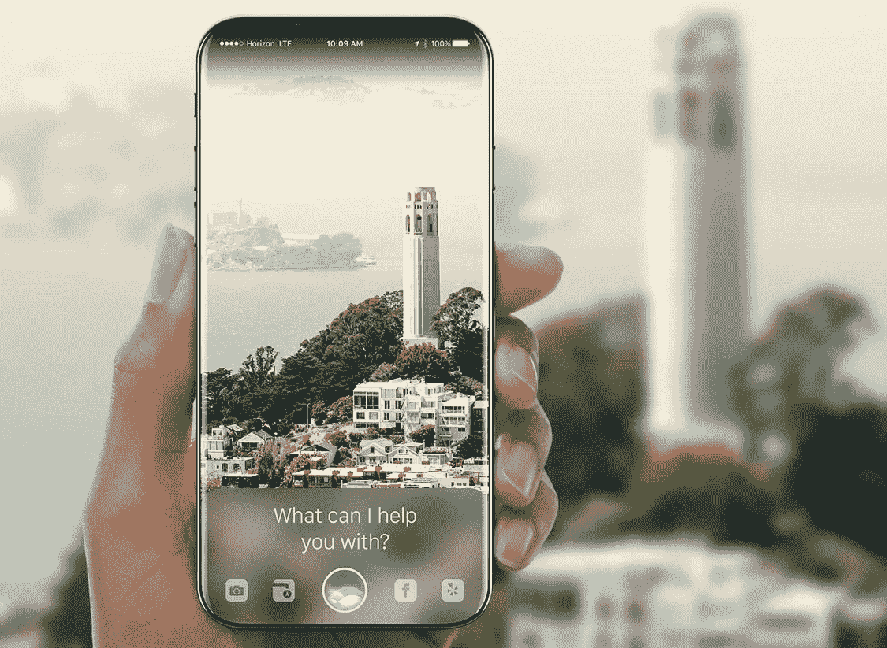
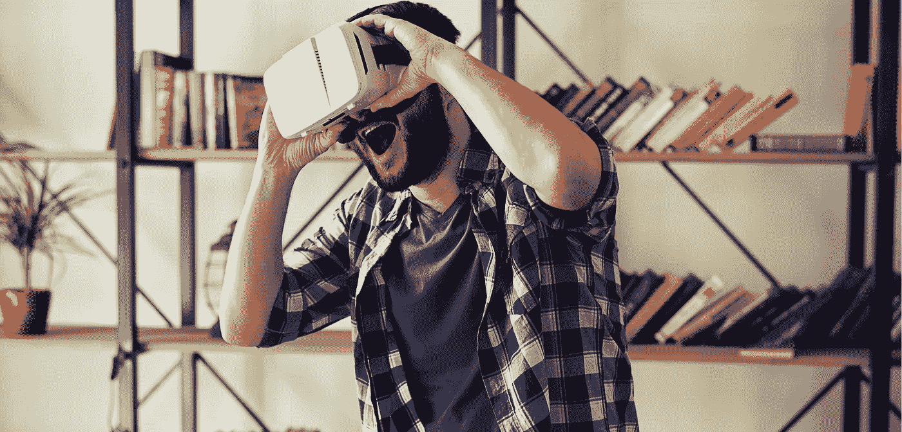
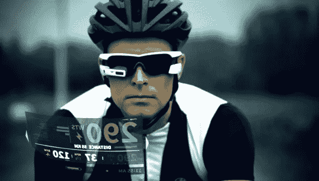

# 网络营销的未来

> 原文：<https://medium.com/hackernoon/future-of-internet-marketing-de6cb5fcb1fc>

Future Of Internet Marketing

凭借先进技术的力量，如 **AR** 、**人工智能**、**机器学习**、**物联网、**，当然还有不可征服的**数据量，**营销人员可以做任何事情，从**沉浸式瞄准**到**合意销售**。

对我来说，这是一个惊人的转变，从只写和发布内容到努力在网上营销它们。虽然这看起来像是一个彻底的转变，但我还是小心翼翼地铺好了路。

*#BoringHardshipStory*

> 让我们承认这个事实，
> 
> 过去，作者被要求将大量内容发送出去，结果却无人阅读。

> 好吧，我们都不知道作家有能力写作以及改变信仰！我们有吗？

令人震惊的是，在没有财政投资的情况下(当时我们没有广告词或任何其他花哨的营销工具)，通过不可靠的销售电话，通过乏味的网站，企业能够说服并转化他们的客户！

**如何？**此后，*内容*主导了*转换过程。*

> 我仍然怀疑内容是否像原始时代的诗歌一样精心制作？！

## 打破无尽的谜团，

> 什么是营销？
> 
> 你在那里推销你的服务/产品。
> 
> 什么是销售？
> 
> 在那里你做**卖**换钱。

我们不是生活在一个物物交换的经济体系中。是的，我们不交换东西并从中发财。

## 窥视在线营销的未来

**Contextual marketing** to I**mmersive marketing**

在线营销正处于崩溃的边缘，并催生出一种完全不同的商业模式。随着新兴技术的出现，在线营销正在从**情境营销**快速转变为**沉浸式营销**(耶)。

例如，将社交媒体纳入我们的互动流已经改变了我们在日常生活中保持联系的方式。此外，它们都可以通过手机**和**访问。

随着整个世界都已联网，似乎除了通过数字媒介之外别无其他，我们的生活将如我们所愿地改变！

看一看**新的创新技术**那些我们很快就会接触到的技术。他们肯定会通过彻底改变在线营销的工作方式来卸下我们的重担。

## 介绍…

## 增强现实

Augmented Reality within e-commerce

尽管听起来可能很庞大，但增强现实正开始改变营销人员为他们的产品使用游戏化的方式。

还记得《口袋妖怪 Go 》( Pokemon Go )( Pokemon Go )( Pokemon Go )( Pokemon Go )( Pokemon Go )( Pokemon Go )( Pokemon Go )( Pokemon Go )( Pokemon )( Pokemon )( Pokemon Go )( Pokemon )( Pokemon )( Pokemon )( Pokemon )( Pokemon )[ T1)是如何被 T2)AR(AR )( T3)技术所吸引，并让我们陷入它的狂热中吗？

这给了我们一个关于人机交互未来的想法。也就是说，在这个点上，物理环境和数字环境将会相遇并得到改善。随着一些未来主义公司最近的发布，如**谷歌**和**苹果**-谷歌用于 Android 的 **AR 核心**到**苹果专门用于支持 AR 的 iPhone 8-X**，给我们一个清晰的画面。

Apple’s Augmented Reality Image Recognition

## AR 对营销的入侵会是什么样子？

回到 2010 年，应用程序如何争夺用户的注意力，AR 通过后置镜头聚焦到物体上来使事情变得有趣的能力将再次恢复应用程序战争或产品战争。

**市场营销内部…**

## 购买前的沉浸式体验

检查**修改界面**。Modiface 是一个不需要动脑筋的东西(从它的名字就可以看出来)。它允许用户在实际购买之前使用其 AR 应用程序来试用美容产品。

Augmented Reality for cosmetics

## 虚拟现实和网络营销

Virtual Reality Gear to experience immersive visualisation

虚拟现实和网络营销将通过加强视觉/ **视频营销**大有作为，特别是将提升视频的传播。尽管虚拟现实技术目前需要的预算略高，但作为企业和用户，它的好处是巨大的。

**脸书**推出 **Oculus Rift** 的几个 VR 技术教程。随着革命性的虚拟世界的出现，用户可能会期待不同的产品体验，企业必须在用户提出要求之前为他们提供独特的体验。

> 如果营销人员在用户过度接触它之前选择它，情况会更好。

例如，让我们从最近刚刚过去的温布尔登锦标赛制造的**捷豹**中获得最身临其境的视觉体验。在游戏中，你将飞越温布尔登场地**的迷宫般的 CG 建筑**上方，在比赛的高峰时段落入球场中心。

谁配音的？**安迪·穆雷**！

VR driven campaign by Jaguar featuring Andy Murray killing it in the recent past Wimbledon Match

高潮:当你撞上安迪的身体时，这种体验就结束了！

看看 [**捷豹的温网 VR 网站**](https://youtu.be/rF6eME_vr6M)

> 注意:不要过分强调技术和礼仪。人们讨厌它。

## 可穿戴技术

Wearable technology will help improve our health in a greater extent

凭借我们目前使用的可穿戴设备的极限，它要么让我们的日常生活变得方便，要么将企业推向数据死亡的边缘！

嗯，**物联网**的力量是巨大而复杂的。

可穿戴设备使用的增加，如**苹果手表**，将显著帮助企业根据穿戴者早期的**购物经历/在线行为，及时将他们的创意**广告**瞄准目标受众。**

**检查**:定制广告必须更加个性化，更有创意，才能从穿着者身上获得完全的利益。

> **事实**:普通人查看智能手表的次数比查看智能手机的次数多 85%。

似乎有更多的机会让营销人员和企业被众多的用户选择。

## 让我们在下一篇博客中了解更多破坏性的营销技巧。