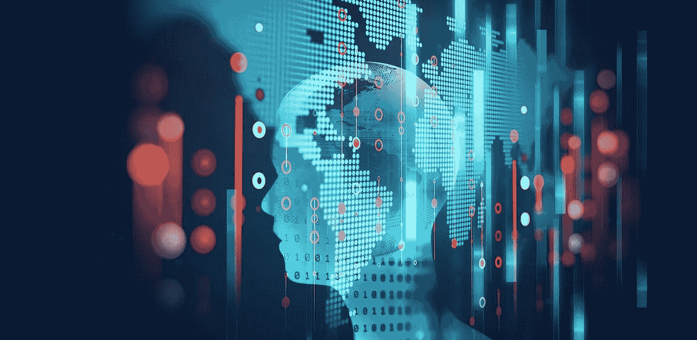
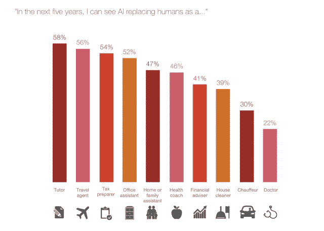

# 人工智能、机器学习和深度学习的未来

> 原文：<https://medium.com/hackernoon/future-of-work-with-ai-machine-learning-and-deep-learning-6a0211c24b9b>

[Image: [Georgia Tech](https://pe.gatech.edu/blog/meet-jill-watson-georgia-techs-first-ai-teaching-assistant)]

## 仍处于开发和使用的早期阶段，人工智能、机器学习和深度学习已经在影响我们的生活、工作和娱乐方式。您的组织准备好接受和利用这些颠覆性创新了吗？

当汉森机器人公司制造的机器人索菲亚获得公民身份后，[沙特成为世界上第一个公开接受人工智能(AI)和“现实生活”之间密切关系的国家](http://bigthink.com/paul-ratner/for-the-first-time-ever-a-country-just-made-this-robot-a-citizen)这位沙特公民是按照奥黛丽·赫本的形象设计的，她已经有点名气，出现在《今夜秀》和各种全球会议上。

索菲亚并不孤单。事实上，几十年来，我们一直在日常生活中使用 AI。从所有智能手机上的语音识别到帮助你打扫房间的机器人，再到提醒你即将举行的商务会议的虚拟助手，人工智能已经证明自己是信息、学习、推理、规划和交流的伟大提供商。

人工智能被定义为计算机对人类智能过程的有效模拟，它还融合了机器学习和深度学习的概念。前者在 AI 赋予无生命系统自动学习和从经验中改进的能力(一种非常“类似人类”的特性)时发挥作用，而后者赋予计算机在没有明确编程的情况下学习的能力。

机器学习帮助优步等公司确定乘车的到达时间，估计 UberEATS 的送餐时间，并计算最佳的上车地点。谷歌将深度学习用于语音和图像识别算法，亚马逊利用它来帮助确定客户接下来想要观看或购买什么。

# 今天，人工智能已经以三种方式影响了我们

因为人工智能、机器学习和深度学习都可以松散地组合在同一个保护伞下，所以最好认为这三者协同工作，以帮助组织更智能、更好、更快地工作。尽管这三者仍处于技术增长曲线的初级阶段，但它已经在以我们可能都没有意识到的方式产生影响。以下是其中的三个:

简化我们的日常生活。根据一篇 [*福布斯*](https://www.forbes.com/sites/shephyken/2016/08/27/bad-customer-service-costs-businesses-billions-of-dollars/#e4c2da151525) 的文章，620 亿美元因糟糕的客户服务而损失——这一赤字逐年增加。人工智能可以通过超越人类的能力来帮助堵塞漏洞。数字助理已经成为日常生活中常见和可接受的依靠——我们可以期待它们在未来的生活中发挥更大的作用——但它们只是开始。普华永道最近的一项调查显示，大多数消费者认为人工智能在不久的将来会简化他们的日常生活:

让我们的政府更有效率。人工智能和机器学习有可能大幅降低和控制公共部门机构的持续运营成本。考虑下面的例子:

*   [陆军医疗部门](http://mrmc.amedd.army.mil/index.cfm?pageid=medical_r_and_d.ccc.overview)正在开发可穿戴显示器，使用机器学习算法来衡量伤口的潜在严重性，以帮助医务人员确定治疗或撤离的优先顺序。
*   白宫和美国海关和移民局使用聊天机器人来回答基本问题，并把复杂的回答留给人类。
*   [美国邮政局](http://mhlnews.com/technology-amp-automation/postal-automation-delivers-1.)使用手写识别按邮政编码分拣邮件；有些机器一小时能处理 18，000 封邮件。

根据德勤最近的一项研究，使用人工智能来自动化现在由雇员执行的联邦政府任务，每年将节省至少 9670 万工作时间，节省 33 亿美元的成本。结合更好、更快、更准确的服务以及降低成本的激励，将继续推动人工智能在政府部门的采用。

**解决企业面临的最严峻挑战。**以制造业为例。工业革命把我们从大规模生产带到了自动化。自从第一批机器人在生产线上工作以来，已经过去了半个多世纪。现在，被称为工业 4.0 的制造业正变得越来越智能，因为它采用了人工智能、机器学习和物联网(IoT)。可以收集、整合、分析和预测来自客户、合作伙伴、市场、工厂车间和仓库的数据，使公司能够高效、准确地改变生产和运输产品和货物的方式。

制造业并不是人工智能应用的唯一例子；它还影响着市场的每个领域，以解决复杂的业务问题。

例如，许多大型金融机构投资了人工智能引擎，以协助其投资实践。一份来自[*美国银行家*](https://www.americanbanker.com/news/beyond-robo-advisers-how-ai-could-rewire-wealth-management) 的报告强调了财富管理公司贝莱德(BlackRock)名为 Aladdin 的人工智能引擎如何在内部用于帮助通知投资决策；它也提供给客户，近 30，000 人使用该系统。Aladdin 具有广泛的功能，包括使用自然语言处理来阅读新闻、经纪人报告和社交媒体提要等文本。然后，该系统帮助用户做出投资决策。

# 你应该从哪里开始？

自然界既模糊又复杂，人工智能及其推动的运动都需要高度专业化的技能。为了让它发挥作用，人们必须将人工智能与如何在私营或公共部门有效应用人工智能之间的点连接起来。这并不总是容易做到的——对于一些认为机器“接管”的日子并不遥远的人来说，这个想法可能会很可怕——但积极的结果已经被记录下来并被谈论。

随着人工智能、机器学习和深度学习的不断发展和成熟，每个组织都应该开始尝试这些技术帮助组织更智能、更好、更快地工作的许多方式。那么如何开始呢？

它始于商业策略。你的组织可能没有一个正式的、成文的方法来预测未来，但它肯定有一个商业战略。这种策略源于对正在发生的变化的一些假设——准确与否。

这需要自我反省。首先采取以下步骤:

1.  仔细检查你当前的策略，就在此时此刻。你的团队执行当前计划的情况如何？今天需要什么样的改变？从你当前情况的角度考虑这些执行方法，以确定利用人工智能是否可能使你的组织更有效。
2.  分析当前工作对团队、合作伙伴和客户的影响。你的业绩最明显可以提高或增加收入的地方在哪里？
3.  评估你目前的能力，以便做出这些改进。你有什么资产和资源可以开始尝试人工智能？

你对未来的假设直接根植于你现在做事的方式中。仔细地重新审视你现有的过程可以让你更容易看到你当前的战略假设你正在走向的未来。

任何未来的转变都需要左脑型(分析型)和右脑型(创新型)人才和文化。人工智能的价值创造过程也是如此。它始于产生正确的想法，终于有效的执行。

# 相关:

*   [四个问题让你公司的每个人都成为未来主义者](https://www.fastcompany.com/3066740/four-questions-to-turn-everyone-in-your-company-into-a-futurist)
*   [数据科学会让你的商业直觉变得无关紧要吗？](https://www.fastcompany.com/3060675/how-to-keep-your-business-instincts-relevant-as-data-science-evolves)
*   [这段无人机捕捞金枪鱼的视频能教会你什么是破坏](https://www.fastcompany.com/3059743/what-this-video-of-a-drone-fishing-for-tuna-can-teach-you-about-disruption)

***版权所有 2017 费萨尔·霍克。保留所有权利。***

我是一名[企业家和作者](http://faisalhoque.com/speaking/)。SHADOKA 等公司创始人。Shadoka 让抱负成为领导、创新和变革的动力。Shadoka 的加速器和解决方案汇集了管理框架、数字平台和思想领导力，以实现创新、转型、创业、增长和社会影响。

《“ [*《万物互联——如何在创意、创新和可持续发展的时代进行变革和领导》*](http://www.amazon.com/Everything-Connects-Creativity-Innovation-Sustainability/dp/0071830758/ref=sr_1_1?ie=UTF8&qid=1376488798&sr=8-1&keywords=everything+connects%2Bfaisal+hoque) 》(麦格劳·希尔)和《 [*《生存并茁壮成长:弹性企业家、创新者和领导者的 27 种实践*](http://survivetothrive.pub/) 》(励志出版社)的作者。在推特上关注我。*免费使用* [*万物互联*](http://app.everythingconnectsthebook.com/login.php) *领导力 app 和* [*生存茁壮*](http://app.survivetothrive.pub/login.php) *弹性 app。*