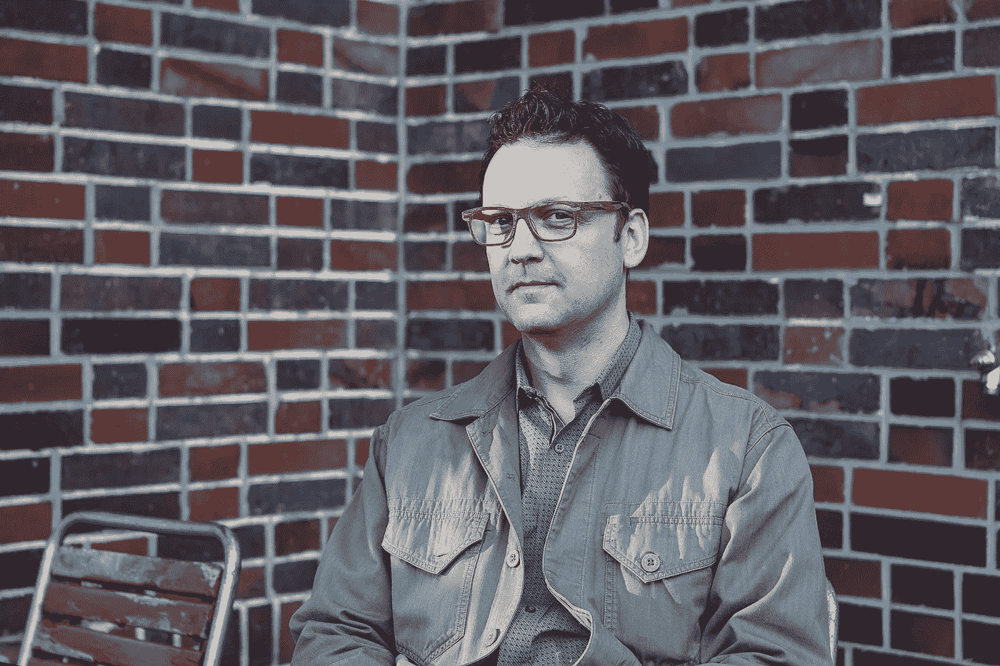
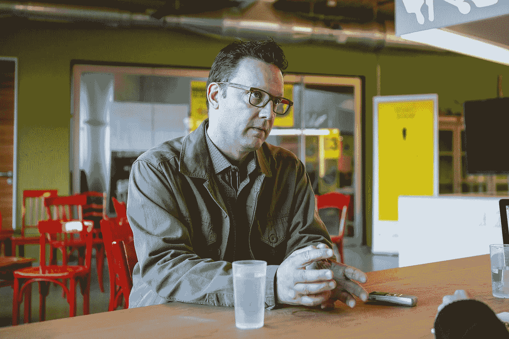
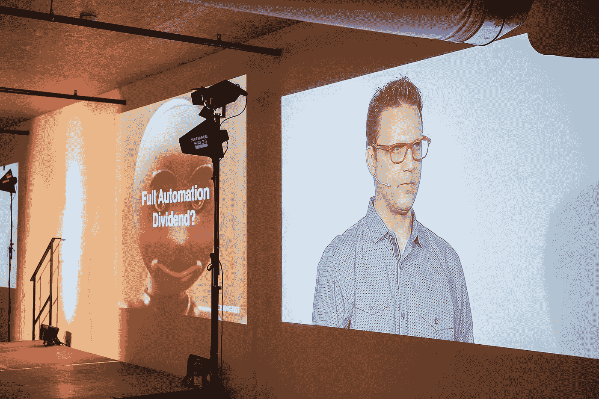
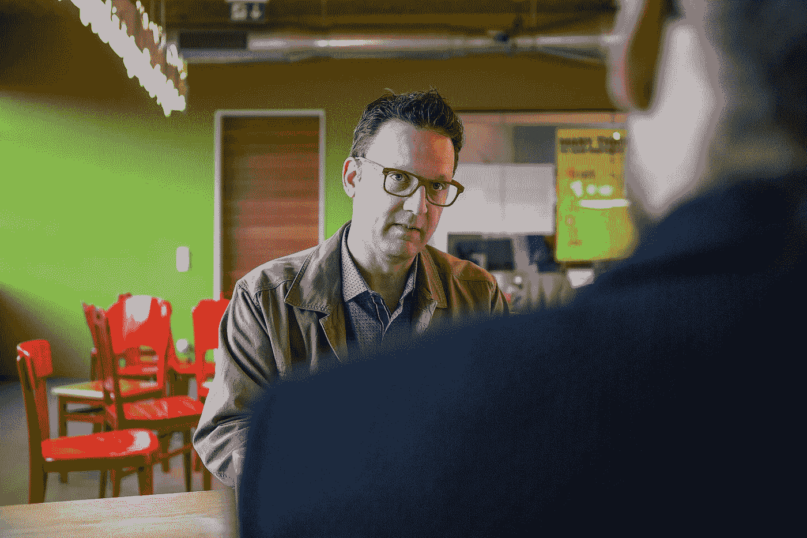

# 未来学家斯科特·史密斯:下一个优步将是一家生物技术公司。

> 原文：<https://medium.com/hackernoon/futurist-scott-smith-the-next-uber-is-going-to-be-a-biotech-company-b2510e7b164a>

«I rarely smile on photos», Smith says. He’s more of a sceptical nature. (Photo by [Nils Fisch](http://www.nilsfisch.com))

人们对名称中带有创新字样的会议有种感觉。每个人都直呼其名，熨烫过的衬衫正与帽衫结合在一起，至少有一个舞台上有一张老式沙发。所有这些都有助于激励和吸引来自世界各地的年轻企业家和研究人员走到一起，谈论未来。在 10 月底，人们可以在 Lift Basel 上看到所有这些元素聚集在一起，这是一个初创公司和生命科学界的会议。

在 Lift Basel 举行的一次会议感觉奇怪地脱离了背景。虽然其他研讨会的主题是外科医生的超能力或啤酒解码，但这次研讨会讨论的是全球老龄化问题。这种人口现象如何挑战我们的社会，以及它创造了什么样的机会。其中，[美国未来学家和作家 Scott Smith](/@changeist) 谈到了可能的出路，感谢听众在周五下午听我谈论死亡。后来，我们和斯科特坐在一个摆满红色椅子的房间里。

**Scott Smith，在电梯巴塞尔，你被介绍为一个旅行的未来主义者。那听起来像是一份不错的工作。**

这是一份有趣的工作，但给我打电话是一件奇怪的事情。我所做的是帮助组织理解复杂的未来，理解其中涉及的内容以及这些组织应该做哪些不同的事情。这需要几样东西。一个是你走出去看看这个世界。你可以看到世界上有趣的部分正在发生变化。你会看到新技术、新产品、新体验，但你也会看到人。我做的很多工作都是旅行。这样，我可以了解世界各地新的社会行为。

所以基本上你在世界各地游荡，想知道？

我的工作建立在好奇心和深入研究的基础上，但人的因素也很重要。去参加几个大型电子展或大型互联网会议，然后结束是很容易的。但我想看看世界是如何真正吸收这些新的未来和技术的。对我来说，这意味着四处走动，看许多不同的东西，和许多不同的人交谈。

你最近真正感到惊讶的事情是什么？

刚从新加坡回来第一次。这是一个非常未来的地方。这个社会似乎是一种方式。政府是另一种方式。那很有趣。

**现在，我需要使用什么样的小工具或技术才能走在前沿？**

真正的问题是什么是现在的前沿，什么对未来是有趣和重要的。我们可以谈论最新一代的 iPhone 或者 Oculus Rift 或者其他我们可以购买的东西。通常，我更感兴趣的是那些你不能从苹果商店买到的东西。但是十年后，你的后院可能会有一个，因为它是 T2 技术中非常重要的一部分。我们谈论了很多关于 3D 打印的话题。更有趣的是生物 3D 打印。怎样才能把细胞长成肉？我经常关注那些你几乎很难接触到的技术，因为有时它们只存在于纸面上。

**要预测未来，哪种技能更重要:是丰富的想象力，还是对现在进行合理的分析？**

最重要的技能是平衡这两者。仅仅从幻想的角度来思考并描绘出某种我们想要生活的科幻世界是不够的。你必须在可能和真实之间找到平衡。有必要用一些有根据的数据来证明这种创造性。

**总有炒作的时候。目前是** [**物联网**](https://en.wikipedia.org/wiki/Internet_of_Things) **或者自动驾驶汽车。你如何避免被它冲昏头脑？**

通过培养对什么是炒作，什么不是炒作的良好意识。通过不断问好问题和深入挖掘。某项创新可能会面临哪些障碍？什么会出错？可能会有什么意想不到的后果？

«I don’t care too much about gadgets. Technologies that exist only on paper are more interesting to me.» (Photo by [Nils Fisch](http://www.nilsfisch.com))

你认为自己是一个乐观的人吗？

大多数认识我的人可能都不会用这个词。就我个人而言，我认为自己充满希望，但也很现实。如果你过于乐观，过于关注可能发生的惊人的事情，你往往会忘记下面的关键因素。我试图在我们可以改善我们周围的世界的基础上继续前进，我们可以为人们创造积极的未来，不是通过做一个单一的预测，而是通过寻求社会上充分的可持续方式来改善世界。

当你总是在想什么可能出错时，这是否会让你变得更加警惕。

有时它肯定会让你头疼。显然，你可以想到世界上许多令人沮丧的问题。我们必须面对巨大的挑战。例如，你可以看着气候变化，然后放弃。这和做外科医生没什么不同。没有人想切开某人，取出一个器官或做手术，但从长远来看，你这样做是为了改善人们的生活。你对不舒服的事情有了容忍度。不然你怎么学？

今天最成功的公司通常被认为是颠覆性的。你对这个学期很挑剔。这是为什么呢？

我不认为这是一个真正有意义的术语。关于创新，你也可以这么说。这到底意味着什么？没有两个人能达成一致。当然，商学院对颠覆有一个经典的定义，但与其说它是颠覆，不如说它是错位，它是置换。破坏是一个不必要的侵略性术语。如果你想进入一个新的市场，你不一定需要破坏它，而是需要为自己创造新的空间。破坏性意味着你要来摧毁现有的结构，如果这是真的，那么你必须问自己，为什么你需要摧毁它。基本上是个空泛的词。

**从进化的角度来看，颠覆是一件好事，不是吗？**

这可能就是创造这个术语的最初的经济学家的意思。它是关于从旧的做事方式进化到新的方式。我们当然不想生活在 19 世纪。但是这个词已经变得太容易让人集中注意力了。它为没有真正好计划的年轻公司提供了进入许可，唯一的想法是淘汰别人。通常，这并不是最明智的做法。相反，你可以合作或建立伙伴关系。

**你为什么要为语义学烦恼呢？**

正如政治家每天向我们展示的那样，语言是一种强大的东西。让人们对他们的意思负责是很重要的。你可以谈论开始一项颠覆性的业务，但实际上，你可能做不出任何有价值或有用的事情。它变成了一个理由，说哦，这是颠覆，这是创新，别管我。我们看到我们周围世界的创新实际上是消极的，或者可能产生消极的后果，优步就是一个典型的例子。人们说:让优步创新，扰乱交通系统。另一方面，我们要问自己，为什么我们还要有法律法规。

> 语义的确很重要，因为它们会造成两极分化。

在巴塞尔，我们很快就要投票表决一项规范出租车市场的新法律，关于禁止像优步这样的服务，已经有了激烈的讨论。每个人看起来都很无助。

这正是问题所在，也是语义之所以重要的原因，因为它们造成了两极分化。可笑的是，我们竟然在谈论非此即彼的情况，谈论要么拥有优步，要么拥有出租车，两者之间什么都没有。太疯狂了。事实上，在优步出现之前，欧洲在发展端到端运输服务方面遥遥领先。这基本上是优步做的。他们将运动和移动转化为软件。但是他们可以在不违反现有出租车法规的情况下做到这一点。虽然这对他们的股东来说还不够快，但这是我们长期以来通过谈判达成一致的方式。下一个优步将是一家生物技术公司。现在，想想一家可能正在开发合成生物的生物技术公司的同样行为。现在是优步，但下一次它将是一项你希望有更多监管的技术。

**优步也经常被说成是共享经济的典范。在一次演讲中，你说分享经济商业模式如此成功有一个可悲的原因。**

Airbnb 的出现正值全球经济创造了一种局面，人们需要有人呆在家里，简单地说，是一种持家的方式。它在生活和住房成本难以控制的地方最为成功。他们从必需品中获益良多。租赁或出售不是分享，而是租赁和出售。如果你骑你的自行车向我收取 5 欧元，那不是你和我共用一辆自行车，而是你卖给我一辆骑你的自行车。回到语义上来:如果我和你分享的东西在社会上有意义，在情感上也有意义。这是一个重要的词，我们不应该只是垃圾电话销售共享。

**你有时被称为左翼分子吗？**

可能是这样，但不是故意的。我使用 Airbnb 大约 40 次，但我从未参加过可以被视为政治行为的优步。我对这些公司的观点是长期可持续性。它们可能是有用的服务，但如果它们将惠及许多人，那么它们需要以公平和公正的方式运作。如果这被理解为政治左派的特征，那是偶然的。

**您提到了长期可持续发展:为什么这对企业来说不太有吸引力？**

今天，我们的市场非常扭曲，风险资本和获得资金的愿望压倒了建立长期可持续业务的愿望。我说的是长期可持续的企业，因为你想让企业创造就业机会，你想让他们创造可持续的收入。我很高兴 Airbnb 和优步在这里，我希望他们在 50 年后还能在这里，但是要提供公共福利，提供工作，金钱，税收，以及维持社会运转的东西。

你认为这种做生意的方式有可能在不久的将来改变吗？

我认为这是一种抵制，许多地方的公众已经对他们看待做生意的方式感到不舒服。仅仅因为它已经从一群行为不端的银行和大公司转变为现在的初创公司和快速增长的破坏性公司，行为不端并不会使它变得更好。你现在就要做出决定，这些决定将在未来几十年里促进瑞士经济、欧洲经济和世界经济的发展。我们不需要只是注入更多的糖和咖啡因，刺激经济，然后让它再次崩溃。

[**特斯拉最近发布了所谓的自动驾驶**](http://www.wired.com/2015/10/tesla-self-driving-over-air-update-live/) **这意味着人们已经可以将部分驾驶任务留给他们的汽车。现在，我仍然没有驾驶执照，你认为值得努力去做吗？还是我应该等待自动驾驶汽车成为主流？**

你有 8 万欧元吗？

一旦它变得更普遍，它会变得更便宜。

有可能，但这需要一段时间。所以我的问题是:你想等那么久吗？还是有其他的方法可以绕过去？我住在荷兰，在那里骑自行车是一种替代交通系统，适合很多人。让我惊讶的是，你怎么能运行三个并行的交通系统，火车、汽车和自行车。我不明白为什么我们要彻底摧毁整个移动系统，为自动驾驶汽车腾出空间。把长途货运卡车车队换成自动卡车，这种事情很有意义。私人自动驾驶汽车？没问题，但是不会有充满他们的城市。要改变这一点需要付出太多。

> 如果詹姆斯·迪恩驾驶一辆带自动驾驶功能的特斯拉 s，‹Rebel 会变成什么样？

虽然这是一个令人毛骨悚然的想法，但有汽车自己四处游荡。

一百年前，人们开着汽油动力箱到处跑是一种令人毛骨悚然的想法。这将需要我们彻底重新思考如何看待移动性。就街道而言，我们的孩子将生活在一个非常不同的世界。我们理所当然地认为是 21 世纪文化的一部分的许多东西，都是围绕使用汽油的汽车建立的。想想所有标志性的电影。如果詹姆斯·迪恩开着一辆带自动驾驶功能的特斯拉 S，会是什么样的无因叛逆？过去 100 年的城市设计大多是由汽车推动的。我们如何生活，住在哪里，完全取决于我们为了满足对汽车的需求而建造的道路，而汽车又会满足对橡胶、玻璃和石油的需求。整个供应链都在变化。

**自动驾驶汽车是一回事，** [**全自动化又是另一回事**](http://www.theguardian.com/business/2015/nov/07/artificial-intelligence-homo-sapiens-split-handful-gods?CMP=fb_gu) **。如果你把它和你在台上谈到的全球老龄化问题结合起来，我们就有了一个全新的问题。这个星球上将会有更多的人，同时，更多的工作将由机器来完成。我们还能做什么？**

去照顾老人(笑)。如果你相信——我不确定我是否相信——我们将在未来 20 到 40 年用机器人取代一半的劳动力，这里面蕴含着巨大的问题。人们工作是为了满足感，他们工作是为了技能，他们工作是因为社会要求他们纳税来支持事物。我们努力照顾自己和家人。我们必须重新思考这将如何发生。它需要一定数量的人工作并向系统中支付工资来维持其他人的生活。在失业率高达 20%或 30%的情况下，祝你好运。经济衰退后，西班牙现在的失业率为 25%。并不是每个人都回去学习在线课程并获得博士学位。总而言之:这里涉及到主要的经济壁垒。

那些是天然屏障吗？还是我们必须通过制定法规和作为消费者做出决定来建立这些壁垒？

我们现在正处于一个时间点，我们必须问自己一些关于流动性、收入、工作、健康和气候的真正重大的问题。这些问题的答案可能是资本主义的，也可能是社会主义的和基于社区的。我们必须找到这些问题的答案，不能不重新评估它的意义就直接进入那些情况。否则，这个系统会找到新的平衡点来取代人们，这就是我们遇到问题的地方。人们会指指点点地说，等等，你没有告诉我，拥有自动化的生活方式意味着没有收入，住在盒子里。

Scott Smith does not only think and write about the future, he also is a much sought-after speaker at conferences around the world. (Photo by [Nils Fisch](http://www.nilsfisch.com))

当你思考或写作新技术时，你常常在乌托邦和反乌托邦之间徘徊。

我们不都是吗？

**你是如何保持平衡的？**

做这项工作的一个方法是对未来非常确定，并试图说服人们去做。有一些值得尊敬的专业人士做我做的事情，但他们将自己定位为支持不同的技术，作为一个倡导者。他们的工作是围绕说服其他人这些未来会发生。我敢打赌，你和我可能会对我们的未来有不同的看法。可能有共同的地方，但有些事情可能有点不同。从我的角度来看，更有用的是给你工具来决定你的想法，然后让我说服你接受我的观点，把未来强加给你。这个世界是一个非常混乱和复杂的地方，有 70 亿混乱和复杂的人四处游荡，他们都有不同的需求。

我从事的新闻业是一个快速发展的市场，因此竞争越来越激烈。你建议我掌握什么技能来保持领先地位？

如果你在几年前问某人这个问题，答案可能是数据新闻，乐于收集和可视化数据和信息。我倾向于认为，讲好故事，知道在正确的时间和地点插入故事并带给人们仍然是一项关键技能。对我来说，能够讲述有趣、真实的故事，而不被浏览量和点击诱饵所困扰，仍然是非常必要的。人们总是看重深度和质量。

**在你的一篇博文中，你写了关于** [**技术阅读、理解并对我们的情绪做出反应**](http://www.changeist.com/changeism/2014/12/4/emotion-and-the-internet-of-things) **。我要多久才能让我的电脑为我做这样的采访？**

如果你把正确的部分组合在一起，你可能现在就能做到。有一家公司出售编写简单的体育和市场故事的软件。他们发展得相当快，刚刚把他们的代码作为开源发布，这样人们就可以实现它了。这将会砍掉很多底层的、入门级的新闻业。但问题是，计算机能不能感知到和你感知到的一样的东西，以你的方式改变讨论，以你的方式阅读互动？我不认为那是真的。即使技术变得更加复杂，也并不意味着它可以使用和你同样水平的直觉。长期的经验和技能很难被技术所取代。

> 长期的经验和技能很难被技术所取代。

面试有一个纯粹的功能方面，那就是让问题得到回答。但是还有一个社交方面，那就是和某人见面并进行一次有趣的谈话。为什么我要把有趣的部分留给我的电脑？

编辑可能会做出经济上的决定，因为这样更便宜。但随着时间的推移，这将会改变并降低工作质量。我们有算法可以识别和复制我们认为是美丽的艺术。我刚刚为《连线》杂志写了一篇关于这个的文章[。我们什么时候才能知道这部获奖小说不是人类写的？我们可能没有注意到这一点，因为作为消费者，我们被训练成那种有点小故障、有点奇怪的机器写单词和构建故事的方式。尽管如此，我还是想问你对这个城市了解多少，而不是去问电脑。](http://www.wired.co.uk/magazine/archive/2015/10/ideas-bank/what-if-a-robot-wins-the-booker)

**从机器人变回人类:你称全球老龄化为人口定时炸弹。这是不是有点过分了？**

我更多的是把它当成一种谜题。人口统计学不会说谎，你无法从根本上快速改变这些数字。原因是，中国刚刚改变了独生子女政策，因为他们不能再假装这不会损害他们社会的长期可持续性。美国已经有不可持续的国内生产总值用于支持老年人的医疗支出。美国还没有显著的老年人口，但这已经是一个可能使国家经济破产的问题。这就是为什么美国共和党人要求我们削减其他服务来维持支出。我们必须重新思考我们的生活方式。如果你不想要医疗保健，那么你必须更健康。这是一个非常棘手的问题，很难找出答案。

它在我们的生活中无处不在。

这些东西被称为海啸，因为你可以看到几十年后的人口变化。战后，出现了一个婴儿潮，这意味着人口统计中将会出现泡沫。这可能帮助我们度过了 20 世纪，但现在它正在成为一个问题。这将对你我未来 40 年的生活方式产生巨大的物质影响。当我们 60、70 岁的时候，我向你保证，我们会回顾这段对话，并认为，嗯，我想这是一个大问题。如果你所在地区的所有人都变老了，需要护理，你还能获得医疗保健吗？谁来照顾你？你打算怎么支付？

我们非常善于忽略这一点，因为这让我们害怕。在您的演讲中，您再次谈到了 15 万亿美元的市场潜力。这应该够动力了吧？

我希望我们不要陷入这样一种境地:我们只从纯粹的市场角度考虑社会问题。因为如果我们这样做了，就意味着有些人得到了某些东西，有些人没有。幸运的是，大多数国家不会仅仅因为支付能力而拒绝提供救命的治疗。可悲的是，美国做到了。这对社会的构建方式没有好处，因为最终它会让不同群体的人相互对立。

**在另一个小组中，你和一群其他人谈论到** [**美国作为一个潜在的榜样**](http://liftconference.com/lift-basel-15/workshops/moving-fast-old-europe) **为一个创新的、企业家友好的文化。与此同时，美国在不平等方面面临着许多非常严重的问题。有像硅谷那样所有的钱都集中在一起的集群，同时，也有像底特律这样的大城市，那里的一些人甚至在家里没有自来水。为什么我们要在欧洲或瑞士建立这样的系统？**

一件好事是去掉好的部分，留下坏的部分。但是你也必须意识到它们之间有联系。作为一种文化，美国并没有像其他大多数文化那样建立起来。这是一个有着人造文化的人造国家。它是作为民主以及重商主义和市场的实验而创立的。在这种历史背景下，你不能指望最终会有一个平衡和完全平等的社会。那只是经济学，不是政治声明。但是双方都有可以互相借鉴的地方。美国可以释放自身固有的社区关怀和社会凝聚力。虽然欧洲可能会从这种心态中受益，即可以自由地做事情，而不必过多地回顾传统的等级制度和体系。对我来说，这一切都可以归结为历史，这就是这两种截然不同的心态的来源。然而，这是一场危险的讨论，因为它陷入了大范围的泛化。

你最近搬回了欧洲，因为你觉得你必须继续前进，就像你昨天在演讲中说的那样。你觉得你在这里能学到什么？

如果你想了解一些我在专业上感兴趣的话题，比如综合运输系统或某些种类的可再生能源发电，那么你需要以一种紧密结合的方式来看待它们。否则，你无法理解它们是如何协同工作的。此外，我发现生活在其他政治和社会环境中以更好地理解它们是很重要的。如果我想思考像现在正在发生的移民和难民这样的问题，我能得到的最接近的东西就是我的电视，这对于我的兴趣来说还不够近。在欧洲，我可以在汉堡的火车上下车，基本上是和刚刚抵达的叙利亚难民坐在同一节车厢里。我的职业兴趣和好奇心要求亲身体验。为了能够思考它在未来五年或十年将如何影响我们的社会，我需要这种直接的互动，而不是简单地将其视为一份政策文件或新闻报道。

你为什么选择住在阿姆斯特丹？

在荷兰，大学里有一些非常有趣的研究，阿姆斯特丹和乌得勒支有一些有趣的研究机构。

> 开放交流是你学习的方式，无论是你的基因库、经济学、软件开发还是创造力。

**你能想出一门只有在瑞士才能学到的课程吗？**

可能有很多。我甚至无法想象我能在这里学到什么。例如，我听到很多关于教育系统是如何组织的，以及它如何比大多数其他国家培养出更多受过高等教育的人。我想知道这与商业和社会有什么联系。这里也有很多有趣的生物技术工作。而且有很多国际合作。去年，我在欧洲核子研究中心，作为一个科学研究的模型，它很吸引人，因为它没有完全私有化，坐落在某个商业园区。瑞士不得不改善其作为一个联邦体系的内部运作方式，以及对外与许多其他国家的合作方式，以取得进步。

**正是这种开放性受到了猛烈的政治攻击。现在正在实施的一些法律将我们与欧洲和世界其他地区隔离开来。**

很多地方都在发生这种情况。我们有两三个美国总统候选人谈论在边境建墙。加泰罗尼亚想要脱离西班牙，北部想要脱离英国南部，苏格兰想要脱离所有人。这些想法是我们五年前经历的资源紧缩的结果。我认为这也是针对全球化更消极方面的举措，这是可以理解的。但这也关闭了未来的可能性。开放交流是你学习的方式，无论是你的基因库、经济学、软件开发还是创造力。

«I just want us to keep asking the right questions even though we’re evolving rapidly», Scott Smith says. (Photo by [Nils Fisch](http://www.nilsfisch.com))

我们谈了很多你怀疑的未来。有没有一个领域可以让我们在未来前进而不会遇到一些问题？

我不想让人觉得我对一切都过度怀疑。我们正处在一个一切都在快速发展的时间点上。我只是想让我们继续问正确的问题，即使我们在快速进化。例如，食品行业发生了一些非常有趣的事情。有些人已经在谈论一场食物革命，无论是创造一种新的蛋白质，还是着眼于用更少的资源养活更多的人。像 [Soylent](http://www.theverge.com/2014/7/17/5893221/soylent-survivor-one-month-living-on-lab-made-liquid-nourishment) 这样的东西。我不会喝它，但我不认为它本身过于危险。这是思考如何让更多人获得营养的一种方式。事实上，在过去的几周里，一种新的 Soylent 克隆产品已经在印度上市。我们确实需要一种易于生产、高营养的食品，你可以把它提供给那些不能正常获得食物的人。

【Soylent 这个名字来源于七十年代的一部科幻电影****。有没有想过写科幻小说？****

**我不仅思考过，还做过实验。有时候，我的工作需要写虚构的故事。我今年夏天做了一些剧本创作，包括写四个虚构的故事。我经常与科幻作家、艺术家和设计师合作，寻找新的方式来交流未来的风险和机遇。如果我现在可以停止工作，我可能会写一些小说。**

****会更乌托邦还是反乌托邦？****

**我会说都不是。我对感觉近乎真实的东西感兴趣，所以你没必要把它们当成小说。而对于更梦幻的作品，很容易就把它们简单地当成幻想作品而置之不理。**

**如果你想传达一个信息，故事的发展会产生巨大的影响。**

**从心理学上来说，我可能会写一些更难理解的东西。不是为了吓唬人，而是让他们理解事情的含义。我自然会担心那些没有要求我们建设性地批判和提问的过于积极的故事。这些问题有望带来更积极乐观的结果。**

**Scott，谢谢你仍然让我们保持乐观的心态。**

> **这篇采访首次出现在位于巴塞尔的瑞士在线杂志 TagesWoche 上。**

************

> **[黑客中午](http://bit.ly/Hackernoon)是黑客如何开始他们的下午。我们是 [@AMI](http://bit.ly/atAMIatAMI) 家庭的一员。我们现在[接受投稿](http://bit.ly/hackernoonsubmission)并乐意[讨论广告&赞助](mailto:partners@amipublications.com)机会。**
> 
> **如果你喜欢这个故事，我们推荐你阅读我们的[最新科技故事](http://bit.ly/hackernoonlatestt)和[趋势科技故事](https://hackernoon.com/trending)。直到下一次，不要把世界的现实想当然！**

****