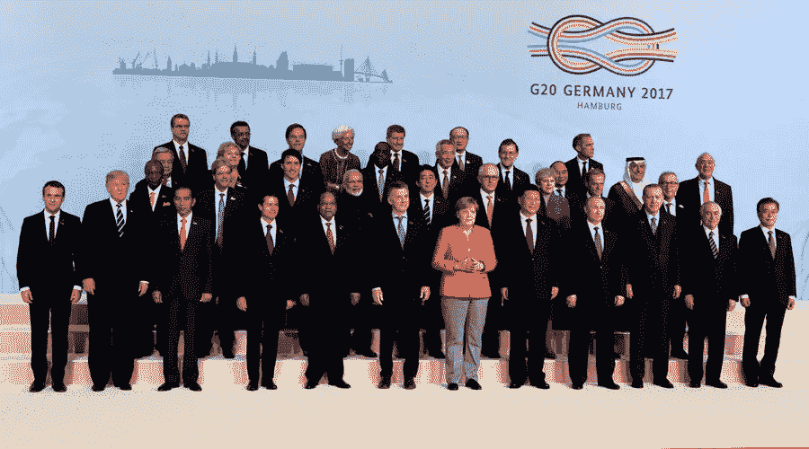

# G20 誓言与科技集团合作打击恐怖主义

> 原文：<https://medium.com/hackernoon/g20-vows-to-work-with-tech-groups-to-fight-terrorism-47250e1dfc4f>

## **重点打击助长恐怖主义的激进化和为恐怖主义目的使用互联网。**

在德国汉堡举行的 20 国集团峰会上，20 个最工业化国家的领导人发誓要与硅谷和科技公司合作，打击恐怖分子的网上宣传，并在互联网上放大积极的声音。

“我们的反恐行动必须继续成为综合方案的一部分，包括打击激进化和招募，阻碍恐怖主义运动和反击恐怖主义宣传，” [G20 声明称。](http://europa.eu/rapid/press-release_STATEMENT-17-1955_en.htm)

“我们将交流预防和打击恐怖主义和有利于恐怖主义的暴力极端主义的最佳做法，国家战略和去激进化及脱离接触计划，以及促进战略沟通和强有力的积极叙事，以打击恐怖主义宣传。”

二十国集团领导人强调，必须全面解决恐怖分子利用的潜在条件，促进政治和宗教宽容、经济发展、社会凝聚力和包容性，以解决武装冲突，并促进重返社会。

分享信息和最佳实践是关键:“我们将分享有关具体措施的知识，以应对来自回国的外国恐怖主义战斗人员和本土激进分子的威胁。我们还将分享去激进化和重返社会方案的最佳做法，包括针对囚犯的最佳做法。”

在充分尊重人权的同时，私营部门的作用也是打击利用互联网和社交媒体从事恐怖主义活动的关键，如宣传、资助和策划恐怖主义行为、煽动恐怖主义、煽动和招募恐怖主义行为。

“在这方面，适当过滤、检测和删除煽动恐怖主义行为的内容至关重要，”声明写道。

20 国集团领导人鼓励科技行业“继续投资于技术和人力资本，以帮助检测以及迅速和永久地删除恐怖主义内容。”

他们补充说:“根据我们人民的期望，我们还鼓励与行业合作，在保护国家安全免受恐怖主义威胁所必需的情况下，提供合法和非任意的可用信息。”

> 我们申明，法治在网上和网下都适用。

今年 5 月，G7 领导人还呼吁科技行业加大打击网络恐怖主义的力度。

在西西里岛陶尔米纳举行的 G7 峰会的第一天，G7 发表了一份关于打击恐怖主义和暴力极端主义的联合声明，声明称:“尽管互联网是过去几十年中最重要的技术成就之一，但它也已被证明是恐怖主义的强大工具。”。

 [## G7 呼吁科技集团打击网络恐怖主义

### G7 领导人于 5 月 26 日至 27 日齐聚意大利陶尔米纳，参加 2017 年 G7 峰会。

hackernoon.com](https://hackernoon.com/g7-calls-for-tech-groups-to-fight-terrorism-online-34bf99cbdcc8) 

> 我们鼓励行业采取紧急行动，开发和分享新技术和工具，以改善对煽动暴力内容的自动检测，我们承诺支持行业在这方面的努力，包括拟议的行业牵头的打击网上极端主义论坛。

 [## 七国集团关于打击恐怖主义和暴力极端主义的声明

### 在意大利举行的七国集团首脑会议上，七国集团领导人“以最强烈的措辞谴责一切形式的恐怖主义和……

medium.com](/g7inus/g7-statement-on-the-fight-against-terrorism-and-violent-extremism-de53d1da862b) 

七国集团领导人强调需要“支持促进植根于我们共同价值观的替代性和积极的叙事，并适当尊重言论自由的原则。”