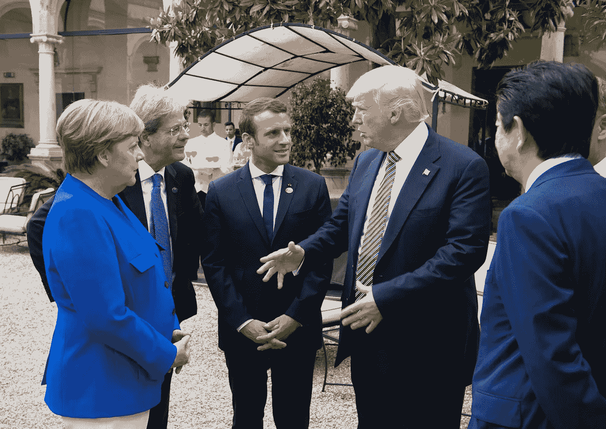
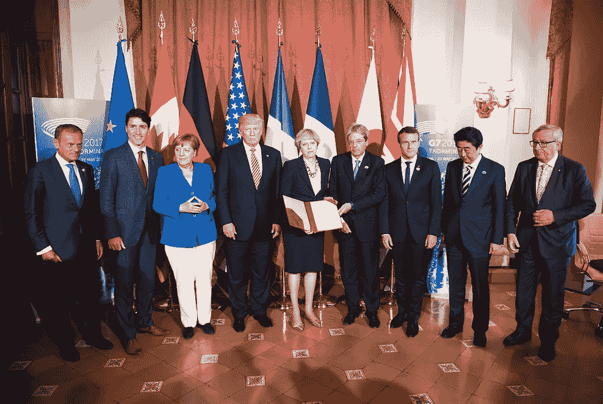
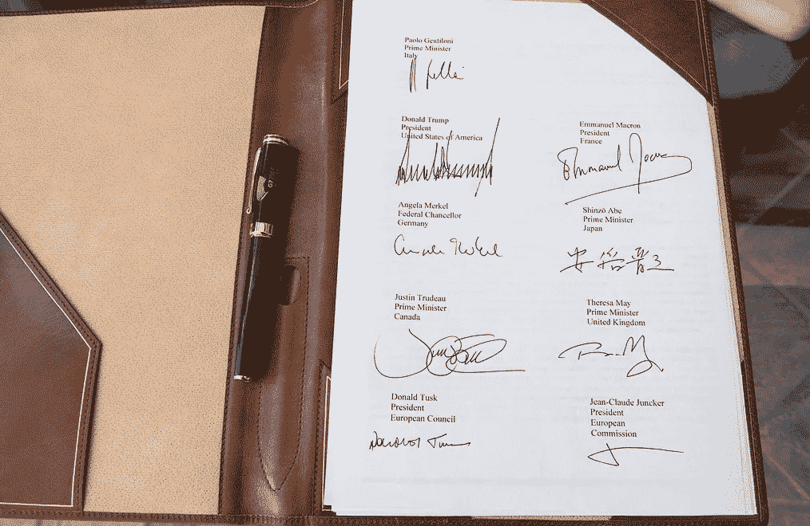
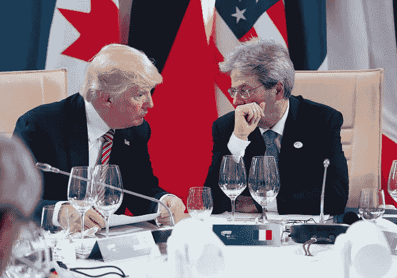
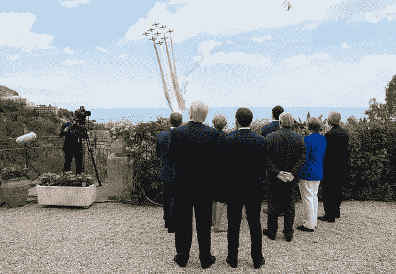
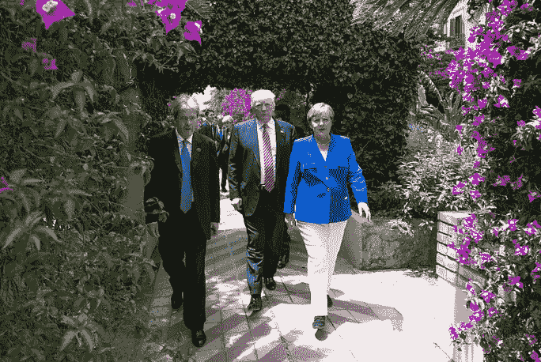
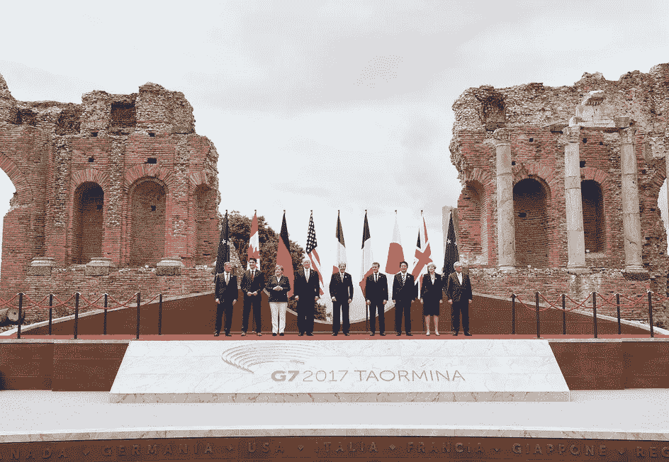
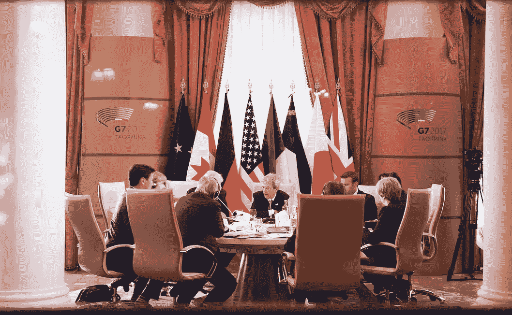

# G7 呼吁科技集团打击网络恐怖主义

> 原文：<https://medium.com/hackernoon/g7-calls-for-tech-groups-to-fight-terrorism-online-34bf99cbdcc8>

From the left: Angela Merkel of Germany; Paolo Gentiloni of Italy; [Emmanuel Macron](https://medium.com/u/bb9cecbbf08d?source=post_page-----34bf99cbdcc8--------------------------------) of France; Donald Trump of the United States; Shinzo Abe of Japan (Taormina, May 26, 2017 — credits: Office of the Prime Minister of Italy)

## G7 领导人于 5 月 26 日至 27 日齐聚意大利陶尔米纳，参加 2017 年 G7 峰会。

在西西里岛陶尔米纳(Taormina)举行的 G7 峰会第一天，G7 发表了一份关于打击恐怖主义和暴力极端主义的联合声明，声明称:“尽管互联网是过去几十年最重要的技术成就之一，但它也被证明是实现恐怖主义目的的强大工具。”。

(Taormina, May 26, 2017 — credits: Office of the Prime Minister of Italy)

G7 领导人——加拿大总理贾斯廷·特鲁多；[埃马纽埃尔·马克龙](https://medium.com/u/bb9cecbbf08d?source=post_page-----34bf99cbdcc8--------------------------------)法兰西；德国的安格拉·默克尔；意大利的保罗·真蒂洛尼；日本的安倍晋三；联合王国的特里萨·梅；美国的唐纳德·特朗普；欧盟委员会[的让-克洛德·容克](https://medium.com/u/960f4c0ad987?source=post_page-----34bf99cbdcc8--------------------------------)和欧盟理事会的姜懿翔·图斯克——呼吁科技集团和社交媒体平台“大力应对恐怖主义内容”

> 我们鼓励行业采取紧急行动，开发和分享新技术和工具，以改善对煽动暴力内容的自动检测，我们承诺支持行业在这方面的努力，包括拟议的行业牵头的打击网上极端主义论坛。

 [## 七国集团关于打击恐怖主义和暴力极端主义的声明

### 在意大利举行的七国集团首脑会议上，七国集团领导人“以最强烈的措辞谴责一切形式的恐怖主义和……

medium.com](/g7inus/g7-statement-on-the-fight-against-terrorism-and-violent-extremism-de53d1da862b) 

七国集团领导人强调需要“支持促进植根于我们共同价值观的替代性和积极的叙事，并适当尊重言论自由的原则。”

他们说，打击宣传是打击恐怖主义和暴力极端主义、极端分子在线招募以及激进化和煽动暴力的关键。

领导人同意增加与民间社会、青年和宗教领袖、拘留设施和教育机构的接触。他们还决定责成七国集团国家的内政部长“尽快举行会议，重点讨论以下承诺的执行情况，并与私营部门和民间社会共同努力击败恐怖主义。”

3 月，来自 68 个国家的代表聚集在 DC，参加由国务卿雷克斯·蒂勒森和美国国务院 T4 主办的打击 ISIS 全球联盟部长级会议。打击网上极端主义和恐怖主义是议程上的优先事项。

国务卿蒂尔森在联盟会议的开场白中强调了社交媒体在反击恐怖主义信息和打击 ISIS 中的作用。他强调了与硅谷的合作如何在一年内将 ISIS 在线内容减少了 75%。

蒂尔森说:“我们都应该深化与科技行业的合作，防止加密技术成为极端分子合作的工具。”。

他补充说:“我们需要全球科技行业在这场斗争中取得新的进展，我们感谢那些已经对这一挑战做出回应的公司。我们必须利用数据分析和算法技术的强大进步来构建发现 ISIS 宣传和识别迫在眉睫的攻击的工具。"

> [黑客中午](http://bit.ly/Hackernoon)是黑客如何开始他们的下午。我们是 [@AMI](http://bit.ly/atAMIatAMI) 家庭的一员。我们现在[接受投稿](http://bit.ly/hackernoonsubmission)并乐意[讨论广告&赞助](mailto:partners@amipublications.com)机会。
> 
> 如果你喜欢这个故事，我们推荐你阅读我们的[最新科技故事](http://bit.ly/hackernoonlatestt)和[趋势科技故事](https://hackernoon.com/trending)。直到下一次，不要把世界的现实想当然！

