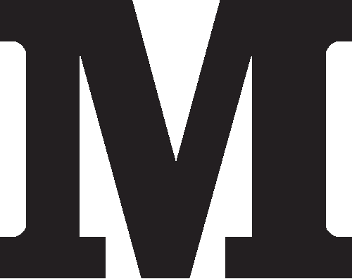
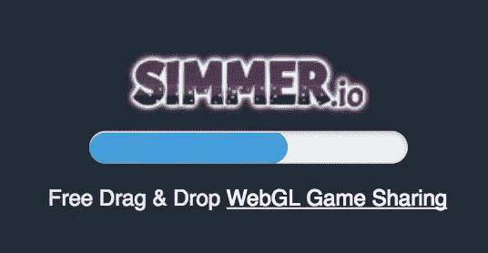
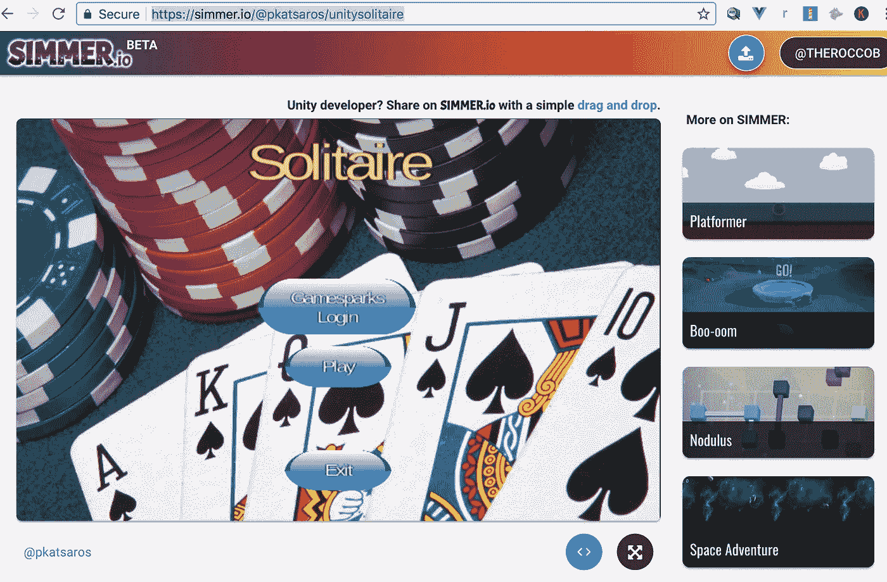
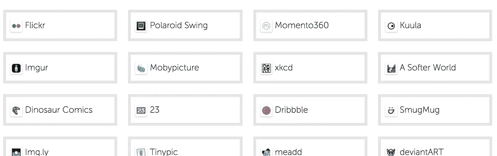

# 借助 OEmbed 为您的 web 应用赢得宝贵的吸引力

> 原文：<https://medium.com/hackernoon/gain-traction-for-your-website-with-oembed-508a8ea3c9ab>


您可以使用 OEmbed 的一个实现创建几十个到其他 web 应用程序的集成。

## o 嵌入引物

那是什么呢？如果你是一个中型作家，你曾经在一篇文章中粘贴了一个 youtube 链接(就像[https://www.youtube.com/watch?v=dQw4w9WgXcQ](https://www.youtube.com/watch?v=dQw4w9WgXcQ))，它会扩展成一个完整的视频，就像这样:

或者如果我粘贴一个 ted 的页面([https://www . TED . com/talks/Susan _ black more _ on _ memes _ and _ temes](https://www.ted.com/talks/susan_blackmore_on_memes_and_temes))，TED 自己的视频播放器就会出现:

但你知道 OEmbed 支持丰富的内容(甚至像 3D 和全视频游戏一样丰富)吗？基本上，使用 OEmbed，你可以用任何东西填充一个响应 iFrame。

## 何必呢？

我经营着一个分享 Unity WebGL 游戏的网站，名为[smelle . io](https://simmer.io)。该网站的技术相当可靠——分享了他们游戏的早期用户告诉我，上传的便捷性让 smelle 比类似的游戏网站更具竞争优势。

但是尽管我不愿意承认，好的技术只是问题的一半。如果未来的游戏开发者不知道这个网站，他们怎么能在那里上传他们的游戏呢？

因此，由于缺乏营销预算，并且是一名程序员，我转向了 OEmbed。OEmbed 间接允许开发者分享游戏，不仅在 smeller 上，也在 Medium、Kickstarter 和 Patreon 等地方。



“Free” integrations w/ oEmbed

## 双赢

游戏开发者获得了附加值——能够在其他网站上直接分享他们的游戏，我得到了这个甜蜜的加载屏幕，反向链接到煨:



OEmbed 是为我的网站增加价值的东西之一，也将有助于通过向网络上独特的地方提供游戏来增加吸引力。

## 用例

煨的早期采用者之一，[Nodulus——开源益智游戏](https://hyperparticle.com/nodulus/)的开发者 [Dan Kondratyuk](/@hyperparticle) ,最近开始在他在 Medium 上编写的一个很棒的 Unity 教程中使用 OEmbed 特性:

[](/@hyperparticle/draw-2d-physics-shapes-in-unity3d-2e0ec634381c) [## 统一绘制 2D 物理图形

### 使用 Unity3D 用光标绘制物理图形的教程。

medium.com](/@hyperparticle/draw-2d-physics-shapes-in-unity3d-2e0ec634381c) 

我也可以看到写游戏的博客，希望在他们的网站上直接包括现场演示。

我正在招募开发者在 Kickstarter 上尝试这个功能，这样他们就可以在他们的 pledge 页面上放一个可玩的演示(类似于今天有多少人只是分享游戏视频)。这样，潜在的支持者将永远不会离开承诺页面，以获得一个真正的游戏正在建设的味道。([发微博给我](https://twitter.com/TheRoccoB)如果你知道谁想试试这个！)

## 技术勇气

因此，OEmbed 的完整规范可在 https://oembed.com/的[获得，但那篇文章有点枯燥，难以解析。它还提到了许多过时的 OEmbed 方法，如除了 JSON 之外还使用 XML，这在 2017 年完全没有必要。](https://oembed.com/)

让我们来看看我是如何使用这个来自煨接龙游戏实现 OEmbed 的。

[](https://simmer.io/@pkatsaros/unitysolitaire)

[https://simmer.io/@pkatsaros/unitysolitaire](https://simmer.io/@pkatsaros/unitysolitaire)

(需要完全澄清的是，游戏开发者不需要担心这些——这些都是通过即时可用的软件实现的)。

第一步是让 OEmbed 消费者(即。Medium，Kickstarter)“知道”该技术是为该页面实现的，这就像在我的纸牌页面的 HTML 中添加这一行一样简单:

```
<link rel="alternate" type="application/json+oembed" href="[https://simmer.io/oembed?url=https%3A%2F%2Fsimmer.io%2F%40pkatsaros%2Funitysolitaire](https://simmer.io/oembed?url=https%3A%2F%2Fsimmer.io%2F%40pkatsaros%2Funitysolitaire)" title="Solitaire | SIMMER.io">
```

这指向了我在 https://simmer.io/oembed?[的站点上的一个端点 URL = https % 3A % 2F % 2f simmer . io % 2F % 40 pkatsaros % 2 funitysolitaire](https://simmer.io/oembed?url=https%3A%2F%2Fsimmer.io%2F%40pkatsaros%2Funitysolitaire)。

该端点返回一个 json 结构

```
{
  "provider_url": "[https://simmer.io](https://simmer.io)",
  "provider_name": "SIMMER.io",
  "thumbnail_width": 960,
  "thumbnail_height": 600,
  "thumbnail_url": "[https://simmercdn.com/unity/nfeauO52WjVFbC84aP8HJqHS9FG3/content/ed3216da-7a17-cba0-f616-bd84b135f351/screens/3.png](https://simmercdn.com/unity/nfeauO52WjVFbC84aP8HJqHS9FG3/content/ed3216da-7a17-cba0-f616-bd84b135f351/screens/3.png)",
  "author_name": "pkatsaros",
  "title": "Solitaire | SIMMER.io",
  "html": "<iframe width='960' height='600' src=\"[https://c.simmer.io/static/unityFrame/index.html?url=https%3A%2F%2Fsimmercdn.com%2Funity%2FnfeauO52WjVFbC84aP8HJqHS9FG3%2Fcontent%2Fed3216da-7a17-cba0-f616-bd84b135f351&imagePath=screens/3.png\](https://c.simmer.io/static/unityFrame/index.html?url=https%3A%2F%2Fsimmercdn.com%2Funity%2FnfeauO52WjVFbC84aP8HJqHS9FG3%2Fcontent%2Fed3216da-7a17-cba0-f616-bd84b135f351&imagePath=screens/3.png\)">",
  "width": 960,
  "height": 600,
  "version": "1.0",
  "author_url": "[https://simmer.io/@pkatsaros](https://simmer.io/@pkatsaros)",
  "type": "rich"
}
```

这添加了一些关于嵌入的元数据，但最重要的是，创建了一个 html 片段:

```
<iframe width='960' height='600' src=\"[https://c.simmer.io/static/unityFrame/index.html?url=https%3A%2F%2Fsimmercdn.com%2Funity%2FnfeauO52WjVFbC84aP8HJqHS9FG3%2Fcontent%2Fed3216da-7a17-cba0-f616-bd84b135f351&imagePath=screens/3.png\](https://c.simmer.io/static/unityFrame/index.html?url=https%3A%2F%2Fsimmercdn.com%2Funity%2FnfeauO52WjVFbC84aP8HJqHS9FG3%2Fcontent%2Fed3216da-7a17-cba0-f616-bd84b135f351&imagePath=screens/3.png\)">
```

这就是魔力！当我们将 URL([https://simmer.io/@pkatsaros/unitysolitaire](https://simmer.io/@pkatsaros/unitysolitaire))粘贴到 Medium 中时，它会自动扩展到上面的 iFrame 中，我们现在得到这个:

Hint: this is a Unity game and only runs well on [desktop browsers](https://docs.unity3d.com/Manual/webgl-browsercompatibility.html) right now.

…差不多吧。还有一步。

## Embed.ly 和 IFramely

Embed.ly 是一个网站(实际上为 Medium 所有)，它提供“粘合剂”来帮助 Medium、Kickstarter 和 Patreon 等网站包含这些类型的嵌入。他们还充当一个简单的看门人，以确保内容不会过于突兀或错误百出。

[](https://embed.ly)

我不得不进去[填写一份申请](http://embed.ly/providers/new)以获得煨包括在内。我有一点担心，因为我没有实现 OEmbed 的“XML”版本，但谢天谢地，他们没有就此与我争论，我实际上在一两天内第一次尝试就被接受了。



[http://embed.ly/providers](http://embed.ly/providers)

Iframely 提供了类似的服务，尽管我认为他们有更自动的方法来接受 OEmbed 提供者。它们也为调试 OEmbed 提供了一个非常好的工具。

## wordpress 软件🙁

Wordpress 支持 OEmbed，但是[只能通过一个白名单](https://premium.wpmudev.org/blog/embedding-wordpress-oembed/)。这意味着你将获得 Youtube 和 Vimeo 等主要网站的自动扩展嵌入，但我必须贿赂一些人(哈哈，不是真的)才能让 smelle 作为 OEmbed 提供商被包括在内。


# 结论

这只花了我一天左右的时间来实现，我可以看到它帮助了许多寻找牵引力的初创公司。

希望您可以看到 OEmbed 的强大功能，以及通过实施它可以为您的客户带来的额外好处。我认为这给了开发者一个很好的理由来使用[而不是其他游戏网站。我得到了反向链接和更多的能见度，所以每个人都赢了。](https://simmer.io)

*如果你喜欢这篇文章，我会非常感谢一个*👏*或一个跟随在介质上。这给了我很多动力去继续写我正在做的很酷的东西。*