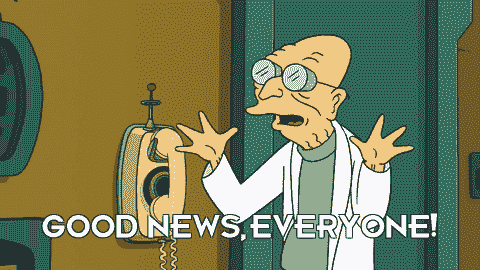

# 游戏机公开测试版明天就出来了

> 原文：<https://medium.com/hackernoon/game-machine-open-beta-version-is-out-tomorrow-9c6ebeb928d4>

我们很高兴地宣布，我们的应用程序的开放测试版推出。明天，11 月 1 日，它就要上市了。这是一个非常重要的发布，游戏机团队尽最大努力创造一个创新的，可行的和高质量的产品。

我们已经从封闭的测试版测试人员那里得到了很多反馈，这些反馈帮助我们解决了现有的问题，并使它成为一个近乎完美的产品。我们制造的东西:

*   改进了我们的官方网站。现在它既简单又时尚——你可以通过访问它来确定自己
*   修正了我们从测试人员那里收到报告的错误
*   在我们的列表中添加了新游戏。现在游戏玩家可以用 WoW、坦克世界、Dota2、CS:GO 等游戏进行交易；战舰世界
*   改进了采矿过程。现在只需点击一下就能工作了
*   创造你自己的代币的可能性
*   开始保留我们的社交网络(Vk、脸书、推特)

另外，游戏机 ICO 将于 11 月 29 日发售。因此，我们修改了我们的代币销售信息，并开始积极准备 ICO。我们编辑了我们的白皮书，发布了广告，为互联网媒体撰写了文章，并开始了我们自己的电报频道，以联系潜在的投资者和广告商。我们的应用已经得到了很多积极的反馈，这无疑是个好消息。

以下是 ICO 的一些附加信息:

*代币销售开始日期*:2017 年 12 月 7 日

*代币销售结束日期*:2018 年 1 月 21 日

*代币总供应量*:1.4 亿 GMIT

*奖金时间表* : **第一天+15%，第二天+10%，第三天+5%**

我们非常兴奋地向广大观众展示我们的项目，并希望它能满足您的期望。游戏机是我们的宝贝，作为父母，我们只想给它最好的。

要了解更多关于产品和代币销售的信息，请访问我们的官方网站:[https://gamemachine.io/en](https://gamemachine.io/en)。