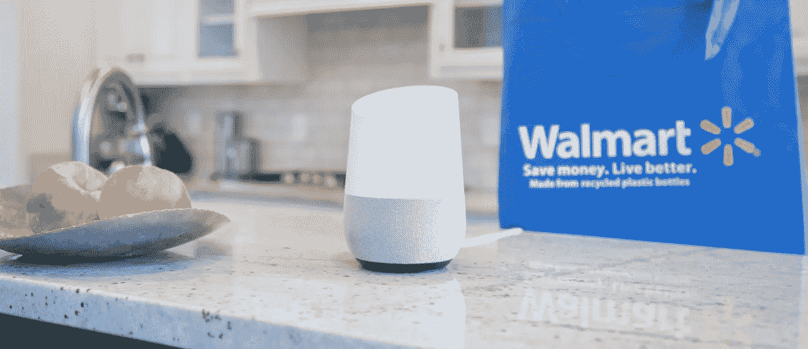
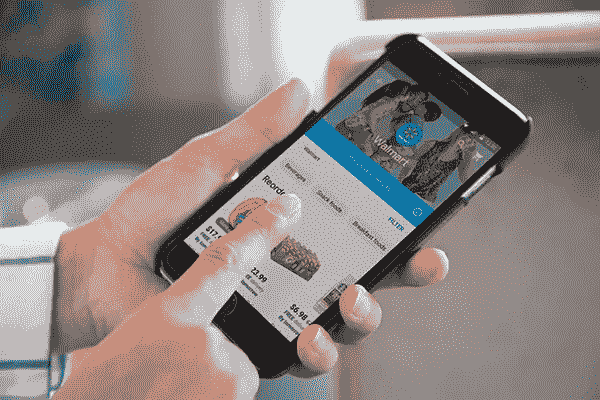
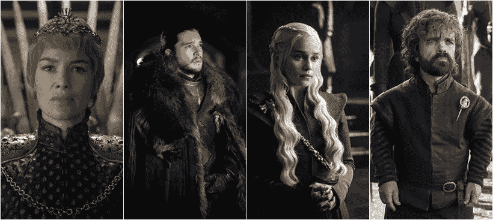

# 语音的电子商务游戏

> 原文：<https://medium.com/hackernoon/game-of-voice-72b98dce5b31>

《权力的游戏》商业版的另一集:沃尔玛和谷歌刚刚联手对抗亚马逊，争夺语音购物。没有血或龙(还)，但与大(大)钱的风险，这一现实世界的战争几乎像流行的小说系列一样迷人。

*(剧透提醒——如果你还没开始看 GoT 第七季就不要读了……)*

纵观历史(真实的和虚构的)，国家和皇室通过协议和婚姻结成联盟。**正如《权力的游戏》不断教导我们的，如果你想留在游戏中，联盟是关键**。提利昂·兰尼斯特温和地向丹妮莉丝·坦格利安(卡丽熙)解释道:即使你拥有几条龙和一支多斯拉克军团，你也不是夜王的对手。提利昂说服丹妮莉丝召唤琼恩·雪诺结盟。所以他写信给斯诺:

> **“只要瑟曦坐在铁王座上，七大王国就会流血。加入我们吧。我们可以一起结束她的暴政。我向你们呼吁，一个私生子对另一个私生子——因为所有的矮人在他们的父亲眼里都是私生子”。提利昂·兰尼斯特，女王之手**

今天早些时候，谷歌和沃尔玛宣布合作，通过谷歌的家用设备在沃尔玛进行语音购物。[来自谷歌的公告:](https://www.blog.google/products/assistant/shop-walmart-and-more-your-favorite-stores-faster/)

> **“我们正在与沃尔玛建立令人兴奋的** [**合作关系**](http://blog.walmart.com/innovation/20170823/walmart-google-partner-to-make-shopping-even-easier-heres-how) **为您带来沃尔玛每天低价销售的数十万种产品——从洗衣液到乐高积木——您可以在 Google Home 或 Google Express 网站或应用程序上通过语音与您的助手一起购买”。**

Source: Walmart

终于来点真正的行动了！

从九月下旬开始，成千上万的沃尔玛商品将可以通过谷歌助手进行语音购物。这应该允许沃尔玛(和谷歌)在超受欢迎的 Echo 设备上与亚马逊的 Alexa 能力竞争。

沃尔玛的马克·洛尔(前 Jet.com 首席执行官，现任 Walmart.com 总裁)在一篇博客文章中解释道:

> ***“我们与谷歌合作是有意义的。他们在自然语言处理和人工智能方面进行了大量投资，以提供强大的语音购物体验"***

Lore 在他的帖子中解释说，语音购物的主要用例之一将是能够建立一个以前购买的日常必需品的篮子。沃尔玛将他们的轻松再订购功能集成到 Google Express 中，这将使我们能够根据客户以前的购买行为，包括在沃尔玛商店和 Walmart.com 上的购买行为，提供高度个性化的购物建议。为了利用这种个性化，客户只需要将他们的沃尔玛账户链接到 Google Express。所以，如果你渴望得到你最喜欢的无糖花生酱，或者你刚用完超柔软的小狗卫生纸——你只需要说“好的，谷歌，我想要我的花生酱，我现在就要！”。2 天交货是免费的，更快的交货或取件选项也存在。

(Source: Walmart)

这只是一个地方性的倡议，还是一个严肃的联盟刚刚形成？我们可以在 Lore 文章的结尾找到线索:

> ***“而且，这仅仅是个开始。明年，我们还将利用我们在美国的 4，700 家商店和我们的履行网络，创造目前语音购物在其他任何地方都不存在的客户体验"***

在全球商战中，家用设备战线将是一个重要的战场。正如我在之前的一篇文章中所说的，在当前的大多数领域，赢家已经被宣布了——搜索、社交、普通电子商务。但技术已经达到了这样一个地步，即有可能在家里拥有一个真正的人工智能助理，它可以成为任何声音的管道:购物、搜索、交通甚至社交。我们的家园正在成为一个新的领域。

这一新举措意义重大，但尽管这一合作听起来很有吸引力，但我们不要太兴奋——谷歌和沃尔玛(尽管总市值接近 1 万亿美元)在这场斗争中仍然处于劣势。他们将面临强大的亚马逊的 Alexa 的激烈竞争——目前是市场领导者，预计占语音扬声器市场的 70%。

沃尔玛不打算整合到 Alexa 中。据 Techcrunch 报道，当被问及是否能从 Alexa 上买到沃尔玛时，Lore 简单地回答道:“不会。”

我们生活在一个复杂的商业世界。事情过去很简单，商业战争过去很直接，那时只是大型连锁超市让小型夫妻店倒闭。现在已经不那么明显了——谁是好人，谁是坏人？这个故事里的卡丽熙是谁，夜王是谁？技术和零售、线上和线下、硬件和软件的界限并不清晰，一个在哪里停止，另一个在哪里开始？

Cersei Lannister, Jon Snow, Daenerys Targaryen, Tyrion Lannister (Source: HBO) Google, Apple, Facebook, Amazon (Source: The Internet)

兰尼斯特，雪诺，坦格利安，龙，夜王。谷歌，亚马逊，脸书，苹果，微软，沃尔玛，阿里巴巴。每个人都在选择一方，挑选他们的武器和战斗，都在为即将到来的战争做准备。

所以，拿些爆米花准备好，比赛开始了。正如琼恩·雪诺，对不起，马克·洛尔所说:

> 这仅仅是个开始。