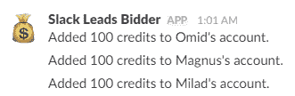
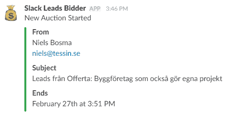
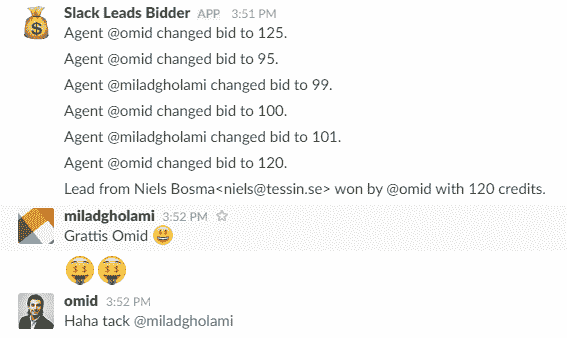
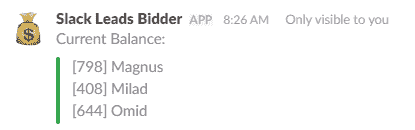
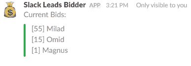

# 使用松弛时间分配销售线索的游戏化

> 原文：<https://medium.com/hackernoon/gamification-of-assigning-leads-using-slack-ffe87b3e5893>

在大多数销售组织中，你必须以某种方式管理新的销售线索。这些销售线索需要在销售人员之间公平分配。

在 [Tessin](https://tessin.se/) 时，所有的销售线索都是通过我们的销售经理 Erik 传递的。这不仅增加了响应时间的延迟，还增加了 Erik 本已繁重的工作量，迫使他跟踪每一个新线索的下一个目标。我决定自动化这个过程，目标是让这个过程公平、有趣、快速。

这导致了 *Tessin Slack 导致投标人*(是的，我需要对这个名字的工作)。它是这样工作的:

一切都通过名为#leads 的松散渠道进行管理。在这个设置中，每个销售人员都被称为一个*代理*，并且拥有一个有信用的账户。我已经配置好了，所以在午夜，每个代理都会收到 100 个额外的积分。

来自组织某处的新线索被发送到内部电子邮件帐户。这将为该销售线索启动新 5 分钟拍卖。代理可以在 Slack 中看到谁发送了线索以及电子邮件的主题。

在 Slack 中使用/bid X 命令，代理可以设置他们的 bid。当时间结束时，出价最高的代理将收到原始电子邮件。如果两个代理有相同的出价，它会在他们之间随机分配。

使用/balance 命令，每个人都可以看到所有代理当前信用的状态。

使用/bids 命令可以看到当前的出价。

还有一个/autobid 命令，允许代理为每次拍卖设定一个起拍价。

这可能并不适用于所有组织，但迄今为止，我们的销售团队对此反应积极。作为一个额外的奖励，它使公司的其他人贡献线索变得更加有趣，因为每个人都可以在 Slack 中关注#leads 频道。

如果你想为你的团队建立一个类似的系统，那么 *Tessin Slack Leads Bidder* 系统的代码已经在 [Github](https://github.com/tessin/SlackLeadsBidder) 上开源了。为了构建这个，我使用了 Mandrill 来自动处理收到的电子邮件，并在后端使用了 MSSQL 数据库。安装说明可以在 Github 上找到。如果你想做贡献，我很乐意接受邀请。

> [黑客中午](http://bit.ly/Hackernoon)是黑客如何开始他们的下午。我们是阿妹家庭的一员。我们现在[接受投稿](http://bit.ly/hackernoonsubmission)并乐意[讨论广告&赞助](mailto:partners@amipublications.com)机会。
> 
> 如果你喜欢这个故事，我们推荐你阅读我们的[最新科技故事](http://bit.ly/hackernoonlatestt)和[趋势科技故事](https://hackernoon.com/trending)。直到下一次，不要把世界的现实想当然！

