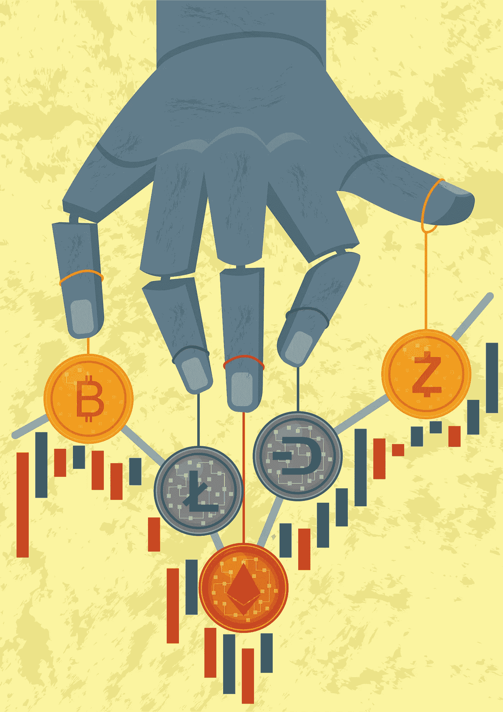
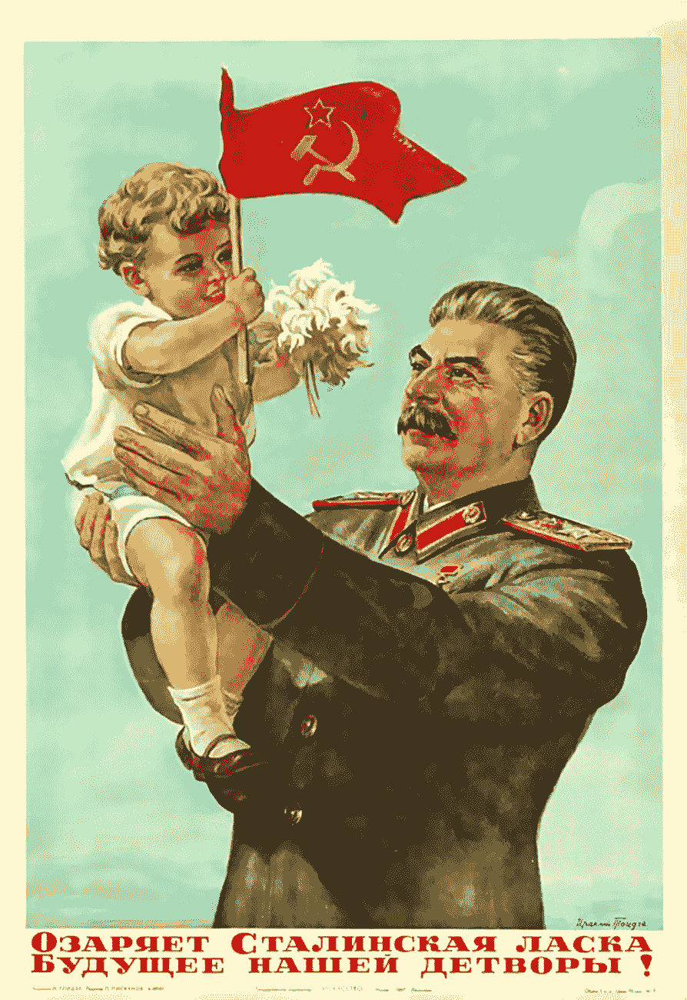
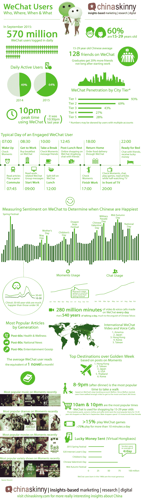
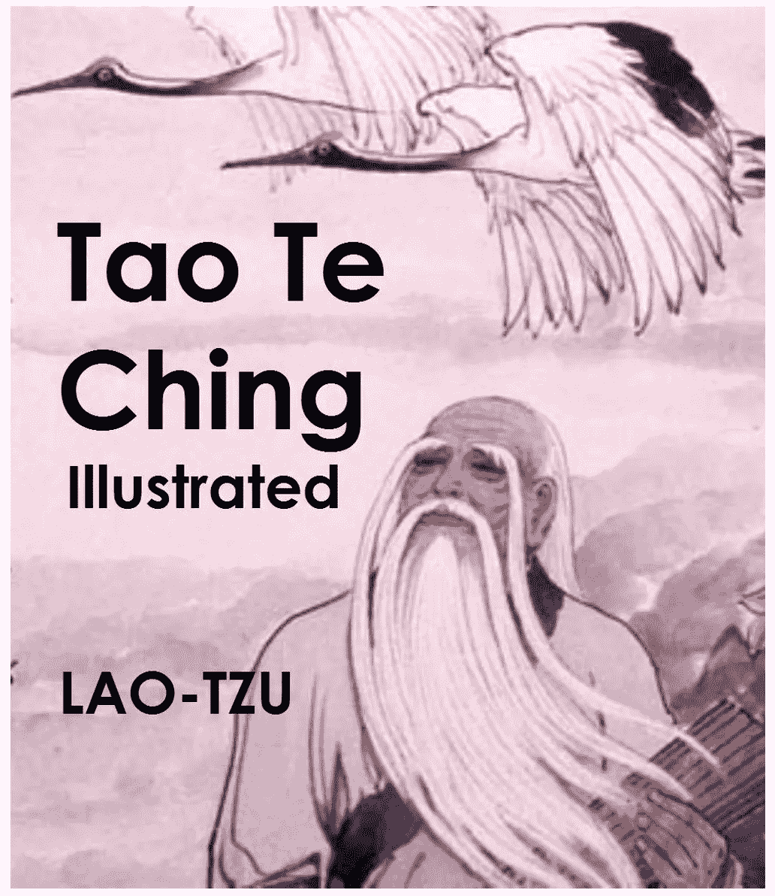
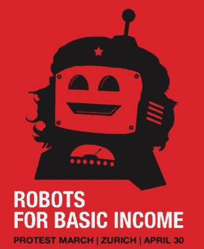
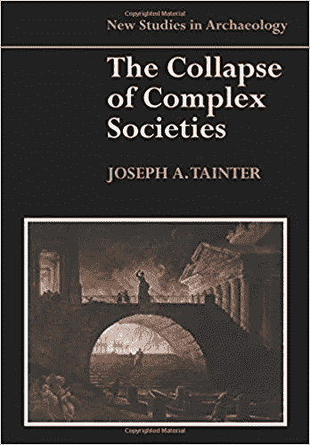
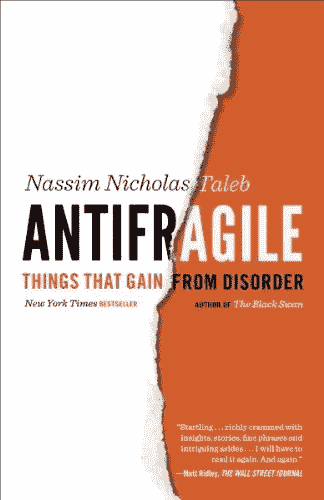

# 将货币的交付游戏化

> 原文：<https://medium.com/hackernoon/gamifying-the-delivery-of-money-c55c25cecaee>

到目前为止，我写过的最受欢迎的文章是“ [**为什么每个人都错过了加密货币**](https://hackernoon.com/why-everyone-missed-the-most-mind-blowing-feature-of-cryptocurrency-860c3f25f1fb) 最令人兴奋的功能”。每天它都被推了几百次。它在社交媒体、播客等等上引起了争论。它带来了雪崩般的人群涌入 [DecStack](http://decstack.com/) ，这是我的加密货币和分布式应用项目的虚拟合作点。

冒着破坏笑点的风险，这一切都归结为一个基本的想法:

**将金钱的分配游戏化。**

但是我忽略了这个难题的一个关键部分:

**我们是如何做到的？**

这就是我在这里要讲的。

你可能想知道为什么我没有在上一篇文章中把它写出来？那是故意的。

首先，有很多方法可以做到。这只是其中一种方式。我不想限制人们的思维。

第二，我和一个团队一起工作，把这个愿景变成现实，我想把它留给自己。但是现在我的想法因为一个非常特殊的原因而改变了:

我把金钱传递游戏化的工作视为与时间的赛跑。

如果我们不快速行动，集中的加密货币将率先粉碎我们夺回权利和隐私的任何希望。

能解放我们的系统也能奴役我们。

# 游戏

中央集权已经在努力构建数字货币，追踪你在生活中做过的每一件事。

那些势力想造什么？同一个该死的系统，我们已经有了，但升级了可怕的新功能。

想想 Equifax 的安全和囤积你的个人数据移植到区块链。想想货币控制慢慢扼杀人类。想想世界上每个人口袋里的跟踪系统和巨大的圆形监狱金钱间谍网。

日本正在建造他们自己的密码系统。[中国](https://www2.deloitte.com/us/en/pages/consulting/articles/state-sponsored-cryptocurrency-adpating-bitcoin-innovation.html)也是。印度宣布所有纸币为非法，并将在未来几年逐步淘汰纸币。他们的中央生物识别系统已经在跟踪每个人的金钱和消费习惯，尽管他们公开发誓根本没有这么做。

Soviet Propaganda poster from the Stalin era.

**想象一下，如果历史上最伟大的怪物** [**像斯大林**](http://amzn.to/2x0Rpqi) **有了区块链**。

他们能收获什么新的恐怖？

你可以远程饿死一个人，只要关掉他们的钱，就像关灯一样，并通过 GPS 地理信息阻止所有的商业活动。

不要认为某个地方的某个人还没有在思考这个问题。

作为一个社会，我们不能让这种事情发生。

去中心化的货币必须获胜。中央集权、政府发行的货币将会存在，其中许多将会非常优秀。那很好。不要认为中央集权的货币会以某种方式消失。不可能。但大多数情况下，它们对那些想控制我们生活方方面面的人来说太有诱惑力了，所以他们很有可能很快变得腐败。

分散加密将平衡集中货币与他们的强大，隐私保护的焦点，这将提供一个强大的检查和平衡集中加密的过度。

但前提是它们在集中版本起飞之前成为主流。

这就是金钱分配游戏化的由来。

通过将金钱分配游戏化，我们尽可能快地将它广泛传播到整个游戏领域，并保证系统变得可行。我们将这个系统从香蕉共和国提升到全球发电站。这将把强大的经济参与者带入这个体系，他们将受到激励去保护和扩大这个体系。

如果我们行动迅速，我们可以释放区块链的真正力量，释放冻结的人类潜力储备，从我们崩溃的政治制度的灰烬中崛起，进入一个全新的经济潜力和发展水平。

# **打破瓶颈**

在我开始讨论实现这一目标的实际机制之前，还有最后一点。

每天都有人来找我，想帮我出主意。他们想给我时间、金钱或建议，但问题是我越来越成为瓶颈。

我不能阅读所有的电子邮件，加入这个星球上的每一个聊天服务器，让每个人都足够快地前进。我不能让每个人都有组织，都朝着同一个方向前进。我不能掌控一切，坦白说，我也不想。我是一个作者，一个有想法的人，不是一个后勤人员。

我正在努力[脱离母体，这样我就可以**把所有的时间和精力集中在研究、写作和演讲**](https://www.patreon.com/danjeffries) 上，但即使这样也不够。如果我有一千次生命，我永远也不会做我一生中想做的每一件事。

这就是为什么我决定把手从舵柄上拿开。

同样，答案只有一个:

**我正在开源我的想法，任何人都可以窃取并付诸实施。**

把它们用于你自己的项目。看看他们。看到他们。理解它们，并赋予它们生命。或者说他们疯了，不理他们。这取决于你。我不在乎。对他们做你想做的。

我不是来和任何人辩论的。我不在乎你是否认为你在我写的东西中发现了一些明显的缺陷。

我给你的是一个元模式。

这是模式的模式。看清这一点，你就会明白。

做编码的工作，并使之结出硕果，将会解决任何察觉到的问题。如果有重大缺陷，有人会找到减轻它的方法。事情就是这样的。不做工作就没有进步。

“You sir! Fancy a long grueling adventure full of pain, betrayal and personal conflicts?” — TV Tropes

我带着石头走了这么远。现在你被[召唤去冒险](http://tvtropes.org/pmwiki/pmwiki.php/Main/CallToAdventure)。如果你想响应号召，那就由你来捡起石头并把它扛上山。

作为一个物种，当成百上千的终端节点产生出一个想法的自己的版本时，我们会更加有效，我们都必须竞争。这就是 DNA 的全部，一个重复一个中心思想的程序，生命的思想！我们只不过是一系列随机的拨动开关，生来就是为了互相挑战和竞争。

你不需要我。我免费给你我的见解。除了看到创意像绿芽一样在全世界涌现，我不要任何回报。

所以让我们开始吧。

我们到底是如何将金钱的传递游戏化的？

# 蓝图

## **第一步:释放自己的贪婪**

如果你专注于积累世界上最大的一堆硬币，或者项目中的每个人如何获得报酬，你就关注错了。

如果你做对了，每个人都会变得富有。所以不要太在意细节。保持简单明了。瓜分一小部分创始人的代币，然后继续前进。不要为它疯狂。

专注于*让整个系统变得更富有*，你就会随之变得富有。

**为每个人做大馅饼，你就能增加系统的总价值。**

## **第二步:建立庞大的** [**忠诚联盟**](https://digiday.com/marketing/wtf-coalition-loyalty/) **和黑仔 App**

马上，你需要筹集资金。为此，您需要生成一个 ICO，但不是任何 ICO。你需要一个与其他 ICO 完全不同的 ICO。

第一个关键是要有一个简单的核心思想，*和一个工作原型*，然后是 ICO。现在没人有那个了。他们有一份白皮书，一个半光滑的网站，和一堆需要三年才能实现的想法。

但到那时就太晚了。中央政权将会建立他们自己的腐败的区块链，让世界窒息。

你可能在想你将创造的硬币来让你的系统运行。去你的硬币。硬币是次要的。

它始于一个杀手级应用程序，而不是硬币。

**我再说一遍:硬币是次要的。**

硬币不过是让它运转的引擎。以太坊从一开始就明智地看到了“气体”或“燃料”。

现在专注于你的应用。你想要简单的可插拔的和可扩展的东西。

**想微信。**

Source: [ChinaSkinny](https://www.chinaskinny.com/).

它开始只是一个聊天应用程序，然后他们在它的基础上添加了数千种不同的应用程序。现在有 8 亿人在使用它。如果做得好的话，这种去中心化的版本将会波及整个世界。

你真正构建的是一个*将成为平台*的应用。

平台是关键。你想想象所有的小插件和二级应用程序，其他人可以在你的系统上构建。平台越通用越好。不一定是聊天。这只是一个例子。

现在有趣的部分来了。

要为你的 ICO 建立忠诚度对比，你首先要做的是为实现你的愿景所需的一切做出预算，营销人员、程序员、项目经理、QA 测试人员、SaaS 软件、云等等。

然后你把它翻了三倍，因为没人能正确地算出这些东西。我们总是低估所有的小失误、小失误和小挫折。

假设总数是 2500 万美元。

现在，你走出去，找出所有精彩的开源项目，如[名为 Matrix](https://matrix.org/) 的分散式服务器系统，或者任何你喜欢移植到你的平台上的项目，或者如果其他项目得到更充分的实现，会使你的平台更加强大的项目。

一旦你确定了他们的身份，你就给他们打电话，告诉他们你每筹集到 2500 万美元以上的资金，你就给了他们项目 x %的回报。可能是 10 万美元或 100 万美元。

你为什么要这么做？

因为现在你有项目实际上绊倒自己给你他们的支持。他们会借给你他们的标志，给你一个热情洋溢的声明贴在你的网站上，并高兴地敲打他们的邮件列表来推广你。你的营销预算现在为零。

你把营销游戏化了。

你已经轻松地在你的网站上吸引了有影响力的人，现在到了在 ICO time 付钱的时候，大众会争先恐后地给你他们的以太和比特币。

对他们来说没有风险，而且有巨大的回报潜力。

将死。

任何没有帮助的项目基本上都是疯狂的。

## **第三步:隐形游戏化应用**

Absolutely not. Hideous. Ugly. Awful. NOT what I am talking about.

你不想公开地将金钱的交付游戏化。这就是你的应用程序如何变成分散的 Candy Crush，一个丑陋的拉斯维加斯风格的系统，俗丽而丑陋。

没人想这样。

你想要微妙、优雅和简单。

你要的是*隐身游戏化*。

想象一下，你正在使用你的微信应用程序，你就像我的妻子和她的妹妹一样，用贴纸聊天，偶尔还会发短信。表情符号。贴纸。贴纸。贴纸。文字。

The hidden power of cat stickers.

我老婆爱[Viber。](https://www.viber.com/)

Viber 是关于贴纸的。例如，你可以得到免费的猫贴纸，也可以购买付费的猫贴纸。

现在想象你的姐姐或妻子正在使用这个应用程序。她在应用程序中做事情会得到一个奖励令牌，只是每天都在使用，但她并没有真正关注它。只是角落里偶尔非常安静地通知她的一盏 blinky 灯。

现在也许她会得到一个特殊的精英猫贴纸作为奖励。这张更引人注目。它在屏幕上晃动起来，在消失在背景中之前大放异彩。突然她想知道更多。

她注意到闪烁的灯光，并点击它。它带她去她的奖励钱包。她意识到她已经建立了一个奖励代币商店。

各种贴纸都有市场。

但她不能用美元和其他法定货币购买，只能用奖励代币。

对她来说，奖励代币基本上是免费的。因此，没有理由不买一大堆精英猫贴纸，然后继续愉快地使用这个应用程序，直到她可以得到更多。

恭喜你，你刚刚构建了一个杀手级应用。

## 第四步:让奖励令牌通用化

接下来，你将专注于设计一个通用的奖励硬币，它将尽快支付给网络上的每个人，并激励他们做对网络最好的事情，而不是对他们自己最好的事情。

如果奖励令牌只在你的系统上有效，它就毫无价值。想想你钱包里有一百家不同商店的臭卡片。马歇尔百货公司、塔吉特百货公司、宠物店、杂货店和所有其他商店都有一个。

糟透了。

你可能还在想如何用奖励硬币最大化你自己的奖励。忽略那种冲动。贪婪会扼杀这个系统。其实根本不用考虑你的奖励。

你要考虑的是如何把你的奖励送出去。

没错。

你要尽快把你的奖励硬币给尽可能多的人。

放弃所有的钱将使系统呈指数增长，并很快让它颠覆整个世界。

让我们在时间上快进。你有一个成功的 ICO。你把钱捐给了其他项目。你有一个应用程序启动并运行，做它的事情。起作用了。

现在是时候扩张了。

你花钱支持的项目现在开始为你工作了。你为他们构建了一个超级光滑的 API 和插件管理系统，他们开始工作，把他们的精彩应用移植到你的平台上。

突然间，你有了一打新的功能提供给顾客。

那些客户带来了他们自己的客户群。现在你要推出下一个产品:

Think universal.

一个向他们的插件提供通用奖励令牌的 API。

关于谁可以使用该 API 的决定最初是半集中式的，从已经存在的主要项目和平台的精选列表中选择。但与此同时，你也在积极努力，通过与能够处理争端的长老理事会建立信任网络，来分散这一过程。你不想成为一个集中的瓶颈。

该 API 包括到安全区块链的连接，该连接包含更新规则以防止滥用和欺诈。例如，一个应用程序不能简单地将每个通用奖励硬币一次性全部交给一个钱包。为了找出欺骗系统的所有方法，你将需要一个安全研究小组，从周日开始寻找破解它的每一种方法。一旦你知道了破坏系统的所有方法，你就可以设计保护它的方法。

有些漏洞是不可避免的，但是你可以利用区块链的力量发布一套新的规则，在创纪录的时间内粉碎这些漏洞。

现在你给项目和公司使用 API 的密钥。密钥还决定了他们可以分发的代币数量。应该和他们网络效应的大小成正比。他们能给平台带来多少人？这个过程应该是自动化的。这不应该是有人分发钥匙或更新电子表格来计算一家公司带来了更多的人。

考虑建立一个外部化的声誉银行，作为对欺骗的对冲，但这是另一篇文章。详情请见我在蝉项目中设计的[通用 ID。](https://hackernoon.com/identity-without-authority-a-decentralized-id-system-for-the-whole-world-bf9aad1a096b)

记住这一点，你会在加密和人生中做得很好:

**每一个加入你人际网络的人，都会增加你的价值。**

做对网络最有利的事情，网络就会繁荣。

只做对自己有好处的事，网络就死了。

平衡最好。确保对你有好处，但对其他人更有好处。馅饼越大，你的份额就越大。

你要设计的是这样的:代币奖励那些让系统受益的人，惩罚那些利用它的人。

**突然之间，你有十几个应用程序都在使用同一个奖励币。它现在是一枚通用的奖励硬币。**

它开始有了自己的价值。一些人会意识到他们可以拿出硬币在交易所交易，或者他们可以跨应用程序使用它来购买免费的演出门票或从他们当地的连接链获得杂货交付。

现在，人们会来找你开发应用程序，使用你的平台，并获得你的奖励令牌。

你把系统带到了一个新的高度。

## 第五步:人民签证

现在你已经准备好建造你自己的区块链了。在那之前，你只是在使用另一个区块链，比如以太坊(Ethereum ),并在需要时不断发行自己的令牌来支持网络。

现在是时候更上一层楼了。你想造一把刀。但不是所有的刀。

[道之道](http://amzn.to/2xMfr6W)之道。

你将建立一个治理深度分散的组织，以及各种用于形成子结构的模板。越普遍越好。这需要仔细规划和考虑，不能操之过急。

道不仅仅是一个智能合约。

这是治理和 SaaS 系统，以及远距离组织人们的方式，就像一个巨大的、蔓延的开源项目。正确设计，您就为未来的企业设计了下一代模板。

你还将设计你的区块链，从网络上的所有采矿奖励和交易费用中抽取*很小一部分。随着网络的发展，通过智能合约，源源不断的资金将涌入道的金库。*

随着世界上越来越多的财富从摇摇欲坠的菲亚特涌入加密，你的道将越来越强大。

恭喜你，你现在是签证 2.0。

但与 Visa 不同的是，你不会为了自己自私的目的而囤积所有的钱。你将赞助其他 Dao 和所有那些你用 ICO 的钱帮助过的项目。

你的道将创造*真正的涓滴经济学*，而不是我们当前残缺不全的系统的伪经济学。

**这些子 Dao 将通过智能合同获得源源不断的收入，这将产生惊人的效果。**

**你会永远打破季度业绩的循环。**

这将是真正的革命。

现在，团队不必在构建真正突破性的功能或他们知道会畅销的垃圾功能之间做出决定。他们将专注于质量和提供帮助人们的功能，而不是仅仅为了快速赚钱的掠夺性功能。

掠夺性的特性开发者通过系统中的投票获得合同。这必须精心设计，以免造成一个多数人的暴政和为意识形态的废话而暂停金钱的愚蠢。规则必须坚定、清晰、符合算法，不受人们的突发奇想和情绪以及他们破碎的信仰体系和琐碎的血仇的影响。

## 第六步:普遍基本收入

现在真正令人惊奇的部分来了。

你用两个新的代币扩展你的区块链。

一个是储蓄代币，一个是消费代币。

储蓄代币是通货紧缩的，就像比特币或黄金一样，所以它会慢慢升值。这个想法是让人们保存它们，以便有一天他们可以买一些特别的东西。这枚硬币的价值不在于不断地花掉它们，而在于持有它们，甚至囤积它们。它们的目的是随着时间的推移而增值，让储户受益，并奖励他们的远见和规划。

有了适当的储蓄，人们可以用钱而不是信贷来购买房子、汽车和其他一切东西，这将慢慢缩小世界经济中的巨额债务泡沫，而不是一下子破灭并摧毁世界。

下一个代币是挥金如土的代币。

这是储蓄令牌的配对反义词。它有轻微的通货膨胀，并与其他货币或其他稳定的价值单位挂钩，如时间。关键是*它必须保持稳定*。价值储存的稳定性使得钱会流动，这就是你想要的。它是日常用来买士力架、公共汽车票和猫贴纸的。

金钱是能量。

它汇集和流动。

两者都是必要的。

消费令牌在世界经济中移动得越快，经济波动就越大。人们储蓄得越多，系统就越能抵御突然的冲击。

当你设计你的区块链时，你让每个人都成为客户和矿工。每个人都被随机抽入人才库，凭工作证明获得区块链奖。然后人们只是走着走着，用着应用程序，他们的手机被唤醒做一点工作五分钟或十分钟，然后继续睡觉。

这创建了一个[分布式工作证明](http://iamcicada.com/)。它把它分散到整个系统，使它不可能被压碎。

我们不需要做得比工作证明更好，我们只需要让它更分散、更节能。所以你要确保这个系统可以在手机上运行，并且增加一堆新系统不会给你带来更多的回报。

现在你可以开始把钱分发给网络上的每个人。

你将*而不是*使用一次性空投。

随着时间的推移，您将不断地向使用该系统的每个人滴出您的所有令牌。

发送奖励代币和消费代币。然后，作为一个特殊的奖励，让人们更有动力保持应用程序运行，你可以分发更加稀缺的储蓄令牌。

所有这些加起来就是一个[普遍基本收入](https://artplusmarketing.com/how-we-can-deliver-a-universal-basic-income-right-now-and-save-ourselves-from-the-robots-without-e1972e22e8eb)，但是因为它不是空投，它不会通过一次发行所有货币而使货币贬值。此外，因为你有多种货币，有不同的目的，你利用多种经济哲学的力量来保持货币的价值稳定或上升。

明确一点，以免某个白痴认为这是某种秘密共产主义:

没有人仅仅局限于他们从 UBI 得到的钱。这是*而不是*一个有限的系统。

这是一个富足的经济体系的开端。

UBI 只是一个基线。

每个人都可以自由创业，创造自己的附加价值，从而赚取更多的钱。

# 密码成功的六大法则

就是这样。六个“简单”的步骤。

这就是你所需要的，为了这个星球上的每个人，让整个游戏变得更好。

但这并不容易。

每一步都充满了不确定性，你可能看不到你正在做的事情的真正目的。如果你变得贪婪或试图控制这个系统，并用漏洞来充实你自己和你的家族，你就变成了另一个令人厌倦的、腐败的、空洞的中央权力，每个人都讨厌它。

但是，如果你能够保持清醒，专注于大局，同时努力放弃你的价值来发展系统，你将建立一个不可阻挡的经济机器，为世界几代人提供动力。

繁荣的不仅仅是你的房子，而是所有地方的所有房子。

这将是一个分布式系统，整个世界的联合体。

但你最好动作快点。现在我们的系统正走向灾难。我们的债务泡沫非常巨大。我们拥有的武器技术可以像砸鸡蛋一样砸地球几千次。对于我们狭小的战场来说，我们的武器太大了。

如果这次系统崩溃了，那将会是前所未有的。当文明在过去崩溃时，它们更小，更本地化，损害局限于它们的势力范围。

在过去，地球是更加分散的。每个社会都是自己如何管理世界的试验台。

但是今天我们有一个全球化的社会，即使我们不相信它，想让时光倒流。不会发生的。没有人能让时光倒流。保护主义不会起作用。

唯一的解决办法是让我们的全球社会**抗脆弱。**

**今天我们有一个玻璃房子。一切都错综复杂，无限相连。我们的经济让我们无情地关注短期。我们为了今天的快钱出卖了未来。**

**我们正以每小时 1000 英里的速度直冲砖墙。**

**如果我们不尽快解决这个问题，我们将最终实践爱因斯坦的著名警告:**

> **“我不知道第三次世界大战将使用什么武器，但第四次世界大战将使用棍棒和石头。”**

**或者我们可以醒来。**

**我们可以趁早改变，为每个人建立一个更美好的世界。**

**如果你听从召唤，这就是你的工作。你必须忠于一个金色的愿景，一个真实的愿景。**

**成为一个贪婪的混蛋，试图控制一切，用集中的咽喉要道扼杀系统，把所有的钱都留给自己，你会加速崩溃，打破世界。你的罪行将永远臭名昭著。**

**但是，如果你能克制住支配、控制和占有每一种资源的冲动，你就能释放这个世界巨大的潜在能量。**

**你所需要做的就是相信愿景，并坚持目标。**

**做到这一点，你的事迹将在永恒的大厅里回响。**

**你可能会拯救世界。**

**Return triumphant to the halls of Eternity.**

**############################################**

**如果你喜欢我的作品**，你可以考虑访问我的主页******，因为这是我们一起改变未来的方式。**帮我脱离母体**我会百倍地回报你的慷慨，把我所有的时间和精力集中在写作、研究和为你和世界提供令人惊叹的内容上**。****

****###########################################****

## ****如果你和我一样热爱加密空间，那就来吧，加入 [DecStack，这是一个虚拟的加密货币和分散应用项目的合作场所](http://decstack.com/)，在这里你可以接触到多个项目。永远完全免费。只是进来和社交，一起工作，分享代码和想法。通过反馈让你的想法更好。寻找新朋友。见见你的新家人。****

****###########################################****

********

****[Photo credit](https://extranewsfeed.com/the-winds-of-world-war-iii-8bc369584f67)****

****关于我:我是一名作家、工程师和连续创业者。在过去的二十年中，我涉及了从 Linux 到虚拟化和容器的广泛技术。****

****你可以看看我的最新小说， [***这是一部史诗般的中国科幻内战传奇***](http://amzn.to/2gAg249) *在这部小说中，中国摆脱了共产主义的枷锁，成为世界上第一个直接民主国家，运行着一个高度先进的、人工智能的去中心化应用平台，没有领导人。*****

## ****[加入我的读者群，你可以免费得到一本我的第一部小说《蝎子游戏》。读者称之为“神经癌的第一次严重竞争”和“黑色侦探会见约翰尼记忆术。”](http://meuploads.com/join-my-readers-group/)****

## ****你也可以根据书中的想法查看[蝉开源项目](http://iamcicada.com/)，该书概述了如何立即将该技术变为现实，你可以参与其中。****

## ****最后，你可以[加入我的私人脸书小组，Nanopunk Posthuman 刺客](https://www.facebook.com/groups/1736763229929363/)，在这里我们讨论所有的科技、科幻、幻想等等。****