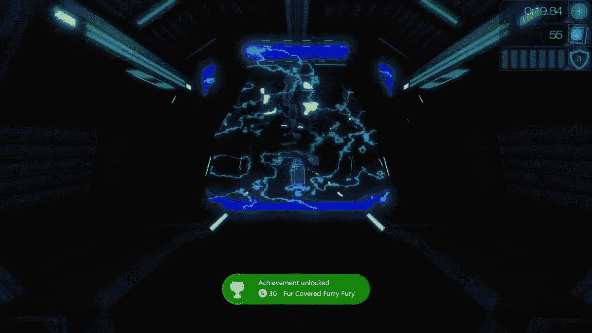
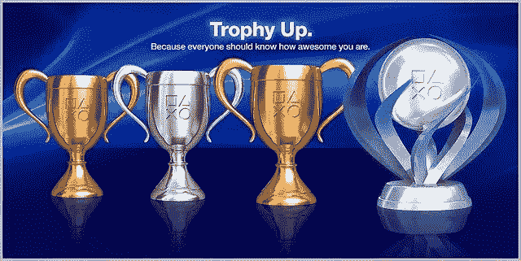
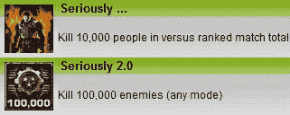

# 游戏需要游戏化

> 原文：<https://medium.com/hackernoon/gaming-needs-gamification-1b7c2629d370>

> 成就和奖杯已经过时了

当 Xbox 360 在 2005 年推出时，它引入了一种机制，这种机制很快成为游戏生态系统中最重要的功能之一。我说的是成绩。

成就是你在游戏中完成特定目标后获得的一种数字奖励。这些可以从击败游戏到在特定情况下击败它或者做一些像收集物品、玩大量比赛等附带活动。一旦你完成其中一项，你将获得一项成就(或 [Playstation](https://hackernoon.com/tagged/playstation) 上的奖杯或 Steam 上的徽章):

成就很重要，原因有很多。一方面，它允许开发者带领玩家探索游戏中不同的元素，否则他们可能会跳过。例如，它可能会奖励玩家使用混凝土枪一定次数的成就，或做游戏中与主要故事无关的附带活动。

另一方面，它为游戏增加了持久的价值，因为玩家可能不会觉得他们已经打败了游戏，直到他们赢得了所有的成就。这有助于玩家不转售他们的游戏，因为他们越晚尝试这样做，他们得到的钱就越少。反过来，这也意味着发行商和制造商有更多的钱，因为他们卖出了更多的第一手游戏。

最后但同样重要的是，它在游戏生态系统之上创建了一个社交层，让游戏玩家在购买不同系统的游戏或彻底改变系统时三思而行。社交层的出现是因为你开始和朋友们竞争谁在一个系统上更有成就。这使得改变到一个不同的游戏生态系统代价高昂，因为你会失去所有来之不易的奖杯。正因如此，很多人买一款游戏给 system X，即使它在 system Y 中运行得更好或者有更多的功能，只是因为他们想为自己的成就做出贡献。出于同样的原因，他们可能会在一代人的变化中坚持使用一个游戏机品牌。主机厂商因此受益匪浅。

## 现在让我们来分析一下 Xbox One、PS4 和 Steam 如今的成就:

Xbox One 拥有迄今为止最丰富的成就程序，尽管它仍然可以从其他生态系统中学习一些技巧。它的工作方式是每一个成就都值 X 个积分，玩家有一个玩家分数，它总结了你的成就所值的所有积分。每个游戏都有价值 1000 点的成就，DLC 有 250 点。一旦你解锁了一项成就，你会在屏幕上得到一个通知:

Xbox One Achievement notification

有些游戏为每一项成就都预设了图像，有些游戏会在你解锁的时候截图。在 Xbox 的“成就”部分，您可以看到您每场比赛的所有成就，与您朋友的成就进行比较，并查看您在每场比赛中取得的进步:

Xbox 上的其他成就是，每个游戏都有一套特定的指标，可以比较你和你的朋友之间的表现。例如，在《战争机器 4》中，它会显示你拍了多少头像，找到了多少收藏品，玩了多长时间以及其他指标，并告诉你在所有这些指标中与你的朋友相比排名如何。这也是一种让人们沉迷于游戏并增加其重玩价值的方法。

PS4 的系统略有不同。成就被称为奖杯，分为 4 类:铜牌，银牌，金牌，白金。每场比赛只有一个白金奖杯，一旦你赢得所有其他奖杯，就会颁发给你。如果认为解锁所有其他奖杯太容易，一些游戏没有白金奖杯。

From left to right: bronze, silver, gold, platinum (duh!)

不是有玩家分数，而是根据玩家解锁的奖杯数量来分配等级。这有点模糊，因为你永远不知道离下一关还有多少奖杯。

一个很好的功能是你可以看到有多少%的玩家获得了任何一个奖杯。这很酷，因为大多数人似乎不怎么玩他们买的游戏，所以你最终赢得了很少有人能很快解锁的奖杯。

这个系统也缺乏查看你在某项成就上取得了多少进展的功能，这使得你很难知道你离实现它还有多远。

## 成就/奖杯应该如何变化:

很明显，微软和索尼必须互相学习。两者都有对方缺乏的特征。在新版本中，我也将使用“成就”一词，因为这是流传最广的一个词。

我认为 Playstation 将奖杯分为 4 类的系统非常有意义，因为解锁一个金牌奖杯比获得 50 个玩家分数更有回报。更有形。它还允许不同层次的比较，不仅仅是通过比较玩家分数或奖杯等级，而是通过比较你和你的朋友拥有多少白金或黄金奖杯。拥有更多铂金会比总体水平更高给你更多的街头信誉。

也就是说，我相信每个类别都需要一定数量的经验值来分配，这样你就可以清楚地知道你还需要赚多少才能达到下一个等级。如果你碰巧接近达到一个新的水平，你可能会玩“再来一轮”以试图达到那里，而如果你真的不知道，你只是把它作为最终会发生的事情。

成就本身也是如此。你需要 Xbox 拥有的跟踪个人成就进展的系统，以了解你是否足够接近今天投入额外的一小时，或者你是否会把它留到另一天。它基本上告诉你，比如，你离获得成就还有多少关。你玩得越多，你买的游戏就越多，你越晚换购，每个人都赢得越多。

我记得，在最初的战争机器时代，许多玩家痴迷于在多人游戏中达到 10.000(是的，这是正确的)击杀来获得“严肃”的成就。这相当困难，因为比赛中的杀戮由于其战略性而不太多。它不仅仅是另一个成就的原因是因为它实际上奖励了你比一些玩家分数更多的东西，它将解锁一个只能通过解锁该成就获得的个人资料图像。

You could set the Achievement image as your profile pic

这不只是让人们继续玩游戏，而是让他们穿上了战争机器的个人资料图片，一旦实现，其他人都会看到。免费广告。我认为所有的成就(金牌或以上)都应该有这样一个图像，并标明它是金牌还是白金。这样你就可以炫耀，甚至向没有具体游戏的人炫耀，你已经解锁了白金奖章 X 或 y。

不仅如此，我还会在解锁金牌或白金奖牌时给你的主机一个壁纸/主题，让它更有回报。

现在的游戏在不断进化。不仅仅是就媒体而言，而是就个人游戏而言。如果你看看《最终幻想十四》、《上古卷轴在线》、《命运》或《分裂》,你会清楚地看到这些游戏在发布后随着时间的推移发生了巨大的变化。平台需要给开发者一种方式来增加他们发布 DLC 之外的成就。这需要一个审批系统，这样他们就不会为了向追求成就的人出售更多的拷贝而创造简单的成就，但这是必要的。否则你最终会得到一个巨大的不对称的游戏，在这个游戏中成就是为了什么，在这个游戏中成就是什么。

还应该有只能在一定时间内获得的定时专属成就。这些不应该算作在游戏中获得 100%的分数，因为有人可能无法在那段时间玩游戏，但它们肯定会让一些人回到他们有一段时间没有玩的游戏，给开发者一个机会向他们展示可能已经添加的新机制或内容。

任天堂曾有机会与 Switch 一起推出一个很棒的成就系统，但它再次错过了一个很好的机会，并推出了没有任何成就系统的游戏机，就像之前的所有游戏机一样。现在连 Google Play 都有成就了！

我认为这里有很大的改进空间，对于生态系统中的每个人来说，创建一个吸引人的娱乐系统是双赢的。希望很快会有人在这里带头，让成就更有回报。

> [黑客中午](http://bit.ly/Hackernoon)是黑客如何开始他们的下午。我们是 [@AMI](http://bit.ly/atAMIatAMI) 家庭的一员。我们现在[接受投稿](http://bit.ly/hackernoonsubmission)，并乐意[讨论广告&赞助](mailto:partners@amipublications.com)机会。
> 
> 如果你喜欢这个故事，我们推荐你阅读我们的[最新科技故事](http://bit.ly/hackernoonlatestt)和[趋势科技故事](https://hackernoon.com/trending)。直到下一次，不要把世界的现实想当然！

