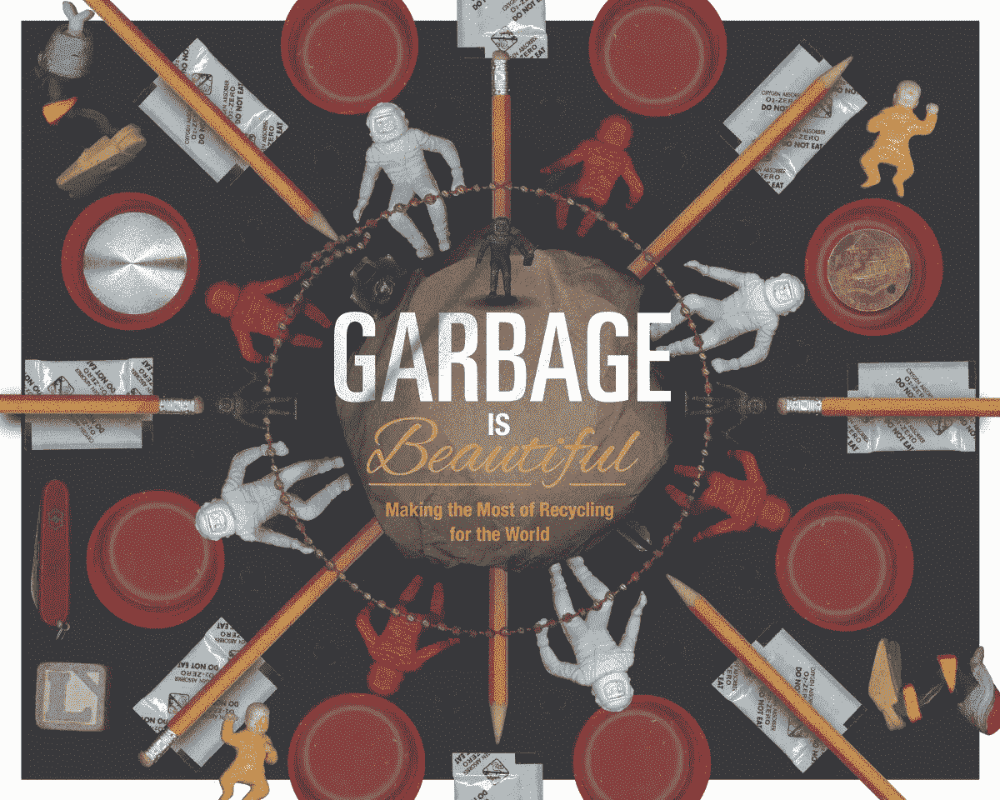
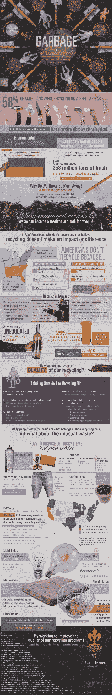

# 垃圾也可以很美

> 原文：<https://medium.com/hackernoon/garbage-can-be-beautiful-6dc39de7b978>

截至 2011 年，58%的美国人定期回收垃圾，是 20 年前的两倍。超过一半的美国人自觉承担起保护我们星球的责任，不让东西进入垃圾填埋场。

如今，回收几乎成了我们的第二天性。几乎每个垃圾桶旁边都有一个回收箱，扔掉塑料瓶从未如此简单。我们可以把回收利用看作是最环保的方法之一，但是我们还有更多要学的。那些“不”可回收的物品呢？

我们谈论的是每天都不会被扔掉的东西；或者我们认为不可回收但实际上是可回收的物品，反之亦然。

对于这些，我们必须跳出框框思考。尽管许多类型的玻璃都是可回收的，但白炽灯泡不在其中。避免把它们扔进你的回收箱，因为玻璃的高熔点会毁掉一批可回收的玻璃。然而，LED 灯泡是可以回收的，除了当地的回收中心之外，还经常在家装店收集。

有些产品对环境非常有害，我们甚至不应该扔掉它们。像旧电池和喷雾罐这样的物品总是被神秘所笼罩，但解决方法很简单:[当地回收中心](http://its-not-trash.com/garbage-is-beautiful/)。一些电子商店有回收旧手机或笔记本电池的收集箱，但是对于那些漏在你抽屉里的电池，最好直接把它们带到源头。

