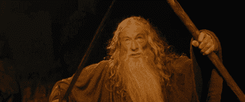

# 看门人及其在健康软件开发中的作用

> 原文：<https://medium.com/hackernoon/gatekeepers-and-their-role-in-healthy-software-development-7c6df6e0d792>

什么是[看门人](https://en.wikipedia.org/wiki/Gatekeeper):看门人是控制对某些东西的访问的人[……]决定给定信息是否将通过大众媒体传播的个人。

在软件开发的环境中，看门人的行为类似于上面的一般定义——一个既作为特性请求的过滤器又为项目定义未来路线图的人。这一角色非常重要，能够对任何努力的成败产生非常实际的影响。现代软件开发中的看门人可以采取多种形式；高级 SDE、技术领导、产品经理、CTO 在某种程度上都是把关者，不一定是项目的最初开发者。

看门人的职责通常围绕以下方面:

1.成为所有功能请求的概念验证
2。所述请求的优先级
3。计划中的每个产品版本的利益相关者——每个设计讨论的一部分

通常，Sokrati 的团队有 5-7 名成员，包括一名技术主管和一名产品经理。

守门人可以出现的不同级别大致符合这些类别:

**公司层面**——通常是首席技术官/工程主管，定义年度路线图，季度健全性检查，并在需要时监督新的需求/支点——这是最高层面的把关。

**团队层面** —你的技术领导和产品经理，通常是两者的某种组合，以确保从业务和技术角度涵盖所有方面。

**项目级别** —不太常见，您可以在这个级别定义模块所有者，范围主要是关于要使用的技术、编码模式等的内部。

有一个看门人可以确保你有一个清楚了解软件是什么以及它将会发展成什么的人。人们往往倾向于给现有产品添加不必要的功能，直到它不再有明确的用途，而只是一组广泛相关的功能的混搭。它还允许更加明确地确定所请求的特性是真的将解决一个业务用例，还是仅仅是一个更大问题的副产品，由于膝跳反射般地急于对新版本的每一个功能缺失做出反应，这个问题已经像滚雪球一样越滚越大。

也就是说，应该非常小心地确保看门人永远不会沦为近视的地牢主人。看门人的话绝不是最终的。这个“角色”是一个建议性的角色，在一个忙碌的环境中，每天提交的数量经常被吹捧为一种荣誉的徽章，这个角色促进了否则会半途而废的讨论。另一个主要问题是变得如此依赖你的看门人，以至于他/她成为了一个单点故障(SPoF)——看门人不是一个障碍，而是一个漏斗，将产品引向你选择的总方向。

*这篇博客是触及 Sokrati 技术流程系列的一部分。访问我们的* [*工程博客这里*](https://sokrati.com/engineering/) *查看更多。*

Authored by: [Farnoosh Azadi](mailto:farnoosh.azadi@sokrati.com) | Tech Lead

> [黑客中午](http://bit.ly/Hackernoon)是黑客如何开始他们的下午。我们是阿妹家庭的一员。我们现在[接受投稿](http://bit.ly/hackernoonsubmission)并乐意[讨论广告&赞助](mailto:partners@amipublications.com)机会。
> 
> 如果你喜欢这个故事，我们推荐你阅读我们的[最新科技故事](http://bit.ly/hackernoonlatestt)和[趋势科技故事](https://hackernoon.com/trending)。直到下一次，不要把世界的现实想当然！

