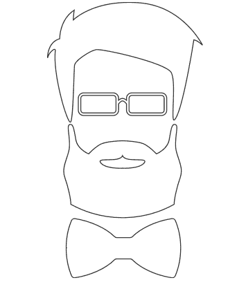

# 用 Reactjs 衡量用户关注度

> 原文：<https://medium.com/hackernoon/gauging-user-focus-with-reactjs-aa35b86f41bf>

理解你的用户在什么时候关注什么是现代 web 开发中最重要的事情之一。

# 动画

想象一下:

你刚刚被一家新兴公司聘为全新的初级开发人员。他们非常喜欢你的 Dribbble 作品，以至于他们让你为注册这项服务的新用户创作最令人惊叹的[动画](https://hackernoon.com/tagged/animation)。

在三周的时间里，你努力理解 [CSS](https://hackernoon.com/tagged/css) 的最深处，为注册创建最无缝的动画。

在三周的时间里，你深入研究了 CSS3，理解了你的同事从未听说过的选择器。这部动画是一部艺术作品。它有多个移动的部分，时间精确到毫秒，再好不过了。

终于到了向你的老板展示你出色工作的时候了。你对这个动画感到无比自豪，你认为你已经找到了所有的东西——完全的浏览器支持，如果需要的话，还有后退，色盲颜色的切换，以及完全的辅助功能支持。

你的老板叫你到他的办公桌前演示这个全新的动画。他拉起集结地，它无缝地关闭了。一切都很完美…

直到他转到他的邮箱。

“你在做什么？你要错过最精彩的部分了！”

“抱歉，我必须尽快回复这封电子邮件，它非常重要”

他切换回动画，它就完成了。他错过了最重要的部分。

“你怎么能指望用户在我们的页面上坐 3 秒钟而不分心呢？我们不能指望用户等动画，我们需要动画等用户。”

# 反应-用户-焦点

今天的网络用户是一群非常善变的人，他们有着奇怪的浏览习惯。作为一名开发人员，我发现自己经常在新标签页中打开链接，并保存一些东西以备后用。如果任何一个网站有一个吸引注意力的开头，而不是等我去参与，那么它对我来说就完全失去了意义。

*在一个网站试图抓住我的注意力之前，它应该知道它有我的焦点。*

为了解决这个问题，我在 React 中构建了一个组件来帮助网站理解用户何时关注该网站。这是一个非常简单的组件。它只是返回用户是否专注以及用户是否空闲。

它通过跟踪页面的状态来做到这一点。如果用户移开、最小化窗口或者聚焦在不同的窗口上，那么 react-user-focus 组件将会知道。

它还跟踪用户的空闲状态。如果用户在设定的时间段内没有运动或参与，则反应用户焦点将认为该用户空闲。

使用起来就像这样简单:

```
import ReactUserFocus from 'react-user-focus';<ReactUserFocus 
onFocusChange={onFocusChange} 
onIdleChange={onIdleChange} 
idleTime={2} 
/>
```

它在全局范围内工作，所以只要这个组件被渲染，它就会监听。



Not the best quality :/, check out the full demo [here](https://seankilgarriff.com/ReactUserFocusDemo)!

在 Github 上查看源代码！

*原载于 2016 年 11 月 30 日*[*【blog.seankilgarriff.com*](https://blog.seankilgarriff.com/gauging-user-focus-with-reactjs/)*。*

[*提交修正*](https://github.com/Skilgarriff/Blog-Posts) *。*

> [黑客中午](http://bit.ly/Hackernoon)是黑客如何开始他们的下午。我们是 AMI 家庭的一员。我们现在[接受投稿](http://bit.ly/hackernoonsubmission)并乐意[讨论广告&赞助](mailto:partners@amipublications.com)机会。
> 
> 要了解更多信息，请阅读我们的“关于”页面、[喜欢/在脸书上给我们发消息](http://bit.ly/HackernoonFB)，或者简单地发送 [tweet/DM @HackerNoon。](https://goo.gl/k7XYbx)
> 
> 如果你喜欢这个故事，我们推荐你阅读我们的[最新科技故事](http://bit.ly/hackernoonlatestt)和[趋势科技故事](https://hackernoon.com/trending)。直到下一次，不要把世界的现实想当然！