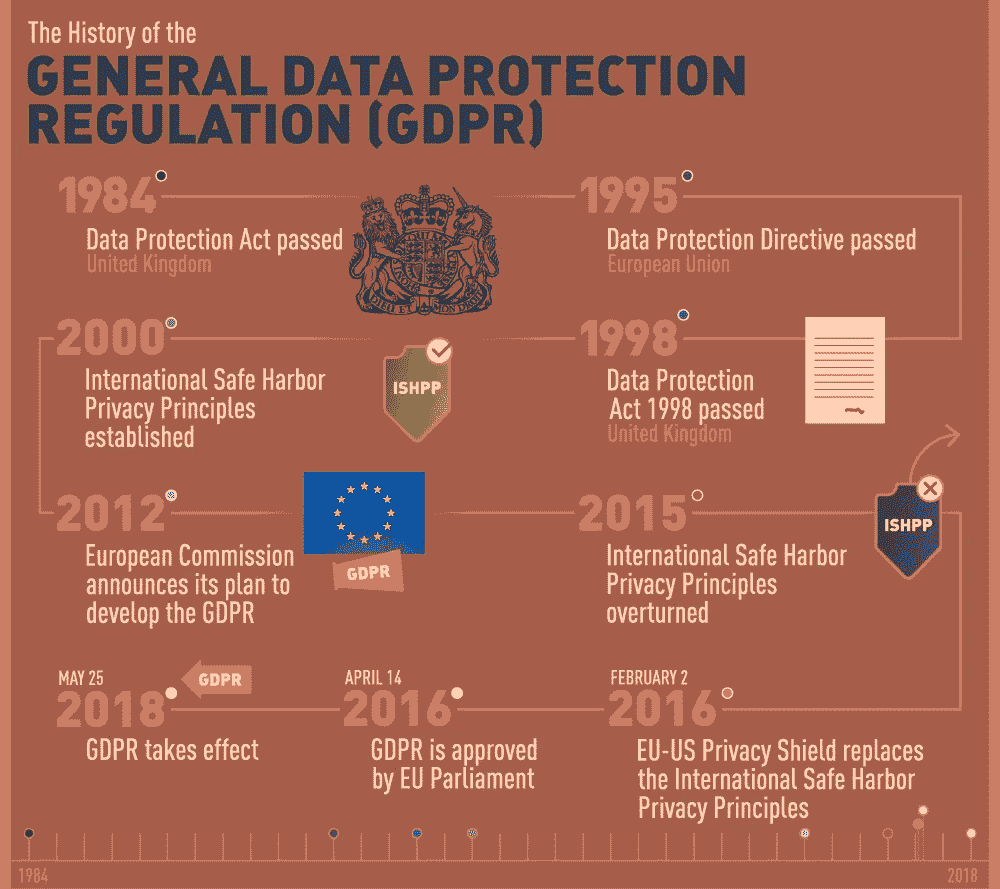

# GDPR:欧盟立法旨在加强用户控制，呼吁改变企业处理数据的方式

> 原文：<https://medium.com/hackernoon/gdpr-eu-legislation-aims-to-increase-user-control-calls-for-changes-in-how-businesses-handle-6c18a5d81c69>

互联网和数据安全领域发生了很多事情。在一个日益数字化的世界里，个人数据的价值是巨大的，两种文化正在采取两种截然不同的监管方式。

在美国，最近通过的法律允许互联网服务提供商(ISP)出售其用户的浏览器历史，迫使用户寻找保护其隐私的新方法。此举之后，联邦通信委员会试图[回滚网络中立](https://www.deseretnews.com/article/865684703/Heres-how-a-rollback-of-net-neutrality-could-affect-your-internet.html)，这可能会导致互联网服务提供商对更快的访问收取费用，优先访问其合作伙伴的内容，并阻止一些竞争对手的网站，或者只是减慢连接速度。

与此同时，与美国用户控制权的丧失形成鲜明对比的是，在大洋彼岸，欧盟政府一直在制定名为《通用数据保护条例》(GDPR)的新立法。这项改革将帮助欧盟公民(GDPR 条款下的数据主体)改善对个人数据的控制。GDPR 还将为所有欧盟国家和在这些国家运营的企业(GDPR 条款下的数据控制器/处理器)提供一个透明、统一的框架，概述他们在以下方面的责任:

*   获得用户同意
*   数据收集、存储和处理
*   数据安全性和机密性、违规预防流程等。

> *GDPR 最重要的一点是，该法规适用于所有控制、处理或存储欧盟公民数据的公司，即使该公司位于欧盟之外。*

GDPR 执行**于 2018 年 5 月 25 日**开始，届时 GDPR 规定的两年宽限期结束。

根据欧洲和全球的新规定，欧盟用户被赋予了哪些权利？让我们来看看。

# 在 GDPR 之前

GDPR 的前身是 1995 年通过的[数据保护指令(95/46/EC)](https://en.wikipedia.org/wiki/Data_Protection_Directive) 。其主要缺陷之一是管辖权不明确。对于向欧盟以外的国家(第三国)传输数据的情况，该指令要求这些国家提供足够的保护。成立了一个单独的委员会，就第三国的数据保护水平提供咨询。然而，如果没有强制执行，很少有企业会在意。

尽管如此，该委员会的确旨在帮助第三国实现“充分保护”。该委员会努力的一个例子是安全港原则，这是欧盟和美国在 1998-2000 年间达成的一项协议。这些原则旨在避免泄露或丢失客户信息。美国公司可以获得认证，如果他们遵循文件中概述的七项原则。2000 年，合规的美国公司被允许将欧盟客户的数据转移到我们这里进行处理或存储。但是，从一开始，美国组织的参与资格就有限制，这实际上使得这些原则毫无用处。

在欧盟内部，指令不会导致法律义务；它概述了会员国希望取得的成果。成员国决定如何将某项指令转化为法律，因此产生的法律可能会有所不同。然而，实施[法规](http://www.usda-eu.org/eu-basics-questions/difference-between-a-regulation-directive-and-decision/)(如 GDPR)对所有欧盟成员国来说是一个强制性的过程，因为它是一个有约束力的立法行为。

这些和其他原因产生了对统一、更加透明和现代化的立法机构的需求，以跟上不断变化的数字生态系统。最初的[对 GDPR](http://www.eugdpr.org/gdpr-timeline.html) 的采用发生在 2012 年 1 月，当时欧盟委员会提出了更新数据监管的初步提案。

Source: digitalguardian.com

# GDPR 对用户(数据主体)有什么影响？

*GDPR 要求位于欧盟以及在欧盟市场运营的所有组织尊重这些权利。所有处理或存储欧盟公民个人数据的公司也是如此。*

在新法规下，“个人数据”的定义[已经扩展](https://gdpr-info.eu/art-4-gdpr/)到包括以下标识符:位置数据、在线标识符(IP 地址，可能还有浏览器 cookies)。
第九条。，第 2 章规定“敏感个人数据”现在包括受数据控制器和数据处理器额外保护的基因或生物特征信息。

GDPR 的第 3 章包含授予用户并由 DPA(数据保护机构)强制执行的权利列表。具体而言，第 3 章阐明了数据主体有权访问其数据、纠正错误、删除数据，以及有权要求限制对其个人数据的处理。数据控制者有义务核实每个数据主体的身份，并在一个月内提供信息。它应以透明的方式免费呈现给数据主体。

此外，GDPR 特别概述了必须向用户提供的一组信息，无论这些信息是直接从用户那里收集的，还是由数据控制者或通过第三方数据控制者收集的。除其他详细信息外，所有信息集必须包括:

*   数据处理的目的和法律依据
*   收集的个人数据的类别
*   收集数据的接收者
*   收集的数据可以存储的期限或确定该期限的可理解标准

# 数据主体的权利概述

GDPR 的主要原则是访问权，这意味着数据主体有权在任何时候了解其数据状态的细节，并对其行使控制权。

此外，必须通知用户其他权利:

*   同意。因为一切都从数据收集开始，所以我包含了数据主体在收集、存储或处理数据之前被请求同意的权利。一旦实施 GDPR，每个数据控制者都应*在选择加入的基础上*获得明确的同意。此外，这种数据收集的披露应该清晰、简明、易懂——70 页的[隐私](https://hackernoon.com/tagged/privacy)政策或服务条款需要被编辑下来*才能让数据主体理解。*
*   数据分析限制。数据主体可以行使其要求限制或直接反对数据处理的权利。
*   删改。受试者可能会要求删除或纠正数据，或者像数据处理公司一样，要求限制数据处理。
*   拒绝自动处理和分析，以防对数据主体产生重大影响。
*   投诉。受试者可以向数据保护机构投诉侵权行为。

# 擦除权

基于数据主体的请求，出于以下原因之一，控制者可能有义务删除主体的个人数据:

*   非法收集个人资料
*   不必要的数据用于收集数据的原始目的，并且不存在新的目的
*   数据主体选择不同意收集或处理个人数据
*   行使反对数据收集的权利，且没有取代该反对的法律理由

需要注意的是，即使在数据已经由第三方处理的情况下，数据控制器仍然负责数据删除。

# 限制数据处理的权利

数据主体可在以下情况下使用此权利为自己辩护:

*   非法数据处理
*   不准确的数据
*   出于原始目的不必要的数据，但出于法律原因，控制者需要这些数据

# 纠正权

确保每个数据主体可以通过向控制者提供声明来请求删除不准确的数据或补充不完整的数据。

# 数据便携性的权利

允许每个数据主体以清晰、简明、机器可读的格式接收数据控制者获取的个人信息。该数据可以由数据主体本身在数据控制器之间传送，或者根据请求在它们之间传输。这项服务应该是免费的。

# 客体加工权

在以下情况下，数据主体可以使用此权利来阻止对其数据的处理:
数据用于直接营销目的，数据控制方缺乏足够的法律依据来取代数据主体的利益。

# GDPR 如何影响商业？

显然，欧盟致力于对其公民数据的处理方式进行有序化，这意味着希望在欧盟市场开展业务的公司现在面临着一项复杂的任务，需要进行重大变革。SAS 的一项[民意调查显示，48%的英国成年人计划使用 GDPR 授予的权利，其中 15%的人将在第一个月内这样做。数据控制者最好做好准备，因为欧盟对违规或违法行为的处罚非常严厉。
严重的违法行为将使一个组织付出 2000 万欧元或全球年营业额 4%的罚款(以金额较大者为准)。
较轻的不当行为将导致 1000 万欧元或全球年营业额 2%的罚款(以金额较大者为准)。)
这还只是罚款。符合 GDPR 标准要求公司实施新的标准、程序，甚至新的职位。](https://www.sas.com/en_gb/news/press-releases/2017/july/uk-adults-polled-intend-to-activate-new-personal-data-rights.html)

# GDPR 不仅仅是欧盟

这种变化不会仅限于欧洲。这将是全球性的，因为 GDPR 将影响所有能够访问欧盟数字主体数据的公司，甚至是欧盟以外的公司。

如果这对世界各地的企业来说是一笔巨大的成本。也不全是坏事。在欧盟委员会发布的新闻稿中，提到了以下对企业的益处:

一部适用于整个欧盟的法律将削减数据控制者的法律费用。一站式服务——现在将有一个单一的机构来管理和控制 GDPR 的实施。
同等条件——欧盟公司在数据方面比欧盟以外的公司受到更多监管，这造成了一种“不公平优势”现在，欧盟市场的所有参与者都将在同一水平上竞争和运营。这为较小的公司和创业公司创造了更多的机会，这些公司和创业公司可能会因为数据可移植性权利而吸引客户，允许用户在控制器之间传输他们的个人数据。

此外，对于数字主体和控制器来说，一些前期成本将会得到回报。例如，GDPR 正在努力实现“设计和默认的数据保护”，这意味着隐私和安全将成为产品设计的支柱之一。是的，这种要求将要求控制者进行更多的投资，但它也将激发更多的技术创新，包括加密、数据匿名化或假名化。它们可以提供从数据分析中获得洞察力的方法，重点是客户安全。更多的公司将考虑使用内部或自我托管的解决方案，而不是第三方数据处理器，以消除风险并保持控制。

为了让企业适应这一变化，两年的宽限期允许企业进行调整并达到[合规性](https://hackernoon.com/tagged/compliance)。在为 GDPR 做准备的过程中，企业有机会围绕可靠的流程实施所需的安全框架，将出错几率降至最低，并采取有效的预防措施——这是我们从[重大数据泄露](https://blog.stopad.io/2017/10/17/what-the-3-largest-data-breaches-mean-for-you/)事件中了解到的明显缺失的东西。这些可靠的流程包括:

*   数据存储和传输审计
*   充分记录活动
*   认证和访问级别控制
*   合规和员工培训
*   向数据保护机构报告违规情况

一些较大的公司或处理敏感数据的公司将需要任命数据保护官，负责公司对保护政策和法律的遵守情况，是的，一些成本将会增加。然而，公共安全和满意度越来越与我们的数字生活混为一谈，GDPR 在认识和优先考虑这一转变方面还有很长的路要走。

> [最初发表于 StopAd 博客](https://blog.stopad.io/GDPR-update)

*来源:*
*http://www.eugdpr.org*
*http://ec.europa.eu/*
*http://www.usda-eu.org*
*https://digitalguardian.com*
*https://www . white case . com/publications/article/chapter-5-key-definitions-unlocking-eu-general-data-protection-regulation*
*https://www . white case . com/publications/article/chapter-9-rights-data-subjects-unlocking-eu-general*