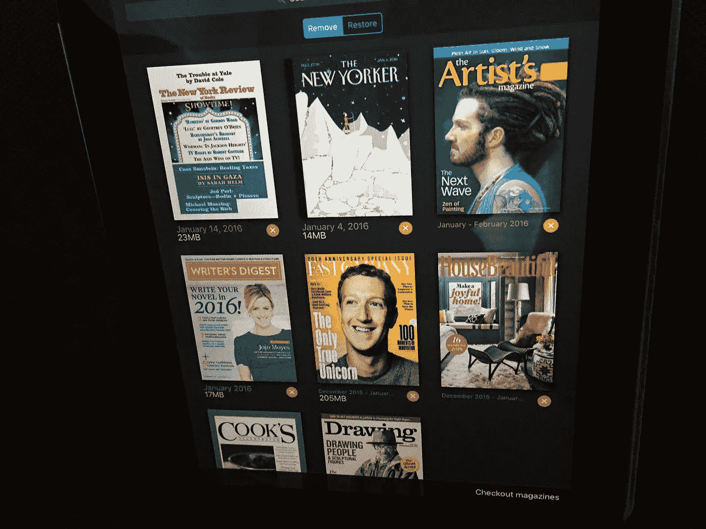

# 古怪的祖母倒影

> 原文：<https://medium.com/hackernoon/geeky-grandmother-reflections-1f381451ae70>

现在是 1995 年。我在加拿大首都渥太华的机场，等待乘坐短途航班返回多伦多，我在机场商店浏览杂志打发时间。一些新的东西吸引了我的眼球——一本杂志的封面上写着“商业的新规则——工作是个人的——计算是社会的——知识就是力量——打破规则”。叫*快公司*。我买了它，从头到尾读了一遍，它以一种有意义的方式解释了这个新世界，

现在是 2016 年，快公司已经成熟。我也是，只是方式有些不同。作为一名[极客](https://hackernoon.com/tagged/geeky) [老奶奶](https://hackernoon.com/tagged/grandmother)，我现在用 Zenio 应用在 Ipad 上阅读 Fast Company 的周年纪念刊。我意识到我经历了和杂志一样的疯狂。21 岁以上的人都应该读读这篇文章。但是，带着对*Fast Company*的歉意，我将列出一些它为挑战的时间命名的事情——让你思考我们在过去二十年中遇到了什么——并且经常被遗忘

*   美国网景公司
*   掌上领航员
*   Travelocity
*   福克斯新闻频道
*   克雷格列表（网站名）
*   无线局域网（wireless fidelity 的缩写）
*   在前的
*   第三代
*   高清晰度电视
*   贝宝
*   数字录像机
*   纳普斯特(公司名)
*   亚马孙
*   Zipcar
*   全球（卫星）定位系统
*   MapQuest
*   网络电话
*   维基百科(一个基于 wiki 技术的多语言的百科全书协作计划ˌ也是一部用不同语言写成的网络百科全书ˌ 其目标及宗旨是为全人类提供自由的百科全书)ˌ开放性的百科全书
*   翻晒
*   全食超市
*   创意类
*   人类基因组
*   我的空间
*   脸谱网
*   油管（国外视频网站）
*   半岛电视台
*   苹果手机
*   铬
*   推特
*   照片墙
*   Etsy
*   Kickstarter
*   沃比·帕克
*   网飞
*   平方
*   优步
*   爱彼迎（美国短租平台）
*   苹果手表

感谢，*快公司* —往往我是通过你才第一次遇到这些事情的！未来 20 年，我们将了解什么？

# 分享这个:

> [黑客中午](http://bit.ly/Hackernoon)是黑客如何开始他们的下午。我们是阿妹家庭的一员。我们现在[接受投稿](http://bit.ly/hackernoonsubmission)并乐意[讨论广告&赞助](mailto:partners@amipublications.com)机会。
> 
> 如果你喜欢这个故事，我们推荐你阅读我们的[最新科技故事](http://bit.ly/hackernoonlatestt)和[趋势科技故事](https://hackernoon.com/trending)。直到下一次，不要把世界的现实想当然！

