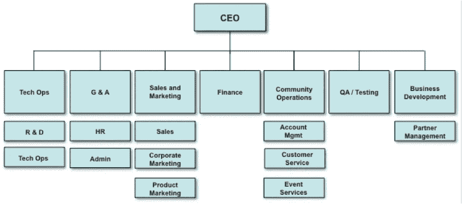
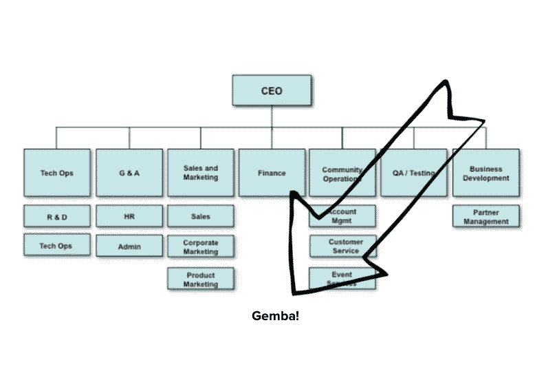

# Gemba 时间

> 原文：<https://medium.com/hackernoon/gemba-time-373f049712e7>

*Gemba。在日语中，Gemba 的意思是“真实的地方”。行动发生的地方。这是典型的组织结构图。*

你认为 Gemba 在这个组织结构图中处于什么位置？

注意到什么了吗？你的位置越高，就离 Gemba 越远。你离得越远，就越脱离现实。将根据 Gemba 是什么的幻影作出决定。在大多数公司，首席执行官总是最后一个知道。你预测的大工程问题即将到来，而你的组织正在努力解决，你的副总裁总是最后一个知道。你的客户想从产品中得到什么，项目经理总是最后一个知道。用户不关心你公司的组织结构。事实上，如果他们能猜出你公司的组织结构，这意味着你有麻烦了。

> “当你打开新 iPhone 的包装盒时，你能猜出谁是苹果的霸主吗？是的。是你，顾客；不是软件、制造、零售、硬件、应用的负责人，也不是签支票的人。这是完全应该的。”——埃里克·施密特(Eric Schmidt)在《谷歌是如何工作的》。

**这有什么解决办法？**

丰田高管大野泰一(Taiichi Ohno)发明了这种健步走。Gemba Walk 旨在让领导者识别现有的安全隐患，观察机器和设备状况，询问实践标准，了解工作状态，并与丰田员工建立关系。Gemba Walk 的目标是了解价值流及其问题，而不是回顾结果或发表肤浅的评论。惠普的高管们实践了一种叫做[管理](https://hackernoon.com/tagged/management)的方式，他们四处走动，对工作场所进行无组织的、随机的访问，这将有助于他们理解并解决他们所关心的问题。

**我们如何将 Gemba walk 付诸实践？**

CXO/副总裁/经理塑造其组织的最有力工具是什么？日历。(*如果您的日历不开放且不可见，祝贺您，您是在纵容组织透明度的缓慢消亡。打开它。*)开始在您的日历中设定 Gemba 时间。不要把它放在你的日历上，让它成为一种练习。作为首席执行官，您可能会担心您的公司可能达不到销售配额。大多数首席执行官接下来会做什么？他们给销售副总裁打电话，问问题，找借口！噗。问题解决了。Gemba 首席执行官会去现场几次，倾听电话，并获得神奇的洞察力，即他/她的代表无法很好地定位产品并为竞争设置陷阱。如果销售副总裁花了 Gemba 的时间，他早就有这个想法了。如果 PMs 按时完成了 Gemba 的支持和销售电话，他们就不用在制定路线图时要求提供包含重要功能要求的 excel 工作表。

> 在[高产出管理](https://www.amazon.com/High-Output-Management-Andrew-Grove-ebook/dp/B015VACHOK)中，安迪·格罗夫向一名记者讲述了一个事件——“一名对我们的管理风格感到困惑的记者曾经问我，“格罗夫先生，你的公司强调的是不是明显的平等主义迹象，比如非正式的穿着、隔板而不是办公室。。。就这么多做作？“我的回答是，这不是做作，而是生存的问题。在我们的业务中，我们每天都要把有知识、有权力的人和有地位、有权力的人混合在一起，他们一起做出可能在未来几年影响我们的决定。”

离开你的办公室。整理您的日历。去为 Gemba 腾出时间吧。这是生存的问题。

*感谢您的阅读:)如果您喜欢，请点击推荐！*

> [黑客中午](http://bit.ly/Hackernoon)是黑客们开始他们下午的方式。我们是 [@AMI](http://bit.ly/atAMIatAMI) 家族的一员。我们现在[接受提交](http://bit.ly/hackernoonsubmission)并很高兴[讨论广告&赞助](mailto:partners@amipublications.com)机会。
> 
> 如果您喜欢这个故事，我们建议您阅读我们的[最新科技故事](http://bit.ly/hackernoonlatestt)和[趋势科技故事](https://hackernoon.com/trending)。直到下一次，不要把世界的现实视为理所当然！

