# 用神经网络改变你自拍中的性别和种族

> 原文：<https://medium.com/hackernoon/gender-and-race-change-on-your-selfie-with-neural-nets-9a9a1c9c5c16>

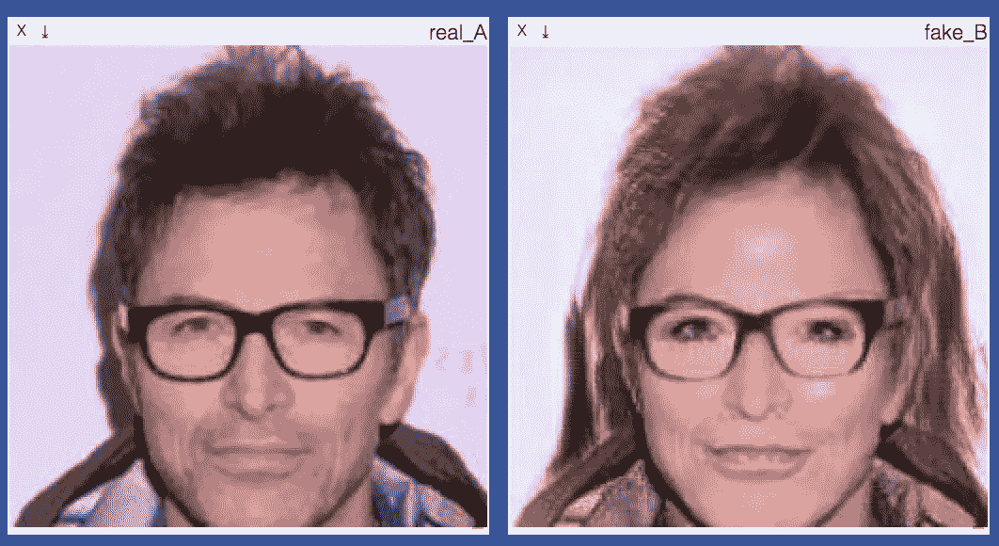

今天，我将告诉你如何使用带有几个生成神经网络(GANs)的复杂管道来改变照片上的脸。你大概见过一堆把你的自拍转换成女性或者老人的热门应用。他们没有一直使用深度学习，因为两个主要问题:

*   GAN 处理仍然繁重而缓慢
*   经典 CV 方法的质量足以满足生产水平

但是，无论如何，建议的方法有一些潜力，下面描述的工作证明了 GANs 适用于这类任务的概念。

转换照片的管道可能如下所示:

1.  从输入图像中检测和提取人脸
2.  以期望的方式变换提取的面部(转换成女性、亚洲人等。)
3.  高档/增强改造脸
4.  将变换后的人脸粘贴回原始图像

这些步骤中的每一步都可以用单独的神经网络来解决，也可以不解决。让我们一步一步地走过这条管道。

# 人脸检测

这是最简单的部分。你可以简单地使用类似`dlib.get_frontal_face_detector()` ( [例子](http://dlib.net/face_detector.py.html))的东西。dlib 提供的默认人脸检测器对 HOG 特征使用线性分类。如下例所示，生成的矩形不能适合整张脸，所以最好在每个维度上扩展矩形一些因子。

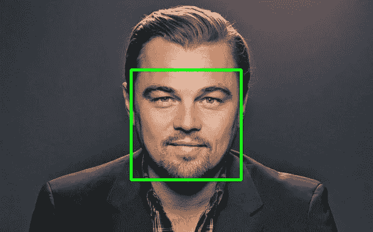

Detected face with dlib’s default detector

通过手动调整这些因素，您可能会得到以下代码:

结果如下:

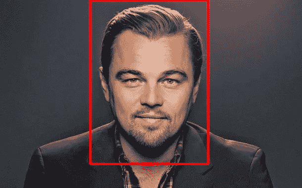

Extended face rectangle

如果出于任何原因，你对这种老派方法的表现不满意，你可以尝试 SOTA 深度学习技术。任何对象检测架构(例如 [Faster-RCNN](https://arxiv.org/abs/1506.01497) 或 [YOLOv2](https://arxiv.org/abs/1612.08242) )都可以轻松处理这项任务。

# 人脸变换

这是最有趣的部分。你可能知道，GANs 非常擅长生成和转换图像。而且有很多型号的命名像 *<前缀你自己选>* 甘。将图像从一个子集(域)变换到另一个子集(域)的问题称为域转移。而我选择的域转移网络是 Cycle-GAN。

**周波-甘**

为什么是 Cycle-GAN？因为它有效。而且因为上手真的很容易。访问[项目网站](https://junyanz.github.io/CycleGAN/)获取应用示例。你可以把画转换成照片，把斑马转换成马，把熊猫转换成熊，甚至把脸转换成拉面(这有多疯狂？！).

Applications of Cycle-GAN (pic. from [original paper](https://arxiv.org/abs/1703.10593))

要开始，你只需要准备两个文件夹，里面有你两个领域的图片(例如男性照片和女性照片)，用 Cycle-GAN 的 PyTorch 实现克隆[作者的 repo](https://github.com/junyanz/pytorch-CycleGAN-and-pix2pix) ，然后开始训练。就是这样。

**工作原理**

这张来自原始论文的图简明而完整地描述了这个模型是如何工作的。我喜欢这个想法，因为它简单、优雅，而且会产生很好的效果。

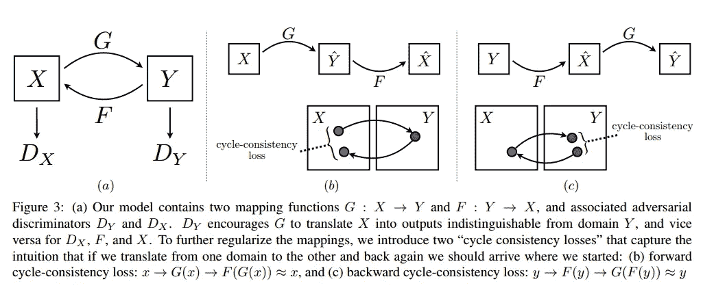

除了 GAN 丢失和循环一致性丢失之外，作者还添加了身份映射丢失。它的作用就像模型的正则化器，如果图像来自目标域，它希望图像不要改变。例如，如果 Zebra-generator 的输入是 Zebra 的图像，那么它根本不应该被转换。这种额外的损失有助于保留输入图像的颜色(见下图)

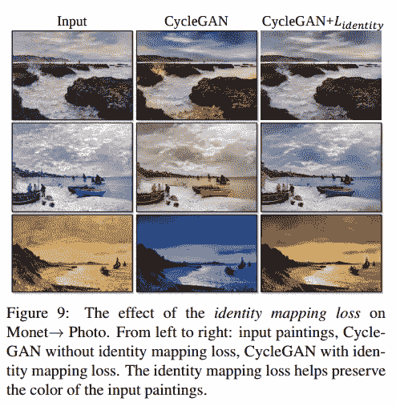

**网络架构**

生成器网络包含用于对输入进行两次下采样的两个步长为 2 的卷积、几个残差块和用于上采样的两个分数步长卷积。ReLu 激活和实例规范化用于所有层。

3 层全卷积网络用作鉴别器。该分类器没有任何完全连接的层，因此它接受任何大小的输入图像。论文[中首次介绍了一种 FCN 架构，用于语义分割的全卷积网络](https://arxiv.org/abs/1411.4038)，这种类型的模型如今变得相当流行。

全卷积鉴别器将一个输入映射到几个特征图，然后判断图像是真是假。这可以被解释为从输入中提取多个补丁并将它们分类为真/假。斑块的大小(或感受野的大小)由网络的层数控制。这种鉴别器也称为贴片传感器。在这篇文章中，菲利普·伊索拉向我解释了这个网络背后的魔力。通读一下，以便更好地理解。比如 1 层贴片——GAN 看的是 16×16 的贴片，而 5 层网络会有 286×286 的感受野。在 Cycle-GAN 论文中使用的鉴别器具有 70×70 感受野，具有 3 个 4x4 卷积层，随后是批量归一化和 LeakyReLu 激活。

**训练周期-甘**

让我们试着解决将男性照片转换成女性照片的任务，反之亦然。为此，我们需要包含男性和女性图像的数据集。嗯， [CelebA 数据集](http://mmlab.ie.cuhk.edu.hk/projects/CelebA.html)非常适合我们的需求。它是免费的，有 20 万张图片和 40 个二元标签，如性别、眼镜、穿着、金发等等。

CelebA dataset

这个数据集有 9 万张男性照片和 11 万张女性照片。这对我们的领地来说已经足够了。这些图片上人脸的平均尺寸并不大，只有 150x150 像素。因此，我们将所有提取的人脸尺寸调整为 128x128，同时保持宽高比，并使用黑色背景。我们的循环 GAN 的典型输入可能如下所示:

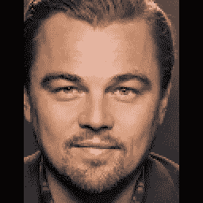

128x128 preprocessed input image

**知觉丧失**

在我们的设置中，我们改变了身份损失的计算方式。我们使用来自预训练的 vgg-16 网络的风格特征，而不是使用每像素损失。这很合理，依姆霍。如果你想保持图像的风格，为什么要计算像素的差异，当你有层负责表现图像的风格？这个想法首先在论文[中介绍，用于实时风格转换和超分辨率的感知损失](https://arxiv.org/abs/1603.08155)，并且广泛用于风格转换任务。这个小小的变化导致了一些有趣的效果，我将在后面描述。

**训练**

嗯，整体模型相当庞大。我们同时训练 4 个网络。输入通过它们几次，以计算所有损失，加上所有梯度也必须传播。1 在 GForce 1080 上对 200k 图像进行一次训练需要大约 5 个小时，因此很难用不同的超参数进行大量实验。在我们的最终模型中，用感知损失替代身份损失是与原始 Cycle-GAN 配置的唯一变化。具有少于或多于 3 层的贴片没有显示出好的结果。beta =(0.5，0.999)的 Adam 用作优化器。学习率从 0.0002 开始，每个时期都有小的衰减。Batchsize 等于 1，到处都使用实例规范化，而不是批处理规范化。我想注意到的一个有趣的技巧是，不是将生成器的最后一个输出提供给鉴别器，而是使用了一个包含 50 个先前生成的图像的缓冲区，因此来自该缓冲区的一个随机图像被传递给鉴别器。因此，D 网络使用早期版本 g 的图像。这个有用的技巧是 Soumith Chintala 的精彩笔记中列出的技巧之一。我建议在与 GANs 合作时，将此列表放在您的面前。我们没有时间尝试所有这些方法，例如 LeakyReLu 和 Generator 中的替代上采样层。但是设置和控制生成器-鉴别器对的训练时间表的技巧确实增加了学习过程的稳定性。

**实验**

最后，我们看到了示例部分。

训练生成网络与训练其他深度学习模型有点不同。您不会经常看到损耗降低和精度提高的曲线图。对你的模型做得有多好的评估主要是通过可视化查看生成器的输出来完成的。一个典型的循环甘训练过程看起来像这样:

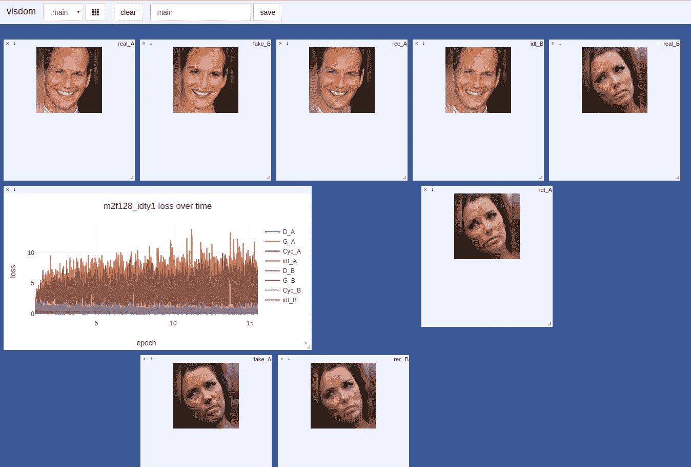

发电机偏离，其他损失慢慢下降，但尽管如此，模型的输出是相当好的和合理的。顺便说一下，为了获得这种训练过程的可视化，我们使用了 visdom，一个由脸书研究所维护的易于使用的开源产品。在每次迭代中，显示以下 8 张图片:

*   real_A —来自域 A 的输入
*   fake_B —由生成器 A->B 转换的 real_A
*   rec_A —重建图像，fake_B 由生成器 B->A 转换
*   idty_B —实数 _A，由生成器 B->A 转换
*   4 根据图像从域 B 转换到域 a

经过 5 个时代的训练，你可以期待一个模型产生相当好的图像。看看下面的例子。发电机的损耗并没有减少，但女性发电机仍然可以把长得像 G .辛顿的男人的脸变成女人。怎么会呢？！！

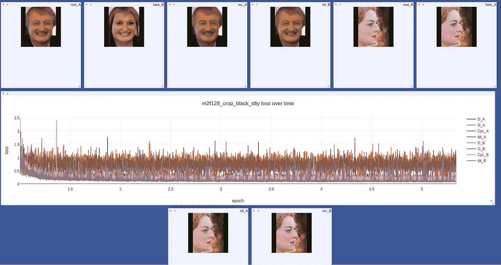

有时候事情会变得很糟糕:

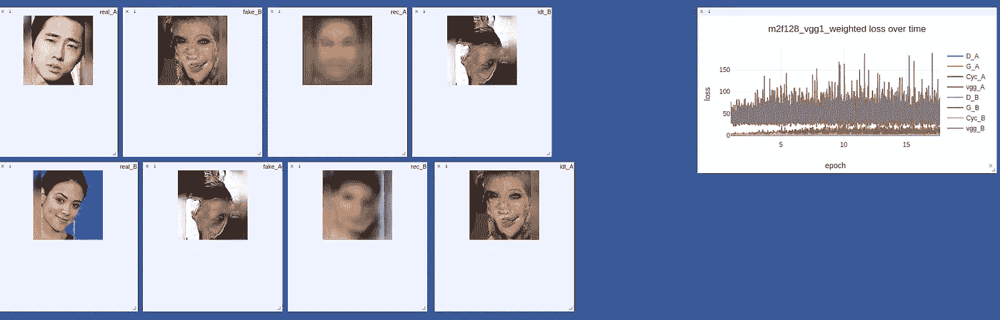

在这种情况下，只需按 Ctrl+C 并打电话给记者，声称你“刚刚关闭了人工智能”。

总之，尽管有一些伪像和低分辨率，我们可以说 Cycle-GAN 非常好地处理了这项任务。这是一些样品。

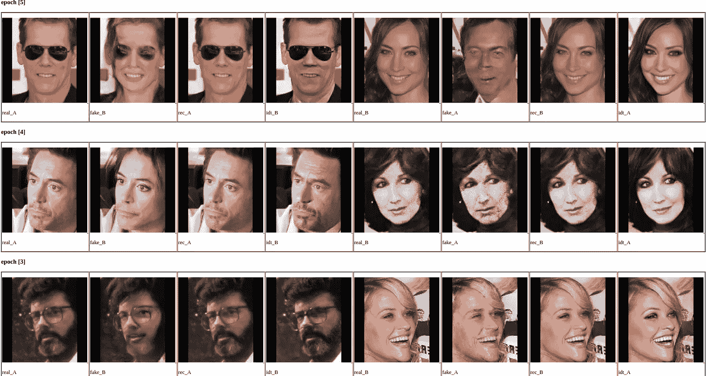

Male <-> Female

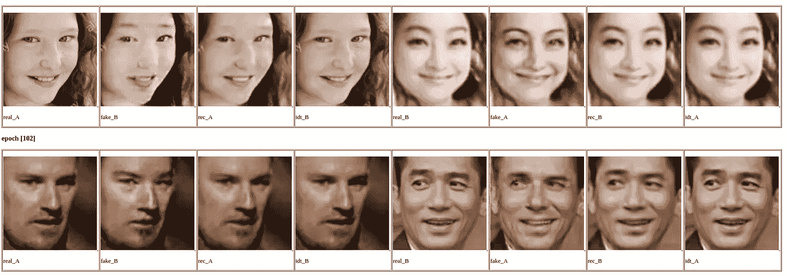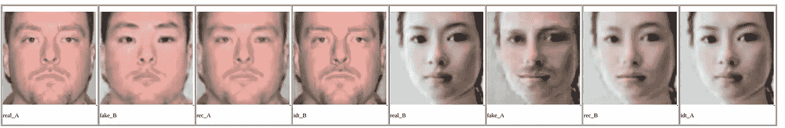

White <-> Asian

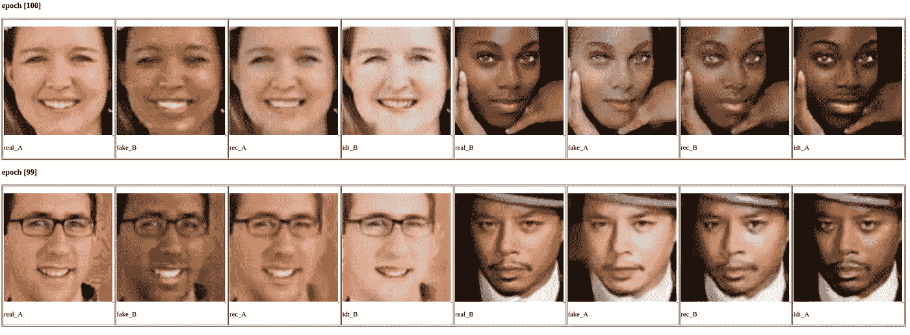

White <-> Black

更多名人的例子:

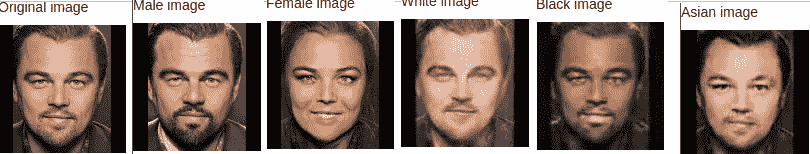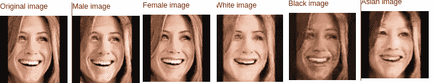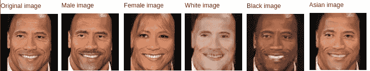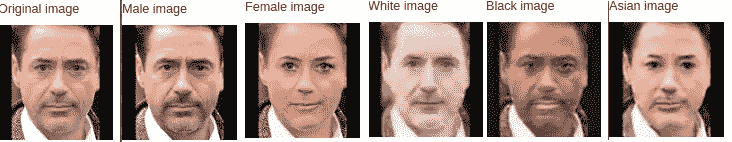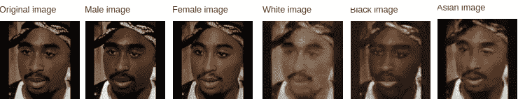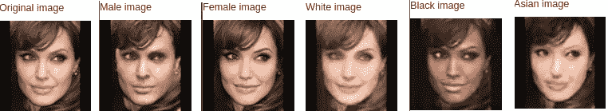

现在是一个极端的例子:

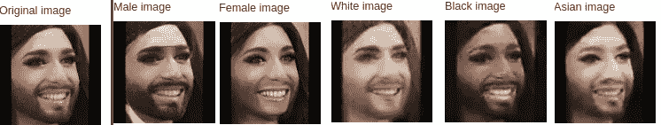

不错吧。你注意到对身份图像的有趣影响了吗？如果我们使用原始身份损失，idty_A 和 idty_B 将正好等于它们的原始图像。但是随着感知损失，身份映射现在学习每个域的最强特征，并在输入上增加它们。这就是为什么男人变得更成熟，女人变得更亮的皮肤和更多的化妆品。如果你多次传递一幅图像，效果会增强。那是一个随时可用的美化应用程序。看看这个:

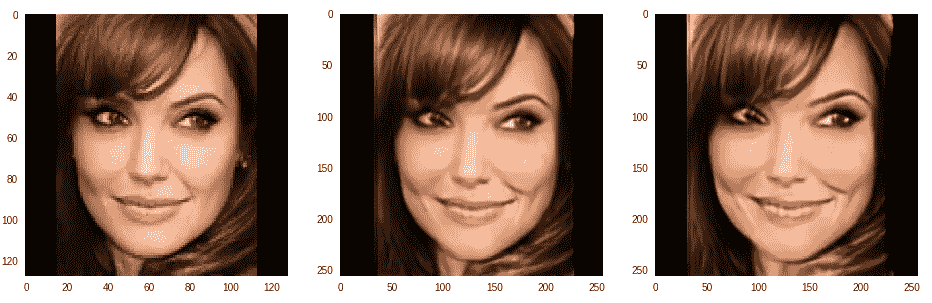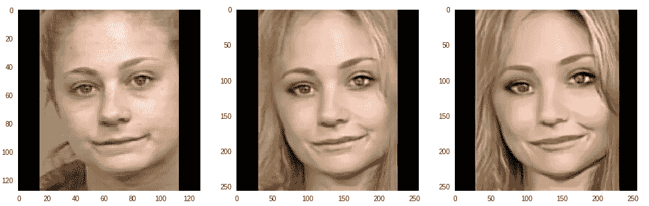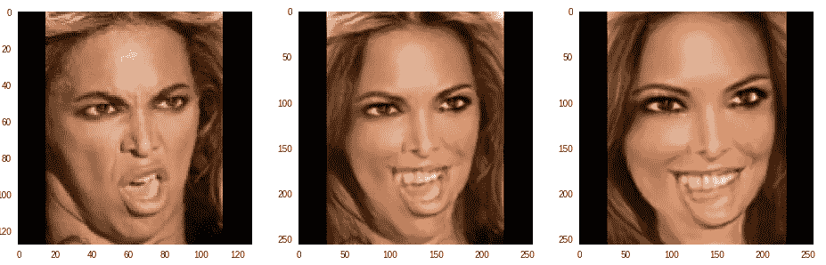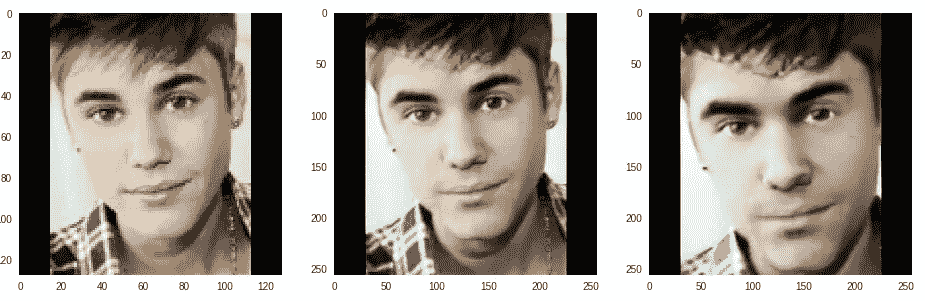

闭嘴，把你的钱给我！

# 图像超分辨率

Cycle-GAN 产生的图像分辨率较低。最好增加和增强它们。提高图像分辨率的问题称为超分辨率。在这个领域已经做了大量的研究。我想指出两个能够解决图像超分辨率任务的最先进的深度学习模型:SRResNet 和 EDSR。

**SRResNet**

在论文[中，作者提出了一种基于 ResNet 架构的超分辨率生成网络。使用目标图像和超分辨率图像之间的 MSE 损失作为目标。但是增加了两个额外的术语:VGG 特征的鉴别损失和感知损失(看，每个人都在做！)](https://arxiv.org/abs/1609.04802)

生成器使用带有 3x3 卷积、批量标准化和参数 ReLu 的残差块。子像素卷积用于上采样。

鉴别器使用 8 个具有 3x3 内核和泄漏 ReLu 激活的卷积。缩减像素采样是通过步进卷积完成的(没有池层)。分类是通过最后两个完全连接的层来完成的，在末端具有 s 形激活。

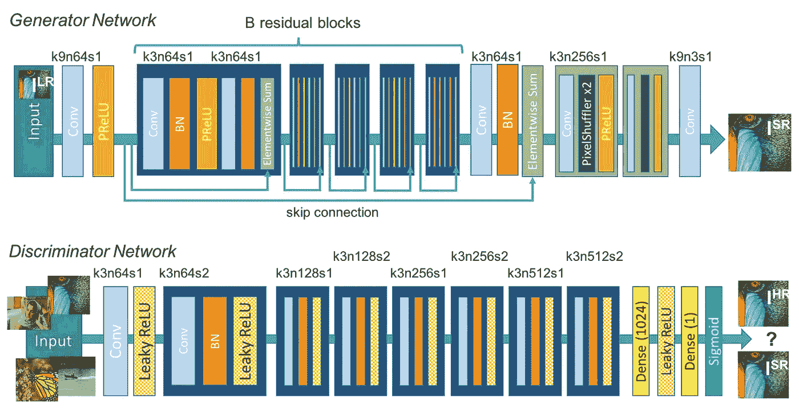

SRResNet architecture

**EDSR**

[增强型深度超分辨率网络](https://arxiv.org/abs/1707.02921)类似于 SRResNet，但改进不多:

*   不使用批处理标准化。这可以节省高达 40%的内存，并允许增加层数和过滤器。
*   在剩余块之外不使用 ReLu。
*   所有 ResNet 块在与单位向量连接之前都按 0.1 进行缩放。这有助于稳定培训过程。

**培训**

为了训练 SR 网络，我们需要高分辨率图像的数据集。我们从 Instagram 上解析了数千张带有#face 标签的图片。训练通常在小块图像上进行，而不是在完整图像上进行。这有助于生成器处理细小的细节。在评估模式中，全尺寸图像被传递，这是可能的，因为网络的全卷积方式。在实践中，EDSR，这被认为是一个增强 SRResNet，没有显示出更好的结果，并在培训时间缓慢。因此，在我们的最终流水线中，我们使用了在 64x64 补丁上训练的 SRResNet，没有感知损失，也没有鉴别器。下面是训练集中的一些例子。

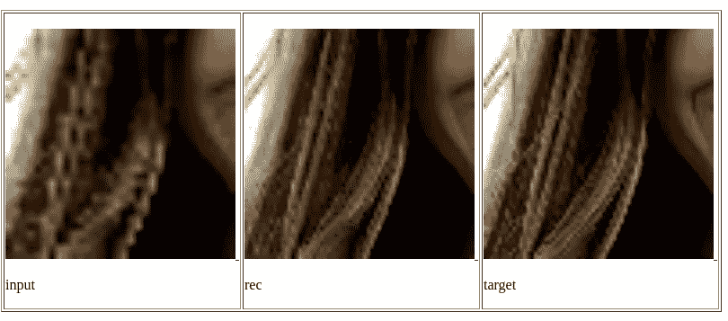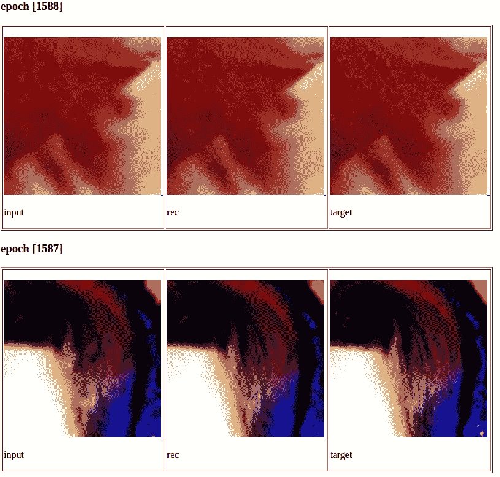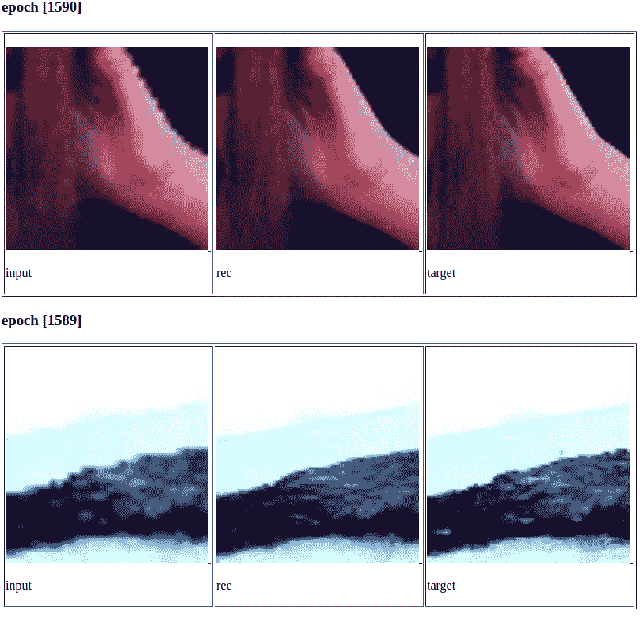

这就是这个网络在我们的人造图像上的表现。不完美，但现在还可以。

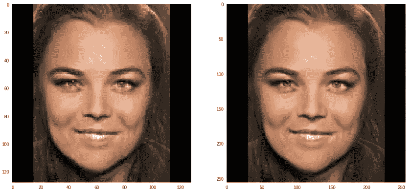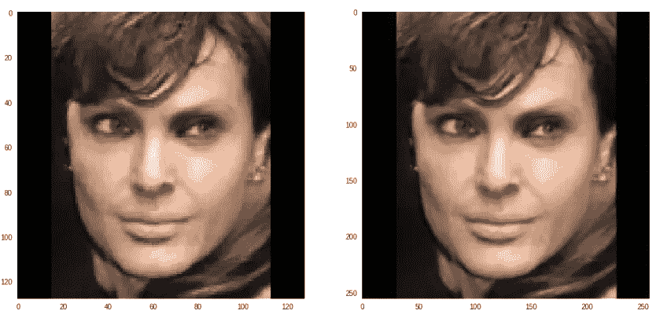

# 将图像粘贴回原始图像

甚至这个任务都可以通过深度学习来完成。我发现了一篇关于图像混合的有趣论文。GP-GAN:迈向逼真的高分辨率图像融合。我不会深究细节，只给你看报纸上的图表。

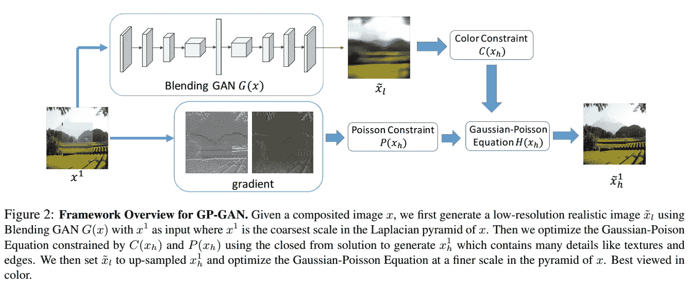

但是我们已经实现了简单明了的解决方案。变换后的面粘贴到原始图像中，当靠近其边缘时，透明度会增加。结果看起来像这样:

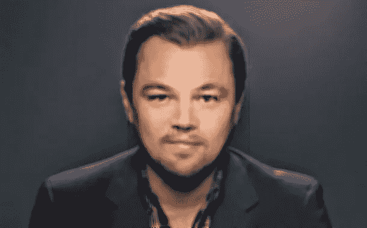

# 结论

结果似乎还可以，但是还没有准备好生产。在压缩生成网络以使它们变得轻便和快速的领域，还有很多工作要做。这包括知识提炼、因式分解、量化等方面的实验。然后整个管道可以被部署为移动应用。未来有很多有趣的工作…