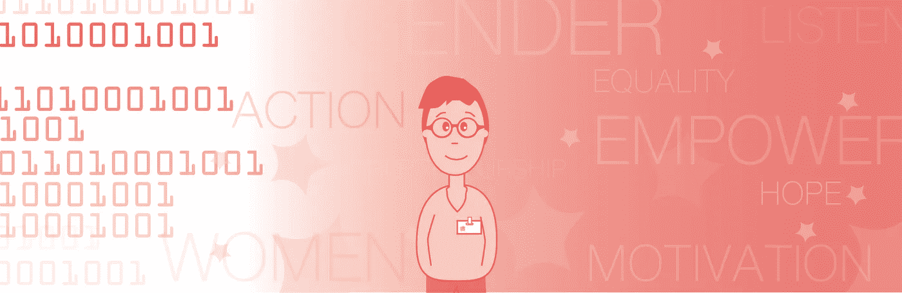
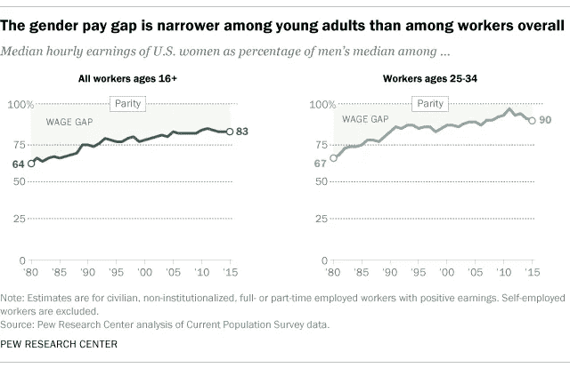
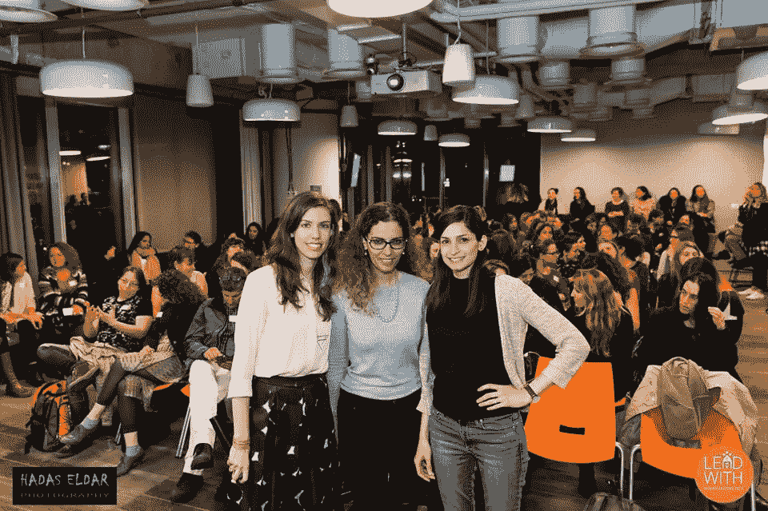

# 科技领域的性别平等:光说是不够的

> 原文：<https://medium.com/hackernoon/gender-equality-words-are-not-enough-969108754b93>

在科技行业工作，你可能会对性别不平等的现实视而不见。你的团队包括男性和女性设计师、程序员和经理，你们都在和谐地工作。然而，对于科技行业的女性来说，事情可能没有你想象的那么好——你可能不明白或者不想明白，在你的行业，甚至是你的公司，存在着严重的性别不平等问题。我们生活在泡沫中，只要看看数据，告诉我没有真正的问题——女性只拥有所有初创公司的 5%,她们只获得 28%的计算机工程学位，在排名前 100 的风险投资公司中，只有 7%的合伙人是女性。你上一次和你的女同事或在工作中的配偶开诚布公地谈论她在工作中的感受是什么时候？您什么时候听过他们在行业中面临的挑战？这里有一个很大的问题和机会，解决一个现实问题的第一步是理解它。

我在科技公司工作了很长时间。我曾在一家被收购的医疗设备初创公司工作，创办了自己的移动初创公司，并作为顾问和导师与企业家(男性和女性)一起工作。我从未认为女性与男性有什么不同，也从未与男性和女性工程师、软件开发人员和产品经理共事过。直到最近，我和我的妻子阿维夫谈到了这个问题，我才真正意识到这是一个个人问题。通过她的眼睛和经历，我明白了这里存在一个问题——一个真正值得解决的问题。

但是如果你和这个问题没有个人联系，你会怎么做呢？怎么理解呢？最重要的事情是开始一场对话，并倾听你的女性和男性同事对此的看法。提问题，听他们的故事，看事实。试着观察你的周围，看看你的公司里有多少女人？有多少人在管理岗位上？看看这些数字，非常清楚他们在公司的待遇。不要看一个具体的人，而要看一个群体。你可能会发现你的公司很棒，对每个人都很好。你可能会发现有一个问题值得解决，你可以做些什么。

在过去的一年里，Aviv 和她的两个朋友 Dalit 和 Shira 正在致力于一个新的创业项目，一个新的非营利组织和社区，旨在赋予科技世界的女性权力——lead with。她的参与和社会企业家精神让我对这个主题进行了大量的研究和思考，并最终加入他们，志愿成为一名导师和设计师。

A photo from one of LeadWith’s events — photo credit Hadas Eldar

在做研究时，我接触到这样一个事实，即如今男女之间不平等，而且不仅仅是在科技界。政治、商业和技术领域都由男性主导。这种差距在工资、职位、工作时间和社会接受度方面都很明显。我认为，这些差距被非常有影响力的女性的成功所模糊，如雅虎和雪莉·桑德伯格的前首席执行官玛丽莎·梅耶尔，脸书的首席运营官。然而，他们占主导地位的性格和强大的影响力有时会造成没有问题的假象。

根据皮尤研究中心对美国全职和兼职工人每小时收入中位数的分析，2015 年，女性的收入是男性的 83%。然而，千禧一代的差距正在慢慢缩小。对于 25-34 岁的成年人来说，男性每小时挣 1 美元，女性每小时挣 90 美分。有差距，但差距变小了。据说，这种差距持续存在的原因是女性为了抚养孩子或陪伴家人而中断职业生涯。较少的男性说他们正在休息。这打断了他们的长期职业目标和收入。

From Pew Research Center Analysis

差距正在缩小，因为有了关于性别平等和妇女赋权的公开对话。我们的社会开始开放，我们看到越来越多的女性处于领导地位，也明白不平等可能会阻碍我们的经济、技术和政策。越来越多的年轻政治家公开谈论女权主义和不平等，比如加拿大总理[贾斯汀·特鲁多](https://twitter.com/JustinTrudeau)、[巴拉克·奥巴马](https://twitter.com/BarackObama)以及现在的法国新总理[埃马纽埃尔·马克龙](https://twitter.com/EmmanuelMacron)。与许多政治家和公众人物不同，他们正在采取实际行动来改变他们的社区。特鲁多和马克龙创建了一个平等的政府，其中包括 50%的男性和 50%的女性部长。

Canada’s Prime Minister Justin Trudeau talks about gender equality

大胆的女企业家正在加速这种变化，她们正在通过创建组织开展一场运动，增强妇女成为企业家、创造、发明和领导世界变革的能力。像[雪莉·桑德伯格](https://www.facebook.com/sheryl)创立的 [Lean In](https://www.facebook.com/leanincommunity/?hc_ref=SEARCH) 、脸书的【首席运营官】、 [SheWorx](https://www.facebook.com/sheworx/) 和 [LeadWith](https://www.facebook.com/LeadWith/) 等组织都是由女性创立和领导的非营利组织**——男性应该加入这个运动**。

这些组织是做什么的？以 LeadWith 为例，运行几个倡议和程序来解决问题。他们举行各种主题的聚会，让他们的社区成长和联系。他们还启动了一个辅导项目，帮助那些寻求职业道路建议、打造产品和创业的女性(我有幸在这个项目中担任导师)。最近，他们与 Wix 联手，为女性企业家创建了一个加速器。最近，他们甚至为年轻的高中天才女孩举办了一次黑客马拉松，帮助她们开发新产品和解决问题，但最重要的是给她们改变的信心，并教育她们走向伟大。

Shira, Dalit and Aviv in one of the LeadWith events — photo credit: Hadas Eldar

参加活动并指导她们社区的女性，我感受到了惊人的能量，这些女性想要改变世界并产生影响。我成为了谈话的一部分，倾听和理解女性以及她们的感受。通过参与其中，我也成为了解决方案的一部分

# 男人为什么要在乎性别平等？

男人(和女人)应该投入巨大的努力来实现性别平等，我们有数据告诉你为什么。女性应该在所有领域得到平等的代表和补偿:政治、商业、学术——无论在哪里。如果你希望公司或组织取得成功，你既应该雇佣更多女性，也应该渴望增加管理岗位上的女性人数。

Catalyst 的一份报告称，雇佣最多女性的公司平均销售回报率高出 42%，股本回报率高出 53%，投资资本回报率高出 66%。

盖洛普(Gallup)的一份报告指出，企业中女性的比例与公司的成功之间存在关联。报告建议女性鼓励员工的成长和发展，并定期提供积极的反馈。这些行动对任何企业都非常有价值，因为它有助于最大限度地提高员工的参与度和承诺。报告指出，女性往往比男性同事更有同情心、更有教养、更有耐心。这在不同的领导风格中显而易见

彼得森国际经济研究所和 EY 进行的另一项研究[分析了来自 91 个国家各行各业的 21，980 家全球上市公司](http://www.iie.com/publications/newsreleases/newsrelease.cfm?id=241)的结果。该研究显示，在领导岗位或 C 级岗位上女性比例至少达到 30%的公司，净利润率会提高 6%。

链接到 https://piie.com/publications/wp/wp16-3.pdf[PIIE 论文全文](https://piie.com/publications/wp/wp16-3.pdf)

如果你想让你的生意盈利，你必须关心性别平等。如果这还不够，看看下一段视频，听听这位阿里巴巴的创始人讲述为什么女性对他的生意很重要。

Alibaba’s Founder Jack Ma about Women and their contribution to Alibaba’s success

# 男人为什么要采取行动？

男人应该更多参与的第一个原因是，光说是不够的——为了做事情，你必须执行，而不仅仅是想一个主意。就像创业一样，对一个产品有想法只是工作的 0.05%。为了一个更加平等的世界做出改变，你的话是工作的 0.05%。如果你想做出改变，产生影响，为这个世界带来平等，你必须执行。你需要把手弄脏并采取行动。你可以加入一个非营利组织，你可以在你的工作场所发起一个项目，你可以积极推动雇佣优秀的男性和女性——一视同仁。

第二个原因是，加入像 lean in T1 和 lead with T3 这样的组织，会让你对女性在科技领域面临的问题有更深入的了解。它给了你一个公开倾听男女谈论性别平等问题的机会——它创造了一个对话。你可能会认为在创业公司和技术领域没有问题，因为你的团队中有两位伟大的女性程序员，你像男同事一样和她们一起工作。然而，成为这样一个组织的一部分会让你看到更大的图景和数据。这将反映出你的团队有 2 名女性程序员，但多了 12 名男性程序员。它可能向你表明，你的情况不是一个例子，而是一个例外，或者你忽略了它是伪装的。

最后，你会看到女性是多么强大、有才华和专业。参加完这些会议后，你会毫不怀疑女性和男性是平等的，她们可以像男性一样影响这个行业，甚至更多。你会接受这样一个事实:男人应该需要女人，女人需要男人来制造新产品、解决问题和引领技术进步——我们需要彼此。

# 男人能做些什么来改变呢？

几个月前，在国际妇女节那天，我在脸书和推特上看到大量男性的帖子，称赞他们的妻子、女儿、母亲和经理是最伟大的人，有权有势，事业有成。他们都分享了一张照片，并讲述了他们生活中的女性是多么坚强的故事。这是帮助妇女赋权的第一步。然而，这还不够。这样的帖子是伟大的创举，在我们的社会中创造了巨大的参与和意识。但是男人应该超越意识阶段，开始采取行动。

真正的挑战是让男性走出被动意识阶段，采取更多行动。男人应该加入 [LeanIn](https://leanin.org/) ，带头做志愿者，投入他们的时间去改变和解决性别平等的问题。他们应该推动他们的女儿，妻子和朋友发展他们的职业生涯，建立公司，追求高等教育。他们应该大声疾呼，支持平等。明确这是他们核心价值观的一部分。

LeadWith Mentoring session

我们在这个旅程中的使命是实现性别平等——这是男人和女人的共同使命，不是女人的问题。我们应该共同拥有它，创造一个男女作为企业家、政治家、科学家等拥有平等权利和机会的现实。如果有更多的男人加入进来，衡量我们的成功和见识将会非常有趣。如果更多的男性加入，我们能提高实现性别平等的机会吗？我们应该试试看。

> 加入脸书的 LeadWith 社区:[https://www.facebook.com/LeadWith/](https://www.facebook.com/LeadWith/)

请随时在 Linkedin 上与我联系:【https://il.linkedin.com/in/illaigescheit 

如果你想问问题，开始对话，讲述你的故事，请留下评论。

