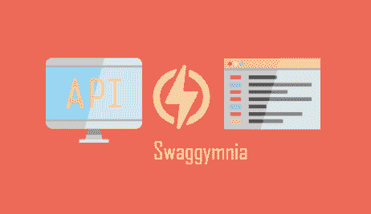
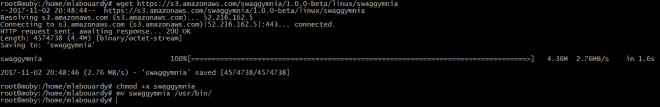
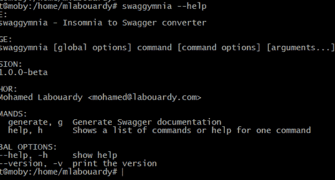
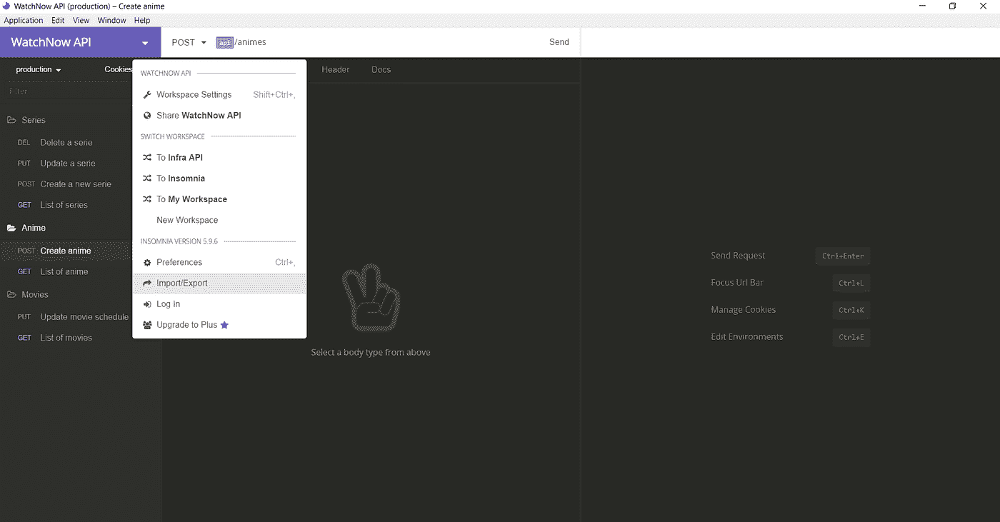
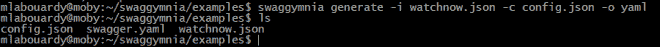
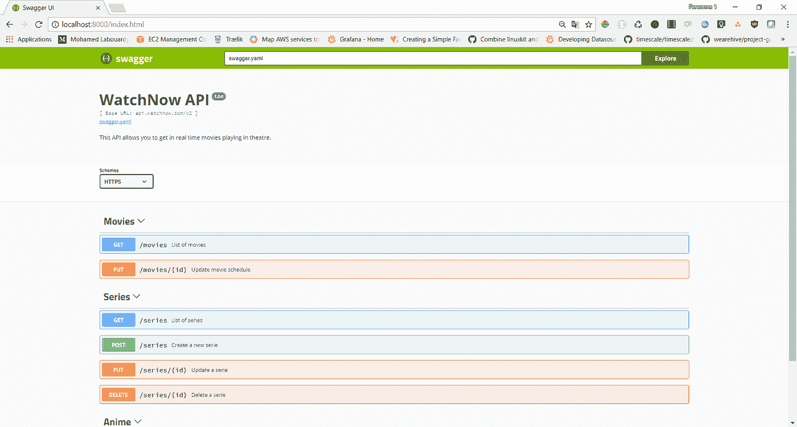

# 从失眠中生成漂亮的 Swagger API 文档

> 原文：<https://medium.com/hackernoon/generate-beautiful-swagger-api-documentation-from-insomnia-ffaa2b77828e>

我最近构建了一个名为[**swagggymnia**](https://github.com/mlabouardy/swaggymnia)的工具，为[失眠症](https://insomnia.rest/) REST 客户端中的一个现有 API 生成 [Swagger](https://swagger.io/) 文档。所以，请做好准备，阅读一篇简短而有趣的小贴士。

从下载**swagggymnia**开始，找到适合你的系统的[包](https://github.com/mlabouardy/swaggymnia)并下载。对于 linux:

> wget[https://S3 . Amazon AWS . com/swagggymnia/1 . 0 . 0-beta/Linux/swagymnia](https://s3.amazonaws.com/swaggymnia/1.0.0-beta/linux/swaggymnia)

下载**swagggymnia**后。向二进制文件添加执行权限:

> chmod +x swaggymnia

注意:对于**窗口**，确保**swagggymnia**二进制文件在**路径**上可用。[本页](https://stackoverflow.com/questions/1618280/where-can-i-set-path-to-make-exe-on-windows)包含在**窗口**上设置**路径**的说明。

安装后，通过打开一个新的终端会话并检查**swagggymnia**是否可用来验证安装是否有效:

完成后，从**失眠症**中导出您的 API:

接下来，创建一个配置文件，格式如下:

然后，发出以下命令:

> swaggymnia generate-I watch now . JSON-c config . JSON-o YAML

结果，您应该看到生成了一个名为 *swagger.yml* 的新文件:

现在我们的 Swagger 规范已经生成，您可以将您的 Swagger 规范发布为面向客户的文档。

为此，您可以使用 [Swagger UI](http://swagger.io/swagger-ui/) ，它将您的 Swagger 规范转换成漂亮的交互式 API 文档。

你可以从[这里](https://github.com/swagger-api/swagger-ui/releases)下载 **Swagger UI** 。它只是 HTML、CSS 和 JS 文件的捆绑，不需要框架什么的，可以安装在任何 HTTP 服务器上的一个目录下。

一旦你下载了它，你就把你的 **swagger.yaml** 文件放到 **dist** 目录中——打开【index.html】的并把它改为指向你的 swagger 文件而不是[**http://petstore.swagger.io/v2/swagger.json**。](http://petstore.swagger.io/v2/swagger.json.)

然后你可以在你的浏览器中打开**index.html**，看到你新的漂亮的，交互式的 API 文档:

