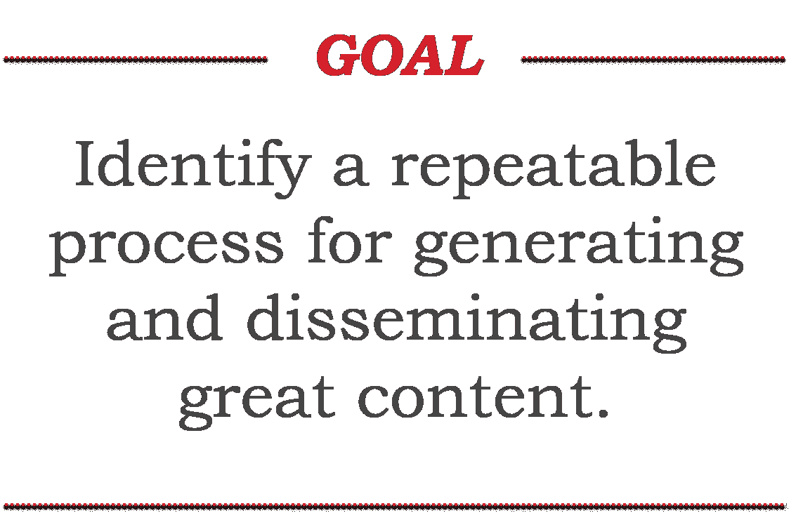
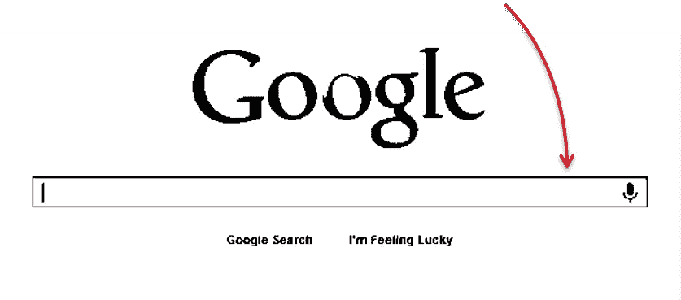
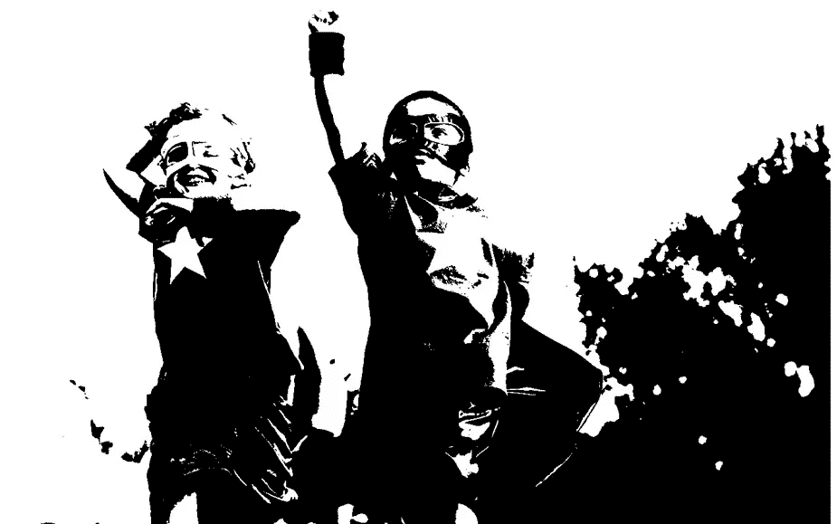
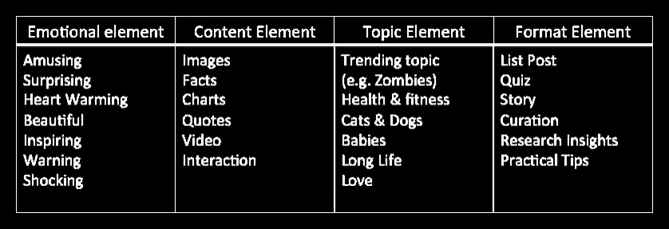
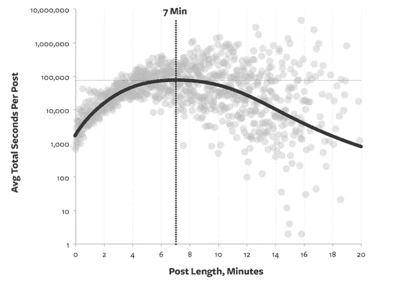
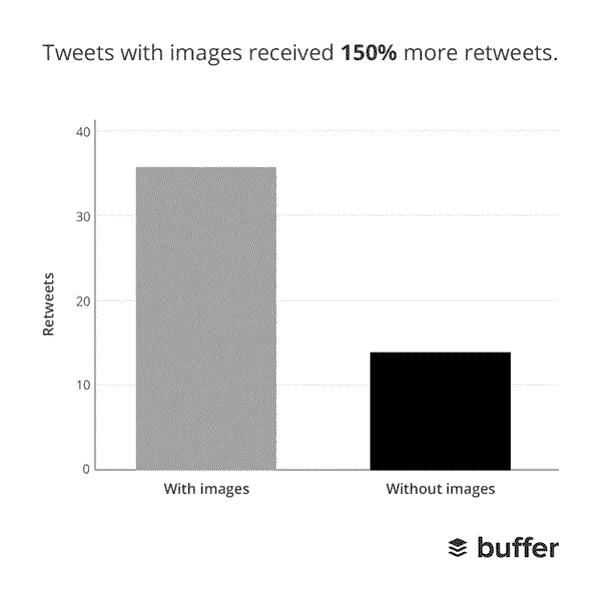

# 为你的创业、你自己或你的客户创造免费的公关

> 原文：<https://medium.com/hackernoon/generate-free-pr-for-your-startup-your-self-or-your-clients-b7b449e70ffc>

## 发布内容的 7 个步骤

在过去的两年里，我用这个方法让自己在 TechCrunch、VentureBeat、美国消费者新闻与商业频道和其他一些出版物上发表了文章。我还帮助我们投资组合中的许多公司部署了相同的流程，为他们的初创公司带来了高影响力、*、公关。*

*任何营销策略都需要努力。没有人会来敲你的门。但是如果你付出努力，你可以为你的创业公司、你自己或者你的客户带来巨大的轰动。*

**

# *第一步:了解你的(潜在)受众*

***你在解决什么问题？**当你的潜在客户试图解决这个问题时，他们在这里输入了什么？*

**

## *任务:写下客户在寻求解决你所解决的特定问题时可能会进行的 5-10 次搜索！*

> ***举例:蓝色围裙***
> 
> *显而易见的搜索词是“送餐服务”*
> 
> *不太明显的搜索词是“两个人的晚餐创意”*

*客户可能进行的明显搜索最好在传统营销渠道(新闻发布、广告活动等)中解决。).这是不太明显的搜索，使一个伟大的内容块和我们将寻找去后。*

# *第二步:确定你的目标平台*

***写博客不仅仅是你的“博客”的专利。你的博客内容有 4 个主要的平台。***

**

1.  *社论:把这些看作是在追求广大的观众。《纽约时报》、《华尔街日报》、《福布斯》、甚至在较小程度上还有 TechCrunch，都拥有相当大且广泛的受众。这里的目标是建立知名度，展示一些思想领导力。*
2.  ***客座博文:**理想情况下，这些网站拥有比你自己更多的受众。这个策略是为那些很少或者没有网络流量的初创公司准备的。让其他人去做建立观众群的艰难工作(理想情况下是你所追求的同一批观众),并为他们提供免费内容作为回报。*
3.  ***你自己的网站:**在你拥有持续的网络流量之前，只使用这个来宣传公司的里程碑事件或事件。你可能想在这里重新发布文章或将其用于 SEO 目的，但我的观点是，内容营销已经超越了 SEO，应该专注于高质量的思想领导力和眼球，而不是没有人会阅读的关键字填充帖子(来自一个经营一家公司的人)。*
4.  ****发布平台(Medium/LinkedIn):** 两年前，当我第一次将这个过程整合在一起时，这个选项并不存在，或者至少还没有成为一个可能的选择。这些平台的独特之处在于，用户在这个平台上复制其他平台的内容，甚至使用这些媒体来替代他们的博客。我建议也这样做。典型的策略是，如果你的内容被选为社论或客座博文，在文章发表后等待 1-2 周。*

## *任务 1:谷歌“(出版物)论坛版指南”，然后开始一个电子表格，并跟踪每个出版物的电子邮件地址和格式。争取到 20。*

## ***任务 2:创建一个潜在客户可能会阅读的行业相关博客的电子表格。***

> ***案例研究:**Buffer 的创始人 Leo Widrich 在为自己的博客撰写任何东西之前，通过积极的客座博文策略获得了 10 万名客户。*
> 
> *[http://search engine watch . com/sew/how-to/2194396/how-guest-posting-provided-one-site-from-0-to-100-000-customers](http://searchenginewatch.com/sew/how-to/2194396/how-guest-posting-propelled-one-site-from-0-to-100-000-customers)*

*Leo 所做的是我们中很少有人能做到的事情(每天 1-2 篇文章)，但它表明，从其他公司的受众那里获取信息是建立自己的受众群的有效策略。*

*下面是 Leo 在推介他的客座博文时使用的一个简单的电子邮件模板:*

> *嗨伙计们，*
> 
> *作为一个刚刚开始学习一些基本的网页设计课程的人，我发现你的网站非常有用，所以在此简单地感谢你。*
> 
> *我想问你是否对我写的一篇客座博文感兴趣，我把它命名为“充分利用 Twitter 的 10 个工具”。它涵盖了一些最新的 Twitter 工具，这些工具对我保持高效率有很大帮助。*
> 
> *我希望你能让我知道你是否对这个帖子感兴趣。*
> 
> *作为我写作风格的参考，我最近发表了:[六、修改](http://sixrevisions.com/tools/10-new-twitter-tools-that-will-make-your-life-easier/)[social media examiner](http://www.socialmediaexaminer.com/5-new-twitter-tools-worth-exploring/)、& [Inspiredm](http://inspiredm.com/10-twitter-tools-to-save-more-time/) 。*
> 
>  *狮子座最好*

# *第三步:展示思想领导力*

***不要害怕发表意见！！**你比大多数人更了解你的行业，需要消除被批评的恐惧。*

**

> *忘记你的广义受众。首先，无名无姓的观众会把你吓死，其次，不像剧院，它是不存在的。在写作中，你的读者只有一个。我发现有时候挑选一个人会有帮助——一个你认识的真实的人，或者一个想象中的人，然后给那个人写信。*
> 
> **——约翰·斯坦贝克**

* [## 关注“一个人的观众”,避免创造性恐惧

### 你永远不会让每个人都开心，所以为什么要尝试呢？作家约翰·斯坦贝克曾经说过，创造的最好方式是忘记…

lifehacker.com](http://lifehacker.com/focus-on-an-audience-of-one-to-avoid-creative-fear-1582679569)* 

# *第四步:*确定&重复已被证实的策略**

*两年前，当我第一次把这些放在一起时，列表风靡一时，至今仍有巨大的吸引力(我目前在这篇文章中使用的是列表)，但也有一些其他的策略被发现。*

*Buzzsumo 对 2015 年分享最多的文章进行了一项惊人的研究，将分享的要素分成四个不同的类别:*

*** [## 如何传播:2015 年最受分享内容的教训

### 你今年读了什么内容？它包括了 2015 年最受欢迎的文章吗？为什么某些…

buzzsumo.com](http://buzzsumo.com/blog/go-viral-lessons-shared-content-2015/) 

## 他们还开发了 14 个类别主题，这些主题在 2015 年获得了最多的份额:

1.  给人惊喜(事实和图片)
2.  利用趋势，尤其是僵尸
3.  激励人们
4.  创建令人惊叹的图片列表帖子
5.  利用可爱的动物和婴儿
6.  有趣
7.  有争议
8.  测验人们
9.  提供警告
10.  告诉他们成功的秘诀
11.  健康、饮食和健身小贴士
12.  告诉他们爱情和约会的秘密
13.  分享长寿的秘诀
14.  分享一个温暖人心的故事

## 任务:想出 10 个与你的行业相关的想法，这些想法可以作为与之前的一个类别相联系的基础。要有创意！

> **例子:**风险投资博客周期表
> 
> [https://www . CB insights . com/blog/venture-capital-blogs-elementary-table/](https://www.cbinsights.com/blog/venture-capital-blogs-periodic-table/)* 

# *第五步:*优化你的标题！**

*可用性研究表明，人们倾向于只记住前三个词和后三个词。*

## *[Kissmetrics](https://www.kissmetrics.com/) 很好地将标题分成了 5 类:*

*   *如果你对阅读你的文章的价值含糊其辞，你的读者也会如此。*
*   *有益:要让你的读者看到你的文章的价值，你必须展示它将如何帮助他。*
*   *即时性:你的标题应该非常有趣，让你的读者忍不住马上往下读。*
*   ***新闻价值:**你的头条*一定要*说点他没听过的。*
*   *娱乐:在广告中承诺娱乐的标题比没有承诺的标题更容易成功。*

* [## 你能写出比这更好的标题吗？不使用旧的标题公式，你不能

### 你知道转换的拷贝和不转换的拷贝之间的主要区别吗？你可能会认为这是故事…

blog.kissmetrics.com](https://blog.kissmetrics.com/how-to-write-headlines/)* 

# *优化你的身体*

***你的职位应该多长？**根据 Medium 的说法，一篇博文的理想长度是 7 分钟或 1，600 字……尽管我见过很多 4-5 分钟的阅读时间就足够了。*

**

*[https://medium.com/data-lab/the-optimal-post-is-7-minutes-74b9f41509b](/data-lab/the-optimal-post-is-7-minutes-74b9f41509b)*

**

*[https://moz.com/blog/what-makes-a-link-worthy-post-part-1](https://moz.com/blog/what-makes-a-link-worthy-post-part-1)*

## *添加视频、图像、音频或任何其他类型的媒体也会增加帖子的共享性。*

**

*[https://moz.com/blog/what-makes-a-link-worthy-post-part-1](https://moz.com/blog/what-makes-a-link-worthy-post-part-1)*

**

*[https://blog.bufferapp.com/the-power-of-twitters-new-expanded-images-and-how-to-make-the-most-of-it](https://blog.bufferapp.com/the-power-of-twitters-new-expanded-images-and-how-to-make-the-most-of-it)*

# *第七步:*实施你的计划**

*步骤 1 和 2 只需要做一次。记者和出版物的列表将继续为你服务。随着新的机会和关系的出现，继续添加到列表中。*

## *计划概述:*

*   *目标客户*
*   *从你的话题列表中写一篇文章*
*   *写一个杀手标题*
*   *添加一些媒体*
*   *开始发送给出版商，行业博客，或发布到您的网站…然后在媒体上重新发布。*

********

> *[黑客中午](http://bit.ly/Hackernoon)是黑客如何开始他们的下午。我们是 [@AMI](http://bit.ly/atAMIatAMI) 家庭的一员。我们现在[接受投稿](http://bit.ly/hackernoonsubmission)并乐意[讨论广告&赞助](mailto:partners@amipublications.com)机会。*
> 
> *如果你喜欢这个故事，我们推荐你阅读我们的[最新科技故事](http://bit.ly/hackernoonlatestt)和[趋势科技故事](https://hackernoon.com/trending)。直到下一次，不要把世界的现实想当然！*

**