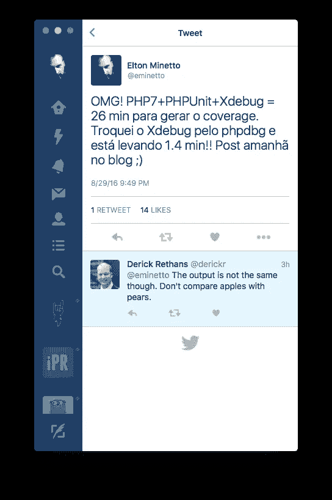
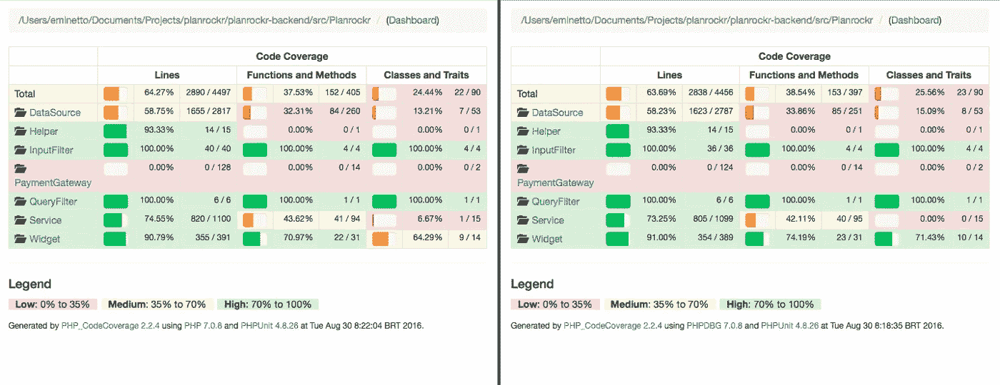
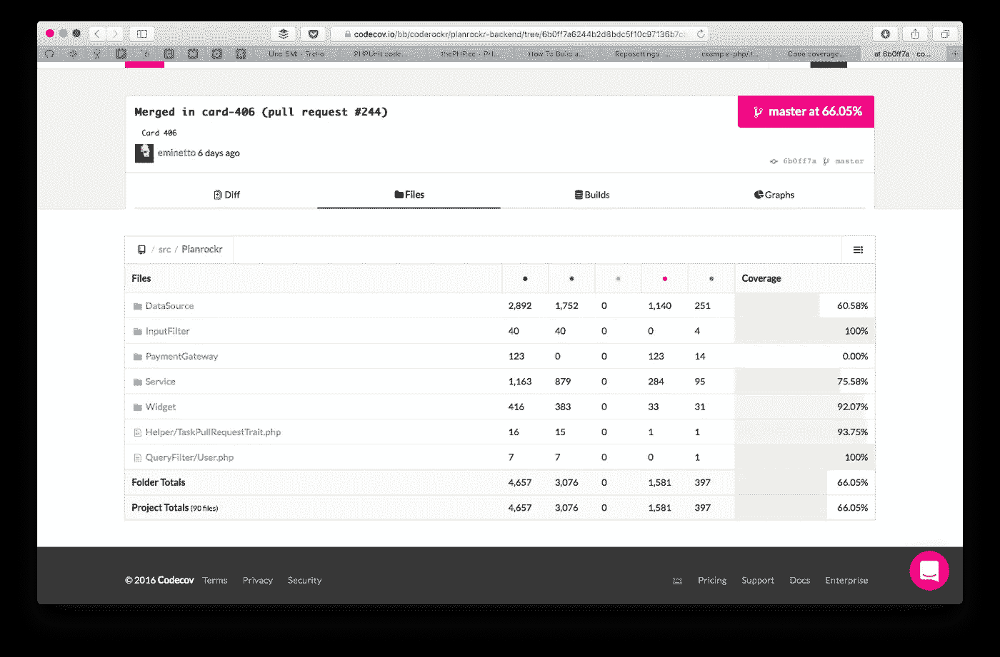
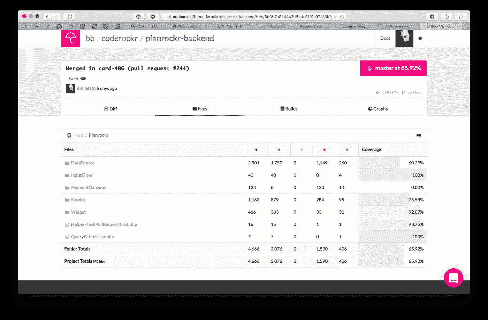

# 用 PHPUnit 和 phpdbg 生成代码覆盖率

> 原文：<https://medium.com/hackernoon/generating-code-coverage-with-phpunite-and-phpdbg-4d20347ffb45>

在之前的一篇文章中，我解释了如何识别执行时间过长的测试。在这篇文章中，我将展示如何使用 [PHPUnit](https://hackernoon.com/tagged/phpunit) 来提高代码覆盖报告生成的性能。

在 phpunit.xml 文件中，可以添加配置来生成与正在执行的测试相关的报告。例如:

将创建一个名为“tests/_reports”的目录，其中包含一系列有用的信息。在 coverage-html 目录中，我们可以看到有助于分析的代码测试覆盖细节。clover.xml 文件只是由 Jenkins、CodeCov、Coveralls、Codacy 等服务处理的相同信息的另一个版本，用于自动化警报和脚本。

除了更改 phpunit.xml 文件之外，为了生成这些信息，我们还需要安装扩展 XDebug。然而，通过安装它，我们得到了性能的实质性下降。检查测试执行结果，但不生成报告:

现在，当我们添加 XDebug 并再次执行它时，我们得到:

执行时间从 1.08 分钟跳到了 22.26 分钟！

在网上做了一些研究后，我找到了[的这个帖子](http://blog.remirepo.net/post/2015/11/09/PHPUnit-code-coverage-benchmark)，并决定尝试一下 [phpdbg](https://hackernoon.com/tagged/phpdbg) 。

因为我在这个测试中使用的是 MacOS X，所以我执行了下面的命令来安装所有必要的依赖项。

主要区别在于 php7 安装中使用的参数–with-phpdbg。

通过跟随 PHPUnit 的创建者塞巴斯蒂安·博格曼的这篇文章，我找到了再次运行测试的语法:

*phpdbg -qrr。/vendor/bin/phpunit*

1.59 分钟比 XDebug 的 22.26 分钟要好得多。

在写这篇文章之前，我兴奋地发了以下微博:

如果你看一下评论，吴镇男·雷瑟斯不是别人，正是 XDebug 的创造者！考虑到他的评论，我比较了 XDebug 和 phpdbg 生成的结果。

下面是 XDebug(左)和 phpdbg(右)生成的 coverage-html 的对比。

然后，我使用 CodeCov 处理 clover.xml 文件，结果也略有不同:

phpdbg

XDebug

根据 phpdbg 生成的报告，Planrockr 拥有 66.05%的代码覆盖率。XDebug 的报告显示代码覆盖率为 65.92%

我从这个小测试中得出一些结论:

*   XDebug 是一个不可思议的工具，它不仅仅是生成代码覆盖率，所以我并不是说你应该停止使用它。我只是比较它众多功能中的一个。
*   我比较了默认结果，没有对 XDebug 或 phpdbg 的配置进行任何调整，因此其他场景可能会有不同的结果。
*   虽然这两个结果略有不同，但在我的例子中，由于 phpdbg 的性能更好，所以使用 phpdbg 确实是一种补偿。

我会继续使用 phpdbg 一段时间，如果我碰巧看到任何不同的结果，我会更新这篇文章或写另一篇关于体验的文章。

如果你认为我的结论是错误的，请不要犹豫联系我让我知道。

> [黑客中午](http://bit.ly/Hackernoon)是黑客如何开始他们的下午。我们是 [@AMI](http://bit.ly/atAMIatAMI) 家庭的一员。我们现在[接受投稿](http://bit.ly/hackernoonsubmission)，并乐意[讨论广告&赞助](mailto:partners@amipublications.com)机会。
> 
> 要了解更多信息，请[阅读我们的“关于”页面](https://goo.gl/4ofytp)、[在脸书上点赞/给我们发消息](http://bit.ly/HackernoonFB)，或者简单地说， [tweet/DM @HackerNoon。](https://goo.gl/k7XYbx)
> 
> 如果你喜欢这个故事，我们推荐你阅读我们的[最新科技故事](http://bit.ly/hackernoonlatestt)和[趋势科技故事](https://hackernoon.com/trending)。直到下一次，不要把世界的现实想当然！