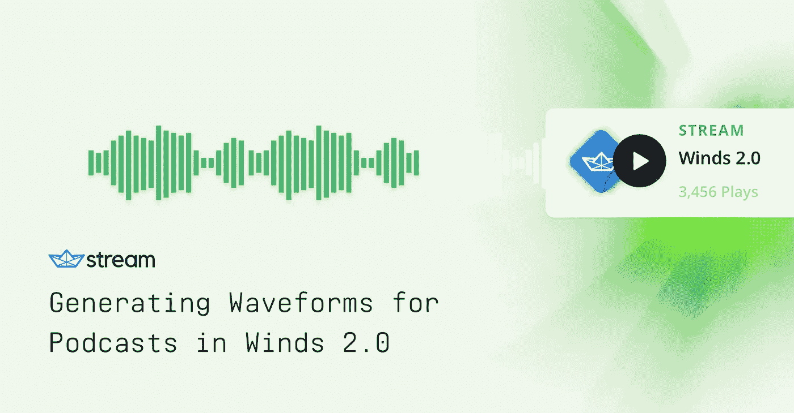
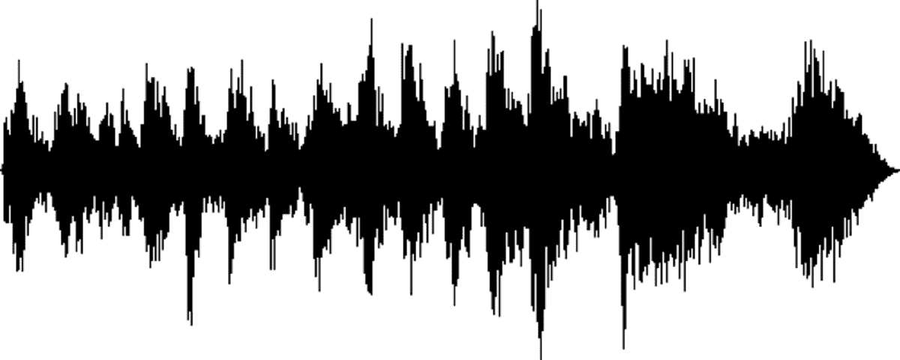
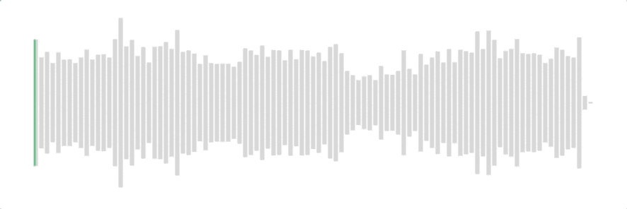

# 在 Winds 2.0 中为播客生成波形

> 原文：<https://medium.com/hackernoon/generating-waveforms-for-podcasts-in-winds-2-0-82a32a1c77fa>

作为用于构建可扩展新闻源和活动流的 API[Stream](http://getstream.io/)的开发人员，我和我的同事们一直在努力开发 Winds 2.0。这个版本的 Winds 是一个开源的桌面应用程序，支持 RSS 提要和简单的播客收听，我们正在 Electron、React 和 Node.js 中构建它。

关于 Winds 2.0 的更多信息，请查看[发布的博客文章](https://getstream.io/blog/announcing-winds-2-0%E2%80%8A-%E2%80%8Aan-electron-app-support-rss-podcasts/)。

Winds 的一个很酷的新特性是波形功能。在这篇博文中，我将简单介绍一下波形到底是什么，以及如何创建波形。

想跟着去吗？在 [GitHub](https://github.com/kenhoff/winds-waveform-example) 上查看源代码，然后查看[完成的示例](https://kenhoff.github.io/winds-waveform-example/)。

## 什么是波形？

波形是音频文件随时间变化的音量的直观表示，这使得挑选歌曲或 podcast 的响亮/安静部分变得非常容易。

对于那些视觉学习者来说，波形看起来是这样的:

在 Winds 2.0 中，我们创建了一个风格化的波形组件，除了显示音频文件随时间变化的音量，还显示当前轨道的进度。以下是我们的设计师(他将基于[的 UI 套件](https://getstream.io/based-feed-ui-kit-sketch/)和基于[的 UI 套件——移动](https://getstream.io/based-mobile-ui-kit/))所寻找的东西:

**应该有一个图书馆来放这个…**

有！ [react-wavesurfer](https://www.npmjs.com/package/react-wavesurfer) 是围绕 [wavesurfer.js](https://wavesurfer-js.org/) 的 react 包装器，是一个用于在浏览器中播放和显示音频文件的 JavaScript 库。

Wavesurfer 是一个很棒的项目，但没有完全满足我们的要求。Wavesurfer 使用 HTML5 画布(这对我们没用——稍后会详细介绍！)，看起来我们将不得不解决许多问题，将老派的 JS 库集成到我们的新派 React/Redux/electronic 应用程序中。

**我们已经建立了音频播放器——我们只需要一个波形*渲染器……***

Winds 2.0 已经有了一个轻量级的音频播放器，这只是一个包装[反作用音频播放器](https://github.com/justinmc/react-audio-player)。我们现在需要的只是一个波形渲染器——某种可以将音频文件转换成波形的组件。

同样重要的是要注意，我们还需要在波形上显示**进度**，这样用户就知道在另一次保证驾驶休息之前，他们还有多少辉煌的几分钟闷热的电台播音员的声音。

## 第 1 部分:获取波形数据

在绘制波形之前，我们必须获取音频数据，并将其转换为一种格式，以便实际应用于页面。

请记住，数字音频文件实际上只是一个巨大的数字阵列，当足够快地按顺序播放时，听起来就像一个播客！或者黑暗咒语，如果反过来玩。

为了获取数据并对其进行处理，我们需要将其加载到 AudioContext 中，然后使用`getChannelData`方法获取音频值数组。基本上，我们只是把 JS `ArrayBuffer`变成了`Float32Array`:

> AudioContext 对象是新的 [Web Audio API](https://webaudio.github.io/web-audio-api/) 的一部分，对于浏览器来说，这是一个相对较新的概念，但是在所有现代浏览器中仍然可以使用[。完全可能做到这一点与 ffmpeg 和其他音频库，如果这是更好地为您工作！
> 
> 同样，我们使用](https://developer.mozilla.org/en-US/docs/Web/API/AudioContext#Browser_compatibility) [axios](https://github.com/axios/axios) 代替 [XMLHttpRequest](https://developer.mozilla.org/en-US/docs/Web/API/XMLHttpRequest/Using_XMLHttpRequest) ，只是因为它稍微容易一点。

例如，如果我们使用最新的[汽车谈话集，#1743](https://www.cartalk.com/show/1743-sherman-letank) (嗯，最新的“最棒的”汽车谈话集，因为它在 2012 年停播了——RIP Tom)和`console.log`出了`decodedAudioData`，我得到了看起来有点像这样的东西:

现在我有一个 143，669，376 个 32 位浮点的数组。MP3 的采样速率为每秒 44，100 个样本，运行时间为 54 分 18 秒，因此，数学:

(44100 个样本/秒)* ( 3258 秒)=总计 143，677，800 个样本

这与我们阵列中的 143，669，376 个样本非常接近。太棒了。

## 将波形数据转换成我们可以渲染的东西

在这个过程的最后，我想要一个从 0 到 1 的大约 100 个值的数组，我可以映射到波形上每个条的高度。(我的意思是，我可以尝试将所有 143，669，376 个值映射到波形的条形图上，但是我觉得*可能会*引起一些可用性问题……)

我们将使用分时段算法来生成 N 个时段——每个时段都表示音频文件在该时间间隔内音量的最大值(或平均值，或最小值，这取决于您要查找的内容)。

正如您在上面看到的，音频数据可能是负面的！这就是音频数据的工作方式——音频样本的值可以是-1 到 1。然而，我们不希望在波形中出现负值，所以我们将只使用每个桶中的最大值。

我们高度程式化的波形不一定是音频文件中数据的 100%精确再现。我们只需要一个 100 小节的数组，每个小节都表示该部分音频文件的一般“响度”。

以下是分时段算法:

在用 100 个桶通过这个算法运行我们的 decodedAudioData(包含 143，669，376 个样本的`Float32Array`)之后，我们得到了类似如下的结果:

对我们来说，将它呈现到页面上要容易得多！

## 第 2 部分:绘制我们的波形

好了，现在我们有了 100 个值的数组，从 0 到 1，每个值都表示音频文件该部分的最大响度。我们可以使用这些数据向页面实际呈现波形。

请记住，这就是我们希望波形在最后的样子:

基于这个模型，我们将有 3 个主要要求:

1.  该波形是播客音量随时间变化的近似值，我们已经从第 1 部分中获得了该数据。
2.  我们需要对组件的样式有一些控制:条的数量，它们之间的间距，颜色等等。
3.  当曲目播放时，我们需要让进度条在波形条中“闪耀”ᗛ**这是一个棘手的问题**！

## 实施方案

有几种不同的方法可以实现这一点——每一种都有一些权衡。

[**Canvas**](https://developer.mozilla.org/en-US/docs/Web/API/Canvas_API)**——现有的波形库大多使用 HTML5 Canvas 元素。**

***Pro:* Canvas 非常适合 2D 和 3D 游戏，也是分层或动画视觉元素的像素级完美实现。听起来很适合我们，对吧？**

***Con:* Canvas 没有真正满足我们的#2 要求，这很容易控制组件的样式。缩放波形“条”的高度、宽度和间距很困难，我们也很难提供容易改变的参数。**

**(Canvas 确实提供了一些使用剪辑蒙版的方法，但我并没有深入研究。)**

**[**DOM**](https://developer.mozilla.org/en-US/docs/Web/API/Document_Object_Model)**——就是一堆`div` s！****

*****Pro:* 对于 web 开发人员来说，使用 CSS 对 DOM waveform 进行大量定制是非常容易的。它可以很好地伸缩，我们可以很容易地设置填充，高度和宽度参数，我们甚至可以在播客加载或播放时添加动画。****

*****缺点:*DOM 对我们来说不容易做到的是屏蔽/剪辑——例如，播放时让进度条“穿透”波形。当然，我们可能会设置一些情况，根据音频文件的进度计算要填充多少小节，然后计算填充“当前播放”小节的百分比，但这有点混乱。****

****[**SVG**](https://developer.mozilla.org/en-US/docs/Web/SVG)**——`rect`【s】`viewBox``preserveAspectRatio`。******

*******Pro:* SVG 给了我们*一些*样式选项—(填充颜色、矩形边框半径和其他 SVG 属性都可以通过 CSS 设置)。最重要的是，SVG 允许我们对 DOM 元素进行“屏蔽”(或裁剪)。******

******反对:使用 SVG 的一个缺点是我们不能通过 CSS 获得布局控制。相反，我们必须对每个“条”使用绝对定位。然而，SVG 确实给了我们一些拉伸和缩放的选项，比如`preserveAspectRatio="none"`。使用 JavaScript，我们可以指定这些参数(条数、条间距等)，并使用 *math* 计算出在哪里绘制它们。******

## ******SVG 遮罩的工作原理******

******我们讨论了实现波形的不同方法，但我们围绕的主要要求是“屏蔽”，或者让进度条“穿透”波形。******

******让我们的 SVG 遮罩发挥作用有三个部分:******

1.  ******这个元素将作为一个“进度条”——动画显示一个从 0%宽度到 100%宽度的矩形。******
2.  ******实际的遮罩:进度条应该“穿透”的“填充”线和区域。******
3.  ******CSS 将两者连接在一起- `clip-path`。******

******现在，请记住这是 SVG，这意味着样式声明和属性看起来略有不同，但在样式化 DOM 元素时，操作原理是相同的。******

******第一部分——我们的“进度条”元素和“背景”元素:******

******`viewBox`属性为我们的 SVG 定义了笛卡尔网格空间，从元素的左上角开始(0，0 ),到右下角的(100，100)。******

******`preserveAspectRatio`属性与您通常在 SVG 上看到的相反——我们没有使用“meet”或“slice”(确保图像被扩展/收缩以适应 SVG 框，或者被裁剪以适应 SVG 框)，而是使用“none ”,这迫使图像被拉伸和缩放以适应我们向它抛出的任何 CSS 尺寸。******

******最后，我们定义两个 SVG 矩形——第一个是我们的波形“背景”(整个波形的灰色),第二个是实际的“进度条”,它在轨道播放时显示宽度。******

******那两个 SVG 不是波形上的条！它们只是背景和进度条。为了创建条形，我们需要创建另一个 SVG 元素，这次高度和宽度为 0:******

******这个 SVG 的高度和宽度为 0，因为我们实际上并不想将其呈现到页面上。相反，我们将在将它连接到进度和后台 SVG 时引用它。我们还使用了一些不太知名的 SVG 标签，比如
`defs` ( [有点像 SVG“模板”](https://developer.mozilla.org/en-US/docs/Web/SVG/Element/defs))和`clipPath`，这正是我们在这种情况下想要使用的*。*******

*******因为在页面加载(并获取音频数据)之前我们不知道条形是什么样子，所以我们将使用 JavaScript 创建一组`rect`——每个桶一个:*******

> *******在 Winds 2.0 中，我们已经用 React 构建了所有东西，所以它在开源 repo 中看起来会略有不同:)Vanilla JS 非常适合阐释这个概念！*******

*******请记住，我们在 0 到 100 的坐标空间中绘制这些条，因为页面上的其他 SVG 使用的就是这个坐标空间。无论 CSS 的高度和宽度如何设置，这些条都将使用`viewBox`进行拉伸和缩放。*******

*******请记住，buckets 只是我们从 0 到 1 的 N 个值的数组，表示在此时间间隔内音轨的一般响度。我们迭代所有的桶，然后使用一些 Math 来计算出这些矩形条的确切位置:*******

1.  *******矩形的起始 X 坐标，从 SVG 框的左侧开始，加上每个条之间的间距。*******
2.  *******矩形的宽度，即桶数/ 100 减去间距。*******

*******最后，我们得到了将两个(如果算上背景的话，是三个)SVG 元素联系在一起的 CSS:*******

*******这选择了“背景”和“进度条”两个矩形，并说“使用`#waveform-mask` SVG 作为蒙版”——就好像`#waveform-mask` SVG 只是进度条上的一个剪纸，我们可以通过剪纸看到像素。*******

*******别忘了！我们需要在音轨播放时更新`.waveform-progress` SVG 的宽度。根据音频播放器的实现，可能会有一个`onListen`回调，或者我们只是使用`setInterval`每 500 毫秒左右触发一次。我们所要做的就是将轨道的当前进度除以轨道的长度，乘以 100 并改变`.waveform-progress`矩形的宽度。*******

## *******最终结果*******

**************

*******嘣！看看——我们的剧集有一些喧闹的部分，一些安静的部分，音频播放，进度条填充……不知何故，我们又浪费了一个完美的小时听汽车对话。*******

*******如果您有兴趣在您的应用程序中实现这样的东西，您可以查看这个[完整的工作示例](https://kenhoff.github.io/winds-waveform-example/)和[源代码](https://github.com/kenhoff/winds-waveform-example)。*******

*******在这个例子中，我刚刚使用了一个`audio`元素作为音频播放器。我每 100 毫秒检查一次音频播放器的进度，然后调整进度条的宽度。*******

*******在重要的应用程序中，音频实现会有很大不同——例如，在 Winds 2.0 中，我们为`PlayerContainer`、`ReactAudioPlayer`和`Waveform`提供了单独的 React 组件。`ReactAudioPlayer`每隔 500 毫秒调用一个 onListen 道具，该道具计算进度，存储在 PlayerContainer 的状态中，然后用`progress`道具呈现`Waveform`组件。*******

## *******下一步是什么？*******

*******请只打一个网络电话。*******

*******在示例代码中，您可能会注意到实际上有两个网络调用来获取/car-talk.mp3 文件——一个来自我们的脚本，它以`ArrayBuffer`格式获取音频，另一个来自页面上的`audio`元素。*******

*******下载两次 30 秒的蓝草音乐？没什么大不了的！ [2 小时的一款龙与地下城游戏](https://www.penny-arcade.com/podcasts/show/ai)，下载了两次？大概是要锤用户的网络连接。*******

*******不幸的是，这是一个比最初看起来要复杂得多的问题，我仍在解决这个问题。我的最佳建议是:*******

*   *******抓取音频数据(通过 XHR，以`ArrayBuffer`格式)并将其加载到`audio`元素中。*******
*   *******或者，反过来做——让`audio`元素获取音频数据，然后从元素中提取数据。*******
*   *******或者，开始黑暗咒语来调用`AudioContext`、`AnalyzerNode`和`AudioDestinationNode`——并且只使用网络音频 API 来播放音频。*******

*********也许最大响度不是我们应该使用的变量？*********

*****我还想提高一点视觉效果——一些播客在章节之间有很好的小音景部分(谢谢， [Jad 和 Robert](http://www.radiolab.org/) )，但大多数口语播客在整集中都很水平(谢谢， [Roman Mars](https://99percentinvisible.org/) )。波形是准确的，但不一定有用——如果我想跳到另一章，我通常会在有间歇音乐或寂静的音频中寻找下降/峰值。*****

*****这可能很简单，只需取整个时段的平均或最小量。或者，我们可以通过计算出某种非线性比例来变得更复杂，或者计算最大音量，并从那里开始缩放一切。只是用来实验的东西！*****

*****但是如果我想要更多的酒吧呢？还是把酒吧的边缘弄圆？！并使组件具有响应能力！？*****

*****这些大多只是 SVG 的局限性——它是 90%的解决方案。圆化一个`div`的角是微不足道的，但是圆化非常小的 SVG 矩形的角效果不好。而且，如果我们调整整个 SVG 的大小，条的数量保持不变，但是条之间的间距会扩大。波形响应不是很快，所以我们最好在页面上粘贴时坚持固定的宽度值。*****

## *****播放结尾音乐*****

*****除了 SVG 的一些限制之外，这个组件非常棒！我们可以让用户的客户端处理所有的波形生成，而不必在服务器端使用 ffmpeg 或其他音频处理库来完成所有这些工作。*****

*****我们正在努力开发 Winds 2.0，这样你就可以在一个应用程序中收听所有你喜欢的播客和阅读你喜欢的 RSS 源。它进展得非常好，所以请在明年年初寻找它。现在，看看我们的另一个示例应用程序， [Cabin](https://github.com/GetStream/stream-react-example) 。*****

> *****这是由 GetStream.io 的开发者倡导者 Ken Hoff 领导的 GetStream.io 团队的合作。原始博文可在[https://getstream . io/blog/generating-waveforms-for-podcast-in-winds-2-0/](https://getstream.io/blog/generating-waveforms-for-podcasts-in-winds-2-0/)找到。*****