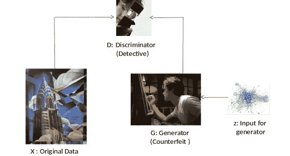
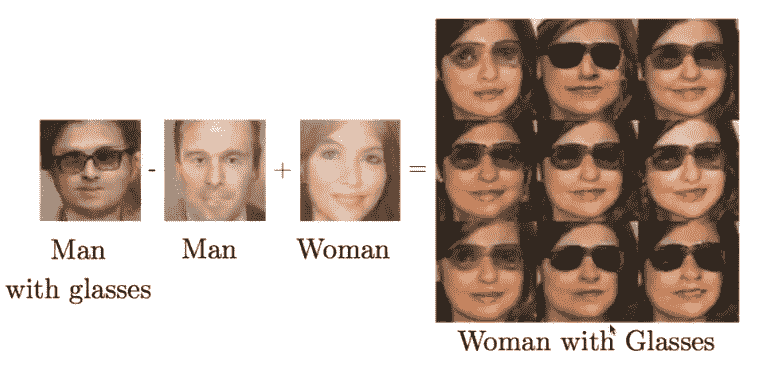
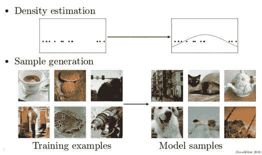
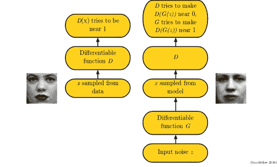

# 生成对抗网络——一种深度学习架构

> 原文：<https://medium.com/hackernoon/generative-adversarial-networks-a-deep-learning-architecture-4253b6d12347>

生成对抗网络(GANs)生成对抗网络，简称 GAN，是由 [Ian Goodfellow](http://www.iangoodfellow.com/) 在 2014 年首次提出的神经网络。该算法被许多人工智能先驱誉为[深度学习](https://hackernoon.com/tagged/deep-learning)的重要里程碑。Yann Le Cunn(卷积神经网络之父)告诉我们，GANs 是最近 20 年内在深度学习领域发生的最酷的事情。此后出现了许多版本的 GAN，如 DCGAN、Sequence-GAN、LSTM-GAN 等。

gan 是由两个相互竞争的网络组成的神经网络。这两个网络即生成数据集的生成器和验证数据集的鉴别器。目标是生成与训练集中的一些数据点相似的数据点。下图显示了 GANs 能够根据文本标题生成图像的情况。算法被赋予了一段文字“一只黑色冠黄色喙的白鸟”。GAN 能够根据给定的文本自行生成图像。

GANs 还被用于预测视频中的未来帧

除了生成图像，GANs 还用于执行各种抽象操作，如从人脸图像中移除眼镜、添加眼镜等，如下所示。

上图显示，GANs 可以学习一种将性别概念与戴眼镜的概念分开的表征。如果我们从表示戴眼镜的男人的概念开始，然后减去表示不戴眼镜的男人的概念的向量，最后加上表示不戴眼镜的女人的概念的向量，我们就得到表示戴眼镜的女人的概念的向量。生成模型正确地将所有这些表示向量解码成图像。

让我们举一个简单的例子来说明 GANs 是如何工作的。考虑一下在印度去货币化过程中发生的情况，一个持有假钞的伪钞罪犯和银行之间的关系。就伪钞而言，罪犯的目的是什么，银行的目的是什么？我们来列举一下:

*   为了成为一名成功的伪钞制造者，犯罪分子想要愚弄 IT 部门，以使 IT 官员无法区分伪钞和真钞
*   为了成功，银行官员希望尽快检测出伪钞

在这里，我们看到我们有利益冲突。这种情况可以用博弈论中的极小极大博弈来建模。这个过程叫做对抗过程。

# 什么是生成对抗网？

GANs 是对抗过程的一个特例，其中的组件(IT 官员和罪犯)是神经网络。第一个网络生成数据，第二个网络试图辨别第一个网络生成的真实数据和虚假数据之间的差异。第二个网络将输出一个标量[0，1]，它表示真实数据的概率。

生成式建模的基本思想是收集训练样本，并形成某种表示，解释这个样本的来源。生成对抗网络(GAN)是生成样本而不是寻找函数的东西。使用生成模型可以完成两件基本的事情。一种是收集点并推断出一个描述产生这些点的分布的函数。第二种方法是建立一个生成模型，即使用一台机器从一个分布中观察许多样本，并能够从同一个分布中创建更多样本。

# 体系结构

生成器会试图生成假图像来欺骗鉴别者，让他们认为这些图像是真实的。鉴别器将试图区分真实图像和生成的图像。它们一起变得更强，直到鉴别器不能再区分真实和生成的图像。在此之后，甘一家将能够制作出逼真的图像。

朱等人(2016)开发了一个名为交互式生成对抗网络(iGAN)的交互式应用。用户可以绘制一个图像的草图，iGAN 会尝试生成最相似的真实图像。在这个例子中，用户画了几条由 iGAN 转换成草地的绿线，用户画了一个由 iGAN 转换成详细的山脉的黑色三角形。创建艺术的应用程序是研究创建图像的生成模型的众多原因之一。下面的视频演示了 iGAN。

# 培训程序

训练过程包括从训练集中采样数据，然后我们对这些输入运行鉴别器。鉴别器是任何一种可微函数，它有我们可以通过梯度下降学习的参数。所以我们通常将其表示为深度神经网络，但原则上，它也可以是其他类型的模型。

当鉴别器应用于来自训练集的图像时，其目标是输出接近 1 的值。表示输入是真实的而不是伪造的概率很高。但是有一半的时间我们也将鉴别器应用于事实上是假的例子。在这种情况下，我们从先前分布中的向量 z 开始采样。所以 z 本质上是一个无结构噪声的矢量。这是一个随机性的来源，允许发生器输出各种不同的向量。然后，我们将生成函数应用于输入向量 z。生成函数是一个可微分函数，其参数可以通过类似于判别函数的梯度下降来学习。

通常，生成器将被表示为深度神经网络。将 G 应用于 z 后，我们从模型中获得一个样本。理想情况下，这将类似于来自数据集的实际样本，类似于上述示例中所示的样本。获得样本后，再次应用鉴别函数 D。这一次，鉴别器 D 的目标是输出接近值 1 的 z 的 G 的值 D。鉴别器想要使值为零，而生成器想要使其接近 1。鉴别器想要拒绝这些样本，因为它们是假的，而生成器想要欺骗鉴别器，使其认为它们是真的。

简单地说，生成器必须向鉴别器寻求建议，凭直觉，鉴别器会告诉每个像素要调整多少，以使图像更真实一点。

# 结论

总之，GANs 是使用监督学习来逼近难以处理的成本函数(最小化误差的函数)的生成模型。此外，它可以模拟许多成本函数，包括用于最大似然的函数。gan 是各种算法的关键成分，这些算法能够从不同的图像类别中生成引人注目的高分辨率样本。虽然有一些类似 GANs 的算法，如变分自动编码器、WaveNet 等，但它们都有各种缺点。在变分编码器中，生成的样本质量很差。在 WaveNet 中，即使生成的数据质量很好，合成所需的时间也很长。例如，为了生成 1 秒钟的音频信号，变分自动编码需要 1 分钟来合成信号。因此，与其他算法相比，GANs 有很大的优势。这是一种令人惊叹的算法，不仅用于图像，还用于网络安全和其他领域。

# 参考

1.  [生成性敌对网络(2014)——伊恩·古德菲勒、让·普盖-阿巴迪、迈赫迪·米尔扎、徐炳、大卫·沃德-法利、谢尔吉尔·奥泽尔、亚伦·库维尔、约舒阿·本吉奥](http://arxiv.org/pdf/1406.2661.pdf)
2.  [NIPS 2016 教程:生成性对抗性网络 Ian Goodfellow](http://arxiv.org/pdf/1701.00160.pdf)

如果你想关注我在深度学习、人工智能和强化学习方面的工作，请在 Medium [Gautam Ramachandra](https://medium.com/u/bd0e563a1744?source=post_page-----4253b6d12347--------------------------------) 或 Twitter [gautam1858](https://twitter.com/gautam1858) 上关注我。

