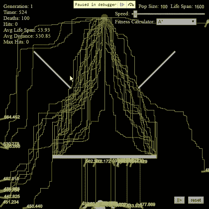
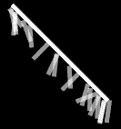

# 遗传算法、A*和旋转物体

> 原文：<https://medium.com/hackernoon/genetic-algorithm-a-and-rotated-objects-ca19668c780d>

有一段时间，我想扩展由[丹尼尔·希夫曼](https://medium.com/u/fecd456da1ea?source=post_page-----ca19668c780d--------------------------------)完成的编码挑战[智能火箭](https://www.youtube.com/watch?v=bGz7mv2vD6g)。所以我做了。

# 目标

为了实现这一目标，我创建了以下改进列表:

1.让画布变大，这样会更有趣，尤其是在处理性能提升的时候；

2.改变它计算有机体适应度的方式。后来，这被证明是一个好主意，因为经过一些改进后，可以添加更多的障碍，并保持遗传算法在寻找更具挑战性的路径方面的可靠性。

3.改进代码组织和组件化；

4.看看遗传算法能在多大程度上使生物体达到目标(命中率)；

5.增加更多的适应度计算算法，看仿真如何应对；

6.添加历史统计数据以可视化遗传算法的进化；

7.添加控件来管理[环境](https://hackernoon.com/tagged/enviroment)(种群大小、速度、有机体数量、健身算法选择器、播放/暂停和重置)；

8.创建一个插件系统；

9.正确计算旋转物体的碰撞。这比我想象的要难；

10.多加障碍！

11.添加更多的基因特征！

# **遗传算法**

这个项目中使用的遗传算法非常简单。一个包含一个种群的世界，一个由有机体和每个有机体及其基因组成的种群:运动，大小和最大力量(在这种情况下最大力量代表其敏捷性)。

在每一代结束时，使用三种可用方法之一计算每个生物体的适应度:

1.A*:寿命和到目标的距离之间的加权计算；

2.加权:寿命和到目标的直接距离之间的加权计算；

3.直接距离:生物体与目标之间的直接距离；

A*加权公式:

其中*距离*是到达目标的总 A*路径步数，*寿命*是死亡前的最高世界分笔成交点(或者当它到达目标时，最大可能寿命)。

交配池的建立是为了在低等生物和高等生物之间产生一定比例的 DNA 差异。

交配池:

随着池的建立，我们需要随机选择生物体进行交配，并交叉其 DNA。

选择:

最后，以 0.1%的突变率穿过它的 DNA。这种突变对于创造离群值来说是必要的，这种离群值可以推动这些生物体并给予它们更多的存活率。

交叉:

# **性能瓶颈**

## **A*寻路**

我遇到的主要性能问题是 A*算法。我正在使用[这个](https://github.com/bgrins/javascript-astar)库，这是一个很好的算法实现，然而，我最初的想法是创建一个 600x600(画布大小)的网格，并根据它的颜色确定可行走的路径(黑色表示可通行的路径，白色表示墙壁)。

我发现自己等待了 10 到 15 秒来计算所有 100 个生物体路径，以便给所有生物体一个适合度分数。这种计算必须在每一代结束时进行。

为了减少所需的总时间，我缓存了创建的图，并且每次新的路径搜索我都简单地清理了图。不幸的是，该算法将数据与函数混合在一起，因此不可能浅层复制图形，因此，我需要重置并清除图形中的每个节点(600*600 = 360，000 个节点)。这方面还有待改进。

尽管总的时间需求非常大，在 7 到 11 秒之间，我还需要进一步改进。经过一两个晚上的思考，我发现了两个可能的解决方案:缩小画布大小或者缓存所有可能的路径组合及其距离。我决定从第一个开始，这被证明是一个可以接受的解决方案。

我的想法来自 JPEG 压缩，这当然不是同一个算法，但想法是一样的。我没有在 600x600 的画布中计算路径，而是将画布大小缩小 X%,然后在较小版本的画布地图表示中计算这两点之间的距离。这个解决方案使距离不太准确，但它对所有生物来说都是公平的，所以这里没有损失。

这一次，将画布尺寸缩小 50%使得时间从 7-11 秒变成了< 1 seconds. After more caching and profiles to find slow parts it decreased to < 400ms in my machine.

Interesting results, I wonder how they do in games with paths larger than mine. Do they do the same?

## **函数编程**

一开始，因为我喜欢使用函数式[编程](https://hackernoon.com/tagged/programming)和像 [ramda](http://ramdajs.com/) 这样的库，所以一切都计划用它来制作。

过了一段时间，我明白了我的目标之一是性能，我需要告诉你，1600 滴答和 60 FPS 的速率与函数式编程不相称。似乎每一点表现都需要挤一挤才能足够快。所以放弃这个想法并不容易。你到处都能看到基本的 fors。

我发现一件有趣的事情是，在 for 中使用 var 比新的 let 更好，原因如下。

# **冲突**

canvas 对象和 p5 库提供了旋转对象的方法，但它在内部进行旋转，因此不可能知道旋转对象的向量(我没有找到方法),因此无法使用它通过顶点计算碰撞。

为了帮助我，我找到了绕原点旋转矢量的公式:

因此，我自己做了，而不是利用旋转到 canvas/p5，从而提高了性能(因为我只能做一次，并将其用于渲染和碰撞计算)。

p5 没有碰撞系统，所以我利用了 [p5.collide2D](https://github.com/bmoren/p5.collide2D) 。

我对结果很满意，正因为如此，我可以在有角度的矩形中检查碰撞。

您可以查看[演示](https://rawgit.com/conradoqg/smart-organisms/master/index.html)或 git 库，网址为:

 [## conradoqg/智能生物

### 智能生物——一个旨在了解更多关于 p5.js 库和遗传算法的纳米项目。

github.com](https://github.com/conradoqg/smart-organisms) 

就是这样。

> [黑客中午](http://bit.ly/Hackernoon)是黑客如何开始他们的下午。我们是 [@AMI](http://bit.ly/atAMIatAMI) 家庭的一员。我们现在[接受投稿](http://bit.ly/hackernoonsubmission)并乐意[讨论广告&赞助](mailto:partners@amipublications.com)机会。
> 
> 如果你喜欢这个故事，我们推荐你阅读我们的[最新科技故事](http://bit.ly/hackernoonlatestt)和[趋势科技故事](https://hackernoon.com/trending)。直到下一次，不要把世界的现实想当然！

